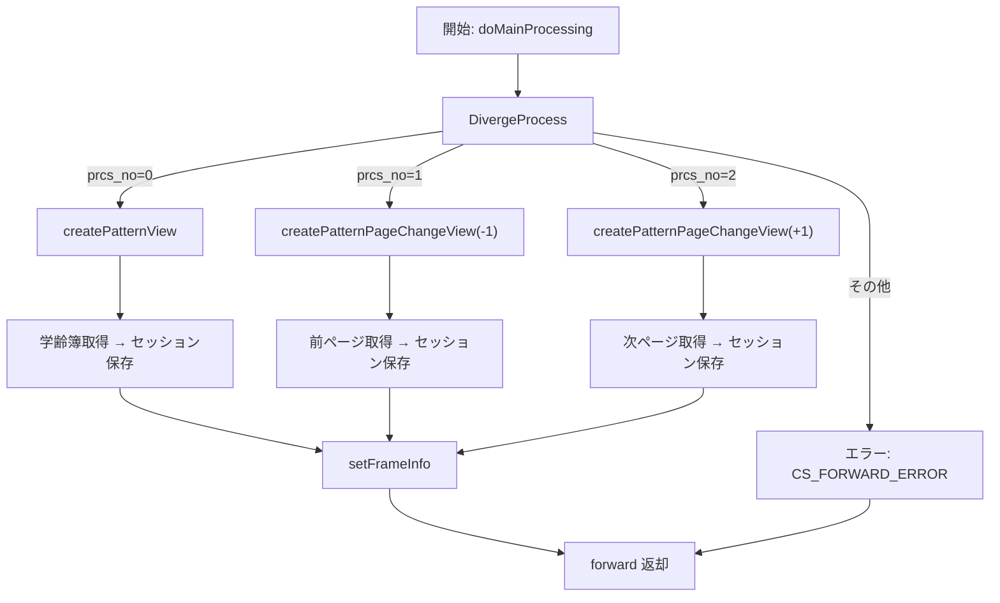

# GKB001S006Controller  
**パッケージ** `jp.co.jip.gkb0000.app.gkb0010`  
**役割** 学齢簿（児童の学年情報）を表示する Web 層のコントローラ。  
**対象読者** 本モジュールを新たに担当する開発者  

---  

## 1. 概要  

| 項目 | 内容 |
|------|------|
| **主な機能** | - 学齢簿の取得・ページング - 区域外管理情報の取得（ページ遷移時） - 画面遷移（戻る・再表示）用フレーム情報の設定 |
| **エントリポイント** | `@RequestMapping("/GKB001S006Controller.do")` → `doAction()` → `execute()` → `doMainProcessing()` |
| **画面フロー** | 初期表示 → 前/次履歴ボタンでページ切替 → 必要に応じて区域外管理情報を取得 |
| **依存コンポーネント** | - `GKB000_GetGakureiboJohoService`（学齢簿取得） - `GKB000_GetKuikigaiService`（区域外管理取得） - `GKB000_GetMessageService`（エラーメッセージ取得） - `GKB000CommonUtil` / `KKA000CommonUtil`（共通ユーティリティ） |
| **重要な定数** | `KyoikuConstants.CS_FORWARD_SUCCESS`、`KyoikuConstants.CS_FORWARD_ERROR`、`KyoikuMsgConstants` 系列 |

> **ポイント**  
> - 本コントローラは「画面遷移」だけでなく「画面状態（セッション）管理」も担うため、**セッションキー** の命名規則と保存タイミングを把握しておくことが重要です。  

---  

## 2. コードレベルの洞察  

### 2.1 主要メソッドの流れ  

| メソッド | 目的 | 主な処理 |
|----------|------|----------|
| `doAction()` | Spring のエントリポイント | `execute()` に委譲 |
| `doMainProcessing()` | 画面表示ロジックの中心 | `DivergeProcess()` → `setFrameInfo()` → フォワード決定 |
| `DivergeProcess()` | 画面イベント（初期表示・前/次ページ）を分岐 | `switch (prcs_no)` → `createPatternView()` / `createPatternPageChangeView()` |
| `createPatternView()` | 初期表示時に最新学齢簿を取得しセッションに格納 | `getArrayGakureibo()` → `setDispDataGakureibo()` → セッション保存 |
| `createPatternPageChangeView()` | 前/次ページ遷移時に対象ページの学齢簿を取得しセッションに格納 | セッションからベクタ取得 → ページ計算 → `setDispDataGakureibo()` → 区域外管理取得 (`getNewKuikigaiKanri()`) |
| `setFrameInfo()` | 「戻る」「再表示」ボタンのリンク情報をフレームに設定 | メニュー番号・個人番号に応じて URL を組み立て、`ResultFrameInfo` をセッションへ保存 |
| `setError()` | エラーメッセージ取得 → `ErrorMessageForm` へ格納 | `GKB000_GetMessageService` を呼び出し、`setModelMessage()` で画面に反映 |

### 2.2 処理分岐フロー（Mermaid）

### 2.3 重要なデータ構造  

| クラス / フィールド | 用途 |
|---------------------|------|
| `GakureiboSyokaiForm` | 画面から送られるリクエストパラメータ（`prcs_no`, `menu_no`, `kojin_no`, `page`） |
| `Vector`（`GKB_001_02_VECTOR`） | 学齢簿レコードの一覧（履歴全体） |
| `GakureiboSyokaiView`（`GKB_001_02_VIEW`） | 現在ページの表示用データ（変換済み日付・メニュー番号等） |
| `KuikigaiKanriListView`（`GKB_001_05_VIEW`） | 区域外管理情報（ページ遷移時に取得） |
| `ResultFrameInfo` | フレーム（戻る・再表示）ボタンのリンク情報を保持 |

### 2.4 例外・エラーハンドリング  

| 例外シナリオ | 処理 |
|--------------|------|
| セッションタイムアウト | `setError(..., KyoikuMsgConstants.EQ_ERROR_TIMEOUT)` |
| 学齢簿が取得できない | `setError(..., KyoikuMsgConstants.EQ_GAKUREIBO_01)` |
| サービス呼び出し失敗（`perform`） | `catch (Exception e) { e.printStackTrace(); }` → 画面はエラーへ遷移 |

---  

## 3. 依存関係とリンク  

| 依存先 | 目的 | Wiki リンク |
|--------|------|-------------|
| `GKB000_GetGakureiboJohoService` | 学齢簿取得（`perform`） | [GKB000_GetGakureiboJohoService](http://localhost:3000/projects/all/wiki?file_path=jp/co/jip/gkb000/service/gkb000/GKB000_GetGakureiboJohoService.java) |
| `GKB000_GetKuikigaiService` | 区域外管理取得 | [GKB000_GetKuikigaiService](http://localhost:3000/projects/all/wiki?file_path=jp/co/jip/gkb000/service/gkb000/GKB000_GetKuikigaiService.java) |
| `GKB000_GetMessageService` | エラーメッセージ取得 | [GKB000_GetMessageService](http://localhost:3000/projects/all/wiki?file_path=jp/co/jip/gkb000/service/gkb000/GKB000_GetMessageService.java) |
| `GKB000CommonUtil` | 画面共通ユーティリティ（セッション操作、表示データ変換） | [GKB000CommonUtil](http://localhost:3000/projects/all/wiki?file_path=jp/co/jip/gkb000/common/util/GKB000CommonUtil.java) |
| `KKA000CommonUtil` | 和暦⇔西暦変換・日付フォーマット | [KKA000CommonUtil](http://localhost:3000/projects/all/wiki?file_path=jp/co/jip/wizlife/fw/kka000/util/KKA000CommonUtil.java) |
| `ResultFrameInfo` | フレーム制御情報（戻る・再表示） | [ResultFrameInfo](http://localhost:3000/projects/all/wiki?file_path=jp/co/jip/wizlife/fw/bean/view/ResultFrameInfo.java) |
| `ScreenHistory` | 画面遷移履歴管理 | [ScreenHistory](http://localhost:3000/projects/all/wiki?file_path=jp/co/jip/gkb000/common/helper/ScreenHistory.java) |
| `CommonGakureiboSyokai` | 学齢簿表示ロジックの共通部品 | [CommonGakureiboSyokai](http://localhost:3000/projects/all/wiki?file_path=jp/co/jip/gkb000/common/util/CommonGakureiboSyokai.java) |

---  

## 4. 設計上の留意点・改善ポイント  

1. **セッションキーのハードコーディング**  
   - `"GKB_001_02_VECTOR"`、`"GKB_001_02_VIEW"` などは文字列リテラルで散在。定数化して typo を防止し、テスト容易性を向上させることが推奨されます。  

2. **例外処理の一貫性**  
   - 現在は `e.printStackTrace()` のみで UI への通知が不十分。`setError()` へ委譲し、ユーザーに適切なエラーメッセージを表示させる方が UX 向上します。  

3. **ページングロジックの境界チェック**  
   - `intPage = (int) gakureiboSyokaiForm.getPage() + intPlus;` の後、`arrayGakureibo.get(intPage - 1)` が配列外になる可能性があります。`intPage` が 1〜size の範囲に収まるか検証ロジックを追加してください。  

4. **依存注入の可視化**  
   - `@Inject` で注入されているサービスはテスト時にモック化しやすい構造ですが、インタフェースが無い場合は直接クラスをモックできません。インタフェース化して DI コンテナに登録するとテスト容易性が向上します。  

5. **ロジックの分割**  
   - `createPatternPageChangeView()` では学齢簿取得と区域外管理取得の 2 つの責務が混在。**Single Responsibility Principle** に沿って、区域外管理取得は別メソッド（既に `getNewKuikigaiKanri`）に委譲していますが、呼び出し側でも条件分岐が増えるため、**ページング専用サービス** を作成すると可読性が上がります。  

---  

## 5. 変更・拡張時のチェックリスト  

| 項目 | 確認内容 |
|------|----------|
| **新しい画面項目** | 追加したリクエストパラメータを `GakureiboSyokaiForm` にマッピングし、`DivergeProcess` の `switch` にケースを追加 |
| **ページングロジック** | `intPage` の境界チェックと `Vector` のサイズ更新が正しく行われているか |
| **エラーメッセージ** | 新規エラーコードが `KyoikuMsgConstants` に定義され、`setError` が呼び出されているか |
| **セッションキー** | 追加したデータは既存キーと衝突しないか、キー名は定数化されているか |
| **テスト** | `GKB000_GetGakureiboJohoService` などのモックを用意し、`doMainProcessing` の全分岐をカバーする単体テストを追加 |
| **ドキュメント** | 変更したメソッド・クラスに対して本 Wiki の該当セクションを更新 |

---  

## 6. まとめ  

`GKB001S006Controller` は学齢簿表示の **取得 → 加工 → セッション保存 → フレーム情報設定** という一連の流れを担うコアコントローラです。  
- **分岐ロジック**（`DivergeProcess`）が画面遷移の中心であり、**ページング** と **初期表示** が主なパスです。  
- **セッションキー** と **フレーム情報** の管理が多く、変更時はキーの一貫性と境界チェックに注意が必要です。  
- 依存サービスはすべて外部 API 呼び出しであり、テスト時はモック化が必須です。  

本ドキュメントを基に、コードの全体像と重要ポイントを把握し、保守・機能追加を安全に進めてください。  