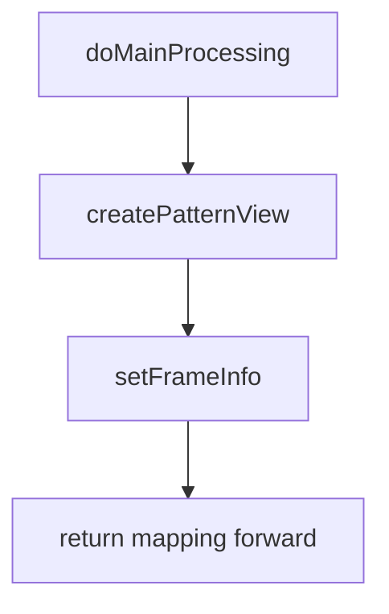
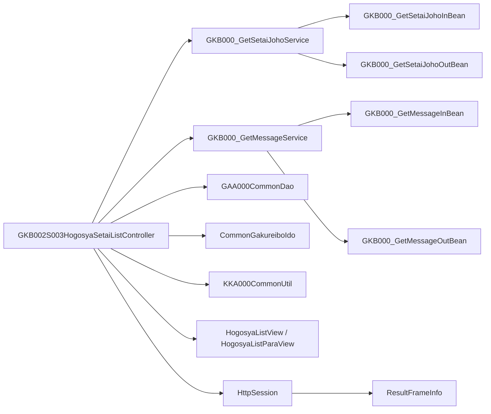

# GKB002S003HogosyaSetaiListController  

**ファイルパス**  
`D:\code-wiki\projects\all\sample_all\java\Controller_GKB002S003HogosyaSetaiListController.java`

---

## 1. 概要

| 項目 | 内容 |
|------|------|
| **クラス名** | `GKB002S003HogosyaSetaiListController` |
| **役割** | 保護者（世帯）情報の一覧表示画面を生成し、ページング・画面制御情報をセッションに格納するコントローラ |
| **属するパッケージ** | `jp.co.jip.gkb0000.app.gkb0020` |
| **主要な外部依存** | `GKB000_GetSetaiJohoService`（世帯情報取得）<br>`GKB000_GetMessageService`（エラーメッセージ取得）<br>`GAA000CommonDao`、`KKA000CommonUtil` などの共通ユーティリティ |
| **画面フロー** | `doAction` → `execute` → `doMainProcessing` → `createPatternView` → **セッション保存** → `setFrameInfo`（フレーム情報設定） |
| **対象読者** | 本モジュールを保守・拡張する新規開発者 |

> **ポイント**  
- 本コントローラは **「保護者情報一覧」** という単一画面の表示ロジックに特化している。  
- 画面遷移は **Spring MVC** の `@Controller` + `ModelAndView` で実装され、フレーム情報は独自の `ResultFrameInfo` に格納している点に注意。  

---

## 2. コードレベルの洞察

### 2.1 エントリーポイント

```java
@RequestMapping(REQUEST_MAPPING_PATH + ".do")
@Override
public ModelAndView doAction(@ModelAttribute(MODELATTRIBUTE_NAME) ActionForm form,
                             HttpServletRequest request,
                             HttpServletResponse response,
                             ModelAndView mv) throws Exception {
    return this.execute(actionMappingConfigContext.getActionMappingByPath(REQUEST_MAPPING_PATH),
                       form, request, response, mv);
}
```

- `doAction` は `BaseSessionSyncController` の `execute` を呼び出し、**ActionMapping** に基づくフロー制御を委譲。  
- `REQUEST_MAPPING_PATH` は `"/GKB002S003HogosyaSetaiListController"` で固定。

### 2.2 メイン処理フロー



1. **`createPatternView`**  
   - エラーチェック (`errorCheck`) → 失敗時は `error` へリダイレクト。  
   - セッションから学齢簿情報 (`GKB_011_01_VECTOR`) と表示用ビュー (`GKB_011_01_VIEW`) を取得。  
   - 現在の学齢簿レコードから個人番号を取得し、**世帯情報配列** (`getArraySetaiList`) を取得。  
   - ページング計算（最大行数 `CS_HOGOSYALIST_MAXROW`）→表示用リスト `arrayHogosyaDisp` を作成。  
   - 画面制御オブジェクト `HogosyaListParaView` に **前/次ページボタン状態**、**ページコンボ** などを設定。  
   - 生成したデータ・制御情報をすべて **セッション** に保存。

2. **`setFrameInfo`**  
   - 成功時は「戻る」・「再表示」リンクを組み立て、`ResultFrameInfo` に格納。  
   - 失敗時はリンクを空にし、フレーム情報だけを保存。

### 2.3 主要メソッドの要点

| メソッド | 目的 | 主な処理 |
|----------|------|----------|
| `createPatternView` | 保護者一覧画面のデータ構築 | エラーチェック → 世帯情報取得 → ページング → セッション保存 |
| `setDispDataSetai` | 1件の世帯情報を表示用 DTO に変換 | 各項目の Null → 空文字変換、日付フォーマット、コード → 名称変換 |
| `getArraySetaiList` | 世帯情報配列（16歳以上）を取得 | Service 呼び出し → 16歳以上フィルタリング |
| `errorCheck` | 前提条件（セッション・タイムアウト）を検証 | タイムアウト・必須セッションキーの有無を確認 |
| `setError` | エラーメッセージ取得・画面設定 | `GKB000_GetMessageService` でメッセージ取得 → `ErrorMessageForm` に設定 |
| `setFrameInfo` | フレーム（戻る/再表示）リンク生成 | 成功/失敗でリンク内容を分岐、`ScreenHistory` 更新 |

### 2.4 例外・エラーハンドリング

- **タイムアウト** → `setError(...EQ_ERROR_TIMEOUT)`  
- **学齢簿情報欠損** → `EQ_GAKUREIBO_01`  
- **処理日欠損** → `EQ_GAKUREIBO_67`  
- **外部サービス例外** は `getArraySetaiList` 内で `printStackTrace` のみ。拡張時はロギングフレームワークへ置き換えることを推奨。

### 2.5 依存関係・リンク

| 参照先 | 種別 | Wiki リンク |
|--------|------|-------------|
| `GKB000_GetSetaiJohoService` | Service | [GKB000_GetSetaiJohoService](http://localhost:3000/projects/all/wiki?file_path=jp/co/jip/gkb0000/app/gkb0020/GKB000_GetSetaiJohoService.java) |
| `GKB000_GetMessageService` | Service | [GKB000_GetMessageService](http://localhost:3000/projects/all/wiki?file_path=jp/co/jip/gkb0000/app/gkb0020/GKB000_GetMessageService.java) |
| `GAA000CommonDao` | DAO | [GAA000CommonDao](http://localhost:3000/projects/all/wiki?file_path=jp/co/jip/gkb0000/app/gkb0020/GAA000CommonDao.java) |
| `KKA000CommonUtil` | Util | [KKA000CommonUtil](http://localhost:3000/projects/all/wiki?file_path=jp/co/jip/gkb0000/app/gkb0020/KKA000CommonUtil.java) |
| `CommonGakureiboIdo` | Util | [CommonGakureiboIdo](http://localhost:3000/projects/all/wiki?file_path=jp/co/jip/gkb0000/app/gkb0020/CommonGakureiboIdo.java) |
| `ResultFrameInfo` | FW Bean | [ResultFrameInfo](http://localhost:3000/projects/all/wiki?file_path=jp/co/jip/wizlife/fw/bean/view/ResultFrameInfo.java) |
| `ScreenHistory` | Helper | [ScreenHistory](http://localhost:3000/projects/all/wiki?file_path=jp/co/jip/gkb000/common/helper/ScreenHistory.java) |
| `HogosyaListView` / `HogosyaListParaView` | View DTO | [HogosyaListView](http://localhost:3000/projects/all/wiki?file_path=jp/co/jip/gkb0000/app/helper/HogosyaListView.java) / [HogosyaListParaView](http://localhost:3000/projects/all/wiki?file_path=jp/co/jip/gkb0000/app/helper/HogosyaListParaView.java) |
| `SetaiList` | Domain | [SetaiList](http://localhost:3000/projects/all/wiki?file_path=jp/co/jip/gkb000/common/helper/SetaiList.java) |

> **注**：上記リンクは同一リポジトリ内に同名クラスが存在すると仮定したパスです。実際のパスに合わせて修正してください。

---

## 3. 依存関係と相互作用



- **Controller** は **Service** → **DAO** の呼び出しでデータ取得。  
- 取得した **DTO** は **Vector** に格納し、画面用 **ViewDTO** に変換。  
- **Session** へは 4 つのキーを保存:  
  - `GKB_011_01_VIEW`（学齢簿表示情報）  
  - `GKB_000_03_VECTOR`（世帯情報配列）  
  - `GKB_000_03_VIEW`（表示用保護者情報配列）  
  - `GKB_000_03_CONTROL`（ページング制御情報）  

---

## 4. 設計上の考慮点・改善ポイント

| 項目 | 現状 | 推奨改善 |
|------|------|----------|
| **例外処理** | `getArraySetaiList` で `printStackTrace` のみ | ロギングフレームワーク（SLF4J/Logback）へ統一し、例外を上位へ再スローして統一ハンドラで処理 |
| **型安全** | `Vector` と生のキャストが多数 | `List<SetaiList>` へ置換し、ジェネリクスで型安全化 |
| **ページングロジック** | 手動計算 & ループでダミーデータ作成 | `Pageable` インタフェース（Spring Data）や `SubList` で簡潔化 |
| **文字列結合** | `+` 演算子で多数結合 | `StringBuilder` または `String.format` の使用で可読性向上 |
| **ハードコーディング** | 定数 `CS_HOGOSYALIST_MAXROW` 以外はコード内に埋め込み | `application.yml` へ外部化し、テスト容易性を向上 |
| **テスト容易性** | 依存が `@Inject` で直接フィールド注入 | コンストラクタインジェクションへ変更し、単体テストでモック注入しやすくする |
| **セッションキーの文字列** | 文字列リテラルが散在 | `SessionKey` enum で一元管理 |

---

## 5. 変更・拡張時のチェックリスト

1. **新しい画面項目を追加** → `setDispDataSetai` にマッピングロジックを追記し、`HogosyaListView` にプロパティ追加。  
2. **ページングサイズ変更** → `KyoikuConstants.CS_HOGOSYALIST_MAXROW` を更新、もしくは外部設定化。  
3. **世帯情報取得ロジック変更** → `GKB000_GetSetaiJohoService` の入力/出力 Bean を確認し、`getArraySetaiList` のフィルタ条件を調整。  
4. **エラーメッセージ追加** → `KyoikuMsgConstants` に新コードを定義し、`setError` で呼び出す。  
5. **テスト追加** → `createPatternView` の戻り値（セッションキーの有無）を検証する単体テストを作成。  

---

## 6. まとめ

`GKB002S003HogosyaSetaiListController` は保護者一覧画面の **データ取得 → 変換 → ページング → セッション保存 → フレーム情報設定** という一連の流れを担うコントローラです。  
設計は **Spring MVC** と独自フレームワークの組み合わせで実装されており、**セッションキー** と **DTO** のやり取りが中心です。  

新規開発者は以下を意識するとスムーズです。

- **セッションキー** の流れを把握し、必要に応じて追加/削除する。  
- **ページングロジック** が手動実装されている点を認識し、リファクタリングの候補とする。  
- **例外・ロギング** が統一されていないので、プロジェクト全体の方針に合わせて統一する。  

以上を踏まえて、保守・機能追加を行ってください。