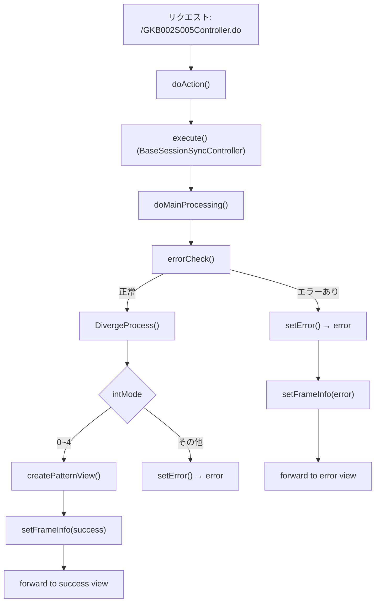

# GKB002S005Controller  
**パス**: `D:\code-wiki\projects\all\sample_all\java\Controller_GKB002S005Controller.java`  

---

## 1. 概要

| 項目 | 内容 |
|------|------|
| **役割** | 「就学履歴」画面の表示・再表示・エラーハンドリングを行う Spring MVC コントローラ。 |
| **主な機能** | 1. 画面遷移のエントリポイント (`/GKB002S005Controller.do`)   2. 画面表示に必要なデータ取得・整形  3. ボタン制御情報・ページ情報のセッション格納  4. エラー発生時のメッセージ取得・画面遷移設定 |
| **所属モジュール** | `jp.co.jip.gkb0000.app.gkb0020`（就学履歴系 UI） |
| **依存サービス** | - `GKB000_GetWkKuikigaiService`（区域外管理データ取得） - `GKB000_GetMessageService`（エラーメッセージ取得） - `GKB000CommonUtil`、`KKA000CommonUtil`（セッション/日付変換ユーティリティ） |
| **対象読者** | 本モジュールを保守・拡張する新規開発者、または UI フローを追いかけるテスト担当者 |

> **新規開発者が最初に抱く疑問**  
> *「このコントローラはどのタイミングで呼ばれ、どのデータを画面に渡すのか？」*  
> 本ドキュメントは「リクエスト → データ取得 → セッション格納 → 画面遷移」の流れを中心に解説し、実装上の重要ポイントと注意点をまとめています。

---

## 2. コードレベルの洞察

### 2.1 エントリポイントとフロー

* **`doAction`**: Spring の `@RequestMapping` に紐付くエントリ。`execute` は `BaseSessionSyncController` が提供する共通前処理（トランザクション、ログ等）を実行。
* **`doMainProcessing`**: 例外は上位へスローし、`setFrameInfo` でフレーム制御情報を設定した後、`ActionMapping` が保持する forward 名へ遷移。
* **`DivergeProcess`**: 画面モード (`prcsMode`) に応じて処理を分岐。`0~4` が「表示系」(初期表示・再表示・追加・修正・削除) で、`createPatternView` が実体処理。モードが不正ならエラーへ。
* **`createPatternView`**:  
  1. 学齢簿情報 (`GakureiboSyokaiView`) を取得。  
  2. 区域外管理データ (`KuikigaiKanriListView`) を `getKuikigaiKanri` で取得。  
  3. 件数カウント → 画面制御情報 (`KuikigaiKanriListParaView`) を生成。  
  4. 画面表示用データ (`KuikigaiKanriListView`) を `getsRirekiForm` で整形。  
  5. 必要なオブジェクトをすべてセッションに格納。  

### 2.2 主要メソッドの役割と実装ポイント

| メソッド | 目的 | 重要ロジック・注意点 |
|----------|------|----------------------|
| `errorCheck` | 事前バリデーション | - タイムアウト・セッション欠損チェック  - `prcsMode` の範囲チェック  - 追加/修正時の必須項目チェック (区分コード・開始日) |
| `getKuikigaiKanri` | 区域外管理テーブルから対象児童の履歴を取得 | - `service.perform(inBean)` で外部サービス呼び出し  - 取得結果を `KuikigaiKanriListView` に変換し、10 件未満はダミーデータで埋める  - 日付は `KKA000CommonUtil` で西暦→和暦変換、`format` で桁揃え |
| `getSRirekiParaView` | 画面上のボタン有効/無効状態を決定 | - 件数が 10 件で「追加」ボタン無効、0 件で「修正/削除」ボタン無効 |
| `getsRirekiForm` | 画面表示用の 1 行データを生成 | - `prcsMode` が 1/2 (追加/修正) のときは空データを返す  - それ以外は `sRirekiForm` の現在値をそのまま設定  - ラベル文字列 (`追加/修正/削除`) を設定 |
| `setFrameInfo` | フレーム（親ウィンドウ）側の「戻る」「再表示」リンクを設定 | - 成功時は前画面 (`GKB002S004GakureiboIdoController`) と同画面へのリフレッシュ URL を設定  - 失敗時はリンクを無効化 |
| `setError` / `setError(HttpServletRequest, ArrayList)` | エラーメッセージ取得 → `ErrorMessageForm` に格納 | - `messageService.perform` でメッセージコードから文言取得  - `setModelMessage` (継承元) がリクエスト属性へ設定 |

### 2.3 データフロー

1. **入力**: `HttpServletRequest` → `ActionForm` (`GKB002S005Form`)  
2. **取得**:  
   - `GakureiboSyokaiView` (`GKB_011_01_VIEW`) – 学齢簿情報  
   - `KuikigaiKanriListView` (`getKuikigaiKanri`) – 区域外管理履歴  
3. **加工**: 件数カウント → 画面制御情報 (`KuikigaiKanriListParaView`)  
4. **整形**: 1 行分の表示データ (`KuikigaiKanriListView`)  
5. **出力**: すべてをセッションキーで保存  
   - `GKB_011_05_VECTOR` – 履歴配列（最大 10 件）  
   - `GKB_011_05_VIEW` – フォームオブジェクト  
   - `GKB_011_05_CONTROL` – ボタン制御情報  
   - `GKB_PARA_VIEW` – 画面パラメータビュー  

---

## 3. 依存関係とリンク

| 参照先 | 種類 | 用途 | Wiki リンク |
|--------|------|------|-------------|
| `GKB002S005Form` | フォームクラス | 画面入力・状態保持 | [GKB002S005Form](http://localhost:3000/projects/all/wiki?file_path=java%2Fform%2FGKB002S005Form.java) |
| `GakureiboSyokaiView` | ヘルパークラス | 学齢簿情報取得 | [GakureiboSyokaiView](http://localhost:3000/projects/all/wiki?file_path=java%2Fhelper%2FGakureiboSyokaiView.java) |
| `KuikigaiKanriList` / `KuikigaiKanriListView` | ドメイン/ヘルパー | 区域外管理データの保持・表示 | [KuikigaiKanriList](http://localhost:3000/projects/all/wiki?file_path=java%2Fhelper%2FKuikigaiKanriList.java) |
| `KuikigaiKanriListParaView` | ヘルパー | ボタン有効/無効情報 | [KuikigaiKanriListParaView](http://localhost:3000/projects/all/wiki?file_path=java%2Fhelper%2FKuikigaiKanriListParaView.java) |
| `GKB000_GetWkKuikigaiService` | サービス | 区域外管理データ取得（外部呼び出し） | [GKB000_GetWkKuikigaiService](http://localhost:3000/projects/all/wiki?file_path=java%2Fservice%2Fgkb000%2FGKB000_GetWkKuikigaiService.java) |
| `GKB000_GetMessageService` | サービス | エラーメッセージ取得 | [GKB000_GetMessageService](http://localhost:3000/projects/all/wiki?file_path=java%2Fservice%2Fgkb000%2FGKB000_GetMessageService.java) |
| `GKB000CommonUtil` / `KKA000CommonUtil` | ユーティリティ | セッション操作、日付変換、null→空文字等 | [GKB000CommonUtil](http://localhost:3000/projects/all/wiki?file_path=java%2Fcommon%2Fdao%2FGKB000CommonUtil.java) |
| `BaseSessionSyncController` | 基底クラス | `execute`・共通前処理 | [BaseSessionSyncController](http://localhost:3000/projects/all/wiki?file_path=java%2Fbase%2FBaseSessionSyncController.java) |
| `ResultFrameInfo` | フレーム情報クラス | 戻る/再表示リンク設定 | [ResultFrameInfo](http://localhost:3000/projects/all/wiki?file_path=java%2Ffw%2Fbean%2Fview%2FResultFrameInfo.java) |
| `ScreenHistory` | ヘルパー | 画面遷移履歴管理（本クラスでは生成のみ） | [ScreenHistory](http://localhost:3000/projects/all/wiki?file_path=java%2Fhelper%2FScreenHistory.java) |

---

## 4. 重要な実装上の留意点

1. **セッションキーの一貫性**  
   - `GKB_011_01_VIEW`、`GKB_011_05_VECTOR`、`GKB_011_05_VIEW` などは他コントローラでも参照されるため、キー名を変更しないこと。  
   - `gkb000CommonUtil.isSession` / `setSession` のラッパーは null チェックとタイムアウト判定を内部で行うので、直接 `request.getSession()` を触らない。

2. **`prcsMode` の取り扱い**  
   - 0: 再表示、1: 追加、2: 追加確定、3: 修正、4: 削除、5: 更新(削除除く) という独自規約。  
   - `DivergeProcess` では `intMode` が 0~4 のときに `createPatternView` を呼び出すが、`intMode == 5` はエラー扱いになる点に注意。

3. **10 件固定ロジック**  
   - 画面は最大 10 行まで表示できる設計。`getKuikigaiKanri` で不足分はダミーデータで埋め、`createPatternView` でも 10 件超過分は先頭 10 件だけセッションに格納。  
   - 将来的に行数を変更する場合は **2 か所** (`getKuikigaiKanri` のダミー生成ロジック、`createPatternView` の切り出しロジック) を同時に修正する必要がある。

4. **日付変換**  
   - `KKA000CommonUtil.getSeireki2Wareki` → `format(...,3)` で「和暦3桁」(例: `R01`) に統一。ロジック変更時は `KKA000CommonUtil` の仕様に依存するため、テストケースで和暦変換が正しく行われているか確認。

5. **エラーハンドリング**  
   - `setError` 系は必ず `"error"` を返すが、呼び出し側 (`DivergeProcess`) がその文字列を `forward` に使用する点に注意。  
   - `errorCheck` が `true` を返すと即座に `CS_FORWARD_ERROR` が返るが、`errorCheck` 内部で `setError` が呼ばれた後に **二重** でエラーメッセージが設定されないように設計されている。

6. **例外の伝搬**  
   - `doMainProcessing`・`doAction` は `throws Exception`。フレームワーク側で例外ハンドラが捕捉し、`setError` が呼ばれないケース（例: サービス呼び出しで `RuntimeException`）はスタックトレースがそのまま出力される。必要に応じて `try/catch` を追加し、`setError` 経由でユーザ向けメッセージを出すことを推奨。

---

## 5. 拡張・保守のポイント

| シナリオ | 変更箇所 | 推奨手順 |
|----------|----------|----------|
| **画面項目に新しいフィールドを追加** | - `KuikigaiKanriListView` にプロパティ追加  - `getsRirekiForm` で新フィールドの設定  - `createPatternView` のセッション格納キーは同じ | 1. ドメイン/ヘルパークラスにフィールド追加  2. `getsRirekiForm` にマッピングロジックを追記  3. 画面 JSP/Thymeleaf 側で新フィールドを参照 |
| **表示件数上限を 20 件に変更** | - `getKuikigaiKanri` のダミーデータ生成ロジック  - `createPatternView` の配列切り出しロジック | 1. 定数 `MAX_DISPLAY = 20` をクラスに追加  2. 2 箇所で `10` → `MAX_DISPLAY` に置換  3. テストケースで 20 件超過時の挙動を確認 |
| **エラーメッセージの多言語化** | - `KyoikuMsgConstants` に新コード追加  - `setError` の呼び出し側でコードを切り替え | 1. メッセージ定義ファイルにロケール別文言を追加  2. 必要箇所で `MessageNo` にロケール情報を付与（既存実装が対応していればそのまま） |
| **トランザクション制御の追加** | - `GKB000_GetWkKuikigaiService` 呼び出し前後 | 1. `@Transactional` アノテーションをサービス層に付与  2. 失敗時は `setError` でロールバックを明示的にハンドリング |

---

## 6. 参考リンク（外部ドキュメント）

- **Spring MVC**: `@Controller`、`@RequestMapping` の基本的な挙動  
- **JSP/Thymeleaf**: 本コントローラが返す `ModelAndView` のビュー名は `success` / `error` で、`ResultFrameInfo` がフレーム制御に利用される点に留意。  
- **共通ユーティリティ**: `GKB000CommonUtil.nullToSpace` は `null` → `""` の安全変換、頻繁に使用されているのでテストケースに含めること。  

--- 

*本ドキュメントは新規開発者が「就学履歴画面」コントローラの全体像と主要ロジックを把握し、保守・機能追加を安全に行えるよう設計意図と実装上の注意点をまとめました。*