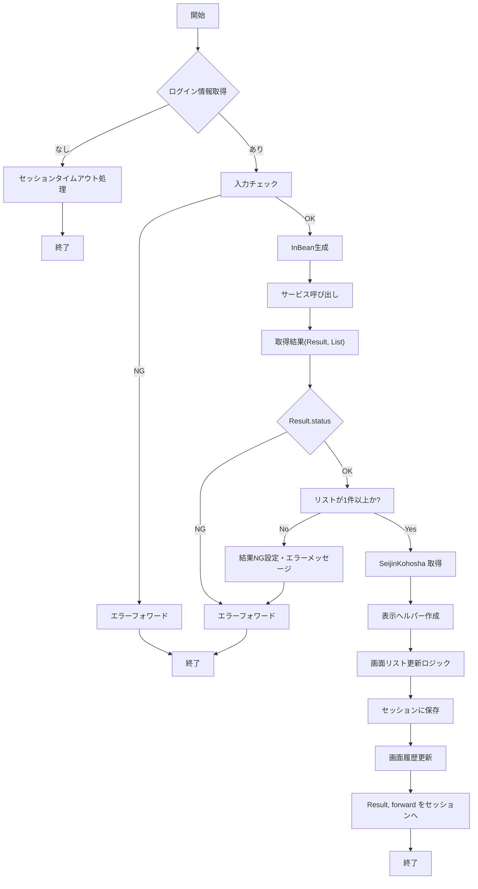

# GKB003S004Controller  
**ファイルパス**: `D:\code-wiki\projects\all\sample_all\java\Controller_GKB003S004Controller.java`  

---  

## 1. 概要  
`GKB003S004Controller` は **成人者登録画面（初期表示）** のエントリポイントです。  
Spring MVC の `@Controller` として登録され、以下の役割を担います。

| 役割 | 内容 |
|------|------|
| **画面表示** | `/GKB003S004Controller.do` へのリクエストを受け取り、`doAction` → `execute` の流れで画面を描画 |
| **登録ボタン処理** | `doMainProcessing` が「登録」ボタン押下時のメインロジックを実装 |
| **入力バリデーション** | `inputCheck` で画面入力項目（年度・整理番号・出欠区分）の必須・形式チェック |
| **サービス呼び出し** | `GKB003S004_GetSeijinTorokuService` に検索条件を渡し、対象者情報を取得 |
| **結果格納** | 取得結果・エラーメッセージ・画面履歴を `HttpSession` に保存し、次画面へ引き継ぐ |
| **エラーハンドリング** | `sysError` で共通エラーメッセージ取得、`doPostProcessing` でフレーム制御情報を設定 |

> **新規開発者へのポイント**  
> - このコントローラは「画面遷移」だけでなく、**ビジネスロジックの呼び出し・結果加工・画面状態管理** を一手に担うため、**セッション管理** と **Result オブジェクト** の扱いが鍵になります。  

---  

## 2. コードレベルの洞察  

### 2.1 主要メソッドとフロー  

| メソッド | 目的 | 主な処理 |
|----------|------|----------|
| `setUpForm` | `ActionForm` の自動生成（Spring の `@ModelAttribute`） | `setModelAttribute(request)` を呼び出すだけ |
| `doAction` | エントリポイント（`/GKB003S004Controller.do`） | `execute` に委譲 |
| `doMainProcessing` | **登録ボタン押下時のメインロジック** | 1. セッション取得 2. ログイン情報チェック 3. 入力チェック 4. サービス呼び出し → 取得結果加工 5. 画面リスト更新 6. 結果・履歴保存 |
| `inputCheck` | 入力項目の必須・形式バリデーション | 年度・整理番号・出欠区分を検証し、`Result` にエラーメッセージを格納 |
| `createInBean` | サービス呼び出し用の **InBean** を生成 | `SeijinKensakuJoken` に年度・整理番号をセット |
| `sysError` | 共通エラーメッセージ取得 | `GKB000_GetMessageService` を呼び出し、`ErrorMessageForm` に格納 |
| `doPostProcessing` | 画面遷移後のフレーム制御情報設定 | 正常/エラーで `ResultFrameInfo` を作成し、セッションに保存 |

### 2.2 `doMainProcessing` のフローチャート  

### 2.3 重要なデータ構造  

| クラス | 用途 |
|--------|------|
| `Result` | 処理ステータス（`CN_STATUS_OK/NG`）・メッセージ・詳細を保持 |
| `SeijinKohosha` / `SeijinKohoshaView` | 取得した成人者情報（DTO）と画面表示用ヘルパー |
| `SeijinTorokuView` | 画面全体の状態（入力項目、表示リスト、ページ情報）を保持 |
| `ScreenHistory` | 画面遷移履歴を保持し、画面上部に表示 |
| `ResultFrameInfo` | フレーム（左/右フレーム）制御情報（戻る・再表示リンク） |

---  

## 3. 依存関係と関係  

### 3.1 DI（依存性注入）  

| フィールド | 型 | 役割 |
|------------|----|------|
| `gkb003S004_GetSeijinTorokuService` | `GKB003S004_GetSeijinTorokuService` | 成人者検索ロジック（ドメイン層） |
| `gkb000_GetMessageService` | `GKB000_GetMessageService` | エラーメッセージ取得 |
| `actionMappingConfigContext` | `ActionMappingConfigContext` | URL → ActionMapping のマッピング取得 |
| `kka000CommonUtil` | `KKA000CommonUtil` | 和暦/西暦変換・日付フォーマット |
| `jia000CommonDao` | `JIA000CommonDao` | 世帯主情報取得 |
| `gaa000CommonDao` | `JIA000CommonDao` | 世帯主名取得 |
| `gkb000CommonUtil` | `GKB000CommonUtil` | 画面履歴・性別表示等ユーティリティ |

### 3.2 外部クラスへのリンク  

- [`GKB003S004_GetSeijinTorokuService`](http://localhost:3000/projects/all/wiki?file_path=D:\code-wiki\projects\all\sample_all\java\GKB003S004_GetSeijinTorokuService.java)  
- [`GKB000_GetMessageService`](http://localhost:3000/projects/all/wiki?file_path=D:\code-wiki\projects\all\sample_all\java\GKB000_GetMessageService.java)  
- [`KyoikuLoginInfo`](http://localhost:3000/projects/all/wiki?file_path=D:\code-wiki\projects\all\sample_all\java\KyoikuLoginInfo.java)  
- [`KyoikuConstants`](http://localhost:3000/projects/all/wiki?file_path=D:\code-wiki\projects\all\sample_all\java\KyoikuConstants.java)  

（実際のプロジェクト構成に合わせてパスは調整してください）

---  

## 4. 詳細実装ポイント  

### 4.1 入力チェック (`inputCheck`)  

| 項目 | チェック内容 | エラーメッセージ例 |
|------|--------------|-------------------|
| 年度 | 空文字 → 必須、和暦→西暦変換が0 → 不正 | 「年度を入力して下さい。」 / 「年度が正しく入力されていません。」 |
| 整理番号 | 空文字 → 必須、数値が0以下 → 不正 | 「整理番号を入力して下さい。」 |
| 出欠区分 | `"0"`（欠席）または `"1"`（出席）以外は NG | 「出力区分を入力して下さい。」 |

- **Result** オブジェクトにエラーメッセージを格納し、`session` に保存して画面に表示させる。  

### 4.2 取得結果の画面リスト更新  

1. **取得リストは常に 1 件** だが `ArrayList` で受け取る。  
2. `SeijinKohoshaView` に変換し、**和暦変換** (`kka000CommonUtil.format`) を行う。  
3. **世帯主名** は `jia000CommonDao` と `gaa000CommonDao` を組み合わせて取得。  
4. **リスト更新ロジック**  
   - 既存リストが空であれば **新規作成**。  
   - 既に同一個人番号が存在すれば **追加しない**。  
   - 追加時は表示リスト (`LhyojiList`) と更新リスト (`LtorokuList`) の両方に反映。  
5. **ページ情報** (`Sokensu`, `Sopagesu`, `Genpagesu`) を再計算し、`SeijinTorokuView` に保存。  

### 4.3 エラーハンドリング (`sysError`)  

- `MessageNo` オブジェクトにメッセージ番号を入れ、`GKB000_GetMessageService` でメッセージテキストを取得。  
- 取得した `ErrorMessageForm` を `setModelMessage`（`BaseSessionSyncController` のメソッド）でリクエストに設定。  

### 4.4 画面遷移後のフレーム制御 (`doPostProcessing`)  

| 成功時 | 戻るリンク → `GKB000S000KyoikuSeijinMenuController`、再表示リンク → `GKB003S000SeijinTorokuController` |
|------|-----------------------------------------------------------------------------------------------|
| エラー時 | 戻るリンクは同上、再表示は使用不可 (`frameRefreshAction` が空) |

`ResultFrameInfo` は **CasConstants.CAS_FRAME_INFO** キーでセッションに保存され、フレームページ側で参照される。  

---  

## 5. 注意点・潜在的課題  

| 項目 | 説明 | 推奨対策 |
|------|------|----------|
| **セッション依存** | ログイン情報・画面状態・結果すべてが `HttpSession` に格納されるため、セッションタイムアウトや競合に注意。 | タイムアウト時は明示的にリダイレクト／エラーメッセージを統一。 |
| **Result の二重設定** | `catch` ブロックと `if (result.getStatus() == NG)` で同様の NG 設定が重複。 | エラーハンドリングを共通メソッドに抽出し、重複排除。 |
| **リスト更新ロジックの可読性** | `ArrayList` のキャストやサイズチェックが多く、ミスが起きやすい。 | `List<SeijinKohosha>` などジェネリクスで型安全化し、Stream API で重複チェックを簡潔化。 |
| **ハードコーディングされた文字列** (`"0"`, `"1"`, `" "` 等) | 将来変更が必要になる可能性。 | 定数クラス（例: `KyoikuConstants`) に集約。 |
| **例外情報の二重設定** (`result.setDescription(e.getMessage())` が 2 回) | 冗長で意味がない。 | 1 回に統一。 |
| **画面履歴のキャスト** (`(ArrayList)session.getAttribute("GKB_SCREENHISTORY")`) | 型安全でない。 | `@SuppressWarnings("unchecked")` か、専用ラッパークラスで管理。 |

---  

## 6. まとめ  

`GKB003S004Controller` は **成人者登録画面のエントリポイント** と **登録処理ロジック** を一体化したコントローラです。  
- **入力チェック → サービス呼び出し → 取得結果加工 → 画面リスト更新 → セッション保存 → 画面遷移** の一連の流れを把握すれば、機能追加や不具合修正がスムーズに行えます。  
- 今後の保守性向上のために **セッション依存の整理、型安全化、重複ロジックの共通化** を検討してください。  