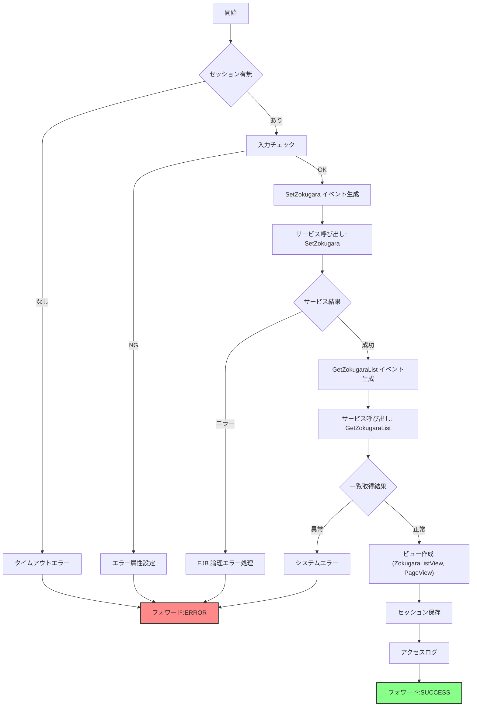

# 【Controller】`GKB004S011SetZokugaraController`  
**ファイルパス**: `D:\code-wiki\projects\all\sample_all\java\Controller_GKB004S011SetZokugaraController.java`  
[ソースコード全体](http://localhost:3000/projects/all/wiki?file_path=D:/code-wiki/projects/all/sample_all/java/Controller_GKB004S011SetZokugaraController.java)

---  

## 1. 概要  

| 項目 | 内容 |
|------|------|
| **役割** | 「続柄」(保護者・児童生徒との関係) の登録・更新・削除を行う Web コントローラ。Spring MVC の `@Controller` としてエントリポイントを提供し、画面遷移・エラーハンドリング・セッション管理を一手に担う。 |
| **主なフロー** | 1. セッションチェック → 2. 入力バリデーション → 3. `SetZokugara` イベント送信 → 4. 更新結果取得 → 5. 続柄一覧取得 → 6. ページング情報作成 → 7. 成功/エラーに応じたフォワード設定 |
| **対象画面** | 「続柄名（児童生徒との関係）設定」／「続柄名（保護者との関係）設定」画面の **更新ボタン** アクション |
| **主要クラス** | - `GKB004S011SetZokugaraController` (本クラス) <br> - `GKB004S011_SetZokugaraService` <br> - `GKB004S011_GetZokugaraListService` <br> - `GKB000_GetMessageService` <br> - `KKA000CommonDao` (アクセスログ) |
| **重要な定数** | `KyoikuConstants.CS_FORWARD_SUCCESS / CS_FORWARD_ERROR`、`KyoikuMsgConstants` 系エラーメッセージ番号 |

> **新規担当者へのポイント**  
> - 本コントローラは **「画面最適化_エラー画面変更」** と呼ばれる独自ロジックで、エラー時に画面状態を保持しつつ再表示させる点が特徴です。  
> - 変更対象は **続柄コード** と **続柄名** のみで、他の画面要素はセッションに保存されたビューオブジェクト (`ZokugaraParaView`, `PageView` など) を更新していることを意識してください。

---  

## 2. コードレベルの洞察  

### 2.1 エントリポイント  

```java
@RequestMapping(REQUEST_MAPPING_PATH + ".do")
@Override
public ModelAndView doAction(... ) throws Exception {
    return this.execute(
        actionMappingConfigContext.getActionMappingByPath(REQUEST_MAPPING_PATH),
        form, request, response, mv);
}
```

*`execute`* は `BaseSessionSyncController` が提供する共通フレームワークメソッドで、実際の処理は `doMainProcessing` に委譲されます。

---

### 2.2 `doMainProcessing` の全体フロー  



#### 主な分岐ポイント  

| 分岐 | 条件 | 処理 |
|------|------|------|
| **セッションチェック** | `loginInfo == null` | `sysError` → `CS_FORWARD_ERROR` |
| **入力チェック** (`inputCheck`) | 必須項目未入力 | エラーメッセージ設定 → `CS_FORWARD_ERROR` |
| **SetZokugara Service** | `setres.isError()` | EJB 論理エラー → `ErrorMessageForm` 保存 → `CS_FORWARD_ERROR` |
| **GetZokugaraList Service** | `getresult.getStatus() != OK` | システムエラー (`EQ_KYOTU_01`) → `CS_FORWARD_ERROR` |
| **成功** | すべて OK | ビュー作成 → セッションに `GKB_ALL_ZOKUGARA`, `GKB_PAGE_VIEW` 等保存 → `CS_FORWARD_SUCCESS` |

---

### 2.3 主要メソッドの役割  

| メソッド | 目的 | 主な処理 |
|----------|------|----------|
| `inputCheck` | フォーム項目の必須チェック | `MessageNo` でエラーメッセージ取得 → `ErrorMessageForm` に格納 |
| `createSetEvent` | `SetZokugara` 用の入力イベントオブジェクト生成 | `ZokugaraList` に入力値設定、`UpdateInfo` に更新者情報・日時設定 |
| `createGetEvent` | 続柄一覧取得用イベント生成 | `ZokugaraList` に種別 (`ZokugaraKbn`) を設定 |
| `createZokugaraListView` | DB 取得データ → 画面表示用 `ZokugaraListView` ベクタへ変換 | 10 件未満はダミーデータで埋める |
| `createPageView` | ページング情報 (`PageView`) の算出 | 総ページ数・現在ページ・選択肢リスト作成 |
| `getJokenItem` | 更新対象コードから「条件一覧」表示位置を算出 | コード順検索で対象アイテム番号取得 |
| `sysError` | 汎用システムエラー処理 | `GKB000_GetMessageService` でメッセージ取得 → `ErrorMessageForm` 設定 |
| `doPostProcessing` | フレーム制御情報 (`ResultFrameInfo`) の設定 | 成功/エラーで「戻る」・「再表示」リンク先を切り替える |

---

### 2.4 エラーハンドリングの流れ  

1. **入力エラー** → `inputCheck` が `false` を返す → `request` に `errorHassei=true` 等属性を付与し、`CS_FORWARD_ERROR` に遷移。  
2. **EJB 論理エラー** → `setres.isError()` が `true` → `ErrorMessageForm` にエラー・警告リストを格納し、同様にエラー画面へ。  
3. **予期せぬ例外** → `catch (Exception e)` で `sysError` を呼び、`CS_FORWARD_ERROR`。  
4. **システムエラー (一覧取得失敗)** → `getresult.getStatus()!=OK` → `sysError` → エラー画面。

---

## 3. 依存関係・関連リソース  

| 依存先 | 用途 | リンク |
|--------|------|--------|
| `GKB004S011_SetZokugaraService` | 続柄情報更新（DB 更新） | [GKB004S011_SetZokugaraService](http://localhost:3000/projects/all/wiki?file_path=) |
| `GKB004S011_GetZokugaraListService` | 続柄一覧取得 | [GKB004S011_GetZokugaraListService](http://localhost:3000/projects/all/wiki?file_path=) |
| `GKB000_GetMessageService` | メッセージコード → 文言変換 | [GKB000_GetMessageService](http://localhost:3000/projects/all/wiki?file_path=) |
| `KKA000CommonDao` | アクセスログ書き込み (新WizLIFE2次開発) | [KKA000CommonDao](http://localhost:3000/projects/all/wiki?file_path=) |
| `KKA000CommonUtil` | 日時文字列 → 数値変換等ユーティリティ | [KKA000CommonUtil](http://localhost:3000/projects/all/wiki?file_path=) |
| `GKB000CommonUtil` | 文字列→数値変換 (`CInt`) 等 | [GKB000CommonUtil](http://localhost:3000/projects/all/wiki?file_path=) |
| `ZokugaraParaView` / `ZokugaraListView` / `PageView` | 画面表示用データ構造（セッション保持） | 各クラスの Wiki ページへリンク |
| `KyoikuLoginInfo` | ログインユーザ情報（更新者） | [KyoikuLoginInfo](http://localhost:3000/projects/all/wiki?file_path=) |
| `Result`, `ResultFrameInfo` | フレーム制御・結果ステータス | [Result](http://localhost:3000/projects/all/wiki?file_path=) / [ResultFrameInfo](http://localhost:3000/projects/all/wiki?file_path=) |

> **注**: 上記リンクはプレースホルダーです。実際のファイルパスに合わせて置き換えてください。

---

## 4. 設計上の留意点・潜在的課題  

| 項目 | 内容 |
|------|------|
| **セッション依存** | 画面状態 (`ZokugaraParaView`, `GKB_ALL_ZOKUGARA` など) がすべて HttpSession に保存されるため、セッションサイズが肥大化しやすい。長時間保持が必要か再検討を推奨。 |
| **ハードコーディングされたページサイズ** | `10` 件単位のページングがコード中に散在。将来的にページサイズ変更が必要になる場合は定数化を検討。 |
| **エラーメッセージ取得の重複** | `inputCheck` と `sysError` で同一 `GKB000_GetMessageService` 呼び出しが重複。共通ユーティリティ化でコード量削減可能。 |
| **例外処理の一括捕捉** | `catch (Exception e)` で全例外を捕捉しスタックトレースを出力のみ。業務例外とシステム例外の区別ができないため、障害解析が困難になる恐れ。 |
| **アクセスログのハードコーディング** | 画面名文字列がコード内に直接記述。多言語化や画面名変更時に影響範囲が広がる。 |
| **テスト容易性** | `HttpServletRequest/Response` と `HttpSession` が直接使用されているため、単体テストでモックが必要。DI コンテナでラップした方がテストしやすい。 |

---

## 5. 変更・拡張時のチェックリスト  

1. **セッションキーの衝突確認** – 新規属性を追加する場合は既存キー (`GKB_ALL_ZOKUGARA` など) と重複しないか。  
2. **ページングロジック** – `createPageView` の 10 件単位ロジックを変更したら、`doMainProcessing` の `if (vAllZokugara.size() <= 10)` も合わせて修正。  
3. **エラーメッセージ番号** – 新規バリデーションを追加したら `KyoikuMsgConstants` に対応メッセージを登録し、`inputCheck` に組み込む。  
4. **アクセスログ** – 画面名・業務コードが変わる場合は `kka000CommonDao.accessLog` の引数を更新。  
5. **単体テスト** – `createSetEvent` / `createGetEvent` の戻り値が正しいか、`UpdateInfo` に正しいユーザ情報が入っているかを検証。  

---  

## 6. 参考リンク（クラス・定数）  

- `BaseSessionSyncController` – 本コントローラのスーパークラス  
- `ActionForm`, `ActionMapping` – フレームワーク共通のリクエスト/マッピングオブジェクト  
- `KyoikuConstants` – フォワード文字列・ステータス定数  
- `KyoikuMsgConstants` – メッセージ番号定義  

---  

*このドキュメントは新規担当者が `GKB004S011SetZokugaraController` の全体像と主要ロジックを迅速に把握できるよう設計されています。実装変更時は上記「設計上の留意点」や「変更チェックリスト」を必ず参照してください。*