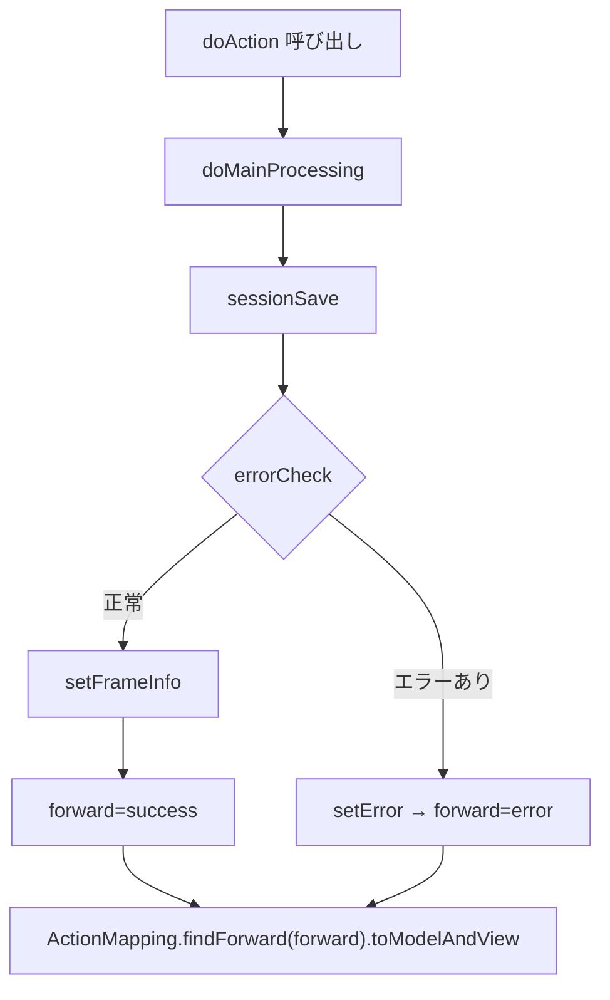

# GakureiboPrintOutController の技術ドキュメント  
**ファイルパス**: `D:\code-wiki\projects\all\sample_all\java\Controller_GakureiboPrintOutController.java`

---

## 1. 概要概述
| 項目 | 内容 |
|------|------|
| **クラス名** | `GakureiboPrintOutController` |
| **所属パッケージ** | `jp.co.jip.gkb000.app.gkb000` |
| **役割** | 学齢簿（児童・保護者情報）に基づく帳票（印刷・PDF）発行画面を表示し、画面遷移・エラーハンドリング・ログ出力を統括する Web コントローラ |
| **継承** | `BaseSessionSyncController`（セッション同期ロジックを提供） |
| **主要エンドポイント** | `GET /GakureiboPrintOutController.do`（`REQUEST_MAPPING_PATH + ".do"`） |
| **対象ユーザー** | 新規にこのモジュールを保守・拡張する開発者 |

> **なぜこのクラスが必要か**  
> 学齢簿情報は多くの画面で共有され、帳票発行は業務上必須です。画面表示前に必要なデータ取得・整形・権限チェック・ログ記録を一元化し、画面遷移情報（戻る・再表示）をフレームに渡すことで、フロントエンドの一貫性を保ちます。

---

## 2. コードレベル洞察

### 2.1 主要メソッドとフロー

| メソッド | 説明 | リンク |
|----------|------|--------|
| `doAction` | Spring MVC のエントリポイント。`execute`（`BaseSessionSyncController`）へ委譲。 | [doAction](http://localhost:3000/projects/all/wiki?file_path=D:\code-wiki\projects\all\sample_all\java\Controller_GakureiboPrintOutController.java) |
| `doMainProcessing` | 画面表示のメインロジック。`sessionSave` → `setFrameInfo` → フォワード決定 の順に実行。 | [doMainProcessing](http://localhost:3000/projects/all/wiki?file_path=D:\code-wiki\projects\all\sample_all\java\Controller_GakureiboPrintOutController.java) |
| `sessionSave` | 学齢簿情報をセッションに格納し、印刷用ビューや教育委員会コード等の補助情報を取得。 | [sessionSave](http://localhost:3000/projects/all/wiki?file_path=D:\code-wiki\projects\all\sample_all\java\Controller_GakureiboPrintOutController.java) |
| `errorCheck` | タイムアウト、セッション欠損、DV（ドメスティックバイオレンス）規制チェックを行い、エラーがあれば `setError` を呼び出す。 | [errorCheck](http://localhost:3000/projects/all/wiki?file_path=D:\code-wiki\projects\all\sample_all\java\Controller_GakureiboPrintOutController.java) |
| `setError` | エラーメッセージ取得サービス (`GKB000_GetMessageService`) を呼び出し、`ErrorMessageForm` を作成してフレームに設定。 | [setError](http://localhost:3000/projects/all/wiki?file_path=D:\code-wiki\projects\all\sample_all\java\Controller_GakureiboPrintOutController.java) |
| `setFrameInfo` | 成功時は「戻る」「再表示」リンクを生成し、`ResultFrameInfo` に格納。失敗時はリンクを無効化。 | [setFrameInfo](http://localhost:3000/projects/all/wiki?file_path=D:\code-wiki\projects\all\sample_all\java\Controller_GakureiboPrintOutController.java) |
| `createLog` | 帳票発行操作を監査ログに記録。 | [createLog](http://localhost:3000/projects/all/wiki?file_path=D:\code-wiki\projects\all\sample_all\java\Controller_GakureiboPrintOutController.java) |
| `processDateCnv` | 和暦日付 → 西暦整数変換（`KKA000CommonUtil#getWareki2Seireki` 使用）。 | [processDateCnv](http://localhost:3000/projects/all/wiki?file_path=D:\code-wiki\projects\all\sample_all\java\Controller_GakureiboPrintOutController.java) |
| `lnullToValue` | `String` → `long` 変換ユーティリティ。null/空文字は 0 を返す。 | [lnullToValue](http://localhost:3000/projects/all/wiki?file_path=D:\code-wiki\projects\all\sample_all\java\Controller_GakureiboPrintOutController.java) |

### 2.2 メイン処理フロー（Mermaid）

### 2.3 重要ロジックのポイント

1. **セッション保持 (`sessionSave`)**  
   - `GakureiboSyokaiView`（学齢簿表示情報）を取得し、`prcsMode`, `chohyoSelectNo`, `tsuchisho` などの初期化。  
   - `CommonGakureiboIdo#setGakureiboPara` でリクエストパラメータから学齢簿情報をマッピング。  
   - 外字（特殊文字）登録有無を `gaa000CommonDao#getGaijiMitouroku` で取得し、`mitourokugaijiFlg` に格納。  
   - 印刷ビュー (`PrintOutView`) に現在日時（`yyyyMMdd`）を `hassobi` として設定。  
   - 教育委員会コードリストを `KKA000CommonDao#getCtList` で取得し、`session` に `GKB_KyouikuList` とフラグを保存。

2. **DV 規制チェック (`errorCheck`)**  
   - `gaa000CommonDao#getDVShikaku`（旧コード） → `GetDVShikakuParam` に置換済み。  
   - 保護者・児童それぞれに対し規制区分 (`gaitoKbn`) を取得し、`1` は警告、`2` はエラーとして `setError` を呼び出す。  
   - いずれかが対象者なら処理は即座にエラーへ遷移。

3. **フレーム情報 (`setFrameInfo`)**  
   - 成功時は画面履歴 (`ScreenHistory`) を更新し、`ResultFrameInfo` に「戻る」「再表示」URL とターゲットを設定。  
   - メニュー番号 (`menu_no`) に応じて遷移先を分岐。  
   - 失敗時はリンクを空文字にし、ボタン無効化。

4. **ログ (`createLog`)**  
   - `KKA000CommonDao#accessLog` に必要情報（顧客番号、世帯番号、処理コード等）を渡すだけのラッパー。  
   - 変更履歴に合わせて引数型を `String` → `String` に統一。

### 2.4 例外・エラーハンドリング

| 例外種別 | 発生箇所 | 対応 |
|----------|----------|------|
| `Timeout` | `errorCheck` → `gkb000CommonUtil.isTimeOut` | `setError` にてタイムアウトエラーメッセージを設定 |
| `Session missing` | `errorCheck` → `gkb000CommonUtil.isSession` | 同上、セッション欠損エラー |
| `DV規制` | `errorCheck` → `gaa000CommonDao.getDVShikaku` | 区分に応じて警告またはエラーを `setError` |
| DAO例外（外字取得等） | `sessionSave` の `gaa000CommonDao.getGaijiMitouroku` | 例外は捕捉し、デフォルト `"0"` を使用して処理継続 |
| ログ書き込み失敗 | `createLog` | 例外をスタックトレース出力し、処理は継続（ログ失敗は致命的でない） |

---

## 3. 依存関係と関係

### 3.1 注入されているコンポーネント（DI）

| フィールド | 型 | 用途 |
|------------|----|------|
| `gkb000_GetMessageService` | `GKB000_GetMessageService` | エラーメッセージ取得サービス |
| `kka000CommonUtil` | `KKA000CommonUtil` | 和暦→西暦変換、共通ユーティリティ |
| `gaa000CommonDao` | `GAA000CommonDao` | 外字取得・DV規制取得 DAO |
| `kka000CommonDao` | `KKA000CommonDao` | 教育委員会コード取得、ログ書き込み DAO |
| `gkb000CommonUtil` | `GKB000CommonUtil` | セッション操作・画面履歴管理ユーティリティ |

### 3.2 参照している外部クラス

| クラス | パッケージ | 目的 |
|--------|-----------|------|
| `GakureiboSyokaiView` | `jp.co.jip.gkb000.common.helper` | 学齢簿画面表示情報（DTO） |
| `PrintOutView` | `jp.co.jip.gkb000.app.helper` | 帳票印刷情報（日時等） |
| `CodeHelper` | `jp.co.jip.gkb000.common.helper` | 教育委員会コードと名称のペア |
| `ResultFrameInfo` | `jp.co.jip.wizlife.fw.bean.view` | フレーム制御情報（戻る/再表示リンク） |
| `ScreenHistory` | `jp.co.jip.gkb000.common.helper` | 画面遷移履歴管理 |
| `MessageNo` | `jp.co.jip.gkb000.common.helper` | エラーメッセージ番号ラッパー |
| `ModalDialogAction` | `jp.co.jip.wizlife.ModalDialogUtil` | モーダルダイアログ遷移情報 |
| `KKATCT02DTO` | `jp.co.jip.wizlife.fw.kka000.dto` | 教育委員会コード取得結果 DTO |
| `GetCtInforParam`, `GetCTListParam` | `jp.co.jip.wizlife.fw.kka000.dao.param` | DAO パラメータオブジェクト |

### 3.3 呼び出し元・呼び出し先

- **呼び出し元**: Spring MVC が `GET /GakureiboPrintOutController.do` にマッピングし、`doAction` がエントリーポイントになる。  
- **呼び出し先**:  
  - `BaseSessionSyncController#execute`（共通前処理・例外ハンドリング）  
  - 各 DAO/Util クラス（データ取得・変換・ログ）  
  - `GKB000_GetMessageService`（エラーメッセージ取得）  

---

## 4. 拡張・保守時の留意点

1. **DV規制ロジックの変更**  
   - `errorCheck` 内の `GetDVShikakuParam` の引数はシステム要件に合わせて更新が必要。  
   - 変更時は `KyoikuMsgConstants` のエラーメッセージコードが正しいか確認。

2. **教育委員会コード取得ロジック**  
   - `GetCTListParam` の `ctlprmCode` がハードコーディングされているため、追加コードが必要になったらここを拡張。  
   - `session` に格納するキー名 (`GKB_KyouikuList`) はフロント側でも使用されるので、名前変更は慎重に。

3. **ログフォーマット**  
   - `createLog` は `accessLog` のシグネチャが変わるとコンパイルエラーになる。  
   - 変更履歴に合わせて DAO のメソッドシグネチャを確認。

4. **画面遷移 URL**  
   - `setFrameInfo` で生成する URL は `request.getContextPath()` に依存。コンテキストパスが変わるとリンクが壊れるので、テスト環境・本番環境で必ず動作確認。

5. **例外処理**  
   - 現在は DAO の例外を捕捉してスタックトレースを出力するだけ。運用上はログフレームワーク（SLF4J 等）へ統一した方が可観測性が向上。

---

## 5. 参考リンク（コードブロック）

- [`doMainProcessing`](http://localhost:3000/projects/all/wiki?file_path=D:\code-wiki\projects\all\sample_all\java\Controller_GakureiboPrintOutController.java)  
- [`sessionSave`](http://localhost:3000/projects/all/wiki?file_path=D:\code-wiki\projects\all\sample_all\java\Controller_GakureiboPrintOutController.java)  
- [`errorCheck`](http://localhost:3000/projects/all/wiki?file_path=D:\code-wiki\projects\all\sample_all\java\Controller_GakureiboPrintOutController.java)  
- [`setError`](http://localhost:3000/projects/all/wiki?file_path=D:\code-wiki\projects\all\sample_all\java\Controller_GakureiboPrintOutController.java)  
- [`setFrameInfo`](http://localhost:3000/projects/all/wiki?file_path=D:\code-wiki\projects\all\sample_all\java\Controller_GakureiboPrintOutController.java)  
- [`createLog`](http://localhost:3000/projects/all/wiki?file_path=D:\code-wiki\projects\all\sample_all\java\Controller_GakureiboPrintOutController.java)  
- [`processDateCnv`](http://localhost:3000/projects/all/wiki?file_path=D:\code-wiki\projects\all\sample_all\java\Controller_GakureiboPrintOutController.java)  
- [`lnullToValue`](http://localhost:3000/projects/all/wiki?file_path=D:\code-wiki\projects\all\sample_all\java\Controller_GakureiboPrintOutController.java)  

--- 

*このドキュメントは新規開発者が `GakureiboPrintOutController` の全体像と主要ロジックを迅速に把握し、保守・機能追加を行う際の指針となることを目的としています。*