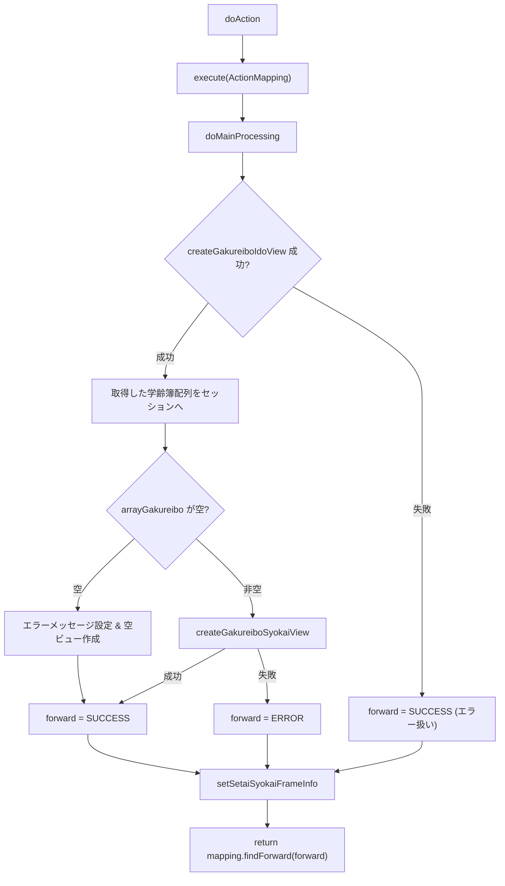
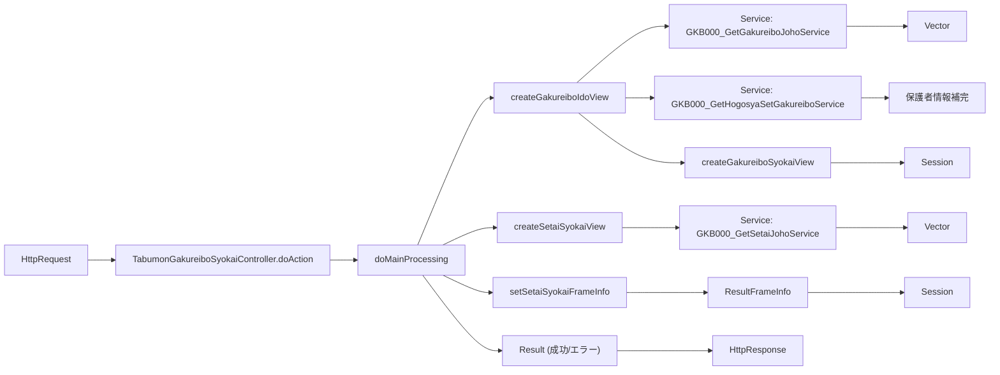

# 📄 TabumonGakureiboSyokaiController.java  
**パス**: `D:\code-wiki\projects\all\sample_all\java\Controller_TabumonGakureiboSyokaiController.java`  

---  

## 1. 概要概述
| 項目 | 内容 |
|------|------|
| **クラス名** | `TabumonGakureiboSyokaiController` |
| **役割** | 学齢簿（児童の学籍情報）画面を表示する Web 層のコントローラ。 画面遷移、データ取得、エラーハンドリング、フレーム制御情報の設定を一手に担う。 |
| **継承元** | `BaseSessionSyncController`（セッション同期ロジックを提供） |
| **主要依存サービス** | `GKB000_SystemInfoService`, `GKB000_GetMessageService`, `GKB000_GetSetaiJohoService`, `GKB000_GetGakureiboJohoService`, `GKB000_GetHogosyaSetGakureiboService`, `GKB000_ShimeiJknService` など |
| **エントリポイント** | `doAction()` → `doMainProcessing()` |
| **対象読者** | 本モジュールを新たに担当する Java エンジニア。特に画面遷移ロジックとセッション管理に不慣れな方が対象。 |

> **なぜこのクラスが重要か**  
> - 学齢簿は教育系システムの中核データ。表示ロジックの不具合は利用者に直接影響する。  
> - 画面遷移・エラーメッセージ生成・システム条件取得といった複数の横断的ロジックが混在しているため、全体像を把握しやすい設計ドキュメントが必須。

---

## 2. コード級洞察

### 2.1 エントリ & フロー概観

### 2.2 主要メソッド解説

| メソッド | 目的 | 主な処理 |
|----------|------|----------|
| `doAction` | コントローラの入口。Spring の `@RequestMapping` に紐付く。 | `kka000GlobalSetDao.kkaProIni()` → 初期化 → `execute` で `doMainProcessing` に委譲 |
| `doMainProcessing` | 画面表示の中心ロジック。 学齢簿取得 → ビュー生成 → エラーハンドリング → フレーム情報設定 | 1. システム条件取得 (`getEQTSystemJoken`)  2. `createGakureiboIdoView` で学齢簿取得  3. 配列が空かどうかで分岐  4. `setSetaiSyokaiFrameInfo` で戻り先・再表示先設定 |
| `createGakureiboIdoView` | 学齢簿配列取得 → 表示用ビュー作成 → エラーレスポンス返却 | - `getArrayGakureibo` で DB から取得  - 配列が無い場合は空ビューを作り `CS_FORWARD_ERROR` を返す  - 配列がある場合は `gkb000CommonUtil.createGakureiboView` を呼び、エラー番号に応じて `CS_FORWARD_SUCCESS` / `setError` |
| `createSetaiSyokaiView` | 世帯情報（保護者・同居者）を取得し、画面用に整形 | - `errorCheck` で前提データが揃っているか確認  - 学齢簿配列・表示ビュー取得 → `getArraySetaiList` で世帯リスト取得  - `gkb000CommonUtil.createSetaiSyokaiView` でセッションへ格納 |
| `getArrayGakureibo` | 学齢簿情報をサービス層から取得し、必要なら保護者情報を補完 | - `processDay` を和暦→西暦変換  - `GKB000_GetGakureiboJohoService` 呼び出し  - 保護者個人番号が 0 の場合は `GKB000_GetHogosyaSetGakureiboService` で補完 |
| `getArraySetaiList` | 指定児童の世帯情報（自分以外）を取得 | - `GKB000_GetSetaiJohoService` 呼び出し  - 16 歳以上のメンバーを除外し、配列を返す |
| `errorCheck` | 前提データがセッションに存在するか検証 | `GKB_011_01_VECTOR` と `GKB_011_01_VIEW` が無い場合は `setError` を呼び出す |
| `setError` | エラーメッセージ取得 → `ErrorMessageForm` に格納 → モデルへ設定 | `GKB000_GetMessageService` でメッセージコードから文言取得 |
| `setSetaiSyokaiFrameInfo` | 画面遷移（戻る・再表示）用フレーム情報を作成し、セッションに保存 | `ScreenHistory` で履歴管理、`ResultFrameInfo` に URL・target を設定 |
| `getEQTSystemJoken` | システム条件（フラグ）を取得 | `GKB000_GetSystemInfoService` → `SystemInfo` の `value` を返す |
| `doPostProcessing` | 現在は空実装。将来的にポスト処理が必要になった際に拡張ポイント。 |

### 2.3 例外・エラーハンドリング方針
| 例外発生箇所 | 例外種別 | 取るべきアクション |
|--------------|----------|-------------------|
| `createGakureiboIdoView` 内の DAO/Service 呼び出し | `Exception` | `Result` に `NG` ステータス、メッセージ「画面情報取得に失敗しました。」を設定し `CS_FORWARD_ERROR` に遷移 |
| `getArrayGakureibo` / `getArraySetaiList` の DB 呼び出し | `Exception` | `e.printStackTrace()` のみ（現状）。**改善提案**: 例外を上位へ再送し統一ハンドラで処理 |
| `setError` のメッセージ取得失敗 | `Exception` | ログ出力し、`CS_FORWARD_ERROR` を返す（既存実装） |

---

## 3. 依存関係と関係図

### 3.1 直接インジェクションされているコンポーネント
| フィールド | 型 | 用途 |
|------------|----|------|
| `systemInfoService` | `GKB000_SystemInfoService` | システム条件取得 |
| `getMessageService` | `GKB000_GetMessageService` | エラーメッセージ取得 |
| `getSetaiJohoService` | `GKB000_GetSetaiJohoService` | 世帯情報取得 |
| `getGakureiboJohoService` | `GKB000_GetGakureiboJohoService` | 学齢簿取得 |
| `getHogosyaSetGakureiboService` | `GKB000_GetHogosyaSetGakureiboService` | 保護者情報補完 |
| `shimeiJknService` | `GKB000_ShimeiJknService` | 本名使用制御情報取得 |
| `jia000commonDao` | `JIA000CommonDao` | コモン DAO（項目コード取得） |
| `gkb000CommonUtil` | `GKB000CommonUtil` | セッション操作・共通ユーティリティ |
| `kka000CommonUtil` | `KKA000CommonUtil` | 和暦→西暦変換等 |
| `gkb000CommonDao` | `GKB000CommonDao` | DB 直接アクセス（保護者取得） |
| `kka000GlobalSetDao` | `KKA000GlobalSetDao` | 初期化処理 (`kkaProIni`) |

### 3.2 関連クラス（リンク例）

- [`BaseSessionSyncController`](http://localhost:3000/projects/all/wiki?file_path=jp/co/jip/gkb000/app/gkb000/BaseSessionSyncController.java)  
- [`GKB000_GetGakureiboJohoService`](http://localhost:3000/projects/all/wiki?file_path=jp/co/jip/gkb000/service/gkb000/GKB000_GetGakureiboJohoService.java)  
- [`GKB000_GetMessageService`](http://localhost:3000/projects/all/wiki?file_path=jp/co/jip/gkb000/service/gkb000/GKB000_GetMessageService.java)  
- [`TabumonShokaiDTO`](http://localhost:3000/projects/all/wiki?file_path=jp/co/jip/wizlife/fw/kka000/bean/dto/TabumonShokaiDTO.java)  
- [`Result`](http://localhost:3000/projects/all/wiki?file_path=jp/co/jip/wizlife/fw/bean/view/Result.java)  

> **注**: 実際のファイルパスはプロジェクト構成に合わせて調整してください。

### 3.3 データフロー（簡易図）

---

## 4. 設計上の考慮点・潜在的課題

| 項目 | 内容 | 推奨改善 |
|------|------|----------|
| **セッション依存** | 多くのデータ (`GKB_011_01_VECTOR`, `GKB_011_01_VIEW` など) がセッションに格納・取得される。セッションが失効した場合のフォールバックが未実装。 | セッションチェックを共通ユーティリティに集約し、失効時はリダイレクトまたは再取得ロジックを追加 |
| **例外処理の一貫性** | DB/Service 呼び出しで `Exception` を捕捉し `printStackTrace` のみ。ユーザーへのフィードバックが限定的。 | カスタム例外 (`ServiceException`) を導入し、統一ハンドラでエラーログとユーザー向けメッセージを処理 |
| **ハードコーディングされた文字列** | `"KOMOKU_KOSHO"`、`"SYS_JOKEN_SHUGAKURIREKI01"` などがコード中に直接記述。 | 定数クラス (`KyoikuConstants` 以外) に集約し、可読性と保守性を向上 |
| **メソッド肥大化** | `doMainProcessing` が 150 行超。ロジックが混在しテストが困難。 | 画面表示ロジック、エラーハンドリング、フレーム情報設定を別クラス/サービスへ分割 |
| **マジックナンバー** | `getEQTSystemJoken(req, 101)`、`122` など。 | `SystemConditionId` enum を作成し、意味を明示 |
| **スレッド安全性** | `Vector` を使用しているが、実際にマルチスレッドで共有されているか不明。 | 必要なら `CopyOnWriteArrayList` へ置換、または `List` に統一し、スレッド安全性を明示 |
| **国際化** | エラーメッセージはハードコード (`"対象のデータが存在しません。"`)。 | メッセージコード化し、`MessageSource` で取得する形に統一 |

---

## 5. 変更・拡張時のチェックリスト

1. **画面遷移追加**  
   - `REQUEST_MAPPING_PATH` と `doAction` のマッピングを新しい URL に追加。  
   - `setSetaiSyokaiFrameInfo` の `returnAction`/`refreshAction` を新規画面に合わせて更新。

2. **新しいシステム条件取得**  
   - `getEQTSystemJoken` に新しい `renban` を渡すだけで OK。  
   - 定数化してコード可読性を保つ。

3. **学齢簿取得ロジックの差し替え**  
   - `GKB000_GetGakureiboJohoService` の実装を変更した場合、`createGakureiboIdoView` のエラーハンドリングが影響しないかテスト。

4. **セッションキー変更**  
   - 変更箇所は `gkb000CommonUtil.getSession` / `setSession` が散在。  
   - キーを定数化し、全箇所で置換。

5. **例外ハンドリング統一**  
   - 例外がスローされるサービスは `ServiceException` にラップし、`doMainProcessing` の catch 部分で `setError` に委譲。

---

## 6. 参考リンク（内部 Wiki）

- [`BaseSessionSyncController`](http://localhost:3000/projects/all/wiki?file_path=jp/co/jip/gkb000/app/gkb000/BaseSessionSyncController.java)  
- [`GKB000CommonUtil`](http://localhost:3000/projects/all/wiki?file_path=jp/co/jip/gkb000/common/util/GKB000CommonUtil.java)  
- [`KyoikuConstants`](http://localhost:3000/projects/all/wiki?file_path=jp/co/jip/gkb000/common/util/KyoikuConstants.java)  
- [`TabumonShokaiConstants`](http://localhost:3000/projects/all/wiki?file_path=jp/co/jip/gkb000/common/util/TabumonShokaiConstants.java)  

---  

**このドキュメントは、`TabumonGakureiboSyokaiController` の全体像と主要ロジックを把握し、保守・拡張を円滑に行うための指針です。**  