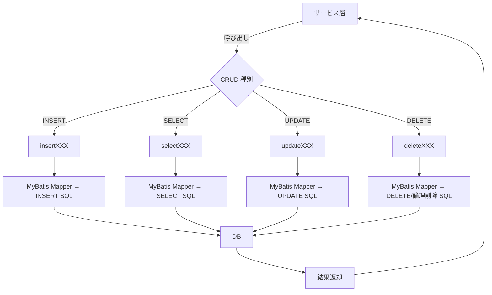

# GKB000EntityRepository  
**パス**: `D:\code-wiki\projects\all\sample_all\java\Repository_GKB000EntityRepository.java`  

---  

## 1. 概要概説
このインターフェースは **Spring Repository** として定義され、`jp.co.jip.gkb000.common.entity` パッケージにある 15 種類以上のエンティティに対する **CRUD（Create‑Read‑Update‑Delete）** 操作を一元化しています。  

- **目的**: 各テーブル（学年、性別、区外外、就学援助 など）への DB アクセスを統一したメソッド名で提供し、サービス層からは「何をしたいか」だけを呼び出すだけで済むようにする。  
- **位置付け**: アプリケーション全体の **データ永続化層** の入口。サービスクラスはこのリポジトリを DI して利用し、ビジネスロジックは DB 操作の詳細から切り離されます。  

> **新規開発者が最初に抱く疑問**  
> - 「メソッド名が `insertGKBTGAKUNEN_001` のように番号付きなのは何故？」  
> - 「同一エンティティに対して `select...` と `delete...` が複数バージョンあるのは？」  
> - 「`ArrayList<Map<String,Object>>` を返すメソッドはどんなケースで使うのか？」  

以下のドキュメントはこれらの疑問に答えると同時に、実装上の留意点や拡張ポイントを示します。

---

## 2. コードレベル洞察

### 2.1 命名規則とバージョン管理
| 要素 | 例 | 意味 |
|------|----|------|
| **プレフィックス** | `insert`, `select`, `update`, `delete` | CRUD の種別 |
| **エンティティコード** | `GKBTGAKUNEN` | エンティティ（テーブル）を表す略称 |
| **連番** | `_001`, `_002` … | 変更履歴や機能追加時に同名メソッドが増えることへの衝突回避。過去のリリースで削除・追加が頻繁に行われたため、番号でバージョンを区別している。 |

> **設計意図**: 既存のバッチや外部システムがメソッド名で呼び出しを行うケースがあるため、名前を変更せずに機能追加だけを行えるように番号で差分管理している。

### 2.2 主なエンティティと提供メソッド

| エンティティ | 主な CRUD メソッド | 追加検索系 |
|--------------|-------------------|-----------|
| `GkbtGakunenEntity` | `insertGKBTGAKUNEN_001`, `selectGKBTGAKUNEN_002`, `updateGKBTGAKUNEN_003`, `deleteGKBTGAKUNEN_004` | なし |
| `GkbtSeijinsyaEntity` | `selectGKBTSEIJINSHA_005`, `insertGKBTSEIJINSHA_006`, `updateGKBTSEIJINSHA_007`, `deleteGKBTSEIJINSHA_008` | なし |
| `GkbtKuikigaiEntity` | `insertGKBTKUIKIGAI_009`, `updateGKBTKUIKIGAI_010`, `selectGKBTKUIKIGAI_011`, `deleteGKBTKUIKIGAI_012` | なし |
| `GkbtTyugakoEntity` | `insertGKBTCHUGAKKO_013`, `selectGKBTCHUGAKKO_014`, `updateGKBTCHUGAKKO_015`, `deleteGKBTCHUGAKKO_016` | なし |
| `GkbtYogogakoEntity` | `insertGKBTYOGOGAKKO_017`, `selectGKBTYOGOGAKKO_018`, `updateGKBTYOGOGAKKO_019`, `deleteGKBTYOGOGAKKO_020` | `selectGKBTYOGOGAKKO_050`, `selectGKBTYOGOGAKKO_051`, `selectGKBTYOGOGAKKO_056` |
| `GkbtYuyojiyuEntity` | `insertGKBTYUYOJIYU_021`, `selectGKBTYUYOJIYU_022`, `updateGKBTYUYOJIYU_023`, `deleteGKBTYUYOJIYU_024` | なし |
| `GkbtZokugaraEntity` | `insertGKBTZOKUGARA_025`, `selectGKBTZOKUGARA_026`, `updateGKBTZOKUGARA_027`, `deleteGKBTZOKUGARA_028` | なし |
| `GkbtGenjiyuEntity` | `insertGKBTGENJIYU_029`, `selectGKBTGENJIYU_030`, `updateGKBTGENJIYU_031`, `deleteGKBTGENJIYU_032` | なし |
| `GkbtIdobunEntity` | `insertGKBTIDOBUN_033`, `selectGKBTIDOBUN_034`, `updateGKBTIDOBUN_035`, `deleteGKBTIDOBUN_036` | なし |
| `GkbtMenjojiyuEntity` | `insertGKBTMENJOJIYU_037`, `selectGKBTMENJOJIYU_038`, `updateGKBTMENJOJIYU_039`, `deleteGKBTMENJOJIYU_040` | なし |
| `GkbtTokusokuEntity` | `insertGKBTTOKUSOKU_041`, `selectGKBTTOKUSOKU_042`, `updateGKBTTOKUSOKU_043`, `deleteGKBTTOKUSOKU_044` | なし |
| `GkbtSyogakoEntity` | `insertGKBTSHOGAKKO_045`, `selectGKBTSHOGAKKO_046`, `updateGKBTSHOGAKKO_047`, `deleteGKBTSHOGAKKO_048`, `updateGKBTSHOGAKKO_049` | `selectGKBTSHOGAKKO_053`, `selectGKBTCHUGAKKO_054`, `selectGKBTKUIKIGAI_055`, `selectGKBTYOGOGAKKO_056`, `selectGKBTKUNISIRITSUGAKKO_057`, `selectGKBTSHOGAKKO_052` |

#### 2.2.1 動的検索系メソッド
- **戻り値**: `ArrayList<Map<String, Object>>`  
- **引数**: `HashMap<String, Object> param`（検索条件）  

これらは **汎用的な検索**（複数カラム条件、ページング、集計等）を実装するために用意され、SQL の `WHERE` 句を動的に組み立てる MyBatis の `<where>` 句と相性が良い。  
> **注意点**: 戻り値が `Map` になるため、呼び出し側はキー名（カラム名）に依存したキャストが必要。型安全を求める場合は DTO へ変換するユーティリティを作成すると良い。

#### 2.2.2 論理削除チェック系メソッド
- 例: `selectGKBTSHOGAKKO_053`（小学校コードの論理削除チェック）  
- **戻り値**: `String`（削除フラグが立っている場合はエラーメッセージ、無ければ `null`）  

これらは **保守対応（QA#17003）** で追加された、削除済みコードが入力された際にエラーメッセージを返すユーティリティ。  
> **実装上のポイント**: SQL 側で `CASE WHEN deleted = 1 THEN '削除済みです' END` のように記述されていることが多く、呼び出し側は `null` 判定で正常/異常を分岐できる。

### 2.3 例外・トランザクション
インターフェース自体は例外宣言を行っていませんが、Spring の `@Repository` が付与されているため、**データアクセス例外は `DataAccessException` 系にラップ**されます。  
- **推奨**: サービス層で `@Transactional` を付与し、必要に応じて例外を捕捉してビジネス例外へ変換してください。

### 2.4 フローチャート（代表的な CRUD フロー）

---

## 3. 依存関係と関係図

### 3.1 直接依存クラス
| エンティティ | ファイルパス（例） |
|--------------|-------------------|
| `GkbtGakunenEntity` | `jp/co/jip/gkb000/common/entity/GkbtGakunenEntity.java` |
| `GkbtSeijinsyaEntity` | `jp/co/jip/gkb000/common/entity/GkbtSeijinsyaEntity.java` |
| `GkbtKuikigaiEntity` | `jp/co/jip/gkb000/common/entity/GkbtKuikigaiEntity.java` |
| `GkbtTyugakoEntity` | `jp/co/jip/gkb000/common/entity/GkbtTyugakoEntity.java` |
| `GkbtYogogakoEntity` | `jp/co/jip/gkb000/common/entity/GkbtYogogakoEntity.java` |
| `GkbtYuyojiyuEntity` | `jp/co/jip/gkb000/common/entity/GkbtYuyojiyuEntity.java` |
| `GkbtZokugaraEntity` | `jp/co/jip/gkb000/common/entity/GkbtZokugaraEntity.java` |
| `GkbtGenjiyuEntity` | `jp/co/jip/gkb000/common/entity/GkbtGenjiyuEntity.java` |
| `GkbtIdobunEntity` | `jp/co/jip/gkb000/common/entity/GkbtIdobunEntity.java` |
| `GkbtMenjojiyuEntity` | `jp/co/jip/gkb000/common/entity/GkbtMenjojiyuEntity.java` |
| `GkbtTokusokuEntity` | `jp/co/jip/gkb000/common/entity/GkbtTokusokuEntity.java` |
| `GkbtSyogakoEntity` | `jp/co/jip/gkb000/common/entity/GkbtSyogakoEntity.java` |

> **リンク例**:  
> - [`GkbtGakunenEntity`](http://localhost:3000/projects/all/wiki?file_path=jp/co/jip/gkb000/common/entity/GkbtGakunenEntity.java)  

### 3.2 他モジュールとの関係
- **Service 層**: 各ビジネスロジックは `jp.co.jip.gkb000.service` パッケージに実装され、`@Autowired` で本リポジトリを注入。  
- **MyBatis Mapper XML**: `resources/mapper/*Repository.xml` に SQL が定義され、メソッド名と同名の `<insert>`, `<select>` 等が紐付く。  
- **Controller 層**: REST API (`/api/v1/...`) がサービスを呼び出し、最終的に本リポジトリ経由で DB へアクセス。

---

## 4. 拡張・保守ポイント

| 項目 | 内容 | 推奨アクション |
|------|------|----------------|
| **メソッド名の番号** | 変更履歴で番号が増えると可読性が低下 | 新規機能追加時は **デフォルトメソッド名**（例: `insertGkbtGakunen`）を採用し、古い番号メソッドは `@Deprecated` にして段階的に削除 |
| **汎用検索 (`Map` 返却)** | 型安全でなく、呼び出し側でキャストが必要 | 必要に応じて **DTO** を作成し、Mapper で `resultMap` を設定 |
| **論理削除チェック** | 文字列でエラーメッセージを返す実装は国際化が困難 | 将来的に **例外** か **エラーコード** に置き換える設計を検討 |
| **トランザクション管理** | 現在はインターフェースに `@Transactional` が無い | サービス層で **明示的に** `@Transactional` を付与し、必要に応じて **Propagation** を設定 |
| **テストカバレッジ** | CRUD が多数あるが、テストコードが散在 | **リポジトリ単体テスト**（MyBatis の `@MapperTest`）と **サービス統合テスト** を整備し、特に `select..._050/051/052` 系はパラメータ組み合わせテストを追加 |

---

## 5. 変更履歴（抜粋）

| 日付 | 担当 | 内容 |
|------|------|------|
| 2024/06/04 | ZCZL.zhaoyan | 新 WizLIFE 2次開発で多数メソッド追加・削除 |
| 2024/06/14 | ZCZL.wanghaonan | `deleteGKBTCHUGAKKO_016` のシグネチャ変更 |
| 2025/10/28 | ZCZL.dy | QA#17003 対応で論理削除チェックメソッド 5 件追加 |

---

## 6. 参考リンク

- **Spring Data JPA vs MyBatis**: 本リポジトリは MyBatis を前提にしたインターフェースです。  
- **エンティティ定義**: 各エンティティのフィールド定義は `entity` パッケージのクラスをご参照ください。  

---  

*このドキュメントは新規開発者が **「何をやっているか」** と **「なぜこのように実装されているか」** を速やかに把握できるよう設計しています。実装変更時は必ず本 Wiki へ追記し、番号付与のルールや汎用検索の利用方法を更新してください。*