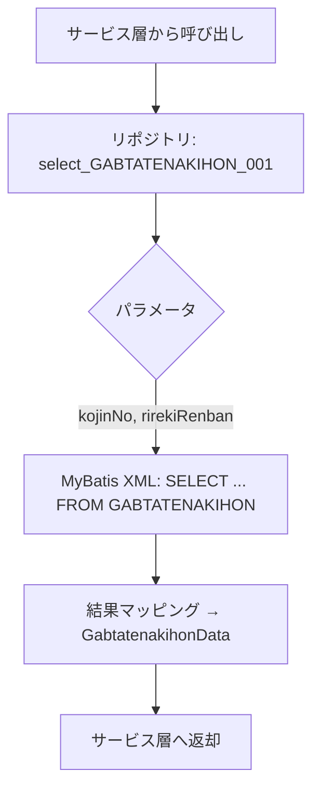
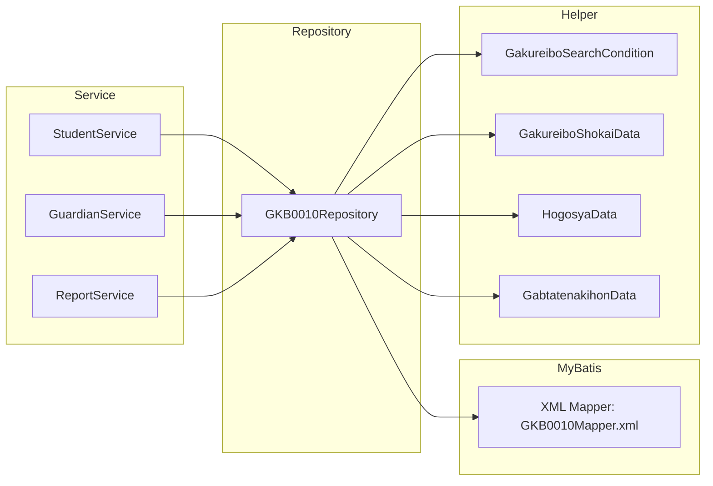

# GKB0010Repository インタフェース  ドキュメント  
**ファイルパス**: `D:\code-wiki\projects\all\sample_all\java\Repository_GKB0010Repository.java`  

---

## 1. 概要概説
`GKB0010Repository` は **MyBatis 用のリポジトリインタフェース** で、学齢簿（児童・保護者情報）に関わる各種検索・取得ロジックを SQL マッピングで提供します。  
- **主目的**: 画面・バッチから呼び出される「宛名情報」「学齢簿履歴」「就学関連マスタ」等のデータ取得を一元化。  
- **プロジェクト内位置**: `jp.co.jip.gkb0000.domain.repository` パッケージに属し、サービス層 (`...service`) から `@Autowired` で注入されます。  
- **変更履歴**: 2024‑2025 年にかけて WizLIFE 系統の機能追加・保守が多数実装されており、メソッドが増加しています。  

> **新規開発者へのポイント**  
> - ほとんどが **SELECT 系** のメソッドで、戻り値は `ArrayList<Map<...>>`、`List<...>`、またはドメインヘルパークラス (`GakureiboShokaiData` など)。  
> - パラメータは **Map**、**String (宛名番号)**、または **検索条件オブジェクト** (`GakureiboSearchCondition`) が中心。  
> - 実装は MyBatis の XML マッピングに委譲されるため、メソッド名とコメントが実装内容を把握する唯一の手がかりです。  

---

## 2. コードレベル洞察

### 2.1 メソッド分類
| カテゴリ | 主なメソッド例 | 目的 |
|---|---|---|
| **基本情報取得** | `selectBIKOSENTAKU_001`、`selectGETBIKO_002` | 備考情報・基本テーブル取得 |
| **宛名・履歴取得** | `selectGABTATENAKIHON_001~004`、`selectGKBTGAKUREIBO_001~004` | 宛名番号・履歴連番から児童・保護者情報取得 |
| **学齢簿検索** | `selectGKBTGAKUREIBO_002`、`selectGKBTGAKUREIBO_009`、`selectGKBTGAKUREIBO_010/011` | 条件検索・履歴取得 |
| **マスタ取得** | `selectGKBTGAKUNEN_001/022`、`selectGKBTMSGAKUKYUCD_001/002`、`selectGKBTKUNISIRITSUGAKKO_001/021` | 学年・学級・学校コード等マスタデータ |
| **就学・申請情報** | `selectGKBWSKT1_001~4`、`selectGABTGYOSEIJOHOJKN_001` | 就学猶予・免除・変更・区域外申請 |
| **補助系ユーティリティ** | `selectFDateSW_001`、`funKKAPK0020_FAGEGET`、`selectGKAFKHAKKOR_016` | 和暦変換・年齢算出・帳票履歴作成 |

### 2.2 代表的なフロー（例：児童宛名情報取得）

- **入力**: `kojinNo`（宛名番号）と `rirekiRenban`（履歴連番）  
- **出力**: `GabtatenakihonData`（宛名基本情報）  

### 2.3 重要なヘルパークラス
| クラス | 用途 |
|---|---|
| `GakureiboSearchCondition` | 学齢簿検索時の条件ラップ（宛名番号、学年、学校コード等） |
| `GakureiboShokaiData` | 学齢簿（児童）情報の DTO |
| `HogosyaData` | 保護者情報の DTO |
| `GkbtgakureiboData` | 学齢簿履歴エンティティ |
| `GabtatenakihonData` | 宛名基本情報エンティティ |
| `GakureiboShokaiHistoryData` | 就学変更履歴 DTO |

> **実装上の注意**  
> - これら DTO は `domain.helper` パッケージにあり、MyBatis の resultMap と 1:1 にマッピングされています。  
> - 新規検索条件を追加する場合は、`GakureiboSearchCondition` にフィールドを足し、対応 XML に `parameterType` を追加してください。

### 2.4 例外・エラーハンドリング
このインタフェース自体は例外宣言を行っていませんが、MyBatis が `PersistenceException` をスローします。  
- **推奨**: サービス層で `try-catch` し、`DataAccessException` にラップして上位へ伝搬させる。  

---

## 3. 依存関係と関係図

- **リポジトリ → MyBatis XML**: 実際の SQL は `src/main/resources/mapper/GKB0010Mapper.xml`（プロジェクト内）に定義。  
- **サービス層**: 例 `StudentService` が `@Autowired GKB0010Repository` を利用し、ビジネスロジックを組み立てます。  
- **ヘルパーパッケージ**: DTO/検索条件は `domain.helper` に集約。  

---

## 4. 拡張・保守の指針

| 項目 | 推奨アクション |
|---|---|
| **新規検索条件追加** | 1. `GakureiboSearchCondition` にフィールド追加 2. 対応 XML に `WHERE` 条件を追記 3. 必要なら `ResultMap` のカラムマッピングを更新 |
| **SQL パフォーマンス改善** | - `EXPLAIN` で実行計画確認   - インデックス追加は DB 管理者と協議 |
| **テスト** | - `@MapperScan` でインタフェースをロードし、`@DataJpaTest` 風に `MyBatisTest` を作成   - `Mock` ではなく実 DB（テスト用 H2）で実行結果を検証 |
| **例外ハンドリング** | - `PersistenceException` → `DataAccessException` に変換し、サービス層で統一的に処理 |
| **ドキュメント更新** | - メソッド追加時は本 Wiki に **概要** と **パラメータ/戻り値** を追記   - 変更履歴コメントは必ず更新 |

---

## 5. 参照リンク

- **インタフェース全体**: [GKB0010Repository](http://localhost:3000/projects/all/wiki?file_path=D:/code-wiki/projects/all/sample_all/java/Repository_GKB0010Repository.java)  
- **主要ヘルパークラス**  
  - `GakureiboSearchCondition`: [リンク](http://localhost:3000/projects/all/wiki?file_path=jp/co/jip/gkb0000/domain/helper/GakureiboSearchCondition.java)  
  - `GakureiboShokaiData`: [リンク](http://localhost:3000/projects/all/wiki?file_path=jp/co/jip/gkb0000/domain/helper/GakureiboShokaiData.java)  
  - `HogosyaData`: [リンク](http://localhost:3000/projects/all/wiki?file_path=jp/co/jip/gkb0000/domain/helper/HogosyaData.java)  
  - `GabtatenakihonData`: [リンク](http://localhost:3000/projects/all/wiki?file_path=jp/co/jip/gkb0000/domain/helper/GabtatenakihonData.java)  

---

*このドキュメントは、`GKB0010Repository` を初めて触る開発者が「何を取得できるか」「どこで使われているか」を即座に把握できるよう設計しています。実装変更時は必ず本ページを更新し、変更点が伝わるようにしてください。*