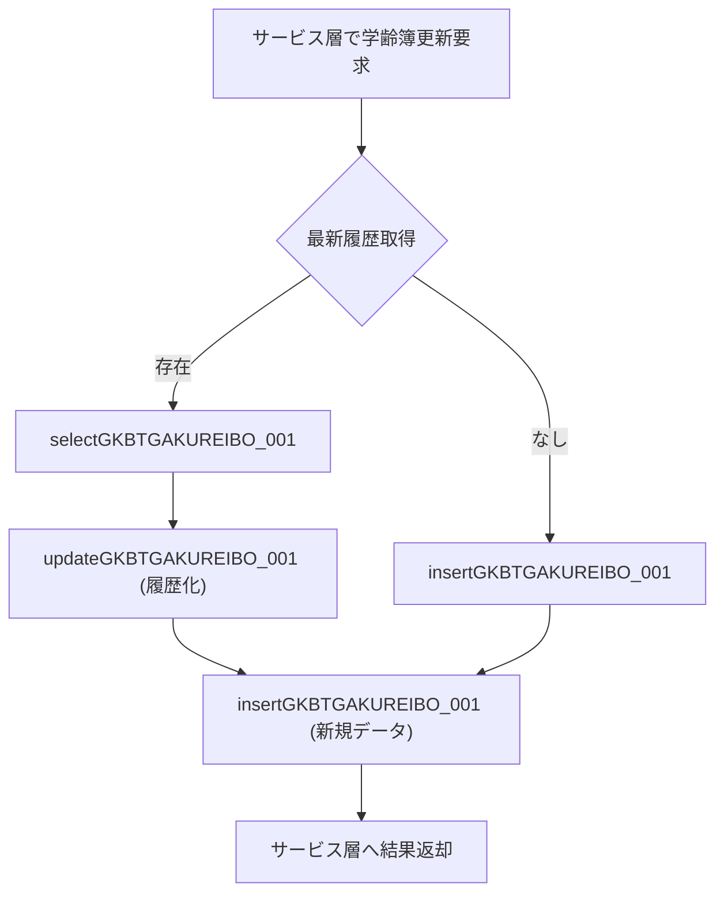

# 📄 **GKB0020Repository（`Repository_GKB0020Repository.java`）**  
**パス**: `D:\code-wiki\projects\all\sample_all\java\Repository_GKB0020Repository.java`

---

## 1. 概要 & 役割

| 項目 | 内容 |
|------|------|
| **モジュール** | `jp.co.jip.gkb000.common.repository` パッケージ内のリポジトリインタフェース |
| **主目的** | 学齢簿・学級・就学・本名使用制御 など、教育系マスタ/トランザクションデータへの CRUD と検索を提供 |
| **使用技術** | Spring Framework (`@Repository`)、MyBatis もしくは類似の SQL マッピングが想定 |
| **システム内位置** | **サービス層** → **リポジトリ層** → **DB** の典型的な 3 層構造で、ビジネスロジックから直接 SQL を呼び出すことを防ぎ、テスト容易性と保守性を確保 |

> **新規開発者へのポイント**  
> - このインタフェースは **「何を」** 行うかだけを宣言し、実装は MyBatis の XML マッピングか Spring Data の自動実装に委ねられます。  
> - メソッド名は **テーブル名 + 処理種別 + 番号** の命名規則で統一されており、過去のバージョン追加・削除履歴が番号で追跡できます。  
> - 変更履歴は Javadoc の冒頭に記載されているので、機能追加やバグ修正の背景を把握する際に必ず参照してください。

---

## 2. コード構造・主要機能

### 2‑1. 大分類

| カテゴリ | 主な対象テーブル | 代表メソッド |
|----------|-------------------|--------------|
| **学級管理** | `GKBTMSGAKUKYUCD` | `selectGKBTMSGAKUKYUCD_001`、`insertGKBTMSGAKUKYUCD_002`、`updateGKBTMSGAKUKYUCD_003`、`deleteGKBTMSGAKUKYUCD_004`、`selectGKBTMSGAKUKYUCD_005`、`selectGKBTMSGAKUKYUCD_007` |
| **学齢簿（個人情報）** | `GKBTGAKUREIBO` 系列 | 取得・履歴管理・削除・更新系メソッド（例: `selectGKBTGAKUREIBO_001`〜`_021`） |
| **学年リンク** | `GKBTGAKUNENLNK` 系列 | `selectGKBTGAKUNENLNK_014`、`insertGKBTGAKUNENLNK_015`、`updateGKBTGAKUNENLNK_016`、`deleteGKBTGAKUNENLNK_022` |
| **任意ビット** | `GKBTNINIBIT` 系列 | `selectGKBTNINIBIT_023`、`insertGKBTNINIBIT_028`、`updateGKBTNINIBIT_027`、`deleteGKBTNINIBIT_024` |
| **本名使用制御** | `GKBTSHIMEIJKN` 系列 | `selectGKBTSHIMEIJKN_034`〜`_037` |
| **端末・部課情報** | `KKNTWS`、`KKNTBK` | `selectKKNTWS_001`、`selectKKNTBK_001` |
| **申請・処理状況** | `GKBTSSJ`、`GKBTSKT` | `selectGKBTSSJ_001`〜`_005`、`updateGKBTSKT_001` |
| **就学・就学履歴** | `GKBTSHUGAKURIREKI` 系列 | `selectGKBTSHUGAKURIREKI_001`〜`_004`、`insertGKBTSHUGAKURIREKI_001` など |
| **その他ユーティリティ** | 各種マスタ取得 | `selectGABVATENAALL_001`、`selectGABTATENAKIHON_001`、`selectGABTJUKIIDO_001` など |

### 2‑2. メソッド設計のポイント

1. **戻り値の型**  
   - **検索系**は `ArrayList<Map<String, Object>>` または `List<Map<String, Object>>` を返す。  
   - **単一レコード取得**は `Map<String, Object>`、`Integer`、`String`、`GabtAtenakihonData` など具体的型を使用。  
   - **更新系**は `void`（例外は Spring が投げる）で、トランザクションはサービス層で管理。

2. **パラメータ**  
   - すべて `Map<String, Object>`（もしくは `long`/`String`）で受け取り、SQL のバインド変数に直接マッピング。  
   - **長整数キー**（例: `kojinNo`）は `long` 型で受け取り、型安全性を確保。

3. **命名規則**  
   - `select` / `insert` / `update` / `delete` + **テーブル名** + **連番**。  
   - 連番は機能追加時にインクリメントされ、過去のメソッドは削除フラグやコメントで残すことで互換性を保つ。

4. **バージョン管理**  
   - Javadoc の変更履歴コメントに **日付・担当者・バージョン番号** が明記。  
   - 新規追加は `Add start` / `Add end`、削除は `Delete start` / `Delete end` で囲む。

### 2‑3. 代表的なフロー（例：学齢簿の履歴化）

> **ポイント**  
> - `selectGKBTGAKUREIBO_001` で対象個人の最新レコードを取得。  
> - 取得できたら `updateGKBTGAKUREIBO_001` で **論理削除**（履歴化）し、続いて `insertGKBTGAKUREIBO_001` で新しいデータを追加。  
> - これにより「履歴を残しつつ最新情報を保持」するパターンが標準化されています。

---

## 3. 依存関係・呼び出し関係

| 呼び出し元（例） | 呼び出し先（このリポジトリ） | 用途 |
|----------------|----------------------------|------|
| `GKB0020Service`（サービス層） | `selectGKBTMSGAKUKYUCD_001` など | 学級情報取得・更新 |
| `GKB0010Controller`（Web層） | `selectGKBTSSJ_001`、`insert_GKBTSSJ_003` | 申請処理画面のデータ取得/保存 |
| `GKB0030BatchJob`（バッチ） | `deleteGKBTGAKUREIBO_001`、`selectGKBTKOSHINLOG_001` | 定期的な論理削除・ログ取得 |
| `GKB0040Scheduler`（スケジューラ） | `selectKKNTWS_001`、`selectKKNTBK_001` | 端末管理情報の同期 |

> **リンク例**（メソッド名は同一ファイルへのリンク）  
> - [`selectGKBTMSGAKUKYUCD_001`](http://localhost:3000/projects/all/wiki?file_path=D:/code-wiki/projects/all/sample_all/java/Repository_GKB0020Repository.java)  
> - [`insertGKBTGAKUREIBO_001`](http://localhost:3000/projects/all/wiki?file_path=D:/code-wiki/projects/all/sample_all/java/Repository_GKB0020Repository.java)  

---

## 4. 実装上の留意点・潜在的課題

| 項目 | 内容 | 推奨対策 |
|------|------|----------|
| **SQL マッピングの分散** | メソッドが多数あるため、対応する XML/アノテーションが散在しやすい。 | - ファイル名にテーブル名を入れた **SQL マッピングファイル** を作成し、リポジトリと 1:1 に保つ。 - 変更時は必ず **CI の SQL 静的解析** を走らせる。 |
| **型安全性** | `Map<String, Object>` の使用は柔軟だが、呼び出し側でキーミスが起きやすい。 | - DTO クラス（例: `GakureiboDto`）を導入し、MyBatis の `resultMap` でマッピング。 - 既存コードは段階的にリファクタリング。 |
| **メソッド増殖** | `*_001`〜`*_037` のように番号が増えると可読性が低下。 | - 新規機能は **機能単位のサブインタフェース**（例: `GakureiboRepository`）に分割。 - 旧メソッドは **デプリケート** アノテーションでマークし、徐々に削除。 |
| **トランザクション管理** | `void` の更新系はサービス層で `@Transactional` が必要。 | - すべてのサービスメソッドに明示的に `@Transactional` を付与し、リポジトリは **ステートレス** に保つ。 |
| **テスト容易性** | インタフェースだけではモックが必要になる。 | - Spring の `@MockBean` でリポジトリをモックし、**Integration Test** では実際の DB（テスト用）を使用。 |

---

## 5. 今後の拡張・メンテナンス指針

1. **機能追加はサブインタフェースへ**  
   - 例: 学級情報だけを扱う `GakkyuRepository` を新設し、`GKB0020Repository` は **共通基盤** に限定。

2. **DTO/Domain の導入**  
   - `Map` から **型安全な POJO** へ移行し、IDE の補完とリファクタリングを活用。

3. **SQL のバージョン管理**  
   - MyBatis の XML は **Git のサブモジュール** か **Flyway** で管理し、リポジトリ変更と同時にマイグレーションを追跡。

4. **ドキュメント自動生成**  
   - Javadoc に **`@see`** でサービス層メソッドをリンクし、Wiki とコードの双方向ナビゲーションを実現。

5. **パフォーマンス監視**  
   - 大量取得系 (`selectGKBTGAKUREIBO_001` など) は **ページング** と **インデックス** の有無を定期的にレビュー。

---

## 6. 参考リンク（同一ファイル内メソッド）

| カテゴリ | メソッド（リンク） |
|----------|-------------------|
| 学級取得・操作 | [`selectGKBTMSGAKUKYUCD_001`](http://localhost:3000/projects/all/wiki?file_path=D:/code-wiki/projects/all/sample_all/java/Repository_GKB0020Repository.java) / [`insertGKBTMSGAKUKYUCD_002`](http://localhost:3000/projects/all/wiki?file_path=D:/code-wiki/projects/all/sample_all/java/Repository_GKB0020Repository.java) / [`updateGKBTMSGAKUKYUCD_003`](http://localhost:3000/projects/all/wiki?file_path=D:/code-wiki/projects/all/sample_all/java/Repository_GKB0020Repository.java) / [`deleteGKBTMSGAKUKYUCD_004`](http://localhost:3000/projects/all/wiki?file_path=D:/code-wiki/projects/all/sample_all/java/Repository_GKB0020Repository.java) |
| 学齢簿履歴 | [`selectGKBTGAKUREIBO_001`](http://localhost:3000/projects/all/wiki?file_path=D:/code-wiki/projects/all/sample_all/java/Repository_GKB0020Repository.java) / [`updateGKBTGAKUREIBO_001`](http://localhost:3000/projects/all/wiki?file_path=D:/code-wiki/projects/all/sample_all/java/Repository_GKB0020Repository.java) / [`insertGKBTGAKUREIBO_001`](http://localhost:3000/projects/all/wiki?file_path=D:/code-wiki/projects/all/sample_all/java/Repository_GKB0020Repository.java) |
| 任意ビット | [`selectGKBTNINIBIT_023`](http://localhost:3000/projects/all/wiki?file_path=D:/code-wiki/projects/all/sample_all/java/Repository_GKB0020Repository.java) / [`insertGKBTNINIBIT_028`](http://localhost:3000/projects/all/wiki?file_path=D:/code-wiki/projects/all/sample_all/java/Repository_GKB0020Repository.java) |
| 本名使用制御 | [`selectGKBTSHIMEIJKN_034`](http://localhost:3000/projects/all/wiki?file_path=D:/code-wiki/projects/all/sample_all/java/Repository_GKB0020Repository.java) / [`insertGKBTSHIMEIJKN_036`](http://localhost:3000/projects/all/wiki?file_path=D:/code-wiki/projects/all/sample_all/java/Repository_GKB0020Repository.java) |
| 端末・部課情報 | [`selectKKNTWS_001`](http://localhost:3000/projects/all/wiki?file_path=D:/code-wiki/projects/all/sample_all/java/Repository_GKB0020Repository.java) / [`selectKKNTBK_001`](http://localhost:3000/projects/all/wiki?file_path=D:/code-wiki/projects/all/sample_all/java/Repository_GKB0020Repository.java) |
| 申請・処理状況 | [`selectGKBTSSJ_001`](http://localhost:3000/projects/all/wiki?file_path=D:/code-wiki/projects/all/sample_all/java/Repository_GKB0020Repository.java) / [`insert_GKBTSSJ_003`](http://localhost:3000/projects/all/wiki?file_path=D:/code-wiki/projects/all/sample_all/java/Repository_GKB0020Repository.java) |
| 就学履歴 | [`selectGKBTSHUGAKURIREKI_001`](http://localhost:3000/projects/all/wiki?file_path=D:/code-wiki/projects/all/sample_all/java/Repository_GKB0020Repository.java) / [`insertGKBTSHUGAKURIREKI_001`](http://localhost:3000/projects/all/wiki?file_path=D:/code-wiki/projects/all/sample_all/java/Repository_GKB0020Repository.java) |
| その他ユーティリティ | [`selectGABTATENAKIHON_001`](http://localhost:3000/projects/all/wiki?file_path=D:/code-wiki/projects/all/sample_all/java/Repository_GKB0020Repository.java) / [`selectGABTJUKIIDO_001`](http://localhost:3000/projects/all/wiki?file_path=D:/code-wiki/projects/all/sample_all/java/Repository_GKB0020Repository.java) |

---

### 📌 まとめ

- **このインタフェースは「教育系データベース操作の入口」** であり、ビジネスロジックはサービス層に委譲すべきです。  
- **命名規則と番号管理** が過去の変更履歴を追跡しやすくしていますが、将来的には **機能別サブインタフェース** と **DTO** へのリファクタリングで可読性・保守性を向上させましょう。  
- **テスト・トランザクション・SQL 管理** のベストプラクティスを守ることで、データ整合性とパフォーマンスを確保できます。  

このドキュメントを起点に、実装コードとマッピングファイルを合わせて確認しながら、**安全かつ拡張しやすいリポジトリ層の構築** に取り組んでください。