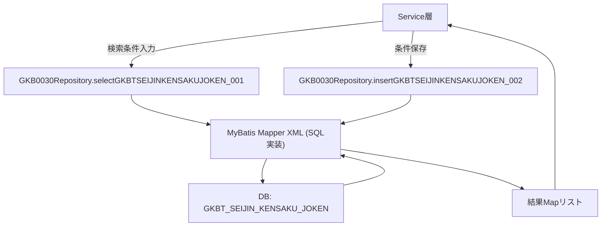
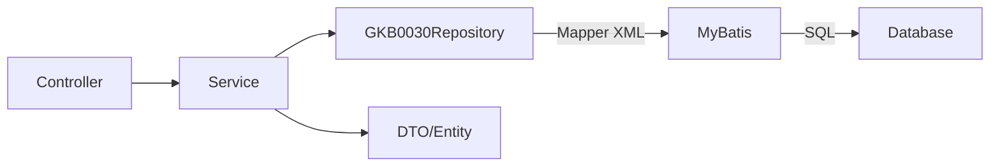

# GKB0030Repository（`Repository_GKB0030Repository.java`）  

## 1. 概要概説
このファイルは **Spring Framework の `@Repository` インタフェース** で、成人式（Seijin）に関わる各種検索・更新・削除処理を DB へ委譲するためのメソッドシグネチャだけを定義しています。  
- **パッケージ**: `jp.co.jip.gkb0100.domain.repository`  
- **役割**: ビジネスロジック層（Service）から呼び出され、MyBatis などの SQL マッピングフレームワークが実装クラスを自動生成して実行します。  
- **対象ドメイン**: 成人者検索条件、検索対象者、通知書管理、帳票番号取得 など、成人式業務全般。  

> **新規開発者が最初に抱く疑問**  
> - 「メソッド名が長くて意味が分かりにくい」  
> - 「実装はどこにあるのか？」  
> - 「トランザクションはどう管理されるのか？」  

本ドキュメントは上記疑問を解消し、**なぜこのインタフェースが必要か**、**どのように利用すべきか** を示します。

---

## 2. コード級インサイト

### 2.1 命名規則と業務意味
| 接頭辞 | 説明 |
|--------|------|
| `select` | データ取得（`SELECT`） |
| `insert` | データ追加（`INSERT`） |
| `delete` | データ削除（`DELETE`） |
| `update` | データ更新（`UPDATE`） |
| `GKBT...` | 「成人式（Seijin）検索」系テーブルのエイリアス |
| `KKAT...` | 帳票・学校情報系テーブルのエイリアス |

メソッド名は **SQL ID** と 1 対 1 に対応しており、`selectGKBTSEIJINKENSAKUJOKEN_001` は `GKBT_SEIJIN_KENSAKU_JOKEN` テーブルの検索条件取得 SQL（ID: `selectGKBTSEIJINKENSAKUJOKEN_001`）を呼び出すことを示します。

### 2.2 主なメソッド一覧（リンク付き）

| メソッド | 目的 | 戻り値 | 参考リンク |
|----------|------|--------|------------|
| `selectGKBTSEIJINKENSAKUJOKEN_001` | 成人者検索条件取得 | `ArrayList<Map<String,Object>>` | [selectGKBTSEIJINKENSAKUJOKEN_001](http://localhost:3000/projects/all/wiki?file_path=D:/code-wiki/projects/all/sample_all/java/Repository_GKB0030Repository.java) |
| `insertGKBTSEIJINKENSAKUJOKEN_002` | 検索条件履歴追加 | `void` | [insertGKBTSEIJINKENSAKUJOKEN_002](http://localhost:3000/projects/all/wiki?file_path=D:/code-wiki/projects/all/sample_all/java/Repository_GKB0030Repository.java) |
| `deleteGKBTSEIJINKENSAKUJOKEN_003` | 同一職員番号・文字列の検索条件削除 | `void` | [deleteGKBTSEIJINKENSAKUJOKEN_003](http://localhost:3000/projects/all/wiki?file_path=D:/code-wiki/projects/all/sample_all/java/Repository_GKB0030Repository.java) |
| `deleteGKBTSEIJINKENSAKUJOKEN_004` | 最古データ（作成日最小）削除 | `void` | [deleteGKBTSEIJINKENSAKUJOKEN_004](http://localhost:3000/projects/all/wiki?file_path=D:/code-wiki/projects/all/sample_all/java/Repository_GKB0030Repository.java) |
| `selectGKBTSEIJINKENSAKUJOKEN_005` | 条件件数取得 | `ArrayList<Map<String,Object>>` | [selectGKBTSEIJINKENSAKUJOKEN_005](http://localhost:3000/projects/all/wiki?file_path=D:/code-wiki/projects/all/sample_all/java/Repository_GKB0030Repository.java) |
| `selectGKBTSEIJINKENSAKUTAISHO_006` | 成人者検索対象者取得 | `ArrayList<Map<String,Object>>` | [selectGKBTSEIJINKENSAKUTAISHO_006](http://localhost:3000/projects/all/wiki?file_path=D:/code-wiki/projects/all/sample_all/java/Repository_GKB0030Repository.java) |
| `insertGKBTSEIJINKENSAKUTAISHO_007` | 検索対象者追加 | `void` | [insertGKBTSEIJINKENSAKUTAISHO_007](http://localhost:3000/projects/all/wiki?file_path=D:/code-wiki/projects/all/sample_all/java/Repository_GKB0030Repository.java) |
| `deleteGKBTSEIJINKENSAKUTAISHO_008` | 同一職員番号・年度・整理番号の対象者削除 | `void` | [deleteGKBTSEIJINKENSAKUTAISHO_008](http://localhost:3000/projects/all/wiki?file_path=D:/code-wiki/projects/all/sample_all/java/Repository_GKB0030Repository.java) |
| `deleteGKBTSEIJINKENSAKUTAISHO_009` | 最古対象者削除 | `void` | [deleteGKBTSEIJINKENSAKUTAISHO_009](http://localhost:3000/projects/all/wiki?file_path=D:/code-wiki/projects/all/sample_all/java/Repository_GKB0030Repository.java) |
| `selectGKBTSEIJINKENSAKUTAISHO_010` | 対象者件数取得 | `ArrayList<Map<String,Object>>` | [selectGKBTSEIJINKENSAKUTAISHO_010](http://localhost:3000/projects/all/wiki?file_path=D:/code-wiki/projects/all/sample_all/java/Repository_GKB0030Repository.java) |
| `selectGKBTSEIJINSHA_011` | 成人者検索結果候補者一覧取得 | `ArrayList<Map<String,Object>>` | [selectGKBTSEIJINSHA_011](http://localhost:3000/projects/all/wiki?file_path=D:/code-wiki/projects/all/sample_all/java/Repository_GKB0030Repository.java) |
| `selectGKBTSEIJINSHA_012` | 成人者最大整理番号取得 | `ArrayList<Map<String,Object>>` | [selectGKBTSEIJINSHA_012](http://localhost:3000/projects/all/wiki?file_path=D:/code-wiki/projects/all/sample_all/java/Repository_GKB0030Repository.java) |
| `selectGKBTSEIJINSHA_013` | 入力画面ヘルパー情報取得 | `ArrayList<Map<String,Object>>` | [selectGKBTSEIJINSHA_013](http://localhost:3000/projects/all/wiki?file_path=D:/code-wiki/projects/all/sample_all/java/Repository_GKB0030Repository.java) |
| `selectEAPFSETAINUSHI_014` | 世帯主情報変更（※実装は SELECT だが更新系） | `void` | [selectEAPFSETAINUSHI_014](http://localhost:3000/projects/all/wiki?file_path=D:/code-wiki/projects/all/sample_all/java/Repository_GKB0030Repository.java) |
| `selectGABTJUKIIDO_015` | 入力画面情報取得 | `ArrayList<Map<String,Object>>` | [selectGABTJUKIIDO_015](http://localhost:3000/projects/all/wiki?file_path=D:/code-wiki/projects/all/sample_all/java/Repository_GKB0030Repository.java) |
| `selectGKBTTSUCHISHOKANRISEIJIN_016` | 成人式通知書管理一覧取得 | `ArrayList<Map<String,Object>>` | [selectGKBTTSUCHISHOKANRISEIJIN_016](http://localhost:3000/projects/all/wiki?file_path=D:/code-wiki/projects/all/sample_all/java/Repository_GKB0030Repository.java) |
| `selectGKBTTSUCHISHOKANRISEIJIN_016_1` | 帳票名管理一覧取得 | `ArrayList<Map<String,Object>>` | [selectGKBTTSUCHISHOKANRISEIJIN_016_1](http://localhost:3000/projects/all/wiki?file_path=D:/code-wiki/projects/all/sample_all/java/Repository_GKB0030Repository.java) |
| `selectGKBTTSUCHISHOJKNSEIJIN_017` | 通知書条件取得 | `ArrayList<Map<String,Object>>` | [selectGKBTTSUCHISHOJKNSEIJIN_017](http://localhost:3000/projects/all/wiki?file_path=D:/code-wiki/projects/all/sample_all/java/Repository_GKB0030Repository.java) |
| `selectGKBTTSUCHISHOJKNSEIJIN_018` | 通知書条件情報取得 | `ArrayList<Map<String,Object>>` | [selectGKBTTSUCHISHOJKNSEIJIN_018](http://localhost:3000/projects/all/wiki?file_path=D:/code-wiki/projects/all/sample_all/java/Repository_GKB0030Repository.java) |
| `updateGKBTTSUCHISHOJKNSEIJIN_019` | 通知書条件情報更新 | `void` | [updateGKBTTSUCHISHOJKNSEIJIN_019](http://localhost:3000/projects/all/wiki?file_path=D:/code-wiki/projects/all/sample_all/java/Repository_GKB0030Repository.java) |
| `insertGKBTTSUCHISHOJKNSEIJIN_020` | 通知書条件情報追加 | `void` | [insertGKBTTSUCHISHOJKNSEIJIN_020](http://localhost:3000/projects/all/wiki?file_path=D:/code-wiki/projects/all/sample_all/java/Repository_GKB0030Repository.java) |
| `updateGKBTSEIJINSHA_021` | 校区・行政区更新 | `void` | [updateGKBTSEIJINSHA_021](http://localhost:3000/projects/all/wiki?file_path=D:/code-wiki/projects/all/sample_all/java/Repository_GKB0030Repository.java) |
| `updateGKBTSEIJINSHA_022` | 出欠区分更新 | `void` | [updateGKBTSEIJINSHA_022](http://localhost:3000/projects/all/wiki?file_path=D:/code-wiki/projects/all/sample_all/java/Repository_GKB0030Repository.java) |
| `selectKKATOPRT_01` | 帳票番号取得 | `ArrayList<Map<String,Object>>` | [selectKKATOPRT_01](http://localhost:3000/projects/all/wiki?file_path=D:/code-wiki/projects/all/sample_all/java/Repository_GKB0030Repository.java) |
| `selectKKATCD_001` | 学校情報取得（SQL ID: `selectKKATCD_001`） | `ArrayList<Map<String,Object>>` | [selectKKATCD_001](http://localhost:3000/projects/all/wiki?file_path=D:/code-wiki/projects/all/sample_all/java/Repository_GKB0030Repository.java) |

### 2.3 データフロー（主要シナリオ）

- **Service 層** が `paramsMap`（検索条件）を組み立て、リポジトリメソッドを呼び出す。  
- **MyBatis の Mapper XML** が `sqlId` と同名の SQL を保持し、`ArrayList<Map<String,Object>>` で結果を返す。  
- **トランザクション** は Service 層で `@Transactional` を付与し、複数のリポジトリ呼び出しを一括管理する。

### 2.4 例外・エラーハンドリング
| 例外タイプ | 発生条件 | 推奨対策 |
|------------|----------|----------|
| `DataAccessException` (Spring) | DB 接続失敗、SQL 文法エラー、制約違反 | Service 層で捕捉し、業務例外 (`BusinessException`) にラップして上位へ伝搬 |
| `NullPointerException` | `paramsMap` が `null` のまま呼び出した場合 | メソッド呼び出し前に必ず `Objects.requireNonNull(paramsMap)` を実施 |
| `DuplicateKeyException` | 同一キーで `insert` → 重複 | 事前に `select..._005` 等で件数確認、または `ON DUPLICATE KEY UPDATE` を使用（SQL 側で調整） |

---

## 3. 依存関係と相互作用

| 参照先 | 内容 |
|--------|------|
| **MyBatis Mapper XML** (`*.xml` 同名) | 各メソッドの実装 SQL が記述。例: `selectGKBTSEIJINKENSAKUJOKEN_001` → `GKB0030Repository-selectGKBTSEIJINKENSAKUJOKEN_001.xml` |
| **Service クラス** (`*Service.java`) | ビジネスロジックで本リポジトリを注入し、トランザクション管理を行う。 |
| **Controller** (`*Controller.java`) | HTTP リクエスト → Service → Repository の流れを担う。 |
| **Domain Model** (`*Entity.java` など) | 本リポジトリは `Map<String,Object>` を返すが、上位層で DTO/Entity に変換して使用。 |

### 依存関係図

---

## 4. 開発・保守のポイント

1. **SQL ID とメソッド名の一貫性**  
   - 変更時は必ず Mapper XML の `id` とインタフェースメソッド名を同一に保つ。  
2. **パラメータは `Map<String,Object>`**  
   - キー名は Mapper 側の `#{key}` と完全一致させる必要がある。  
   - 型安全性が低いため、**Service 層で DTO → Map 変換ロジックを統一** しておくとミスが減る。  
3. **トランザクション境界**  
   - 複数の `insert/delete` を組み合わせる処理は必ず Service に `@Transactional` を付与。  
4. **テスト戦略**  
   - **Mapper XML の単体テスト** は MyBatis の `SqlSessionFactory` を利用し、実際の SQL が期待通りか検証。  
   - **Service 層の統合テスト** で `@MockBean` を使いリポジトリ呼び出しをスタブ化し、ビジネスロジックだけを検証。  

---

## 5. まとめ

- `GKB0030Repository` は成人式業務の **データ永続化インタフェース** であり、**SQL ID と 1 対 1** のメソッド設計が特徴です。  
- 実装は MyBatis の Mapper XML に委譲されるため、**SQL の変更は XML のみ** で完結します。  
- 新規開発者は **メソッド名 ↔ SQL ID の対応**、**`paramsMap` のキー管理**、**トランザクションの配置** に注意すれば、既存ロジックに安全に拡張できます。  