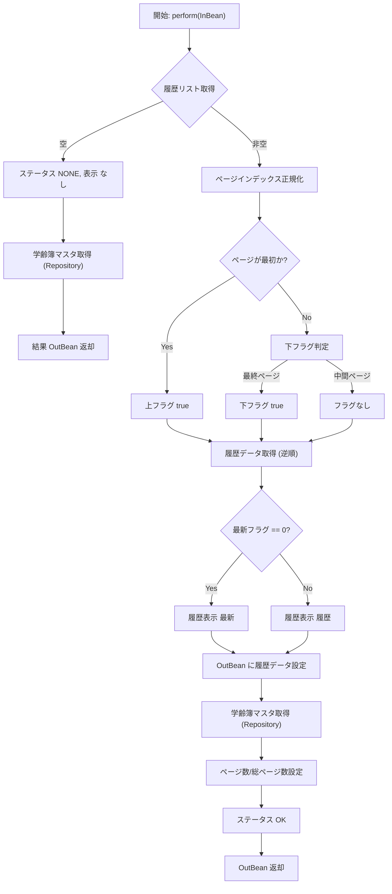

## GKB001S024_GakureiboSyukakkuHistoryService  
**パッケージ** `jp.co.jip.gkb0000.domain.service.gkb0010`  

### 1. 概要概説
| 項目 | 内容 |
|------|------|
| **役割** | 個人（`kojinNo`）の学齢簿（在籍履歴）情報を取得し、**最新／履歴** 表示フラグやページング情報を付与した DTO を返すサービス層コンポーネント。 |
| **呼び出し元** | UI（画面）やバッチ等、学齢簿履歴を表示したい箇所から `perform(InBean)` が呼び出される。 |
| **主な依存** | `GKB001S024_GakureiboSyukakkuHistoryDao`（履歴リスト取得） `GKB0010Repository`（学齢簿マスタ取得） |
| **重要定数** | `NEW = "最新"`、`RIREKI = "履歴"`、`NONE = "なし"`（表示文字列） |
| **変更履歴のポイント** | - 2024/09/25: ページインデックス計算ロジックを修正（0‑ベース→1‑ベースの混在解消） - 2025/12/16: 学齢簿マスタ取得ロジックを追加（保守対応） |

> **新規開発者へのヒント**  
> このクラスは「**データ取得 + 表示ロジック**」を一手に担うため、**ビジネスロジックは DAO/Repository に委譲** し、**画面向けのフラグ設定だけをここで行う** という設計意図があります。ロジック変更は主にページングや表示文字列に関わるので、テストケースは「ページ番号 0/1/最大」など境界条件を重点的にカバーしてください。

---

### 2. コードレベル洞察

#### 2.1 主要フロー

#### 2.2 詳細ステップ

| ステップ | 処理内容 | 目的・設計意図 |
|----------|----------|----------------|
| **1. 履歴リスト取得** | `gKB001S024_GakureiboSyukakkuHistoryDao.getGakureiboShokaiHistoryList(kojinNo)` | DAO が DB から **全履歴**（昇順）を取得。サービスは **全件** を保持し、ページングはローカルで実装。 |
| **2. 履歴が無い場合** | - `Result.status = CN_STATUS_NONE` - `rirekiDisp = "なし"` - `count = total = "1"` - `ue = shita = true` - 学齢簿マスタ取得 | UI が「データなし」でも **1 ページ** として扱えるように固定値を返す。 |
| **3. ページインデックス正規化** | `Integer pageIndex = inBean.getPageIndex();` `if (pageIndex == null || pageIndex > listSize) pageIndex = listSize;` `if (pageIndex - 1 == 0) ...` | **1‑ベース** の入力を受け取り、**0‑ベース** の内部インデックスに変換。境界チェックで不正なページ番号を安全に補正。 |
| **4. 上/下フラグ設定** | `ue`（上へ）と `shita`（下へ）をページ位置に応じて true/false に設定 | UI の「前ページ」「次ページ」ボタン活性化判定に使用。 |
| **5. 履歴データ取得（逆順）** | `historyData = list.get(listSize - pageIndex);` | DB からは **昇順** 取得されるが、画面は **最新が先頭** になるよう逆順で取得。 |
| **6. 最新／履歴表示文字列** | `if (historyData.getSaishinFlg().equals("0")) setRirekiDisp("最新") else setRirekiDisp("履歴")` | `saishinFlg` が `"0"` のときだけ「最新」表示。 |
| **7. 学齢簿マスタ取得** | `gkb0010Repository.selectGKBTGAKUREIBO_006(kojinNo)` | 変更履歴とは別に、**現在の学齢簿情報**（マスタ）も同時に返す。2025 年追加分。 |
| **8. ページ数・総ページ数設定** | `count = String.valueOf(pageIndex);` `total = String.valueOf(listSize);` | UI がページング UI を描画できるよう文字列で提供。 |
| **9. ステータス OK 設定** | `result.status = CN_STATUS_OK` | 正常終了を示す共通ステータス。 |

#### 2.3 例外・エラーハンドリング
- 現在の実装では **例外捕捉は行っていない**。DAO/Repository がスローする例外は上位（コントローラ層）へ伝搬し、統一エラーハンドラで処理される想定。
- **想定外の `null`**（例: `historyData` が `null`）は起きにくいが、テストで `listSize == 0` のケースは **ステータス NONE** で早期リターンしている。

---

### 3. 依存関係とリンク

| 依存先 | 種類 | 用途 | Wiki リンク |
|--------|------|------|--------------|
| `GKB001S024_GakureiboSyukakkuHistoryDao` | DAO | 学齢簿履歴リスト取得 | [GKB001S024_GakureiboSyukakkuHistoryDao](http://localhost:3000/projects/all/wiki?file_path=jp/co/jip/gkb0000/domain/gkb0010/dao/GKB001S024_GakureiboSyukakkuHistoryDao.java) |
| `GKB0010Repository` | Repository | 学齢簿マスタ（`GKBTGAKUREIBO_006`）取得 | [GKB0010Repository](http://localhost:3000/projects/all/wiki?file_path=jp/co/jip/gkb0000/domain/repository/GKB0010Repository.java) |
| `GakureiboShokaiHistoryData` | Helper/DTO | 1 件の履歴データ保持 | [GakureiboShokaiHistoryData](http://localhost:3000/projects/all/wiki?file_path=jp/co/jip/gkb0000/domain/helper/GakureiboShokaiHistoryData.java) |
| `GkbtgakureiboData` | Helper/DTO | 学齢簿マスタ情報保持 | [GkbtgakureiboData](http://localhost:3000/projects/all/wiki?file_path=jp/co/jip/gkb0000/domain/helper/GkbtgakureiboData.java) |
| `GKB001S024_GakureiboSyukakkuHistoryInBean` | 入力DTO | `kojinNo`、`pageIndex` 受取 | [GKB001S024_GakureiboSyukakkuHistoryInBean](http://localhost:3000/projects/all/wiki?file_path=jp/co/jip/gkb0000/domain/service/gkb0010/io/GKB001S024_GakureiboSyukakkuHistoryInBean.java) |
| `GKB001S024_GakureiboSyukakkuHistoryOutBean` | 出力DTO | 結果ステータス、フラグ、データを格納 | [GKB001S024_GakureiboSyukakkuHistoryOutBean](http://localhost:3000/projects/all/wiki?file_path=jp/co/jip/gkb0000/domain/service/gkb0010/io/GKB001S024_GakureiboSyukakkuHistoryOutBean.java) |
| `KyoikuConstants` | 定数クラス | `CN_STATUS_OK` / `CN_STATUS_NONE` など共通ステータス | [KyoikuConstants](http://localhost:3000/projects/all/wiki?file_path=jp/co/jip/gkb000/common/util/KyoikuConstants.java) |

---

### 4. 設計上の考慮点・潜在的課題

| 項目 | 内容 | 推奨アクション |
|------|------|----------------|
| **ページングロジックの混在** | `pageIndex` が 1‑ベースで入力されるが、内部で `listSize - pageIndex` を使用して逆順取得している。 | 将来的に **PagingUtil** クラスへ切り出し、テスト容易性と可読性を向上させる。 |
| **ハードコーディング文字列** | `"0"`、`"最新"`、`"履歴"`、`"なし"` がコード内に直接埋め込まれている。 | 定数化（`enum` も可）し、国際化や変更に備える。 |
| **例外処理の欠如** | DAO/Repository が例外を投げた場合、サービスは捕捉しない。 | 必要に応じて **try‑catch** でラップし、`Result.status` にエラーコードを設定する共通パターンを導入。 |
| **テストカバレッジ** | 境界条件（`pageIndex` が `null`、`0`、`size+1`）のロジックが複雑。 | **単体テスト** で以下を必ず網羅:  ・履歴なし ・1 件だけ ・最初ページ・中間ページ・最終ページ ・`saishinFlg` が `"0"` とそれ以外 |
| **依存注入の可視性** | `@Inject` でフィールドインジェクションを使用。 | コンストラクタインジェクションへ変更し、**不変性** と **テスト容易性** を向上。 |

---

### 5. 変更履歴（抜粋）

| 日付 | 担当 | 内容 |
|------|------|------|
| 2024/09/25 | zczl.cuicy | ページインデックス計算とフラグロジックを修正（IT_GKB_00151） |
| 2025/12/16 | ZCZL.chengjx | 学齢簿マスタ取得ロジックを追加（新WizLIFE保守対応 QA23166） |

---

### 6. まとめ（新規開発者へのポイント）

1. **データ取得は DAO/Repository に委譲** → 変更はそれらの実装に限定。  
2. **ページングはローカルで完結** → 取得した全リストを逆順で参照し、`pageIndex` で切り出す。  
3. **表示フラグは UI 用** → `ue`/`shita` と `rirekiDisp` が UI のボタン/ラベルに直結。  
4. **追加された学齢簿マスタ取得** は **常に** 返却されるので、呼び出し側は `null` チェックが不要。  
5. **テストは境界条件を重点** → `pageIndex` が 0、1、最大、null の4ケースを必ず網羅。  

以上が `GKB001S024_GakureiboSyukakkuHistoryService` の全体像と、今後の保守・拡張時に留意すべきポイントです。