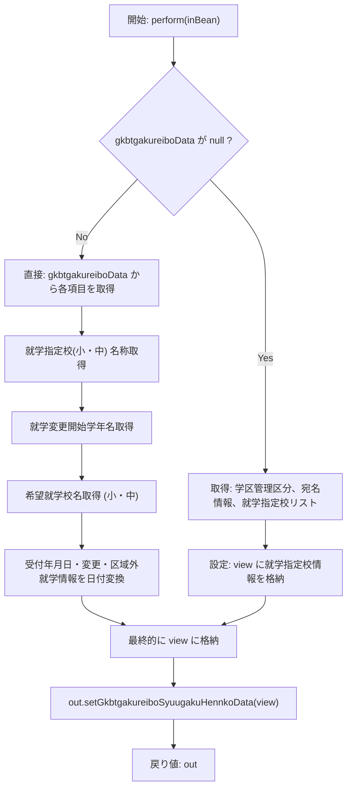
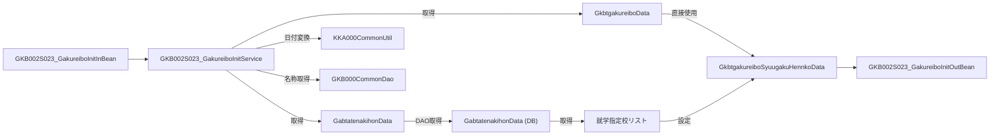

# GKB002S023_GakureiboInitService  
**パッケージ** `jp.co.jip.gkb0000.domain.service.gkb0020`  

## 1. 概要概説
このサービスは **「学年履歴就学学校変更初期処理」** を担い、画面表示用に以下の情報を組み立てて返します。

| 目的 | 主な入力 | 主な出力 |
|------|----------|----------|
| 学齢簿・児童基本情報から、就学指定校・就学変更情報・区域外就学情報等を **表示用データ** に変換 | `GKB002S023_GakureiboInitInBean` (学齢簿データ `GkbtgakureiboData`、児童基本データ `GabtatenakihonData`) | `GKB002S023_GakureiboInitOutBean` → `GkbtgakureiboSyuugakuHennkoData` |

> **新規開発者へのポイント**  
> - `perform` が唯一のエントリーポイント。入力が `null` かどうかで大きく分岐します。  
> - 変更履歴が多数あるため、**仕様変更の意図**（例: 「小学0年」表示回避）をコメントで確認しながら実装を追う必要があります。  
> - 外部 DAO (`GKB002S021_GakureiboDao` など) や共通ユーティリティ (`GKB000CommonDao`, `KKA000CommonUtil`) が多数利用されている点に注意。

## 2. コード級洞察

### 2.1 主なフロー

### 2.2 主要ロジック詳細

| 項目 | 実装ポイント | 変更履歴での注目点 |
|------|---------------|-------------------|
| **就学指定校（小学校）** | `gkb000CommonDao.getGakkoName` でコード → 名称取得。`nullToZero` で `null` → `0` 変換。 ※ 2025/04/27 の修正で `"0"` のみ取得対象に限定。 | `2024/10/21` で仕様変更、`2025/04/27` で「小学0年」回避。 |
| **就学変更開始学年（小）** | `gkb000CommonDao.getGakuNennName` に開始学年コードと指定校コードを渡す。 条件: 両コードが `"0"` のときのみ取得。 | 同上。 |
| **希望就学校（小）** | `KiboGakkoKbnCd` が 1,3,4,5 のいずれかかつ `KiboTyugakkoCd == 0 && KiboSyogakkoCd > 0` の場合に名称取得。 | 仕様上の「公立・私立・その他」区分に合わせたフィルタ。 |
| **希望就学校（中）** | `KiboTyugakkoCd > 0` かつ区分 2,3,4,5 のときに取得。 | 同上。 |
| **日付変換** | `getDate(int)` → `kka000CommonUtil.format(kka000CommonUtil.getSeireki2Wareki(date), 3, 11, 0)`。0 の場合は空文字。 | すべての *年月日* 系フィールドで使用。 |
| **NULL → 0 変換** | `nullToZero(String)` が共通ユーティリティとして利用。 | 文字列が空の場合は 0 を返す安全策。 |
| **学区管理区分取得（gkbtgakureiboData が null の場合）** | `KKA000CommonDao.getCtInfor` で `GetCtInforParam` を呼び出し、`seigyoKbn` を取得。 取得失敗時は `"0"` にフォールバック。 | 2025/05/27 の追加でフォールバックロジックが導入。 |
| **就学指定校リスト取得** | `gkb002S023_SyugakkuHennkouDao.getShiteiGakko(atenakihon)` が返すリストから 1 件目を使用し、コード・名称を `view` に設定。 | 2025/05/27 の大幅リファクタで、直接 DAO からコード取得からリスト取得へ変更。 |

### 2.3 例外・エラーハンドリング
| 例外種別 | 発生条件 | 対応 |
|----------|----------|------|
| `NumberFormatException` | `Integer.parseInt` に `null` または非数値文字列が渡された場合 | `nullToZero` が事前に空文字チェックを行うため基本的に回避。 |
| DAO 呼び出し失敗 | `gkb002S023_SyugakkuHennkouDao` 系メソッドが例外を投げた場合 | 現在は例外を捕捉せず上位へスロー。呼び出し側でトランザクション管理が必要。 |

## 3. 依存関係と関係図

| 依存クラス / DAO | 用途 | リンク |
|------------------|------|--------|
| `GKB002S021_GakureiboDao` | 学齢簿データ取得（本クラスでは未使用） | [GKB002S021_GakureiboDao](http://localhost:3000/projects/all/wiki?file_path=jp/co/jip/gkb0000/domain/gkb0020/dao/GKB002S021_GakureiboDao.java) |
| `KKA000CommonUtil` | 日付フォーマット・和暦変換 | [KKA000CommonUtil](http://localhost:3000/projects/all/wiki?file_path=jp/co/jip/wizlife/fw/kka000/dao/KKA000CommonUtil.java) |
| `KKA000CommonDao` | 学区管理区分取得 | [KKA000CommonDao](http://localhost:3000/projects/all/wiki?file_path=jp/co/jip/wizlife/fw/kka000/dao/KKA000CommonDao.java) |
| `GKB000CommonUtil` | 文字列・数値ユーティリティ（本クラスでは未使用） | [GKB000CommonUtil](http://localhost:3000/projects/all/wiki?file_path=jp/co/jip/gkb000/common/util/GKB000CommonUtil.java) |
| `GKB000CommonDao` | 学校名称・学年名称取得（中心ロジック） | [GKB000CommonDao](http://localhost:3000/projects/all/wiki?file_path=jp/co/jip/gkb000/common/dao/GKB000CommonDao.java) |
| `GKB002S023_SyugakkuHennkouDao` | 区域外就学・就学指定校リスト取得 | [GKB002S023_SyugakkuHennkouDao](http://localhost:3000/projects/all/wiki?file_path=jp/co/jip/gkb0000/domain/gkb0020/dao/GKB002S023_SyugakkuHennkouDao.java) |
| `KKA100GetCTDao` | 参照はあるが本クラスでは未使用 | [KKA100GetCTDao](http://localhost:3000/projects/all/wiki?file_path=jp/co/jip/wizlife/fw/kka100/dao/KKA100GetCTDao.java) |
| `GKBUtil` | Map から文字列取得ヘルパー | [GKBUtil](http://localhost:3000/projects/all/wiki?file_path=jp/co/jip/gkb000/common/util/GKBUtil.java) |
| `KyoikuConstants` | 業務コード定数 | [KyoikuConstants](http://localhost:3000/projects/all/wiki?file_path=jp/co/jip/gkb000/common/util/KyoikuConstants.java) |

### 3.1 データフロー図

## 4. 設計上の考慮点・リスク

| 項目 | 説明 | 推奨アクション |
|------|------|----------------|
| **分岐ロジックの増大** | `gkbtgakureiboData` が有無で大きく処理が変わる。将来的に別パターンが増えると `perform` が肥大化。 | ロジックを **ヘルパーメソッド**（例: `buildFromGakureiboData`, `buildFromAtenaData`）に分割し、テスト容易性を向上。 |
| **ハードコーディングされたコード値** (`"0"`, `"1"`, `"2"` など) | 変更履歴で頻繁に条件が追加・修正されている。 | 定数クラス（例: `SchoolKind`, `GakkoKbn`）に列挙化し、意味を明示。 |
| **日付変換ロジックの重複** | `getDate` が多数呼び出されるが、フォーマットが固定。 | `DateFormatter` ユーティリティに委譲し、フォーマット変更時の影響範囲を限定。 |
| **例外伝搬** | DAO が例外を投げた場合、現在は上位へスローされるだけ。 | 必要に応じて **業務例外**（`GakureiboInitException`）を定義し、エラーメッセージにフィールド情報を付与。 |
| **テスト容易性** | `perform` 内で多数の外部 DAO 呼び出しが直接行われている。 | コンストラクタインジェクションに切り替え、**モック**（Mockito 等）で置換可能にする。 |

## 5. 変更履歴ハイライト（実装上の重要ポイント）

| バージョン | 主な変更 | 影響範囲 |
|------------|----------|----------|
| `2024/10/21` | 仕様変更で `"0"` 判定を追加。 | 条件分岐が増え、`nullToZero` の使用が減少。 |
| `2025/04/27` | 「小学0年」表示回避のため、`"0"` のみ取得対象に。 | UI 表示ロジックが安定。 |
| `2025/05/27` | 就学指定校取得ロジックを **DAO からリスト取得** に変更。 | `GKB002S023_SyugakkuHennkouDao` の新メソッド `getShiteiGakko` が必須に。 |
| `2025/06/12` | 区域外就学情報の追加取得・設定。 | `view` に新フィールドが追加され、画面側のマッピングが必要。 |
| `2025/10/11` | チケット対応で **チェック修正**（`ShiteiTyuGakoCd` の設定ミス修正）。 | 正しい中学校コードが表示されるように。 |

## 6. 参考リンク（クラス・DAO）

- [`GKB002S023_GakureiboInitInBean`](http://localhost:3000/projects/all/wiki?file_path=jp/co/jip/gkb0000/domain/service/gkb0020/io/GKB002S023_GakureiboInitInBean.java)
- [`GKB002S023_GakureiboInitOutBean`](http://localhost:3000/projects/all/wiki?file_path=jp/co/jip/gkb0000/domain/service/gkb0020/io/GKB002S023_GakureiboInitOutBean.java)
- [`GkbtgakureiboData`](http://localhost:3000/projects/all/wiki?file_path=jp/co/jip/gkb0000/domain/helper/GkbtgakureiboData.java)
- [`GabtatenakihonData`](http://localhost:3000/projects/all/wiki?file_path=jp/co/jip/gkb0000/domain/helper/GabtatenakihonData.java)
- [`GkbtgakureiboSyuugakuHennkoData`](http://localhost:3000/projects/all/wiki?file_path=jp/co/jip/gkb0000/domain/helper/GkbtgakureiboSyuugakuHennkoData.java)

---

**このドキュメントは、`GKB002S023_GakureiboInitService` の全体像と実装上の留意点を新規開発者が迅速に把握できるよう設計されています。**  
コード変更時は、上記「設計上の考慮点・リスク」や「変更履歴ハイライト」を参照し、影響範囲を必ずレビューしてください。