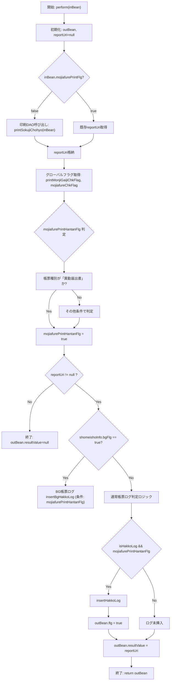

## 📄 **JIA100S003_InsertHakkoLogService**  
**パス**: `D:\code-wiki\projects\all\sample_all\java\Service_JIA100S003_InsertHakkoLogService.java`

---

### 1️⃣ 概要（What & Why）

| 項目 | 内容 |
|------|------|
| **役割** | 発行（証明書・帳票）処理の完了後に、**発行ログ**（発行履歴）を DB に登録するビジネスロジックを提供するサービスクラス。 |
| **呼び出し元** | `EB06_InsertHakkoLogEvent`（イベントクラス）から `perform()` が呼び出され、`JIA100S003_InsertHakkoLogOutBean` が返却される。 |
| **システム内位置付け** |  ① 画面（フロントエンド） → ② `Service` → ③ `DAO`（`JIA100S003_ShomeiShoHakkoDao`） ④ DB（発行ログテーブル） ※印刷プレビュー/印刷の結果に応じて、**ログ挿入の有無** と **印刷エラー判定** を分岐させる。 |
| **主な変更履歴** | - 2022/09/05: 印刷ロジック修正 - 2024/04/09: WizLIFE 2次開発でグローバルフラグ導入、ログ挿入条件拡張 |

> **新規開発者へのヒント**  
> このクラスは「**「いつ」ログを残すか」** と「**「どの情報」** をログに入れるか」を決める**ビジネスルール**の集約点です。ロジック変更は、印刷フラグや帳票種別の追加に伴う条件分岐に注意してください。

---

### 2️⃣ コードレベルの洞察（How）

#### 2.1 主要コンポーネント

| フィールド | 型 | 用途 |
|------------|----|------|
| `shomeiShoHakkoDao` | `JIA100S003_ShomeiShoHakkoDao` | 帳票印刷・ログ挿入の DB アクセスを委譲 |
| `globalValueFW` | `GlobalSessionValueFW` | 文字溢れ・外字チェックフラグ（グローバル設定）を取得 |

#### 2.2 `perform()` の処理フロー

#### 2.3 重要ロジック解説

1. **印刷実行**  
   - `inBean.getMojiafurePrintFlg()` が `false` のときだけ DAO の `printSokujiChohyo(inBean)` を呼び、`reportUri` を取得。  
   - `true` の場合は、すでに画面側で保持している `reportUri` を使用。

2. **文字溢れ・外字エラーフラグ**  
   - `globalValueFW` から 2 つのフラグを取得し、**「文字溢れチェックが必要か」** を `mojiafurePrintHantanFlg` に集約。  
   - 条件は次の通り  
     - 初回印刷かつ `printMonjiGaijiChkFlag == 0` → `true`  
     - プレビュー/再印刷時は、`printMonjiGaijiChkFlag == 0` **または** (`printMonjiGaijiChkFlag > 0 && mojiafureChkFlag == 0`) **または** 帳票ID が「異動届出書」 → `true`

3. **BG帳票（公的証明書）かどうか**  
   - `inBean.getShomeishoInfo().getBgFlg()` が `"true"` の場合は `insertBgHakkoLog` を呼び出す（条件に `mojiafurePrintHantanFlg` が必須）。

4. **通常帳票のログ挿入判定**  
   - `shomeishoInfo` の `hakkoRireki` と `hakkoRirekiRyoho` に基づき **「発行履歴を更新すべきか」** を算出。  
   - プレビュー時は履歴更新を抑制し、印刷ボタン時のみ更新。  
   - さらに **文字溢れチェックが通っている** (`mojiafurePrintHantanFlg`) 場合にだけ `insertHakkoLog` が実行され、`outBean.flg` が `true` になる。

5. **帳票種別別の微調整**  
   - 「住民票コード通知書」（帳票種別 5）の場合、`Koyoin_hyoji` を `0` に強制設定し、印刷時の公用印表示を抑制。

#### 2.4 例外・エラーハンドリング

| 例外種別 | 発生条件 | 対応 |
|----------|----------|------|
| `reportUri == null` | DAO が印刷に失敗、または印刷対象外 | `outBean.resultValue` に `null` が設定され、`outBean.flg` は `false` のまま返却 |
| 文字溢れエラー | `globalValueFW` のフラグが 1 かつ `mojiafureChkFlag` が 1 の場合 | `mojiafurePrintHantanFlg` が `false` になるため、ログ挿入はスキップ（印刷は継続） |

---

### 3️⃣ 依存関係・相互作用

| 依存先 | 種類 | 用途 | Wikiリンク |
|--------|------|------|------------|
| `JIA100S003_ShomeiShoHakkoDao` | DAO | 帳票印刷 (`printSokujiChohyo`) とログ挿入 (`insertHakkoLog`, `insertBgHakkoLog`) | [JIA100S003_ShomeiShoHakkoDao](http://localhost:3000/projects/all/wiki?file_path=jp/co/jip/jia0000/domain/jia1000/dao/JIA100S003_ShomeiShoHakkoDao.java) |
| `GlobalSessionValueFW` | グローバルセッション | 文字溢れ・外字チェックフラグ取得 | [GlobalSessionValueFW](http://localhost:3000/projects/all/wiki?file_path=jp/co/jip/wizlife/fw/kka100/web/session/GlobalSessionValueFW.java) |
| `JIA100S003_InsertHakkoLogInBean` | 入力DTO | 画面から受け取る全パラメータ（帳票情報、フラグ等） | [JIA100S003_InsertHakkoLogInBean](http://localhost:3000/projects/all/wiki?file_path=jp/co/jip/jia0000/domain/service/jia1000/io/JIA100S003_InsertHakkoLogInBean.java) |
| `JIA100S003_InsertHakkoLogOutBean` | 出力DTO | 処理結果（成功フラグ、レポートURI）を返却 | [JIA100S003_InsertHakkoLogOutBean](http://localhost:3000/projects/all/wiki?file_path=jp/co/jip/jia0000/domain/service/jia1000/io/JIA100S003_InsertHakkoLogOutBean.java) |
| `JIAConstants` | 定数クラス | 帳票ID（例: `EBPR_IDOTODOKE_N_CODE`）の比較に使用 | [JIAConstants](http://localhost:3000/projects/all/wiki?file_path=jp/co/jip/jia0000/domain/util/JIAConstants.java) |

---

### 4️⃣ 開発・保守のポイント

| 項目 | 推奨アクション |
|------|----------------|
| **フラグ追加** | 新しい帳票種別や印刷オプションを追加する場合は、`globalValueFW` のフラグ取得ロジックと `mojiafurePrintHantanFlg` の判定条件を必ずレビュー。 |
| **テストケース** | - `mojiafurePrintFlg` の **true/false** パターン - `printMonjiGaijiChkFlag` / `mojiafureChkFlag` の組み合わせ - `shomeishoInfo.bgFlg` が true/false のケース を網羅した単体テストが必須。 |
| **例外ログ** | 現在は `reportUri == null` のみで失敗を示すが、DAO がスローする例外は上位で捕捉し、適切にログ出力する仕組みを追加すると保守性向上。 |
| **リファクタリング候補** | 条件分岐が多いため、**「ログ挿入判定ロジック」** を別メソッド（例: `shouldInsertLog(inBean, globalValueFW)`）に切り出すと可読性が向上。 |
| **依存関係の可視化** | `Service` → `DAO` → `DB` の流れは **Spring DI** による注入で管理されている。DI コンテナの設定変更時は、`@Service` と `@Inject` のスコープに注意。 |

---

### 5️⃣ まとめ

- **目的**: 発行処理完了後に、帳票種別・印刷フラグ・文字溢れチェック結果に応じて適切なログを DB に残す。  
- **キーポイント**: `mojiafurePrintHantanFlg`（文字溢れチェック合格フラグ）と `shomeishoInfo.bgFlg`（BG帳票判定）により、**ログ挿入の有無** が決定される。  
- **拡張性**: 新帳票や新フラグを追加する際は、判定ロジックと DAO メソッドのシグネチャを合わせて更新する必要がある。  

このドキュメントを基に、**ロジックの全体像** と **変更時の影響範囲** を把握し、安心して保守・機能追加に取り組んでください。  