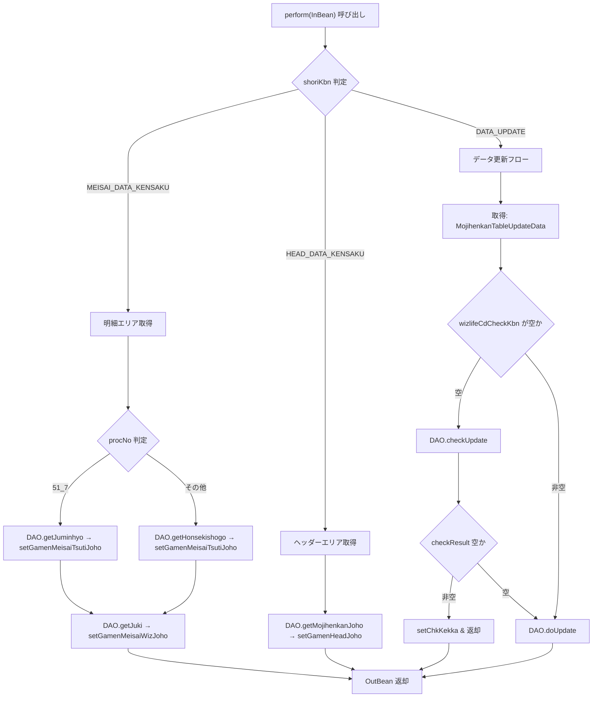

# 📄 Service_JIB005S100_KoushinDataMojisetService.java  
**パス**: `D:\code-wiki\projects\all\sample_all\java\Service_JIB005S100_KoushinDataMojisetService.java`

---  

## 1. 概要概述
このクラスは **「更新データ文字特定」** の業務ロジックを担う Service 層コンポーネントです。  
- 入力は画面から送られる **InBean** (`JIB005S100_KoushinDataMojisetInBean`)  
- 出力は画面へ返す **OutBean** (`JIB005S100_KoushinDataMojisetOutBean`)  
- 実際の DB アクセスは **DAO** (`JIB005S100_KoushinDataMojisetDao`) に委譲します。  

システム全体では、画面の明細エリア・ヘッダーエリアの情報取得、外字文字情報取得、そして文字コード変換データの更新という 3 つの処理区分に分かれています。  

> **新規担当者が最初に抱く疑問**  
> - 「`perform` がやっていることは何か？」  
> - 「どの処理がどの条件で走るのか？」  
> - 「DAO の戻り値はどんな形で OutBean に詰められるのか？」  

以下でこれらを順に解消します。

---

## 2. コード級洞察

### 2.1 主要コンポーネント
| コンポーネント | 役割 | リンク |
|---|---|---|
| `JIB005S100_KoushinDataMojisetDao` | DB 参照・更新を行う DAO | [`JIB005S100_KoushinDataMojisetDao`](http://localhost:3000/projects/all/wiki?file_path=jp/co/jip/jib0000/domain/jib0050/dao/JIB005S100_KoushinDataMojisetDao.java) |
| `JIB005S100_KoushinDataMojisetInBean` | 画面から受け取る入力パラメータ | [`JIB005S100_KoushinDataMojisetInBean`](http://localhost:3000/projects/all/wiki?file_path=jp/co/jip/jib0000/domain/service/jib0050/io/JIB005S100_KoushinDataMojisetInBean.java) |
| `JIB005S100_KoushinDataMojisetOutBean` | 画面へ返す出力パラメータ | [`JIB005S100_KoushinDataMojisetOutBean`](http://localhost:3000/projects/all/wiki?file_path=jp/co/jip/jib0000/domain/service/jib0050/io/JIB005S100_KoushinDataMojisetOutBean.java) |
| `JIB005S100_KoushinDataMojisetInfo` | 更新対象の DTO（テーブル行） | [`JIB005S100_KoushinDataMojisetInfo`](http://localhost:3000/projects/all/wiki?file_path=jp/co/jip/jib0000/domain/jib0050/dao/dto/JIB005S100_KoushinDataMojisetInfo.java) |
| `JIBUtil` | ユーティリティ（空チェック等） | [`JIBUtil`](http://localhost:3000/projects/all/wiki?file_path=jp/co/jip/jib000/util/JIBUtil.java) |

### 2.2 `perform` メソッドのロジック
1. **OutBean の生成**  
   ```java
   JIB005S100_KoushinDataMojisetOutBean out = new JIB005S100_KoushinDataMojisetOutBean();
   ```
2. **`shoriKbn`（処理区分）で分岐**  
   - `MEISAI_DATA_KENSAKU` → 明細エリア情報取得  
   - `HEAD_DATA_KENSAKU` → ヘッダーエリア情報取得  
   - `DATA_UPDATE` → データ更新（チェック＋更新）  

3. **明細エリア取得の内部分岐** (`procNo` が `51_7` のときは住民票情報、その他は本籍照合情報)  

4. **WizLIFE 文字コード取得**（`getJuki`）  

5. **ヘッダーエリア取得**は外字文字コード (`gaijiMojiCd`) で DAO の `getMojihenkanJoho` を呼び出す  

6. **データ更新**  
   - まず `MojihenkanInfo` のリストから `wizlifeCdCheckKbn` が空か確認  
   - 空の場合は `checkUpdate` で事前チェック → エラーがあれば `chkKekka` にセットして即リターン  
   - チェックが通れば `doUpdate` で実際の更新を実行  

### 2.3 例外・エラーハンドリング
| 例外種別 | 発生条件 | 対応 |
|---|---|---|
| `checkResult` が空でない | `checkUpdate` がエラーメッセージを返す | `out.setChkKekka(checkResult)` → 直ちに `out` を返す（更新は行わない） |

※本クラス自体は例外スローは行わず、DAO が返す文字列でエラー判定を行います。

---

## 3. 処理フロー（Mermaid）



---

## 4. 依存関係と関係図

- **Service → DAO**  
  `JIB005S100_KoushinDataMojisetService` は唯一の外部依存として `JIB005S100_KoushinDataMojisetDao` を `@Inject` で取得。  
- **Service ↔ In/Out Bean**  
  入力は `JIB005S100_KoushinDataMojisetInBean`、出力は `JIB005S100_KoushinDataMojisetOutBean`。  
- **DAO ↔ DTO**  
  更新対象は `JIB005S100_KoushinDataMojisetInfo`（リスト）で、DAO の `doUpdate` / `checkUpdate` が受け取る。  

> **注意**: DAO の実装が別モジュールに分かれている場合、テスト時はモック化（例: `@MockBean`）が必須です。

---

## 5. 変更履歴と設計上のポイント

| 日付 | 担当 | 内容 |
|---|---|---|
| 2022/05/10 | zczl.yuchufei | 初版実装 |
| 2024/02/20 | zczl.dongy | マージ作業で `DATA_UPDATE` フローに事前チェックロジックを追加（`checkUpdate`） |

### 設計上の意図
- **処理区分 (`shoriKbn`)** による分岐で、画面側からの要求を一つのエンドポイントでハンドリング。  
- **事前チェック** を `DATA_UPDATE` に組み込むことで、DB 更新前にビジネスルール違反を早期に検出。  
- **DAO への委譲** を徹底し、Service は「何をするか」だけを記述。実装詳細は DAO に隠蔽。

### 潜在的な課題
| 課題 | 影響 | 対応策 |
|---|---|---|
| `shoriKbn` がハードコーディング | 新しい処理区分追加時にコード変更が必要 | Enum 化して `switch` 文に置き換える |
| `procNo` の文字列比較 | タイポやバージョンアップで不整合が起きやすい | 定数クラスに集約 |
| `ArrayList` のインデックス固定 (`koushinData.get(0)`) | データが空の場合 `IndexOutOfBoundsException` が発生 | 空チェックを追加 |
| エラーメッセージが文字列だけ | 国際化・詳細情報付与が困難 | カスタム例外クラスに置き換える |

---

## 6. 参考リンク（他クラスの Wiki）

- [`JIB005S100_KoushinDataMojisetDao`](http://localhost:3000/projects/all/wiki?file_path=jp/co/jip/jib0000/domain/jib0050/dao/JIB005S100_KoushinDataMojisetDao.java)  
- [`JIB005S100_KoushinDataMojisetInBean`](http://localhost:3000/projects/all/wiki?file_path=jp/co/jip/jib0000/domain/service/jib0050/io/JIB005S100_KoushinDataMojisetInBean.java)  
- [`JIB005S100_KoushinDataMojisetOutBean`](http://localhost:3000/projects/all/wiki?file_path=jp/co/jip/jib0000/domain/service/jib0050/io/JIB005S100_KoushinDataMojisetOutBean.java)  
- [`JIBUtil`](http://localhost:3000/projects/all/wiki?file_path=jp/co/jip/jib000/util/JIBUtil.java)  

---

## 7. まとめ（新担当者へのアドバイス）

1. **まずは `shoriKbn` の流れを把握** → どの画面操作がどの分岐に入るかをマッピング。  
2. **DAO の戻り値を確認** → `OutBean` にどのプロパティが設定されるかをデバッグで追うと全体像が掴めます。  
3. **変更が必要な箇所は Enum/定数化** → ハードコーディングを減らすと保守性が向上。  
4. **テストケースを追加** → `DATA_UPDATE` の事前チェックロジックは特に境界条件（空リスト、チェック結果あり/なし）を網羅してください。  

以上が `JIB005S100_KoushinDataMojisetService` の全体像と、今後の保守・拡張に向けた指針です。  