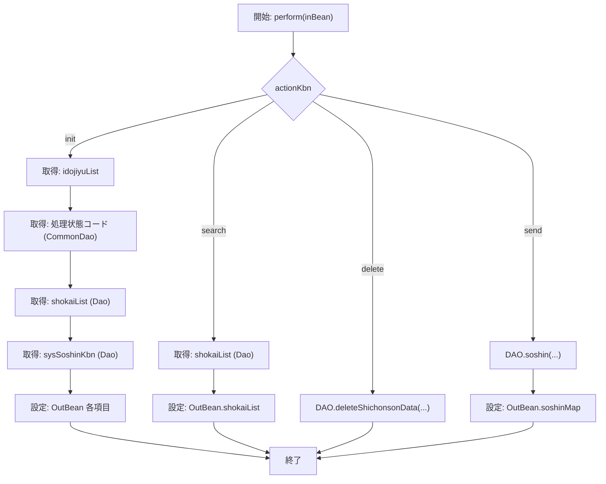

# JIB006S002_ShichosonDataShokaiService  

## 概要  
このクラスは **市町村通知照会画面** のビジネスロジックを担う Service 層コンポーネントです。  
- 画面から送られてくる `actionKbn`（`init` / `search` / `delete` / `send`）に応じて、DAO を呼び出し結果を **OutBean** に詰めて返します。  
- 画面初期化時は、共通コード取得ロジック（`JIA000CommonDao.getCodeList_numsort`）を利用して「処理状態」コンボボックスの表示順を数値ソートで取得します。  

> **新規開発者へのポイント**  
> - `perform` が唯一のエントリーポイントで、分岐ごとに呼び出す DAO メソッドが明確です。  
> - 画面側の `actionKbn` が増える場合は、このメソッドに新たな `else if` ブロックを追加すれば拡張可能です。  

---

## コードレベルの洞察  

### 主要メソッド  

```java
public JIB006S002_ShichosonDataShokaiOutBean perform(
        JIB006S002_ShichosonDataShokaiInBean inBean)
```

| 変数 | 役割 |
|------|------|
| `actionKbn` | 画面からの操作種別（`init`/`search`/`delete`/`send`） |
| `outBean`   | 画面へ返すデータを保持する DTO |

### 処理フロー（Mermaid）



### 各分岐の実装ポイント  

| 分岐 | 主な処理 | 参照 DAO / メソッド |
|------|----------|----------------------|
| `init` | - 市町村コードリスト取得<br>- 処理状態コードを数値順に取得（`JIA000CommonDao.getCodeList_numsort`）<br>- 画面表示用データ取得<br>- システム条件取得 | `shichosonDataShokaiDao.getIdojiyuCmb()`<br>`jia000CommonDao.getCodeList_numsort(...)`<br>`shichosonDataShokaiDao.getShichonsonData(...)`<br>`shichosonDataShokaiDao.getSysSoshinKbn()` |
| `search` | 条件検索でデータ取得 | `shichosonDataShokaiDao.getShichonsonData(...)` |
| `delete` | 指定レコードの論理削除 | `shichosonDataShokaiDao.deleteShichonsonData(...)` |
| `send`   | データ送信（外部システム連携） | `shichosonDataShokaiDao.soshin(...)` |

### 例外処理  
本クラス内では明示的な `try/catch` が無く、例外は上位（コントローラ層）へ伝搬します。  
- DAO がスローする `RuntimeException` 系はそのまま呼び出し元に伝わります。  
- 必要に応じて、将来的に **トランザクション管理** や **業務例外** のハンドリングを追加してください。

---

## 依存関係とリンク  

| 依存クラス | パッケージ | 用途 | Wiki リンク |
|-----------|------------|------|-------------|
| `JIB006S002_ShichosonDataShokaiDao` | `jp.co.jip.jib0000.domain.jib0060.dao` | DB アクセス（市町村データ取得・削除・送信） | [JIB006S002_ShichosonDataShokaiDao](http://localhost:3000/projects/all/wiki?file_path=jp/co/jip/jib0000/domain/jib0060/dao/JIB006S002_ShichosonDataShokaiDao.java) |
| `JIA000CommonDao` | `jp.co.jip.jia000.common.dao` | 共通コード取得（数値ソート） | [JIA000CommonDao](http://localhost:3000/projects/all/wiki?file_path=jp/co/jip/jia000/common/dao/JIA000CommonDao.java) |
| `JIB006S002_ShichosonDataShokaiInBean` | `jp.co.jip.jib0000.domain.service.jib0060.io` | 入力パラメータ DTO | [JIB006S002_ShichosonDataShokaiInBean](http://localhost:3000/projects/all/wiki?file_path=jp/co/jip/jib0000/domain/service/jib0060/io/JIB006S002_ShichosonDataShokaiInBean.java) |
| `JIB006S002_ShichosonDataShokaiOutBean` | `jp.co.jip.jib0000.domain.service.jib0060.io` | 出力パラメータ DTO | [JIB006S002_ShichosonDataShokaiOutBean](http://localhost:3000/projects/all/wiki?file_path=jp/co/jip/jib0000/domain/service/jib0060/io/JIB006S002_ShichosonDataShokaiOutBean.java) |
| `JIB000_Codejoho` | `jp.co.jip.jib000.dao.dto` | コード情報（コード・名称） | [JIB000_Codejoho](http://localhost:3000/projects/all/wiki?file_path=jp/co/jip/jib000/dao/dto/JIB000_Codejoho.java) |
| `JIB006S002_ShichosonDataShokaiInfo` | `jp.co.jip.jib0000.domain.jib0060.dao.dto` | 市町村通知データエンティティ | [JIB006S002_ShichosonDataShokaiInfo](http://localhost:3000/projects/all/wiki?file_path=jp/co/jip/jib0000/domain/jib0060/dao/dto/JIB006S002_ShichosonDataShokaiInfo.java) |
| `KKATCDDTO` | `jp.co.jip.wizlife.fw.bean.dto` | 共通コード DTO（数値順） | [KKATCDDTO](http://localhost:3000/projects/all/wiki?file_path=jp/co/jip/wizlife/fw/bean/dto/KKATCDDTO.java) |
| `GetCodeListNumsortParam` | `jp.co.jip.jia000.common.dao.param` | コード取得パラメータ | [GetCodeListNumsortParam](http://localhost:3000/projects/all/wiki?file_path=jp/co/jip/jia000/common/dao/param/GetCodeListNumsortParam.java) |

---

## 設計上の留意点  

1. **拡張性**  
   - `actionKbn` が増える場合は `perform` に新たな分岐を追加するだけで済むが、ロジックが肥大化しやすい。将来的には **Command パターン** で各アクションを別クラスに分離することを検討してください。  

2. **トランザクション管理**  
   - 現在は DAO メソッドが内部でトランザクションを制御している前提です。`delete` と `send` が同一リクエストで呼ばれるケースがある場合は、サービス層で **@Transactional** を付与し、原子性を保証することが望ましいです。  

3. **例外ハンドリング**  
   - DAO がスローする例外は上位に委譲されています。画面側でユーザーフレンドリーなエラーメッセージを表示したい場合は、**業務例外（BusinessException）** を定義し、`perform` で捕捉・変換する層を追加すると良いでしょう。  

4. **コードリスト取得ロジックの変更**  
   - `init` で `JIA000CommonDao.getCodeList_numsort` を使用していますが、将来的にコードマスタが別テーブルに分割された場合は、**DAO のインタフェース** を拡張し、サービス側のロジックは変更せずに済むように抽象化しておくと保守性が向上します。  

---

## まとめ  

- `JIB006S002_ShichosonDataShokaiService` は画面アクションを判定し、DAO を呼び出すシンプルなサービスクラスです。  
- 主要ロジックは `perform` の分岐に集約されているため、**アクション追加**・**例外処理追加**・**トランザクション統合** のポイントはこのメソッドです。  
- 依存している DAO・DTO はすべてパッケージ単位で整理されているので、変更が必要な場合は該当 DAO のインタフェースを中心に修正してください。  