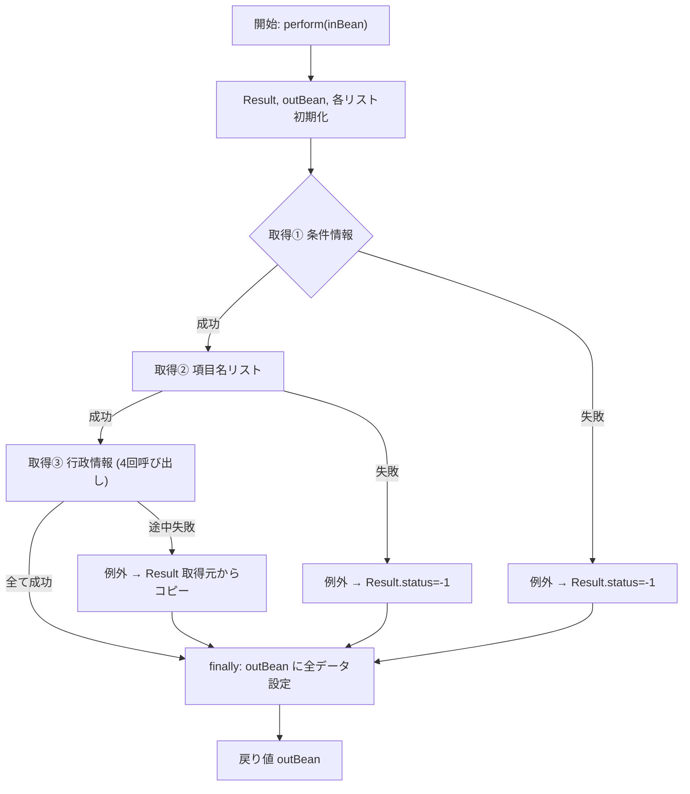

## 1. 概要概述
**`JIB007S001_GetGksJknService`** は、職員番号（`shokuinKojinNo`）と履歴連番から「業務区分条件情報」(`JIB007S001_GyoseiKihonSelectJoken`) を取得し、  
- 項目名リスト（並び順・改行・備考）  
- 行政区情報（地区・行政区・隣保班・小学校区）  

をまとめて **`JIB007S001_GksJknOutBean`** に格納して返すサービスクラスです。  
このサービスは、画面やバッチから「行政情報一覧取得」機能を呼び出す際の **エントリーポイント** となり、以下の 2 つの外部コンポーネントに依存しています。

| 依存コンポーネント | 役割 |
|-------------------|------|
| `JIB007S001_GksJokenDao` | 条件情報・項目名マスタの取得 |
| `JIB000_GetGyoseijohoListService` | 行政区情報（地区・行政区・隣保班・小学校区）を取得 |

> **新規開発者へのポイント**  
> - 本クラスは「データ取得 + 例外統一処理 + 結果組み立て」の 3 つの責務に分かれています。  
> - 例外は **`Result`** オブジェクトにステータス・メッセージを詰めて最終的に `outBean` に設定するだけなので、呼び出し側は `Result` の内容を確認すればエラー原因が分かります。  

---

## 2. コード級洞察

### 2‑1. 処理フロー（概要）

### 2‑2. 詳細ステップ

| ステップ | 内容 | 例外処理 |
|----------|------|----------|
| **1. 入力受取** | `JIB007S001_GetGksJknInBean` から `shokuinKojinNo` と `rireki_renban`、`santeidantaiCode` を取得 | - |
| **2. 条件情報取得** | `gksJokenDao.getJoken()` で `JIB007S001_GyoseiKihonSelectJoken` を取得 | 失敗 → `Result.status=-1`、`Result.summary="条件の取得に失敗しました"` |
| **3. 項目名リスト取得** | `gksJokenDao.getKomokuList(1/2/3)` で「並び順」「改行」「備考」リストを取得 | 失敗 → `Result.status=-1`、`Result.summary="項目名情報の取得に失敗しました"` |
| **4. 行政情報取得（4回呼び出し）** | `getGyoseijohoListService.perform()` に `gyosei_joho_kbn` (1~4) を設定し、`chikuList`、`gyoseikuList`、`hanList`、`shogakkokuList` を取得 | 各呼び出しで `Result.status!=0` → 例外スロー。例外時は `kyotuResult` が `null` かどうかで `Result` を設定。 |
| **5. 例外捕捉** | すべての例外は最外層 `catch` で捕捉し、`Result` にデフォルトエラーメッセージを設定 | `result.setStatus(-1)`、`result.setSummary("エラーが発生しました")` など |
| **6. finally** | 取得した全データと `Result` を `outBean` に格納 | - |
| **7. 戻り** | `outBean` を呼び出し元へ返却 | - |

### 2‑3. 重要な実装上の判断

| 判断 | 理由・メリット | 潜在リスク |
|------|----------------|------------|
| **DAO と別サービスを `@Inject` で注入** | テスト時にモック差し替えが容易 | DI コンテナ設定が正しくないと起動エラー |
| **4 回に分割して行政情報取得** | 1 回の呼び出しで取得できない（サービス側の仕様）ため、個別に取得 | 4 回の呼び出しでネットワーク/DB 負荷が増大。失敗した場合は全体が失敗になる点に注意 |
| **例外を捕捉して `Result` にステータスだけ設定** | 呼び出し側は例外ハンドリングを意識せず `Result` だけで完結できる | 例外情報が `Result` に完全にマッピングされないと、デバッグが困難になる可能性 |
| **`finally` で必ず `outBean` に設定** | 例外が起きても部分的に取得できたデータを返せる | 取得失敗時に `null` が混在する可能性があるので、呼び出し側で `null` チェックが必要 |

---

## 3. 依存関係と関係

### 3‑1. クラス間リンク

| クラス / インタフェース | パス (例) | 役割 |
|------------------------|----------|------|
| `JIB007S001_GksJokenDao` | `jp/co/jip/jib0000/domain/jib0070/dao/JIB007S001_GksJokenDao.java` | 条件情報・項目名マスタ取得 |
| `JIB000_GetGyoseijohoListService` | `jp/co/jip/jib000/service/jib000/JIB000_GetGyoseijohoListService.java` | 行政区情報取得サービス |
| `JIB007S001_GetGksJknInBean` | `jp/co/jip/jib0000/domain/service/jib0070/io/JIB007S001_GetGksJknInBean.java` | 入力パラメータ |
| `JIB007S001_GksJknOutBean` | `jp/co/jip/jib0000/service/jib0070/io/JIB007S001_GksJknOutBean.java` | 出力パラメータ |
| `JIB007S001_GyoseiKihonSelectJoken` | `jp/co/jip/jib000/jib0070/dao/dto/JIB007S001_GyoseiKihonSelectJoken.java` | 条件情報 DTO |
| `Result` | `jp/co/jip/wizlife/fw/bean/view/Result.java` | 処理結果ステータス・メッセージ保持 |

> **リンク例**  
> - [`JIB007S001_GksJokenDao`](http://localhost:3000/projects/all/wiki?file_path=jp/co/jip/jib0000/domain/jib0070/dao/JIB007S001_GksJokenDao.java)  
> - [`JIB000_GetGyoseijohoListService`](http://localhost:3000/projects/all/wiki?file_path=jp/co/jip/jib000/service/jib000/JIB000_GetGyoseijohoListService.java)

### 3‑2. データフロー

1. **入力** → `inBean`  
2. **DAO** → 条件情報 (`jokenInfo`) と項目名リスト (`sortList` など)  
3. **外部サービス** → 行政情報リスト (`chikuList`, `gyoseikuList`, `hanList`, `shogakkokuList`)  
4. **Result** → 成功/失敗ステータス・メッセージ  
5. **出力** → `outBean` に全データと `Result` を格納  

---

## 4. 変更・拡張時の留意点

| 項目 | 推奨アクション |
|------|----------------|
| **DAO の取得ロジック変更** | `perform` 内の例外ハンドリングはそのままに、DAO メソッドのシグネチャが変わったら `try/catch` のメッセージだけ更新 |
| **行政情報取得回数増加** | 4 回の呼び出しは `for` ループに置き換えて可読性向上。ただし `Result` の取得ロジックは維持する |
| **Result のステータスコード拡張** | 新しいステータスを追加したら `perform` の `if (kyotuResult.getStatus()!=0)` 判定を `!= SUCCESS_CODE` に変更 |
| **テスト実装** | `@Inject` された DAO と Service をモック (`Mockito`) に差し替え、`Result` のステータス/サマリが期待通りになるか検証 |
| **例外ロギング** | 現在は `e.printStackTrace()` のみ。本番環境ではロガー (`SLF4J`) に統一し、スタックトレースも出力するように変更 |

---

## 5. まとめ

`JIB007S001_GetGksJknService` は「職員情報」→「条件取得」→「項目名取得」→「行政情報取得」の一連の流れを **統一的な `Result`** でラップし、呼び出し側に **完全なデータセット** と **エラーステータス** を提供するサービスです。  
新規開発者は以下を意識すればスムーズに理解・拡張できます。

1. **データ取得の順序**（条件 → 項目名 → 行政情報）  
2. **例外はすべて `Result` に集約** され、`finally` で必ず `outBean` に設定される点  
3. **外部依存（DAO・別サービス）** がテスト時にモック化できる設計  

この理解をベースに、要件変更やパフォーマンス改善を行うと安全です。