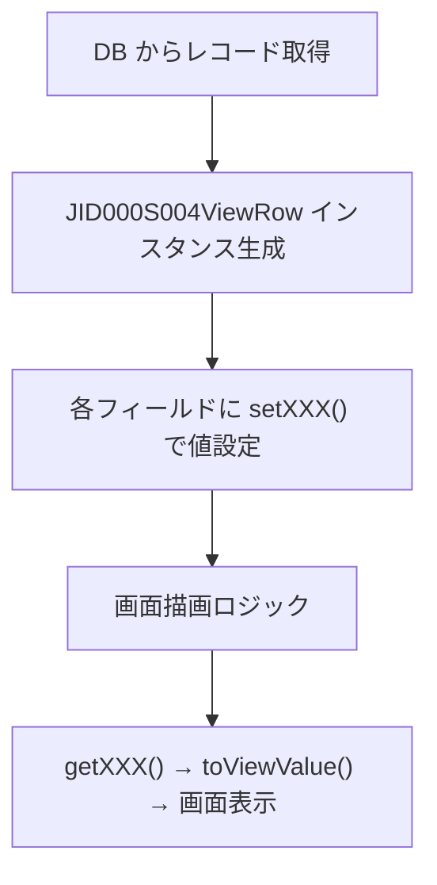

# JID000S004ViewRow クラス ドキュメント  
**ファイルパス**: `D:\code-wiki\projects\all\sample_all\java\View_JID000S004ViewRow.java`  
**リンク**: [JID000S004ViewRow](http://localhost:3000/projects/all/wiki?file_path=D:/code-wiki/projects/all/sample_all/java/View_JID000S004ViewRow.java)

---

## 1. 概要概述

| 項目 | 内容 |
|------|------|
| **クラス名** | `JID000S004ViewRow` |
| **スーパークラス** | `AbstractViewRow`（画面表示用の共通ロジックを提供） |
| **主目的** | 世帯照会画面（JID000S004）で使用される 1 行分の表示データを保持・整形する **DTO（Data Transfer Object）** |
| **担当画面** | 世帯照会画面（一覧表示） |
| **変更履歴** | 2023/10/19 – 新 WizLIFE 2 次開発で項目追加（例: `seinengapiFushoHyoki`） |

> **新規開発者へのポイント**  
> - このクラスは「**データのキャリア**」であり、ビジネスロジックはほとんど持ちません。  
> - 画面側は `getXXX()` 系メソッドで取得した文字列をそのまま表示し、`setXXX()` 系で画面入力を受け取ります。  
> - 文字列の整形はスーパークラス `AbstractViewRow` の `toViewValue` メソッドに委譲している点に注目してください。

---

## 2. コード級洞察

### 2.1 フィールドとアクセサ

| フィールド | 型 | 画面項目 | `toViewValue` の使用有無 | コメント |
|------------|----|----------|--------------------------|----------|
| `dsp_no` | `String` | 明細欄 NO | あり（長さ制限なし） | 行番号 |
| `shimei_kana` | `String` | 氏名（かな） | あり（長さ 18） | 文字幅制限 |
| `shimei_kanji` | `String` | 氏名（漢字） | あり（長さ 18） | 文字幅制限 |
| `touroku_kbn` | `String` | 登録区分 | あり | 例: 新規/更新 |
| `kofu_kbn` | `String` | 交付状態 | あり | 例: 交付済/未交付 |
| `kojin_no` | `String` | 個人番号 | あり | マイナンバー等 |
| `card_no` | `String` | カード番号 | **なし**（そのまま返す） | 暗号化・マスクは別途実装想定 |
| `seinengapi` | `String` | 生年月日 | あり | `yyyyMMdd` 形式が前提 |
| `seinengapi_chk` | `String` | 生年月日（チェック用） | あり | 入力チェック用 |
| `seibetsu` | `String` | 性別 | あり | `M/F` 等 |
| `zokugara_mei` | `String` | 続柄名 | あり | 例: 父、母 |
| `hakko_error` | `int` | エラー区分 | なし | 0: OK、非0: エラー |
| `haishi_bi` | `String` | 廃止日 | なし | 文字列で保持 |
| `gunzenkun` | `int` | （不明） | なし | 0/1 のフラグ想定 |
| `hoteiDairininShimei` | `String` | 法定代理人氏名 | なし | 文字列そのまま |
| `seinengapiFushoHyoki` | `String` | 生年月日不詳表記 | なし | 2023 追加項目 |

#### `toViewValue` の役割
- **入力**: 生データ（DB から取得した文字列）  
- **出力**: 画面表示用に **null → 空文字**、**長さ超過 → 切り捨て**、**フォーマット変換** などを行う共通ロジック。  
- 具体的な実装は `AbstractViewRow` にあるため、表示ロジックを変更したい場合はそちらを修正。

### 2.2 メソッド構成

- **Getter / Setter** がほぼ全フィールドに対して 1 対 1 で実装。  
- 例外処理はなし（単純なデータ保持）。  
- `getCard_no()` は `toViewValue` を通さず **そのまま返す** 設計。暗号化やマスクは呼び出し側で実装する想定です。

### 2.3 データフロー（簡易シーケンス）

- **ポイント**: `JID000S004ViewRow` は「**データキャリア**」であり、画面描画前に `setXXX()` が呼ばれ、描画時に `getXXX()` が呼ばれます。

### 2.4 例外・エラーハンドリング

| 例外種別 | 発生条件 | 対応 |
|----------|----------|------|
| なし | 本クラスは単純な POJO であり、例外はスローしません。 | エラーは上位層（サービス層やコントローラ）でハンドリング。 |

---

## 3. 依存関係と関係

- **スーパークラス**: [`AbstractViewRow`](http://localhost:3000/projects/all/wiki?file_path=※抽象クラスのパス※)  
  - `toViewValue` 系メソッドを提供し、文字列整形の共通処理を担う。  
- **使用箇所**:  
  - `jp.co.jip.jid0000.app.controller.JID000S004Controller`（※仮称※）でインスタンス化され、画面モデルに設定。  
  - `jp.co.jip.jid0000.app.service.JID000S004Service` で DB から取得した DTO を本クラスへマッピング。  

> **新規開発者へのアドバイス**  
> - 画面項目を追加・削除したい場合は **まず** `AbstractViewRow` の `toViewValue` が対応できるか確認し、**次に** 本クラスにフィールドと getter/setter を追加してください。  
> - 文字列長やフォーマット制御は `toViewValue` に委譲することで、画面全体の一貫性が保たれます。

---

## 4. 今後の拡張ポイント

| 項目 | 現状 | 推奨拡張 |
|------|------|----------|
| **バリデーション** | なし（コントローラ側で実装） | `AbstractViewRow` に共通バリデーションメソッドを追加し、`setXXX()` 内で呼び出す形に統一。 |
| **マスク処理** | `card_no` はそのまま返す | `toViewValue` にマスクロジックを組み込み、機密情報の表示漏れ防止。 |
| **国際化** | フィールド名は日本語コメントのみ | `toViewValue` にロケール情報を渡し、日付や性別コードの表示文字列をローカライズ。 |
| **テストカバレッジ** | 手動テストが中心 | JUnit で getter/setter と `toViewValue` の挙動を自動テスト化。 |

---

## 5. まとめ

`JID000S004ViewRow` は世帯照会画面の **表示データコンテナ** です。  
- **シンプルな構造**（フィールド + getter/setter）で、表示ロジックはスーパークラスに委譲。  
- 新規項目追加は **フィールド＋getter/setter** を追加し、必要に応じて `toViewValue` のオーバーロードを利用すれば完結。  
- 画面側のロジックはこのクラスに依存しないため、**UI の変更はデータクラスに影響しにくい** 設計です。

このドキュメントを基に、画面改修や新機能追加の際は「データキャリアの拡張」か「共通整形ロジックの改修」どちらが適切かを判断してください。