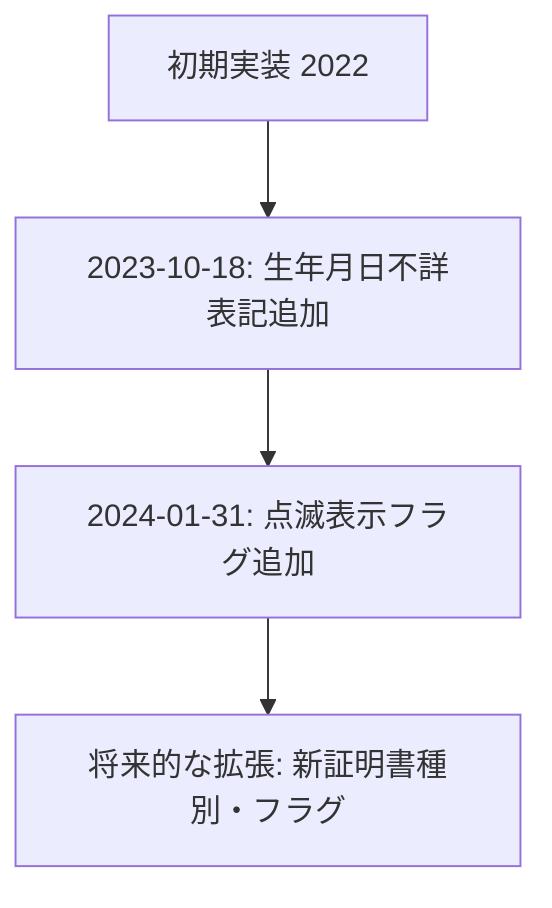

# JID000S005ViewRow クラス概要  

**パッケージ** `jp.co.jip.jid0000.app.helper`  
**継承** [`AbstractViewRow`](http://localhost:3000/projects/all/wiki?file_path=jp/co/jip/jid0000/app/helper/AbstractViewRow.java)  

このクラスは **「申請書発行」画面（日本人・外国人共通）** の行データを保持する *ViewRow* です。  
画面上の各項目（氏名、出生年月日、印鑑等）を文字列またはフラグとして保持し、`AbstractViewRow` が提供する `toViewValue()` を通して **表示用に null 安全な文字列** に変換します。  

---

## 1. 主要な責務  

| 項目 | 目的 | 備考 |
|------|------|------|
| **シーケンス情報** (`sikensuNo`, `sikensuChk`, `sikensuChkEnable`) | 行の識別・選択状態を管理 | チェックボックスの有効/無効も保持 |
| **個人情報** (`namekanjiTxt`, `seinengapi`, `seinengapiFushoHyoki`, `seibetsuTxt`, `zokugara_meiTxt`) | 氏名・生年月日・性別・続柄 | `seinengapiFushoHyoki` は「生年月日不詳」表記（2023 追加） |
| **証明書種別テキスト** (`DVTxt`, `jukiidoTxt`, `jyuukiTxt`, `gaikokuTxt`, `inkanTxt`) | 発行対象の証明書名・種別 | 例: DV、住基異動、住記、外国、印鑑 |
| **フラグ** (`dvredflg`, `jyuukiredflg`, `gaikokuredflg`, `inkanredflg`, `cardredflg`) | 各証明書の「対象/非対象」判定 | 0: 非対象、1: 対象 など、画面ロジックで使用 |
| **エラーコード** (`errzhuCode`, `errinkanCode`, `errforeignCode`) | 交付申請書のバリデーション結果 | 0: 正常、非 0: エラー種別 |
| **その他** (`cardNo`, `kojinNo`, `gaijiflg`, `binkFlg`) | カード番号・個人番号・外字未登録・点滅表示 | `binkFlg` は点滅表示有無（2024 追加） |

---

## 2. コードレベルの洞察  

### 2.1 データ保持と表示変換  

- すべての文字列フィールドは **`toViewValue(String)`**（スーパークラス実装）で取得。  
  - 目的: `null` → 空文字列 に統一し、画面側で `NullPointerException` を防止。  
- `boolean` フィールドはそのまま getter/setter を提供。  

### 2.2 変更履歴と拡張ポイント  

- **2023/10/18**: `seinengapiFushoHyoki` を追加し、生年月日が不明なケースに対応。  
- **2024/01/31**: `binkFlg` を追加し、画面上で点滅表示が必要か判定できるようにした。  

### 2.3 例外・エラーハンドリング  

| 例外種別 | 発生条件 | 対応 |
|----------|----------|------|
| `errzhuCode` | 住民票写し交付申請書のバリデーション失敗 | 画面でエラーメッセージ表示 |
| `errinkanCode` | 印鑑登録証明書交付申請書のバリデーション失敗 | 同上 |
| `errforeignCode` | 登録原票記載事項証明書交付請求書のバリデーション失敗 | 同上 |
| `gaijiflg` | 外字未登録 | UI で警告アイコン表示 |

※ 例外は **数値コード** で保持し、呼び出し側がコードマッピング表と照合してメッセージ化する設計。

---

## 3. 依存関係・相互作用  

- **`AbstractViewRow`**  
  - `toViewValue(String)` の実装を継承。  
  - 画面描画ロジック（JSP/Thymeleaf 等）から `get*()` 系メソッドで取得。  

- **画面コンポーネント**（例: `JID000S005View.jsp`）  
  - 各 `get*()` が直接 EL/タグライブラリにバインドされ、表示/入力制御に使用。  
  - `set*()` はコントローラ層（Spring MVC 等）でリクエストパラメータから設定。  

- **バリデーションロジック**（別クラス）  
  - `err*Code` 系フィールドにエラーコードを書き込み、`JID000S005ViewRow` を返却。  
  - UI はコードを参照し、エラーメッセージを表示。  

- **新規開発**（WizLIFE 2次開発）  
  - 追加された `seinengapiFushoHyoki` と `binkFlg` は、**新しい画面要件** に合わせてコントローラ/ビュー側で利用。  

---

## 4. 使用上の留意点  

1. **`toViewValue` の挙動**  
   - 文字列取得時は必ず `toViewValue` を通すこと。直接フィールドにアクセスすると `null` が返り、画面で例外になる可能性があります。  

2. **フラグの意味**  
   - `*redflg` 系は「対象か否か」を示す整数フラグです。0/1 以外の値が入るとロジックが不安定になるため、設定は **バリデーション層** で統一してください。  

3. **エラーコードの管理**  
   - エラーコードは **定数定義**（例: `ErrorCode.ERR_ZHU_INVALID`) として別クラスに集約し、`JID000S005ViewRow` には数値だけを保持させると保守性が向上します。  

4. **拡張時の命名規則**  
   - 既存フィールドは「種別+Txt」や「種別+Flg」の命名が統一されています。新規項目を追加する際はこのパターンに従うと、画面側のバインディングが容易です。  

---

## 5. 参考リンク  

- [`AbstractViewRow`](http://localhost:3000/projects/all/wiki?file_path=jp/co/jip/jid0000/app/helper/AbstractViewRow.java) – `toViewValue` の実装がここにあります。  
- `JID000S005View.jsp`（画面テンプレート） – 本クラスの getter が EL で利用される場所。  
- `ErrorCode` 定数クラス（プロジェクト内検索で `errzhuCode` 参照） – エラーコードの一覧。  

---  

*このドキュメントは新規開発者が **データ構造** と **画面ロジック** の接点を迅速に把握できるよう設計されています。*