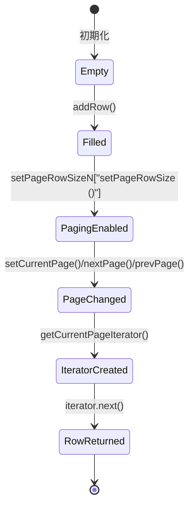
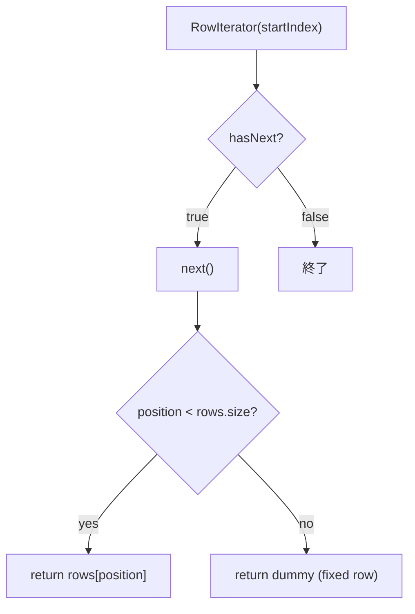

# 📄 **ListViewMultiPage**  
**パッケージ** `jp.co.jip.jid0000.app.helper`  
**実装クラス** `ListViewMultiPage` – `ListViewInterface`, `Serializable`

---

## 1. 概要概説
| 項目 | 内容 |
|------|------|
| **目的** | 行データを保持し、ページ単位で閲覧できるようにする *View* オブジェクト。ページングロジック・固定行（空行）サポートを内包。 |
| **システム内位置付け** | UI 層（一覧表示）で使用され、コントローラやサービスから `addRow`／`removeAll` でデータ投入し、ページ番号やイテレータで表示を取得する。 |
| **主要コンポーネント** | - `rows` : `Vector` に保持する全行<br>- `pageRowSize` : 1ページあたりの最大行数（0 ⇒ ページングなし）<br>- `currentPage` : 現在表示中のページ番号（1‑始まり）<br>- `rowClass` : 固定行（空行）として返すクラス |
| **公開 API** | `setPageRowSize`, `getPageRowSize`, `addRow`, `removeAll`, `setCurrentPage`, `nextPage`, `prevPage`, `getCurrentPageIterator`, `getPages` など |

---

## 2. コードレベルの洞察

### 2.1 データ構造と状態遷移


- **`rows`** はスレッドセーフな `Vector` を使用しているが、全体としては **スレッド非安全**（`currentPage` などは同期されていない）。  
- **`pageRowSize`** が `Integer.MAX_VALUE` のときは「ページングなし」扱い。`0` が外部に返却されるのは UI 側で「全件表示」フラグとして利用できる。  
- **`rowClass`** が設定されると、ページ末端で足りない行を **ダミーオブジェクト**（空行）で埋める。`newInstance()` によるインスタンス生成は **非推奨**（例外処理は `printStackTrace` のみ）。

### 2.2 主なメソッドのロジック

| メソッド | 役割・フロー |
|----------|--------------|
| `setFixedRowClass(Class)` | 固定行クラスを保持。`null` で固定行無効化。 |
| `isFixedRow()` | `rowClass` が設定されているか判定。 |
| `getMaxPage()` | `rows.size() / pageRowSize` の切り上げで総ページ数算出。 |
| `nextPage()` / `prevPage()` | `currentPage` を 1 増減。境界チェックで最終/先頭ページを超えない。 |
| `setCurrentPage(int)` | 指定ページが範囲外の場合は端に丸め、空データ時は `0` に設定。 |
| `isLastPage()` / `isTopPage()` | 現在ページが最終・先頭か判定。 |
| `setPageRowSize(int)` | `<1` は無制限（`MAX_VALUE`）に変換。 |
| `getCurrentPageIterator()` | `RowIterator` を生成。`currentPage==0` は空イテレータ。 |
| `getPages()` | 1〜`maxPage` の文字列リストを返す（ページナビ UI 用）。 |
| `addRow(Object)` | 行追加と同時に `currentPage` を 1 にリセット（最初のページへ）。 |
| `removeAll()` | 全行クリアし `currentPage` を 0 にリセット。 |
| `getRow(int)` / `getCurrentPageRow(int)` | インデックス指定で行取得。後者はページ内イテレータで走査。 |

### 2.3 `RowIterator` の内部動作



- **開始位置**: `startIndex`（ページ先頭インデックス）から `position = startIndex-1` で初期化。  
- **`hasNext` 判定**  
  1. `rows` がまだ残っているか → ページサイズ以内か。  
  2. 余りが無くても `fixedRow` が有効なら、空行を返すかどうかを計算。  
- **`next`** は `hasNext` が `true` のときだけ `position` をインクリメントし、実データか `dummy` を返す。  
- **`remove`** は現在位置がページ開始以降かつ行が存在すれば削除。  

### 2.4 設計上のトレードオフ・注意点

| 項目 | 内容 |
|------|------|
| **型安全** | `Vector` と `Iterator` が **ジェネリック未使用**。利用側でキャストが必要になるリスク。 |
| **スレッド安全性** | `Vector` はスレッド安全だが、`currentPage` や `pageRowSize` の変更は同期されていない。マルチスレッド環境では外部ロックが必要。 |
| **固定行実装** | `Class.newInstance()` は **非推奨**（例外は `printStackTrace` のみ）。Java 9+ では `getDeclaredConstructor().newInstance()` が推奨。 |
| **ページングロジック** | `setCurrentPage` で `page` が `0` になるケースは **空データ** のみ。UI が `0` ページを期待しない場合は注意。 |
| **パフォーマンス** | `getPages()` が毎回 `ArrayList` を生成。ページ数が極端に多い場合はオーバーヘッド。 |
| **イテレータの再利用** | `getCurrentPageIterator` は毎回新規インスタンスを返すため、同一ページで複数イテレータを取得すると状態が独立。 |

---

## 3. 依存関係・相互作用

| 参照先 | 種別 | 用途 |
|--------|------|------|
| `jp.co.jip.jid0000.domain.util.JIDDebug` | ロギングユーティリティ | `RowIterator` の例外出力に使用。 |
| `ListViewInterface` | インターフェース | 本クラスが実装すべきメソッド群（本ファイル内では未使用）。 |
| `java.io.Serializable` | マーカーインターフェース | セッション保存や遠隔呼び出しでオブジェクトをシリアライズ可能にする。 |
| `java.util.Vector` / `ArrayList` / `Collection` | コレクション | 行データ保持・ページリスト生成に使用。 |

> **リンク例**（他クラスが存在すれば）  
> - [`ListViewInterface`](http://localhost:3000/projects/all/wiki?file_path=path/to/ListViewInterface.java)  
> - [`JIDDebug`](http://localhost:3000/projects/all/wiki?file_path=path/to/JIDDebug.java)

---

## 4. 利用シナリオ例（擬似コード）

```java
ListViewMultiPage view = new ListViewMultiPage();
view.setPageRowSize(20);               // 1ページ20行
view.setFixedRowClass(EmptyRow.class); // 空行クラスを設定（最終ページの埋め草）

// データ投入
for (Object data : dataList) {
    view.addRow(data);
}

// ページング操作
view.setCurrentPage(1);
Iterator it = view.getCurrentPageIterator();
while (it.hasNext()) {
    Object row = it.next(); // UI へ描画
}

// 次ページへ
view.nextPage();
```

---

## 5. 今後の改善提案

1. **ジェネリクス導入**  
   `Vector<T>`、`Iterator<T>` に変更し、型安全を確保。  
2. **スレッド安全化**  
   `synchronized` または `ReentrantLock` で `currentPage` 系統の変更を保護。  
3. **固定行インスタンス生成のリファクタリング**  
   `rowClass.getDeclaredConstructor().newInstance()` に置き換え、例外を適切にハンドリング。  
4. **ページリストのキャッシュ**  
   `maxPage` が変わらない限り `getPages()` の結果を保持し、再生成コストを削減。  
5. **テストカバレッジ拡充**  
   境界条件（空データ、ページサイズ 0、固定行有無）を網羅する単体テストを追加。  

--- 

*このドキュメントは新規開発者が `ListViewMultiPage` の設計意図と実装詳細を迅速に把握し、拡張やバグ修正に取り組むための指針となります。*