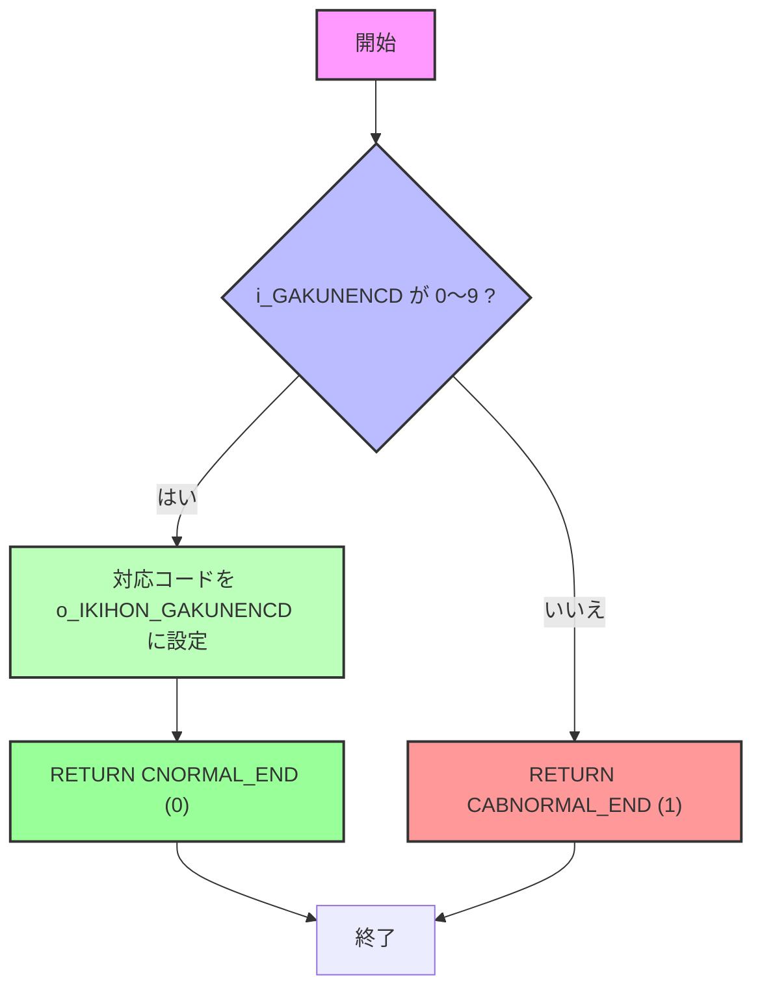

# GKBFKGKNCDHK.sql – 学年コード変換関数

**ファイルパス**  
[GKBFKGKNCDHK](http://localhost:3000/projects/all/wiki?file_path=D:/code-wiki/projects/all/sample_all/sql/GKBFKGKNCDHK.SQL)

---

## 1. 概要概説

| 項目 | 内容 |
|------|------|
| **業務名** | GKB（教育） |
| **PG名** | GKBFKGKNCDHK |
| **機能** | 学齢簿（旧システム）から取得した学年コードを、基本データリストで使用するコードへ変換する |
| **入力** | `i_GAKUNENCD`（NUMBER） – 学齢簿側の学年コード |
| **出力** | `o_IKIHON_GAKUNENCD`（NVARCHAR2） – 基本データリスト側の学年コード |
| **戻り値** | `0` 正常終了、`1` 異常終了 |
| **作成者 / 作成日** | ZCZL.WANGQIWEI / 2024‑06‑03 |
| **バージョン** | 0.3.000.001（2024/09/29 仕様変更） |

> **この関数が新しい開発者にとって意味すること**  
> - 既存の学年コード体系を統一し、他のバッチやレポートが期待するコード（`E3`, `P1` … `J3`）で処理できるようにする入口。  
> - 変更履歴から、以前は学齢簿の「学校区分コード」(`i_IGAKURUI_GAKUNENCD`) を使用していたが、2024/09/29 の仕様変更で「学年コード」(`i_GAKUNENCD`) に切り替わったことが分かる。  

---

## 2. コードレベルの洞察

### 2.1 関数シグネチャ

```sql
CREATE OR REPLACE FUNCTION GKBFKGKNCDHK(
    i_GAKUNENCD      IN  NUMBER,
    o_IKIHON_GAKUNENCD OUT NVARCHAR2
) RETURN NUMBER
```

- **入力パラメータ**は `IN`、**出力パラメータ**は `OUT` として定義。  
- 戻り値はステータスコード（`0` 正常、`1` 異常）で、呼び出し側はこの値で例外処理を判断できる。

### 2.2 定数

| 定数 | 値 | 意味 |
|------|----|------|
| `CNORMAL_END`   | `0` | 正常終了 |
| `CABNORMAL_END` | `1` | 異常終了 |

### 2.3 主処理フロー

1. **CASE 文で入力コードをマッピング**  
   - `i_GAKUNENCD` が 0〜9 のいずれかの場合、対応する文字列コード (`E3`, `P1` … `J3`) を `o_IKIHON_GAKUNENCD` に設定。  
   - それ以外（未定義コード）では `CABNORMAL_END` を返して終了。

2. **正常終了**  
   - マッピングが成功したら `CNORMAL_END` を返す。

3. **例外ハンドリング**  
   - `WHEN OTHERS THEN` で捕捉し、必ず `CABNORMAL_END` を返す。

#### フローチャート（Mermaid）



### 2.4 変更履歴から読み取れる設計上の判断

| 日付 | 変更者 | 内容 | 背景・影響 |
|------|--------|------|------------|
| 2024/09/29 | ZCZL.yangshuai | `i_IGAKURUI_GAKUNENCD` 系のコードをコメントアウトし、`i_GAKUNENCD` に切替 | 仕様 IT_GKB_00073 に対応し、入力項目が学年コードに統一された。既存呼び出し側はパラメータ名だけでなく、渡す値の意味も合わせて修正が必要。 |
| 2024/09/29 | ZCZL.yangshuai | `ELSE` で `CABNORMAL_END` を返すロジックを明示化 | 未定義コードが来た場合の安全策。呼び出し側はステータスコードでエラーハンドリングを実装すべき。 |

---

## 3. 依存関係・相互作用

| 参照先・呼び出し元 | 目的・関係 |
|-------------------|------------|
| **学齢簿テーブル**（例: `T_GAKUEN`） | 学年コード (`i_GAKUNENCD`) を取得し本関数へ渡す。 |
| **基本データリストテーブル**（例: `M_GAKUNEN`） | 本関数が返す文字列コード (`o_IKIHON_GAKUNENCD`) がキーとして使用され、他のバッチやレポートが参照。 |
| **バッチ/ETL ジョブ**（例: `BATCH_GAKUNEN_CONV`） | 本関数を呼び出し、学年コード変換を一括処理。 |
| **エラーログテーブル**（例: `LOG_ERROR`） | `RETURN CABNORMAL_END` が検知された場合、ジョブ側でエラーログへ記録することが想定される。 |

> **注意点**  
> - 変更履歴にある旧パラメータ `i_IGAKURUI_GAKUNENCD` はコメントアウトされているが、過去のリリースや他モジュールに残っている可能性がある。検索して残存コードがあればリファクタリングが必要。  
> - 戻り値はステータスコードだけで、例外情報は返さない。呼び出し側で `SQLCODE` や `SQLERRM` を取得できない点に留意し、必要なら追加のエラーログ出力を実装すること。

---

## 4. 今後の保守・拡張指針

1. **コードマッピングの外部化**  
   - 現在は CASE 文でハードコーディング。学年コードが増える／変更される可能性がある場合、マッピングテーブル（例: `M_GAKUNEN_MAP`）を作成し、SQL で `SELECT` して取得する形にリファクタリングすると保守性が向上。

2. **入力バリデーションの強化**  
   - 現在は `ELSE` で異常終了。入力が `NULL` の場合も同様に扱われるが、明示的に `NULL` チェックを入れると意図が分かりやすくなる。

3. **テストケースの整備**  
   - 0〜9 の全パターンと、未定義コード（例: 10, -1, NULL）に対する期待結果を自動テスト（UT）でカバーする。

4. **ドキュメントの一元管理**  
   - 本 Wiki ページをコードリポジトリの `README.md` か `docs/` 配下にコピーし、CI 時に自動生成・更新できる仕組みを検討。

---

*以上が GKBFKGKNCDHK 関数の技術ドキュメントです。新しくこのモジュールを担当する方は、上記「概要」「コードフロー」「依存関係」を把握したうえで、変更履歴に注意しながら保守・拡張を進めてください。*