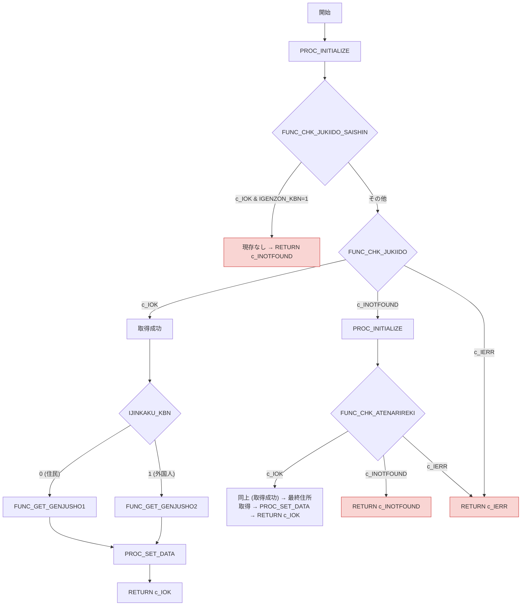

# GKBFKGZSHNT.sql 技術ドキュメント  

**対象読者**：このモジュールを初めて担当する開発者  

**ファイルパス**：`D:/code-wiki/projects/all/sample_all/sql/GKBFKGZSHNT.SQL`  

---  

## 1. 概要概説  

| 項目 | 内容 |
|------|------|
| **業務名** | GKB（教育） |
| **サブルーチン名** | `GKBFKGZSHNT`（現存者判定） |
| **主目的** | 指定した個人番号と基準日（8 桁西暦）に対し、対象者がその時点で「現存」かどうかを判定し、住所・氏名・属性等の詳細情報を取得して呼び出し元へ返す |
| **呼び出し形態** | PL/SQL 関数 → `RETURN PLS_INTEGER`（ステータスコード） と多数の `OUT` パラメータで結果を返す |
| **主要ステータスコード** | `0` 正常 (`c_IOK`)    `1` 該当なし (`c_INOTFOUND`)   `9` その他エラー (`c_IERR`) |
| **主要アウトプット** | 現存区分、人格区分、郵便番号・住所・氏名・生年月日・性別・行政区コード・中学校区・小学校区・電話番号・算定団体情報・カスタムバーコード  |

> **なぜこの関数が必要か**  
> - 教育関連のレポートや通知は、対象者が「現存」かつ最新の住所情報が必要。  
> - 住民・外国人別に最終住所取得ロジックが分かれているため、統一的に判定・取得できるようにサブルーチン化した。  

---

## 2. コードレベルの洞察  

### 2.1 定数・変数  

| 定数 | 意味 |
|------|------|
| `c_IOK`      | 正常終了 |
| `c_INOTFOUND`| データ未取得（対象者が現存しない、または履歴が無い） |
| `c_IERR`     | 例外系エラー |

変数は主に **OUT** パラメータへマッピングするためのローカルコピーとして使用。  

### 2.2 補助関数・手続き  

| 名称 | 種別 | 目的 | リンク |
|------|------|------|--------|
| `FUNC_JICHINAME` | 関数 | 旧自治体名称取得（算定団体コードから） | [FUNC_JICHINAME](http://localhost:3000/projects/all/wiki?file_path=D:/code-wiki/projects/all/sample_all/sql/GKBFKGZSHNT.SQL) |
| `PROC_INITIALIZE` | 手続き | ローカル変数をデフォルト値にリセット | [PROC_INITIALIZE](http://localhost:3000/projects/all/wiki?file_path=D:/code-wiki/projects/all/sample_all/sql/GKBFKGZSHNT.SQL) |
| `PROC_SET_DATA` | 手続き | ローカル変数の内容を **OUT** パラメータへ転送 | [PROC_SET_DATA](http://localhost:3000/projects/all/wiki?file_path=D:/code-wiki/projects/all/sample_all/sql/GKBFKGZSHNT.SQL) |
| `FUNC_CHK_JUKIIDO_SAISHIN` | 関数 | 住記異動マスタ（最新）で「喪失」かどうかを即座に判定 | [FUNC_CHK_JUKIIDO_SAISHIN](http://localhost:3000/projects/all/wiki?file_path=D:/code-wiki/projects/all/sample_all/sql/GKBFKGZSHNT.SQL) |
| `FUNC_CHK_JUKIIDO` | 関数 | 住記異動テーブルから基準日時点の情報を取得 | [FUNC_CHK_JUKIIDO](http://localhost:3000/projects/all/wiki?file_path=D:/code-wiki/projects/all/sample_all/sql/GKBFKGZSHNT.SQL) |
| `FUNC_CHK_ATENARIREKI` | 関数 | 宛名履歴テーブルから基準日時点の情報を取得 | [FUNC_CHK_ATENARIREKI](http://localhost:3000/projects/all/wiki?file_path=D:/code-wiki/projects/all/sample_all/sql/GKBFKGZSHNT.SQL) |
| `FUNC_GET_GENJUSHO1` | 関数 | 住民（日本人）向けに最終住所を取得 | [FUNC_GET_GENJUSHO1](http://localhost:3000/projects/all/wiki?file_path=D:/code-wiki/projects/all/sample_all/sql/GKBFKGZSHNT.SQL) |
| `FUNC_GET_GENJUSHO2` | 関数 | 外国人向けに最終住所を取得 | [FUNC_GET_GENJUSHO2](http://localhost:3000/projects/all/wiki?file_path=D:/code-wiki/projects/all/sample_all/sql/GKBFKGZSHNT.SQL) |

### 2.3 メインロジック（`BEGIN … END`）  

1. **初期化** → `PROC_INITIALIZE`  
2. **最新住記異動で喪失チェック**  
   - `FUNC_CHK_JUKIIDO_SAISHIN` が `c_IOK` かつ `IGENZON_KBN = 1` → 直ちに `c_INOTFOUND` を返す（現存なし）  
3. **住記異動テーブル検索** → `FUNC_CHK_JUKIIDO`  
   - 成功 (`c_IOK`) → 取得データを元に最終住所取得（住民/外国人別） → `PROC_SET_DATA` → 正常終了  
   - 未取得 (`c_INOTFOUND`) → **宛名履歴検索**へフォールバック  
4. **宛名履歴検索** → `FUNC_CHK_ATENARIREKI`  
   - 成功 → 同様に最終住所取得 → `PROC_SET_DATA` → 正常終了  
   - 未取得 → `c_INOTFOUND` を返す（対象者不在）  
5. **例外系エラー** → いずれのステップでも `c_IERR` が返れば即座にエラーコードを返す  

#### フローチャート（メイン処理）

### 2.4 例外処理  

| 例外箇所 | 捕捉対象 | 戻り値 |
|----------|----------|--------|
| 各 `SELECT` 文 | `NO_DATA_FOUND` → `c_INOTFOUND`   `OTHERS` → `c_IERR` | それぞれのステータスコード |
| メインブロック全体 | `OTHERS` → `c_IERR` | `c_IERR` |

---

## 3. 依存関係・外部呼び出し  

| 依存先 | 種類 | 用途 |
|--------|------|------|
| `GAAPK0030` パッケージ | 関数群 (`FJICHINAME`, `FGYOSEIKUMEI`, `FCHUGAKUMEI`, `FSHOGAKUMEI`) | 旧自治体名・行政区・中学校・小学校名称取得 |
| `GAAPK0010` パッケージ | `FCUSTOM_BC` | カスタムバーコード生成 |
| テーブル `GABTJUKIIDO`, `GABTJUKIJUSHO`, `GABTATENAKIHON`, `GABTATENARIREKI` | データソース | 住民・外国人の住所・属性情報、履歴情報 |
| `GABTJUKIIDO` のカラム `JUMIN_NARU`, `JUMIN_NAKUNARU` | 住民・外国人の在籍/喪失フラグ | 現存判定ロジックの根拠 |

> **注意点**  
> - `FUNC_CHK_JUKIIDO_SAISHIN` は「最新」住記異動マスタだけを見て喪失かどうかを判定するため、**データが古い場合は誤判定のリスク** がある。  
> - `FUNC_GET_GENJUSHO2` は外国人向けに「宛名履歴」から最終住所を取得するが、`GENZON_KBN = 0`（現存）であることが前提。  

---

## 4. 拡張・保守の指針  

| 項目 | 推奨アクション |
|------|----------------|
| **新しい属性追加** | 既存の `PROC_SET_DATA` に追加し、対応する `OUT` パラメータとローカル変数を増やす。 |
| **テーブル構造変更** | `FUNC_CHK_JUKIIDO*` 系の `SELECT` 文を修正し、エイリアスやカラム名の変更に追従。 |
| **エラーハンドリング統一** | 現在は各関数で個別に `NO_DATA_FOUND`/`OTHERS` を捕捉しているが、共通例外ハンドラを作成すると保守性向上。 |
| **パフォーマンス改善** | `FUNC_CHK_JUKIIDO` と `FUNC_CHK_ATENARIREKI` の `SELECT` にインデックスが適切か確認。特に `KOJIN_NO` と日付条件の組み合わせは必須。 |
| **テストケース** | - 現存者（住民）   - 現存者（外国人）   - 喪失者（住記異動最新で判定）   - 履歴のみ存在（宛名履歴で取得）   - データなし（`c_INOTFOUND`）   - DB例外シナリオ（`c_IERR`） |

---

## 5. まとめ  

`GKBFKGZSHNT` は教育システムにおける「対象者が基準日現在で現存しているか」を判定し、必要な属性情報を一括で取得できる **汎用的なサブルーチン** です。  
- **フロー**：最新住記異動 → 住記異動テーブル → 宛名履歴 → 最終住所取得 → 結果返却  
- **設計意図**：データソースが分散（住記、宛名履歴）していても、呼び出し側は単一関数で完結できるようにした。  
- **保守ポイント**：テーブル・パッケージ依存が多いので、スキーマ変更時は依存先すべてをレビューすること。  

以上が新規担当者向けの技術ドキュメントです。質問や不明点があれば、該当関数のリンク先コードを直接確認してください。  