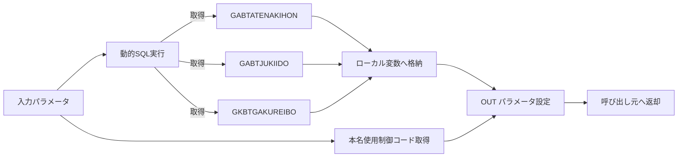

# 📄 GKBFKHMCTRL 関数 – 技術ドキュメント  
**ファイルパス**: `D:\code-wiki\projects\all\sample_all\sql\GKBFKHMCTRL.SQL`  
**Wiki リンク**: [GKBFKHMCTRL 関数](http://localhost:3000/projects/all/wiki?file_path=D:/code-wiki/projects/all/sample_all/sql/GKBFKHMCTRL.SQL)

---  

## 1. 概要 (What & Why)

| 項目 | 内容 |
|------|------|
| **業務名** | GKB_教育 |
| **PG名** | GKBFKHMCTRL |
| **機能** | 受取人（児童・保護者）の氏名・生年月日を、**本名使用制御** と **システム制御設定** に応じて取得し、呼び出し元に `OUT` パラメータで返す。 |
| **呼び出し側** | 各帳票生成プロシージャ／レポートエンジン。帳票 ID (`i_sCHOHYOID`) と宛名番号 (`i_nKOJIN_NO`) を渡すだけで、氏名・生年月日の表示ロジックが集中管理できる。 |
| **主な入力** | <ul><li>`i_nKOJIN_NO` – 宛名番号（児童または保護者）</li><li>`i_sCHOHYOID` – 帳票 ID</li><li>`i_nHOGOSYA_KAN` – 保護者制御フラグ (0: 児童, 1: 保護者)</li><li>`i_nSYS_KAN` – システム制御設定 (0‑12 のコード)</li><li>`i_nRIREKI_RENBAN` – 履歴連番（オプション）</li></ul> |
| **主な出力** | <ul><li>`o_sSHIMEIKANA` – 氏名カナ</li><li>`o_sSHIMEI` – 氏名漢字</li><li>`o_sBIRTHDAY` – 生年月日（西暦 or 和暦）</li></ul> |
| **変更履歴** | 2024‑2025 年に多数のバグ修正・仕様追加が行われている（例: 本名使用制御コード追加、外部テーブル結合方式変更、日付フォーマット改修）。 |

> **新規開発者へのメッセージ**  
> この関数は「**氏名・生年月日の取得ロジック**」を一元化しているため、帳票側で個別にロジックを書かずに済む。変更が必要な場合は **システム制御設定** と **本名使用制御管理** のテーブル (`GKBTSHIMEIJKN`) のコードを追加・変更し、ロジック分岐はこの関数内で完結させることが推奨される。

---

## 2. コードレベルの洞察  

### 2‑1. 主要構造

```plsql
CREATE OR REPLACE FUNCTION GKBFKHMCTRL(
    i_nKOJIN_NO      IN NUMBER,
    i_sCHOHYOID      IN NVARCHAR2,
    i_nHOGOSYA_KAN   IN NUMBER,
    i_nSYS_KAN       IN NUMBER,
    o_sSHIMEIKANA    OUT NVARCHAR2,
    o_sSHIMEI        OUT NVARCHAR2,
    o_sBIRTHDAY      OUT NVARCHAR2,
    i_nRIREKI_RENBAN IN NUMBER DEFAULT 0
) RETURN PLS_INTEGER
```

- **戻り値**: `0` → 正常、`1` 以上 → エラー (SQLCODE が格納)。  
- **例外処理**は `WHEN OTHERS THEN` のみで、エラーコードを `g_nRTN` に格納して返す。

### 2‑2. 変数・テーブルマッピング

| 変数 | 参照テーブル | カラム | 用途 |
|------|--------------|--------|------|
| `g_rSHIMEI_KANA` | `GABTATENAKIHON` | `SHIMEI_KANA` | 児童・保護者の **氏名カナ**（基本） |
| `g_rSHIMEI_KANJI` | `GABTATENAKIHON` | `SHIMEI_KANJI` | **氏名漢字**（基本） |
| `g_rHONMYO_KANA` | `GABTATENAKIHON` | `HONMYO_KANA` | **本名カナ**（本名使用制御が有効な場合） |
| `g_rHONMYO_KANJI` | `GABTATENAKIHON` | `HONMYO_KANJI` | **本名漢字** |
| `g_rTSUSHOMEI_KANA_KIHON` | `GABTATENAKIHON` | `TSUSHOMEI_KANA` | **通称名カナ**（基本） |
| `g_rTSUSHOMEI_KANJI_KIHON` | `GABTATENAKIHON` | `TSUSHOMEI_KANJI` | **通称名漢字** |
| `g_rTSUSHOMEI_KANA_KIIDO` | `GABTJUKIIDO` | `TSUSHOMEI_KANA` | 住基異動の **通称名カナ** |
| `g_rTSUSHOMEI_KANJI_KIIDO` | `GABTJUKIIDO` | `TSUSHOMEI_KANJI` | 住基異動の **通称名漢字** |
| `g_rTSUSHOMEI_KANA_REIBO` | `GKBTGAKUREIBO` | `TSUSHOMEI_KANA` | 学齢簿の **通称名カナ** |
| `g_rTSUSHOMEI_KANJI_REIBO` | `GKBTGAKUREIBO` | `TSUSHOMEI_KANJI` | 学齢簿の **通称名漢字** |
| `g_rHOGOSYA_TSUSHOMEI_KANA_REIBO` | `GKBTGAKUREIBO` | `HOGOSYA_TSUSHOMEI_KANA` | 学齢簿の **保護者通称名カナ** |
| `g_rHOGOSYA_TSUSHOMEI_KANJI_REIBO` | `GKBTGAKUREIBO` | `HOGOSYA_TSUSHOMEI_KANJI` | 学齢簿の **保護者通称名漢字** |
| `g_rSEINENGAPI` | - | - | 西暦生年月日（文字列） |
| `g_rWAREKI_SEINENGAPI` | - | - | 和暦生年月日（文字列） |
| `g_nHONMYO_KAN` | `GKBTSHIMEIJKN` | `NAIYO_CD` | 本名使用制御設定コード（0＝未設定） |
| `g_rJINKAKU_KBN` | `GABTATENAKIHON` | `JINKAKU_KBN` | 人格区分 (0=日本人, 1=外国人) |

### 2‑3. 主なロジックフロー  

1. **動的 SQL の組み立て**  
   - `i_nHOGOSYA_KAN` が `0` か `1` で、結合条件 (`(+)` 外部結合) が変わる。  
   - `i_nRIREKI_RENBAN` が `0` かどうかで、学齢簿の最新履歴取得条件が分岐。  

2. **データ取得** (`FUNC_MAIN`)  
   - カーソルで 1 行取得 → 各カラムをローカル変数へマッピング。  
   - 生年月日のフォーマットは外部パッケージ `KKAPK0020.FDAYEDIT20` を使用し、全角へ変換 (`TO_MULTI_BYTE`)。  

3. **本名使用制御コード取得**  
   ```sql
   SELECT NAIYO_CD INTO g_NAIYO_CD
   FROM GKBTSHIMEIJKN
   WHERE KOJIN_NO = i_nKOJIN_NO
     AND CHOHYO_ID = i_sCHOHYOID;
   ```
   - 取得失敗時は `g_nHONMYO_KAN := 0`（未設定）にフォールバック。  

4. **OUT パラメータ設定** (`FUNC_OUT`)  
   - **第一段階**: `g_nHONMYO_KAN = 0`（本名制御未設定） → `i_nSYS_KAN` の値に応じた分岐（0〜12）。  
   - **第二段階**: `g_nHONMYO_KAN <> 0`（本名制御設定あり） → `g_nHONMYO_KAN` のコード（11,12,21,22,31,32,41,42,51,52,61,62）に応じた分岐。  
   - 各分岐は **氏名カナ・氏名漢字・生年月日** の組み合わせを決定し、`o_sSHIMEIKANA`, `o_sSHIMEI`, `o_sBIRTHDAY` に代入。  

### 2‑4. 複雑な分岐の可視化  

```mermaid
flowchart TD
    A["開始"] --> B["本名使用制御設定(g_nHONMYO_KAN)は0か"]
    B -->|"0"| C["システム制御設定(i_nSYS_KAN)で分岐"]
    B -->|"≠0"| D["本名使用制御コード(g_nHONMYO_KAN)で分岐"]


    %% システム制御設定分岐
    C --> C0{"i_nSYS_KAN = 0"}
    C --> C1{"i_nSYS_KAN = 1"}
    C --> C2{"i_nSYS_KAN = 2"}
    C --> C3{"i_nSYS_KAN = 3"}
    C --> C4{"i_nSYS_KAN = 4"}
    C --> C5{"i_nSYS_KAN = 5"}
    C --> C6{"i_nSYS_KAN = 6"}
    C --> C7{"i_nSYS_KAN = 7"}
    C --> C8{"i_nSYS_KAN = 8"}
    C --> C9{"i_nSYS_KAN = 9"}
    C --> C10{"i_nSYS_KAN = 10"}
    C --> C11{"i_nSYS_KAN = 11"}
    C --> C12{"i_nSYS_KAN = 12"}


    %% 本名使用制御コード分岐
    D --> D11{"g_nHONMYO_KAN = 11"}
    D --> D12{"g_nHONMYO_KAN = 12"}
    D --> D21{"g_nHONMYO_KAN = 21"}
    D --> D22{"g_nHONMYO_KAN = 22"}
    D --> D31{"g_nHONMYO_KAN = 31"}
    D --> D32{"g_nHONMYO_KAN = 32"}
    D --> D41{"g_nHONMYO_KAN = 41"}
    D --> D42{"g_nHONMYO_KAN = 42"}
    D --> D51{"g_nHONMYO_KAN = 51"}
    D --> D52{"g_nHONMYO_KAN = 52"}
    D --> D61{"g_nHONMYO_KAN = 61"}
    D --> D62{"g_nHONMYO_KAN = 62"}


    %% 例: 0系統制御 → 通称名＋和暦/西暦
    C0 -->|"人格区分=1"| O0A["氏名=通称カナ/漢字, 生年月日=西暦"]
    C0 -->|"人格区分=0"| O0B["氏名=通称カナ/漢字, 生年月日=和暦"]


    %% 例: 本名使用制御 31 (外国人・和暦)
    D31 -->|"人格区分=1"| O31A["氏名=アルファベット, 生年月日=和暦"]
    D31 -->|"人格区分=0"| O31B["氏名=氏名カナ/漢字, 生年月日=和暦"]


    %% 省略: 各分岐は同様に「氏名カナ」「氏名漢字」「生年月日」へ代入
    O0A & O0B & O31A & O31B --> END["終了"]
```



### 2‑5. 例外処理

| 例外 | 発生条件 | 処理 |
|------|----------|------|
| `g_eOTHERS` (汎用例外) | 変数初期化失敗、`FUNC_MAIN`/`FUNC_OUT` が非 0 を返したとき | `g_nRTN` に `1` を設定し、最終的に `RETURN g_nRTN` |
| `WHEN OTHERS` (SQL エラー) | 任意の SQL 実行失敗、NULL 参照等 | `g_nRTN := SQLCODE` → 呼び出し側でエラーコード確認 |

---

## 3. 依存関係・関係図  

### 3‑1. 参照テーブル・ビュー

| テーブル | 主キー | 主なカラム | 用途 |
|----------|--------|------------|------|
| `GABTATENAKIHON` | `KOJIN_NO` | `SHIMEI_KANA`, `SHIMEI_KANJI`, `HONMYO_KANA`, `HONMYO_KANJI`, `TSUSHOMEI_KANA`, `TSUSHOMEI_KANJI`, `JINKAKU_KBN`, `SEINENGAPI` | **児童・保護者の基本情報**（氏名・生年月日） |
| `GABTJUKIIDO` | `KOJIN_NO` | `TSUSHOMEI_KANA`, `TSUSHOMEI_KANJI` | **住基異動** の通称名（保護者制御時に使用） |
| `GKBTGAKUREIBO` | `KOJIN_NO` | `TSUSHOMEI_KANA`, `TSUSHOMEI_KANJI`, `HOGOSYA_TSUSHOMEI_KANA`, `HOGOSYA_TSUSHOMEI_KANJI`, `SAISHIN_KBN`, `RIREKI_RENBAN` | **学齢簿** の通称名・保護者情報 |
| `GKBTSHIMEIJKN` | (`KOJIN_NO`, `CHOHYO_ID`) | `NAIYO_CD` | 本名使用制御管理テーブル（設定コード） |
| `GKAPK00020` / `KKAPK0020` | - | - | 日付フォーマット変換ユーティリティ（外部パッケージ） |

### 3‑2. 関数・パッケージ呼び出し

| 呼び出し先 | 種別 | 目的 |
|-----------|------|------|
| `KKAPK0020.FDAYEDIT20` | パッケージ関数 | 生年月日文字列を「YYYY/MM/DD」形式に整形し、全角変換 |
| `TO_MULTI_BYTE` | ビルトイン関数 (カスタム?) | 文字列を全角に変換（帳票表示用） |

### 3‑3. データフロー図（簡易）



---

## 4. メンテナンス・拡張ポイント  

| 項目 | 現状 | 推奨アクション |
|------|------|----------------|
| **本名使用制御コード** | 0, 11, 12, 21, 22, 31, 32, 41, 42, 51, 52, 61, 62 がハードコーディング | 新コード追加時は `FUNC_OUT` の `ELSIF g_nHONMYO_KAN = X` ブロックにロジックを追記。テストケースを必ず追加。 |
| **システム制御設定** | 0〜12 の分岐が長大 | 将来的に `CASE` 文にリファクタリングし、分岐ロジックをサブプロシージャに切り出すと可読性向上。 |
| **外部結合方式** (`(+)`) | Oracle の旧式外部結合を使用 | Oracle 12c 以降は ANSI JOIN に置き換えると保守性が上がる。 |
| **日付フォーマット** | `KKAPK0020.FDAYEDIT20` に依存 | 日付フォーマットが変更になる場合は、パッケージだけ差し替えれば影響は最小。 |
| **例外ハンドリング** | `WHEN OTHERS` のみ | 具体的な例外（`NO_DATA_FOUND`, `TOO_MANY_ROWS`）を捕捉し、ログ出力やエラーメッセージを充実させるとデバッグが楽になる。 |
| **テスト** | 変更履歴が多数あるが、単体テストコードは見当たらない | PL/SQL ユニットテストフレーム（UTPLSQL 等）で `i_nSYS_KAN` と `g_nHONMYO_KAN` の全組み合わせを網羅するテストケースを作成。 |

---

## 5. まとめ  

- **GKBFKHMCTRL** は帳票生成に必要な「氏名・生年月日」取得ロジックを集中管理するコア関数。  
- 入力フラグ (`i_nHOGOSYA_KAN`, `i_nSYS_KAN`) と **本名使用制御コード** (`g_nHONMYO_KAN`) によって、**13 種類以上**の出力パターンが生成される。  
- 変更が頻繁に行われているため、**分岐ロジックの追加・修正は慎重に**、テストケースとコメントを必ず更新すること。  
- 将来的なリファクタリング候補は **CASE 文化、ANSI JOIN への置換、例外ハンドリングの細分化**。  

> **次のステップ**  
> 1. 既存の帳票で使用されている `i_nSYS_KAN` と `g_nHONMYO_KAN` の組み合わせを一覧化。  
> 2. 新しい本名使用制御コードが必要になったら、`FUNC_OUT` にロジックを追加し、UTPLSQL でテストを作成。  
> 3. 可能であれば、SQL の外部結合を ANSI JOIN に書き換えてコードベースをモダン化。  