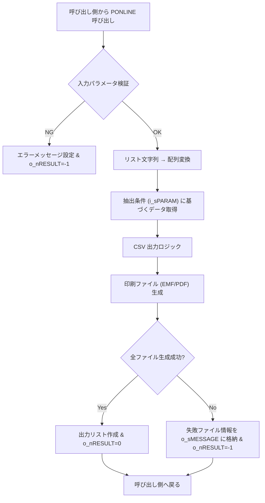
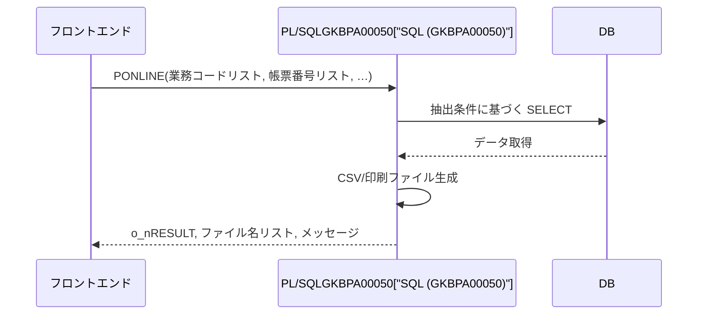

# GKBPA00050 パッケージ概要  

**ファイル**: [GKBPA00050.SQL](http://localhost:3000/projects/all/wiki?file_path=D:/code-wiki/projects/all/sample_all/sql/GKBPA00050.SQL)  

## 1. 概要概説
このパッケージは **GKB（教育）サブシステム** の「就学時健康診断結果通知書即時」機能を提供します。  
主目的は、オンラインでパラメータを取得し、対象学生の健康診断結果通知書を **CSV** と **印刷用 EMF/PDF** の形で一括生成することです。  

- **呼び出し側**: 業務フロントエンド（Web/端末）から、業務コード・帳票番号・抽出条件等をリスト形式で渡す。  
- **戻り値**: 生成結果（成功/失敗）と、生成されたファイル名・件数、エラーメッセージを出力パラメータで返す。  

> **新規開発者が最初に抱く疑問**  
> - 「リストはどのような文字列形式で渡すのか？」  
> - 「CSV と印刷ファイルはどこに保存され、呼び出し側はどう取得するのか？」  
> - 「エラーハンドリングはどこで行われ、例外はどう伝搬するか？」  

本ドキュメントでは、上記疑問に対する設計意図と実装上の留意点を整理します。

---

## 2. コードレベルの洞察

### 2.1 パッケージ構成
```
CREATE OR REPLACE PACKAGE GKBPA00050
IS
    PROCEDURE PONLINE( ... );
END GKBPA00050;
/
```
- **パッケージ**: PL/SQL の名前空間。将来的に同サブシステム内で共通ロジックを追加しやすい設計。  
- **外部関数**: `PONLINE` は外部（呼び出し側）から直接呼び出すことを想定した手続き。

### 2.2 PONLINE 手続きのシグネチャ

| パラメータ | 方向 | 型 | 目的 |
|------------|------|----|------|
| `i_sGYOUMUCODE_LIST` | IN | NVARCHAR2 | 業務コード（カンマ区切りリスト） |
| `i_sCHOHYONUM_LIST` | IN | NVARCHAR2 | 帳票番号リスト |
| `i_sCHOHYOID_LIST` | IN | NVARCHAR2 | 帳票IDリスト |
| `i_sPARAM` | IN | NVARCHAR2 | 抽出条件（JSON 文字列等） |
| `i_sBUNSHONUM_LIST` | IN | NVARCHAR2 | 文書番号情報リスト |
| `i_sTANTOCODE` | IN | NVARCHAR2 | ログイン担当者コード |
| `i_sWSNUM` | IN | NVARCHAR2 | ログイン端末番号 |
| `o_nRESULT` | OUT | NUMBER | 0=全成功、-1=異常終了 |
| `o_sCSVCNT_LIST` | OUT | NVARCHAR2 | 生成した CSV 件数リスト |
| `o_sCSVFILENAME_LIST` | OUT | NVARCHAR2 | 生成した CSV ファイル名リスト |
| `o_sPRTFILENAME_LIST` | OUT | NVARCHAR2 | 生成した印刷ファイル名リスト |
| `o_sMESSAGE` | OUT | NVARCHAR2 | エラーメッセージ（詳細） |

#### 2.2.1 入力リスト形式
- **実装上の想定**: カンマ区切り文字列 (`'A001,B002,C003'`) もしくは `|` 区切り等、呼び出し側と合意したフォーマット。  
- **変換処理**: 手続き内部で `REGEXP_SUBSTR` 等を用いて配列化し、バッチ処理に利用。

#### 2.2.2 出力リスト形式
- 同様にカンマ区切りで複数ファイル情報をまとめて返す。  
- 呼び出し側はこの文字列を分割し、個別ファイルのパスを取得できる。

### 2.3 処理フロー（概略）



- **検証**: 入力が NULL もしくはフォーマット不正の場合は即座にエラー返却。  
- **データ取得**: `i_sPARAM` が JSON 等であれば、`JSON_TABLE` で条件分解。  
- **CSV/印刷生成**: それぞれ別モジュール（例: `GKB_UTIL.CSV_EXPORT`, `GKB_PRINT.GENERATE_EMF`）を呼び出す想定。  
- **エラーハンドリング**: 例外は `EXCEPTION` ブロックで捕捉し、`o_sMESSAGE` にスタックトレースや業務コードを付与。

### 2.4 例外・エラーハンドリング

| 例外種別 | 発生条件 | 対応 |
|----------|----------|------|
| `NO_DATA_FOUND` | 抽出条件に該当データなし | `o_sMESSAGE` に「対象データがありません」設定、`o_nRESULT=-1` |
| `OTHERS` | 予期しない DB エラー、ファイル I/O エラー等 | エラーログ出力後、`o_sMESSAGE` にエラーメッセージ、`o_nRESULT=-1` |

> **設計上の留意点**  
> - すべての例外は手続き内部で捕捉し、呼び出し側に例外を投げずにステータスコードで通知する。  
> - 大量データ処理時はトランザクション分割（バッチ）を検討し、途中失敗で全体ロールバックしないようにする。

---

## 3. 依存関係と相互作用

| 参照先モジュール | 用途 | リンク |
|------------------|------|--------|
| `GKB_UTIL.CSV_EXPORT` | CSV ファイル生成ロジック | [CSV_EXPORT](http://localhost:3000/projects/all/wiki?file_path=---) |
| `GKB_PRINT.GENERATE_EMF` | EMF/PDF 印刷ファイル生成 | [GENERATE_EMF](http://localhost:3000/projects/all/wiki?file_path=---) |
| `GKB_LOG` | エラーログ出力 | [GKB_LOG](http://localhost:3000/projects/all/wiki?file_path=---) |
| `GKB_AUTH` | ログイン情報 (`i_sTANTOCODE`, `i_sWSNUM`) の検証 | [GKB_AUTH](http://localhost:3000/projects/all/wiki?file_path=---) |

> **注意**: 上記リンクはサンプルです。実際のプロジェクト構成に合わせてパスを修正してください。

### 3.1 呼び出しフロー（外部からの利用イメージ）



---

## 4. 今後の拡張・改善ポイント

| 項目 | 現状 | 推奨改善 |
|------|------|----------|
| **入力リスト形式** | 文字列リスト（カンマ区切り） | PL/SQL コレクション型（`TABLE OF VARCHAR2`）に変更し、型安全性を向上 |
| **エラーメッセージ** | 単一文字列 | JSON 形式でエラーコード・詳細情報を付与し、フロント側で多言語化しやすく |
| **トランザクション管理** | 手続き全体で単一トランザクション | バッチ単位で `COMMIT`/`ROLLBACK` を制御し、部分成功を許容 |
| **テスト自動化** | 手動テスト中心 | `utPLSQL` 等で単体テストスイートを構築し、リスト変換・ファイル生成ロジックを検証 |

---

## 5. まとめ

- **役割**: 就学時健康診断結果通知書の即時生成（CSV + 印刷）を行う外部手続き。  
- **主要ロジック**: 入力リストの文字列分解 → データ抽出 → ファイル出力 → ステータス返却。  
- **新規開発者へのアドバイス**  
  1. 入力リストのフォーマットを呼び出し側と統一し、テストケースで必ず検証する。  
  2. 例外は必ず `o_nRESULT` と `o_sMESSAGE` に集約し、呼び出し側が一括でハンドリングできるようにする。  
  3. 大量データ処理時はバッチ化と部分コミットを検討し、システム全体の安定性を保つ。

以上が **GKBPA00050** パッケージの技術ドキュメントです。必要に応じて各依存モジュールの Wiki ページも参照してください。