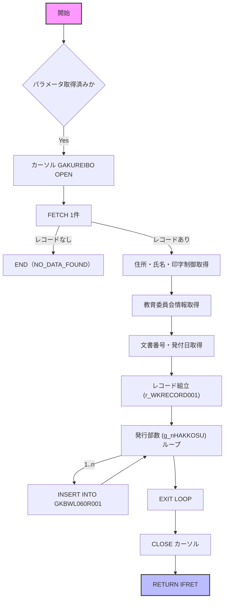
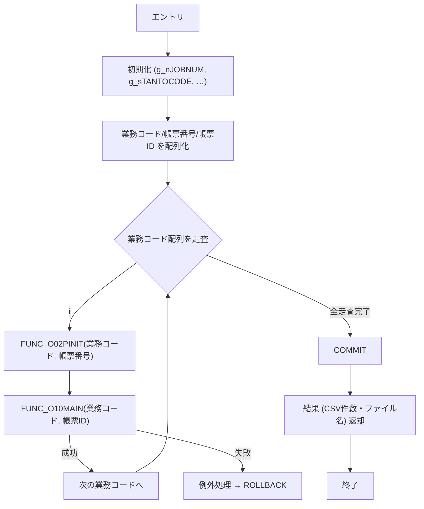

# 📄 GKBPA00050B.SQL – 就学時健康診断結果通知書即時（オンラインバッチ）

> **対象読者**：このモジュールを新たに担当する開発者  
> **目的**：コードの全体像と主要ロジックを把握し、保守・拡張時に迷わないようにすること  

---  

## 1️⃣ 概要概説

| 項目 | 内容 |
|------|------|
| **サブシステム** | GKB（教育） |
| **プログラム名** | 就学時健康診断結果通知書即時 |
| **機能** | 受診結果通知書（EMF/PDF）を即時に生成し、CSV と印刷ファイルを出力する |
| **実行形態** | オンライン（バッチ）ジョブ |
| **主要テーブル** | `GKBTGAKUREIBO`（学齢簿）・`GKBWL060R001`（出力用ワークテーブル）・`GKBTTSUCHISHOKANRI`（通知書管理） |
| **外部パッケージ** | `KKBPK5551`（汎用CSV/ログ/印刷）・`KKAPK0030`・`KKAPK0020`・`GAAPK0030` など多数 |
| **バージョン履歴** | 2024‑01‑06 初版 → 2025‑09‑18 最新（QA20943 対応） |

> **このファイルが担う役割**  
> - 呼び出し元（画面／ジョブ）から渡された CSV 形式のパラメータを分解し、内部変数へ展開  
> - 学齢簿・保護者・教育委員会情報を結合し、1 件ずつレコード化  
> - 生成したレコードを `GKBWL060R001` に INSERT → CSV/EMF/PDF 出力  
> - 途中のロギング・例外処理はすべて `FUNC_SETLOG` 経由で統一  

---  

## 2️⃣ コードレベル洞察

### 2.1 定数・グローバル変数

| 定数 | 値 | 用途 |
|------|----|------|
| `c_ONLINE` | 1 | バッチ区分（オンライン） |
| `c_OK` / `c_ERR` | 0 / -1 | 処理結果ステータス |
| `c_EMF` / `c_PDF` / `c_EMFANDPDF` | 1 / 2 / 3 | 出力ファイル種別 |
| `c_CHOHYO_KBN` | 5 | 健康診断通知書の帳票区分 |

> **設計意図**：定数でハードコーディングを排除し、外部パラメータ変更に強くする。  

### 2.2 主な関数・手順（内部関数）

| 関数/手順 | 目的 | 主な呼び出し先 |
|-----------|------|----------------|
| `FUNC_SETLOG` | ログ出力（KKBPK5551.FSETOLOG） | すべての処理開始/終了・例外 |
| `FUNC_O00INIT` | 開始時刻取得・初期化 | - |
| `FUNC_O01PINIT` | パラメータ文字列（CSV）を分解しグローバル変数へ展開 | `KKBPK5551.FCSV2TBL` |
| `FUNC_O02PINIT` | 帳票ステップ情報取得 | `KKBPK5551.FOPRTGet` |
| `FUNC_O20CSV` | CSV/印刷ファイル生成ロジック | `KKBPK5551.FCSVPUT` |
| `GET_EQRENRAKUSAKI` | 教育委員会連絡先文字列組み立て | `KKAPK0030.FPRMSHUTOKU` |
| `PROC_GET_YMD` / `PROC_GET_YMD1` | 日付（和暦/西暦）変換 | `KKAPK0020.FDAYEDIT` |
| `FUNC_PRMFLGSET` | 氏名印字制御フラグ設定 | `GKBTSHIMEIJKN` 参照 |
| `FUNC_SEIGYO_SET` | 氏名（本名／かな）選択ロジック | フラグ結果に応じて代入 |
| `FUNC_GET_JIDO_REC` | **最重要ロジック**：学齢簿レコード取得 → 各種情報結合 → `GKBWL060R001` INSERT |
| `FUNC_O10MAIN` | メインビジネスロジック：基準日設定 → `FUNC_GET_JIDO_REC` → `FUNC_O20CSV` |
| `PONLINE` (外部手続き) | エントリーポイント：パラメータ分解 → ループで `FUNC_O10MAIN` 呼び出し → 結果集計 |

#### 2.2.1 `FUNC_GET_JIDO_REC` の流れ（Mermaid）

#### 2.2.2 `PONLINE` の全体フロー（Mermaid）

### 2.3 主要ロジックのポイント

| 項目 | 詳細 |
|------|------|
| **CSV/印刷ファイルの二重出力** | `c_EMFANDPDF` の場合は EMF と PDF を別々に `FCSVPUT` で生成し、ファイル名リストに連結 |
| **氏名印字制御** | `FUNC_PRMFLGSET` → フラグ (`BPRMFLG_001~004`) → `FUNC_SEIGYO_SET` で本名／かな・表示/非表示を切り替える |
| **教育委員会連絡先** | `GET_EQRENRAKUSAKI` が「教育委員会名＋電話＋内線」の文字列を組み立て、全角変換も実施 |
| **支援措置対象住所非表示** | `g_nSHIENSOCHIKBN = 1` のとき、住所・郵便番号を空文字にし、代替メッセージ `GKBPK00010.FGETJUSHOMSG()` を使用 |
| **文書番号・発付日** | `KKBPK5551.FBunNumInf` で文書番号情報を取得し、`rBUNNUMEDITKEKA` のフラグで印字有無を判定 |
| **例外処理** | すべての内部関数は `TRUE/FALSE` を返すだけでなく、`FUNC_SETLOG` でエラーログを残す。`PONLINE` では例外種別別にロールバック／結果コード設定 |

---  

## 3️⃣ 依存関係と関係図

| コンポーネント | 依存先 | 用途 |
|----------------|--------|------|
| `KKBPK5551` | - | CSV分解・結合、ログ出力、印刷ファイル生成、ステップ情報取得 |
| `KKAPK0030` | - | パラメータ取得・制御フラグ、教育委員会連絡先 |
| `KKAPK0020` | - | 日付変換（和暦/西暦） |
| `GAAPK0030` | - | 住所編集・支援措置対象判定 |
| `GKBFKHMCTRL` | - | 本名使用制御ロジック（外部関数） |
| `GKBTSHIMEIJKN` | - | 氏名印字制御マスタ |
| `GKBWL060R001` | `FUNC_GET_JIDO_REC` | 出力用ワークテーブル（INSERT） |
| `GKBTTSUCHISHOKANRI` | `FUNC_GET_JIDO_REC` | 通知書テンプレート情報 |
| `GKBTGAKUREIBO` | `FUNC_GET_JIDO_REC` | 学齢簿（メインデータ） |
| `GABTATENAKIHON` / `GABTSOFUSAKI` | `FUNC_GET_JIDO_REC` | 宛先・送付先情報取得 |
| `GKBTZOKUGARA` | `FUNC_GET_JIDO_REC` | 続柄情報取得 |

> **リンク例**（クリックで同ファイル内該当ブロックへジャンプ）  
> - [`FUNC_SETLOG`](http://localhost:3000/projects/all/wiki?file_path=D:/code-wiki/projects/all/sample_all/sql/GKBPA00050B.SQL)  
> - [`FUNC_O01PINIT`](http://localhost:3000/projects/all/wiki?file_path=D:/code-wiki/projects/all/sample_all/sql/GKBPA00050B.SQL)  
> - [`FUNC_GET_JIDO_REC`](http://localhost:3000/projects/all/wiki?file_path=D:/code-wiki/projects/all/sample_all/sql/GKBPA00050B.SQL)  
> - …（以下同様に主要関数をリンク）

---  

## 4️⃣ 設計動機・実装上のトレードオフ

| 観点 | 説明 |
|------|------|
| **オンラインバッチ化** | ユーザ操作不要で即時に通知書を生成できるように、画面からはパラメータだけを渡す設計にした。 |
| **汎用パッケージ活用** | `KKBPK5551` 系列は社内共通ロジックで、CSV/ログ/印刷の統一を図る。新規機能追加時はこのパッケージを拡張すれば済む。 |
| **フラグ駆動の氏名制御** | 本名・かな・非表示をフラグで切り替えることで、法令改正や自治体ごとの要件に柔軟に対応。 |
| **大量レコードへの INSERT** | 1 件ずつ `INSERT` するが、`g_nHAKKOSU`（発行部数）でループさせて同一レコードを複数部数出力。大量データ時はバルク処理に変更する余地あり。 |
| **エラーハンドリング** | 例外はすべて `FUNC_SETLOG` で記録し、`PONLINE` でロールバック。ログが残るので障害調査が容易。 |
| **ハードコーディング** | 帳票区分や印刷種別は定数で管理しているが、外部マスタ化すれば更に柔軟になる。 |
| **依存パッケージのバージョン管理** | 多数の社内パッケージに依存しているため、パッケージ更新時はリグレッションテストが必須。 |

---  

## 5️⃣ 潜在的な問題点と改善ポイント

| 問題 | 現象 | 改善案 |
|------|------|--------|
| **INSERT が 1 件ずつ** | 大量データでパフォーマンス低下 | `FORALL` か `INSERT /*+ APPEND */` でバルク化 |
| **エラーログが文字列結合** | ログサイズが肥大化する恐れ | ログテーブルに構造化して保存 |
| **パラメータ分解ロジックが固定長** | 将来的に項目増加で `FUNC_O01PINIT` が壊れる | パラメータ定義テーブル化、動的マッピング |
| **外部パッケージのブラックボックス** | デバッグが困難 | 主要パッケージのインタフェースドキュメントを別途整備 |
| **文字コード変換（全角/半角）** | データ不整合が起きやすい | 文字コード変換は統一関数に集約し、テストケースを追加 |
| **支援措置対象住所非表示ロジック** | 条件分岐が散在し可読性低下 | 住所生成ロジックを独立手続きに切り出す |

---  

## 6️⃣ 主要関数・手順の簡易リファレンス（リンク付き）

| 名称 | 種別 | 主な引数 | 戻り値 | 説明 |
|------|------|----------|--------|------|
| [`FUNC_SETLOG`](http://localhost:3000/projects/all/wiki?file_path=D:/code-wiki/projects/all/sample_all/sql/GKBPA00050B.SQL) | 関数 | `i_sSTEP_NANE, i_nDEBUG_KBN, i_nSTATUSID, i_sSQLCODE, i_sSQLERRM, i_sERRMSG` | `BOOLEAN` | ログ出力ラッパー |
| [`FUNC_O00INIT`](http://localhost:3000/projects/all/wiki?file_path=D:/code-wiki/projects/all/sample_all/sql/GKBPA00050B.SQL) | 関数 | なし | `BOOLEAN` | 開始時刻取得 |
| [`FUNC_O01PINIT`](http://localhost:3000/projects/all/wiki?file_path=D:/code-wiki/projects/all/sample_all/sql/GKBPA00050B.SQL) | 関数 | `i_sPARAM`（CSV文字列） | `BOOLEAN` | パラメータ分解 → グローバル変数へ展開 |
| [`FUNC_O02PINIT`](http://localhost:3000/projects/all/wiki?file_path=D:/code-wiki/projects/all/sample_all/sql/GKBPA00050B.SQL) | 関数 | `i_sGYOUMUCODE, i_sCHOHYONUM` | `BOOLEAN` | 帳票ステップ情報取得 |
| [`FUNC_O20CSV`](http://localhost:3000/projects/all/wiki?file_path=D:/code-wiki/projects/all/sample_all/sql/GKBPA00050B.SQL) | 関数 | `i_sGYOUMUCODE, i_TBLNAME, i_sCHOHYOID` | `BOOLEAN` | CSV/EMF/PDF 出力ロジック |
| [`GET_EQRENRAKUSAKI`](http://localhost:3000/projects/all/wiki?file_path=D:/code-wiki/projects/all/sample_all/sql/GKBPA00050B.SQL) | 関数 | `i_SEIGYORENBAN, i_EQNAME, i_EQTELNO, i_EQNAISENNO` | `VARCHAR2` | 教育委員会連絡先文字列生成 |
| [`PROC_GET_YMD`](http://localhost:3000/projects/all/wiki?file_path=D:/code-wiki/projects/all/sample_all/sql/GKBPA00050B.SQL) | 手続き | `i_YMD` | `o_YMD` | 和暦/西暦変換（基本） |
| [`FUNC_PRMFLGSET`](http://localhost:3000/projects/all/wiki?file_path=D:/code-wiki/projects/all/sample_all/sql/GKBPA00050B.SQL) | 関数 | `i_KOJIN_NO, i_SHIMEIPRM` | `NUMBER` | 氏名印字制御フラグ設定 |
| [`PROC_GET_YMD1`](http://localhost:3000/projects/all/wiki?file_path=D:/code-wiki/projects/all/sample_all/sql/GKBPA00050B.SQL) | 手続き | `i_KBN, i_YMD` | `o_YMD` | 年齢計算用日付変換（支援措置対象用） |
| [`FUNC_SEIGYO_SET`](http://localhost:3000/projects/all/wiki?file_path=D:/code-wiki/projects/all/sample_all/sql/GKBPA00050B.SQL) | 関数 | `i_HONMYO, i_SHIMEI` | `NUMBER` | 本名／かな選択ロジック |
| [`FUNC_GET_JIDO_REC`](http://localhost:3000/projects/all/wiki?file_path=D:/code-wiki/projects/all/sample_all/sql/GKBPA00050B.SQL) | 関数 | なし | `NUMBER` | 学齢簿レコード取得・加工・INSERT（コア） |
| [`FUNC_O10MAIN`](http://localhost:3000/projects/all/wiki?file_path=D:/code-wiki/projects/all/sample_all/sql/GKBPA00050B.SQL) | 関数 | `i_sGYOUMUCODE, i_sCHOHYOID` | `BOOLEAN` | 基準日設定 → `FUNC_GET_JIDO_REC` → `FUNC_O20CSV` |
| [`PONLINE`](http://localhost:3000/projects/all/wiki?file_path=D:/code-wiki/projects/all/sample_all/sql/GKBPA00050B.SQL) | 手続き（外部） | 複数リストパラメータ | なし | エントリーポイント、全体制御、結果集計 |

---  

## 7️⃣ まとめ（新規担当者へのアドバイス）

1. **全体フローは `PONLINE → FUNC_O10MAIN → FUNC_GET_JIDO_REC → FUNC_O20CSV`**  
   - まずはこの流れをデバッグモードでステップ実行し、各テーブルの入出力を確認すると全体像が掴めます。  
2. **外部パッケージは「ブラックボックス」ではなく、**  
   - `KKBPK5551` の `FCSV2TBL`, `FCSVPUT`, `FSETOLOG` は頻繁に呼ばれるので、テスト用スタブを作成するとロジック検証が楽です。  
3. **パラメータ追加・変更は `FUNC_O01PINIT` の `CASE` 文に追記**  
   - 変更箇所が一箇所にまとまっているので、影響範囲は比較的限定的です。  
4. **大量データ対応は `FUNC_GET_JIDO_REC` の INSERT 部分**  
   - 現在は 1 件ずつ `INSERT` → バルク化や `INSERT /*+ APPEND */` で性能改善が可能です。  
5. **テストケース**  
   - 正常系（全パラメータあり）  
   - 異常系（CSV 項目不足、学齢簿データなし、印刷ファイル取得失敗）  
   - 増改修系（新しい帳票区分・印刷種別追加）  

以上を踏まえて、**まずは `PONLINE` の呼び出しシナリオをローカル環境で実行し、ログと `GKBWL060R001` の内容を確認**してください。そこから個別ロジック（氏名制御、住所生成、文書番号取得）へと掘り下げていくと、スムーズに保守・拡張が行えるはずです。  