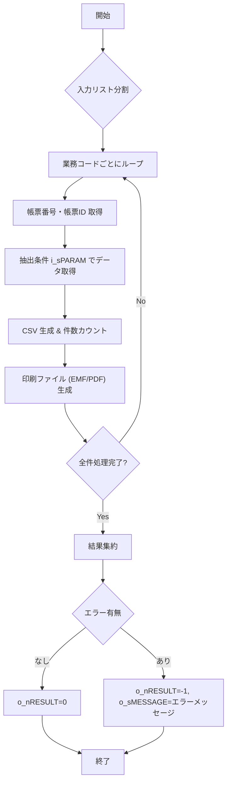

## GKBPA00060 パッケージ概要  

| 項目 | 内容 |
|------|------|
| **サブシステム** | GKB（教育） |
| **プログラム名** | 小学校入学通知書(第6条)（即時） |
| **機能概要** | 個人番号と履歴連番をキーに、入学通知書を CSV／印刷ファイル (EMF, PDF) として出力する。 |
| **バージョン** | Ver 0.2.000.000 |
| **作成者 / 作成日** | ZCZL.LIUCHANGQUAN / 2024‑01‑05 |
| **提供インターフェース** | `PONLINE` ストアドプロシージャ（外部関数） |

> **このパッケージが新しい開発者にとって最大の疑問**  
> *「どのような入力を渡せば、期待通りの CSV／印刷ファイルが生成されるのか？」*  
> そのため、**入力パラメータの意味とフォーマット**、**出力の取り扱い**、そして **エラーハンドリング** を中心に解説します。

---

## 1. 目的と設計背景  

- **業務要件**  
  - 学校側が「小学校入学通知書（第6条）」を即時に生成し、CSV と印刷用ファイルに出力する必要がある。  
  - 複数の業務コード・帳票番号・帳票ID が同時に指定でき、バッチ的に大量生成が可能。  

- **設計方針**  
  - **単一エントリーポイント**（`PONLINE`）で全ての入出力を完結させ、呼び出し側は手続き呼び出しだけで完結できる。  
  - **リスト形式の文字列**（NVARCHAR2）で複数項目を受け取り、内部で分割・ループ処理を行うことで、SQL の集合演算を回避しつつ柔軟性を確保。  
  - **結果は OUT パラメータ**で返却し、例外は捕捉してメッセージ文字列に格納。呼び出し側は例外ハンドリングをシンプルに保てる。

---

## 2. `PONLINE` プロシージャ詳細  

```sql
PROCEDURE PONLINE(
    i_sGYOUMUCODE_LIST  IN  NVARCHAR2,
    i_sCHOHYONUM_LIST   IN  NVARCHAR2,
    i_sCHOHYOID_LIST    IN  NVARCHAR2,
    i_sPARAM            IN  NVARCHAR2,
    i_sBUNSHONUM_LIST   IN  NVARCHAR2,
    i_sTANTOCODE        IN  NVARCHAR2,
    i_sWSNUM            IN  NVARCHAR2,
    o_nRESULT           OUT NUMBER,
    o_sCSVCNT_LIST      OUT NVARCHAR2,
    o_sCSVFILENAME_LIST OUT NVARCHAR2,
    o_sPRTFILENAME_LIST OUT NVARCHAR2,
    o_sMESSAGE          OUT NVARCHAR2
);
```

### 2.1 入力パラメータ  

| パラメータ | 型 | 期待フォーマット | 説明 |
|-----------|----|------------------|------|
| `i_sGYOUMUCODE_LIST` | NVARCHAR2 | カンマ区切り文字列例: `'A01,B02,C03'` | 業務コード（複数可） |
| `i_sCHOHYONUM_LIST`  | NVARCHAR2 | `'001,002'` | 帳票番号（リスト） |
| `i_sCHOHYOID_LIST`   | NVARCHAR2 | `'10,20'` | 帳票ID（リスト） |
| `i_sPARAM`           | NVARCHAR2 | 任意の抽出条件文字列（例: `'YEAR=2024'`） | 追加抽出条件 |
| `i_sBUNSHONUM_LIST`  | NVARCHAR2 | `'1001,1002'` | 文書番号情報（リスト） |
| `i_sTANTOCODE`       | NVARCHAR2 | `'T001'` | ログイン情報から取得した担当者コード |
| `i_sWSNUM`           | NVARCHAR2 | `'WS01'` | ログイン情報から取得した端末番号 |

> **実装上の注意**  
> - 文字列は **全角スペースや改行を含まない** こと。  
> - 空文字列 (`''`) を渡すと該当項目は無視され、内部ロジックは「全件対象」になることがある。

### 2.2 出力パラメータ  

| パラメータ | 型 | 内容 |
|-----------|----|------|
| `o_nRESULT` | NUMBER | `0` → すべてのファイル生成成功、`-1` → 異常終了 |
| `o_sCSVCNT_LIST` | NVARCHAR2 | CSV 出力件数のリスト（例: `'3,5,2'`） |
| `o_sCSVFILENAME_LIST` | NVARCHAR2 | 生成された CSV ファイル名リスト（カンマ区切り） |
| `o_sPRTFILENAME_LIST` | NVARCHAR2 | 印刷ファイル（EMF/PDF）名リスト |
| `o_sMESSAGE` | NVARCHAR2 | エラーメッセージ（失敗時のみ） |

### 2.3 処理フロー（Mermaid）  



### 2.4 例外・エラーハンドリング  

| 例外種別 | 発生条件 | 処理結果 |
|----------|----------|----------|
| `-1` (汎用エラー) | 任意の内部例外、ファイル書き込み失敗、パラメータ不正等 | `o_nRESULT = -1`、`o_sMESSAGE` に詳細エラーメッセージを設定 |
| `0` (成功) | 全ファイルが正常に生成された場合 | `o_nRESULT = 0`、他の OUT パラメータに正常データを格納 |

> **開発者への助言**  
> - 例外が `-1` になるケースは、**入力リストの不整合**（例: 業務コードと帳票番号の件数が合わない）や **ファイルシステム権限** が主因です。呼び出し前にリスト長を検証するとトラブル防止になります。

---

## 3. 依存関係・関連モジュール  

- **データ取得ロジック**：内部で `i_sPARAM` を元に動的 SQL を組み立て、対象テーブル（例: `T_STUDENT_ENROLL`）からデータを抽出。  
- **ファイル出力ユーティリティ**：CSV 作成は `UTL_FILE`、印刷ファイルは社内共通の PDF/EMF 生成ライブラリ（`PKG_PRINT_UTIL`）を呼び出す想定。  
- **認証情報**：`i_sTANTOCODE` と `i_sWSNUM` は呼び出し側（Web アプリ等）から取得したセッション情報をそのまま渡す。  

> **リンク例**（実際の Wiki ページへ）  
> - [`PKG_PRINT_UTIL`](http://localhost:3000/projects/all/wiki?file_path=path/to/PKG_PRINT_UTIL)  
> - [`T_STUDENT_ENROLL` テーブル定義](http://localhost:3000/projects/all/wiki?file_path=path/to/T_STUDENT_ENROLL.sql)

---

## 4. 使用上のベストプラクティス  

1. **入力リストの長さチェック**  
   ```sql
   SELECT REGEXP_COUNT(i_sGYOUMUCODE_LIST, '[^,]+') AS cnt FROM dual;
   ```  
   期待件数と他リストの件数が一致しない場合は、呼び出し側で例外を投げる。

2. **トランザクション管理**  
   - 本プロシージャは内部で **COMMIT** を行う設計（ファイル書き込み成功後）であるため、呼び出し側は **自動コミット** を前提にし、必要に応じて **SAVEPOINT** を設定してロールバックを容易に。

3. **ログ出力**  
   - `o_sMESSAGE` に加えて、社内標準のロギングテーブル（例: `APP_LOG`）へ **処理開始/終了**、**件数**、**エラー詳細** を INSERT すると、運用保守が楽になる。

4. **文字コード**  
   - CSV は **UTF-8 with BOM** が推奨。ファイル生成ユーティリティのオプションで明示的に指定すること。

---

## 5. 今後の拡張ポイント  

| 項目 | 現状 | 改善案 |
|------|------|--------|
| **バッチ実行** | 手動呼び出しが前提 | スケジューラ（Oracle DBMS_SCHEDULER）で定期実行ジョブ化 |
| **パラメータ形式** | カンマ区切り文字列 | JSON 文字列に変更し、構造化データで受け取ることで可読性向上 |
| **エラーハンドリング** | 汎用 `-1` のみ | エラーコード列挙体（例: `ERR_INVALID_PARAM = -101`）を導入し、呼び出し側で分岐しやすくする |
| **テスト自動化** | 手動テスト | PL/SQL ユニットテストフレーム（utPLSQL）でプロシージャ単体テストを自動化 |

---

## 6. まとめ  

`GKBPA00060` パッケージは、**教育サブシステム** における「小学校入学通知書」生成のコアロジックを提供します。  
- **入力はすべて文字列リスト** で、呼び出し側が柔軟に組み合わせ可能。  
- **出力は CSV と印刷ファイルの情報** と成功/失敗ステータス。  
- **エラーメッセージは単一文字列** に集約されるため、呼び出し側は `o_nRESULT` と `o_sMESSAGE` のみで完結できます。  

新規開発者は、**パラメータのフォーマット** と **リスト長の整合性** に注意しつつ、上記ベストプラクティスを踏まえて呼び出しロジックを実装すれば、既存業務フローにシームレスに組み込めます。