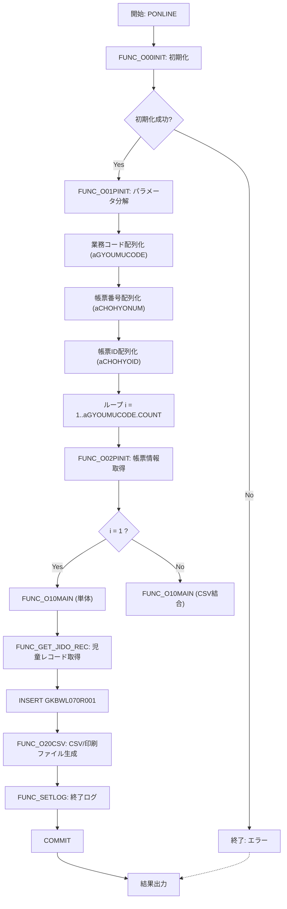

# GKBPA00060 パッケージ概要  
**ファイル:** `D:\code-wiki\projects\all\sample_all\sql\GKBPA00060B.SQL`  

このパッケージは **「小学校入学通知書（第6条）即時」** を生成するバッチ／オンライン処理のコアロジックです。  
個人番号（`g_NKOJIN_NO`）と履歴連番（`g_NRIREKI_RENBAN`）をキーに、児童・保護者情報、学校情報、教育委員会連絡先等を取得し、帳票データ（CSV）と印刷ファイル（EMF/PDF）を出力します。

> **新規担当者へのポイント**  
> 1. **入力パラメータ** は CSV 形式で `FUNC_O01PINIT` が分解し、グローバル変数へ展開します。  
> 2. **処理フロー** は `PONLINE` → `FUNC_O00INIT` → `FUNC_O01PINIT` → ループで `FUNC_O02PINIT` → `FUNC_O10MAIN` → `FUNC_GET_JIDO_REC` → `FUNC_O20CSV` の順です。  
> 3. **帳票データ構造** は `GKBWL070R001` テーブルへレコードを INSERT 後、`FUNC_O20CSV` が CSV/印刷ファイル化します。  
> 4. 変更履歴が多数あるため、**バージョンタグ**（例: `0.3.000.014`）と対応 QA をコードコメントで確認しながら修正してください。

---

## 目次
1. [概要と責務](#概要と責務)  
2. [主要定数・変数](#主要定数・変数)  
3. [主要ロジックの流れ](#主要ロジックの流れ)  
4. [主要サブルーチン・関数一覧](#主要サブルーチン関数一覧)  
5. [データ取得と加工の詳細](#データ取得と加工の詳細)  
6. [依存外部モジュール・テーブル](#依存外部モジュールテーブル)  
7. [エラーハンドリングとログ出力](#エラーハンドリングとログ出力)  
8. [設計上の留意点と改善ポイント](#設計上の留意点と改善ポイント)  

---

## 概要と責務
| 項目 | 内容 |
|------|------|
| **サブシステム** | GKB（学区・学校情報） |
| **対象帳票** | 小学校入学通知書（第6条） |
| **実行形態** | オンライン（即時バッチ）`c_ONLINE = 1` |
| **出力** | - CSV（`GKBWL070R001`） - 印刷ファイル EMF / PDF |
| **主要テーブル** | `GKBWL070R001`（帳票レコード） `GKBWL070R001` へ INSERT 後 `FUNC_O20CSV` が CSV 生成 |
| **外部呼び出し元** | `PONLINE`（外部関数） – Web/ジョブサーバから呼び出されるエントリーポイント |

---

## 主要定数・変数
### 定数
| 定数 | 値 | 説明 |
|------|----|------|
| `c_ONLINE` | 1 | 即時バッチ区分（オンライン実行） |
| `c_ERR` | -1 | 異常終了コード |
| `c_OK` | 0 | 正常終了コード |
| `c_CHOHYO_KBN_S` | 1 | 小学校通知書種別 |
| `c_CHOHYO_KBN_T` | 2 | 中学校通知書種別 |
| `c_EMF` / `c_PDF` | 1 / 2 | 印刷ファイル種別 |
| `c_RENBAN_PRINT` | 0 | 帳票連番印字制御（未使用時は非表示） |

### グローバル変数（パッケージレベル）
| 変数 | 型 | 用途 |
|------|----|------|
| `g_nJOBNUM` | NUMBER | ジョブ番号（ジョブ管理テーブルに使用） |
| `g_sTANTOCODE` | NVARCHAR2 | ログイン情報・担当者コード |
| `g_sWSNUM` | NVARCHAR2 | 端末番号 |
| `g_sBUNSHONUMLIST` | NVARCHAR2 | 文書番号リスト（`KKBPK5551.FBunNumInf` で展開） |
| `g_sCSV_RCNT` / `g_sCSVFILENAME` / `g_sPRTFILENAME` | NVARCHAR2 | CSV/印刷ファイル生成結果を蓄積 |
| `g_vTOIAWASESAKI1..3` | NVARCHAR2 | 教育委員会名・住所・電話（出力用） |
| `g_rBUNNUMSRCINF` / `g_rBUNNUMEDITKEKA` | RECORD | 文書番号・文書日付取得結果 |
| `g_rBUNSHONUM` | NVARCHAR2 | 最終的に帳票へ出力する文書番号 |
| `g_aSHIMEIJKN_CHOHYOPRM` / `g_aEQSHIMEIPRM` | `A_CONS_PRM` 配列 | 本名・通称名・外国人氏名制御パラメータ |
| `g_nGKBPA00060_INDEX` | NUMBER | 本パッケージが対象とする帳票インデックス |
| `g_vGKBPA00060_CTL` | NUMBER | 本パッケージの出力制御フラグ |

---

## 主要ロジックの流れ
### 高レベルフロー（`PONLINE` 呼び出し）

1. **`PONLINE`** がエントリーポイント。  
2. `FUNC_O00INIT` で開始時刻・ログ情報を初期化し、`FUNC_SETLOG` で開始ログを書き込みます。  
3. `FUNC_O01PINIT` が受け取った CSV 文字列を `KKBPK5551.FSplitStr` で分解し、各業務コード・帳票番号・帳票ID の配列 (`aGYOUMUCODE` など) を作成。  
4. ループ内で  
   - `FUNC_O02PINIT` が帳票番号（`g_nCHOHYONUM`）に応じたステップ情報を取得。  
   - `FUNC_O10MAIN` がメインロジックを実行。  
5. `FUNC_O10MAIN` の内部フロー  
   - 各種制御パラメータ取得（`VACONSPRM1..3`、`o_SHIMEIPRM` など）  
   - `FUNC_GET_JIDO_REC` で児童・保護者・学校情報を取得し、`GKBWL070R001` にレコードを INSERT。  
   - `FUNC_O20CSV` が `GKBWL070R001` の内容を CSV/EMF/PDF に変換。  
6. 正常終了時は `FUNC_SETLOG` で終了ログを書き、`c_OK` を返します。  

---

## 主要サブルーチン・関数一覧  

| 名称 | 種別 | 主要処理 | 参照リンク |
|------|------|----------|------------|
| **`PONLINE`** | 外部手続き | エントリーポイント。パラメータ分解 → 初期化 → ループで各帳票処理を実行 | [PONLINE](http://localhost:3000/projects/all/wiki?file_path=D:\code-wiki\projects\all\sample_all\sql\GKBPA00060B.SQL) |
| **`FUNC_SETLOG`** | 関数 | ログテーブル `KKBPK5551.FNINSHOGet` へ処理開始/終了・エラーメッセージを書き込む | [FUNC_SETLOG](http://localhost:3000/projects/all/wiki?file_path=D:\code-wiki\projects\all\sample_all\sql\GKBPA00060B.SQL) |
| **`FUNC_O00INIT`** | 関数 | 開始時刻取得、`g_sTANTOCODE`/`g_sWSNUM` などの初期化 | [FUNC_O00INIT](http://localhost:3000/projects/all/wiki?file_path=D:\code-wiki\projects\all\sample_all\sql\GKBPA00060B.SQL) |
| **`FUNC_O01PINIT`** | 関数 | 受け取った CSV 文字列を `KKBPK5551.FSplitStr` で分解し、グローバル変数へ展開 | [FUNC_O01PINIT](http://localhost:3000/projects/all/wiki?file_path=D:\code-wiki\projects\all\sample_all\sql\GKBPA00060B.SQL) |
| **`FUNC_O02PINIT`** | 関数 | 帳票番号・業務コードに応じたステップ情報（`g_rOPRT`）を取得 | [FUNC_O02PINIT](http://localhost:3000/projects/all/wiki?file_path=D:\code-wiki\projects\all\sample_all\sql\GKBPA00060B.SQL) |
| **`FUNC_O10MAIN`** | 関数 | メインビジネスロジック。CSV 作成 → `FUNC_GET_JIDO_REC` 呼び出し → `FUNC_O20CSV` | [FUNC_O10MAIN](http://localhost:3000/projects/all/wiki?file_path=D:\code-wiki\projects\all\sample_all\sql\GKBPA00060B.SQL) |
| **`FUNC_GET_JIDO_REC`** | 関数 | 児童・保護者・学校情報を取得し、`GKBWL070R001` へレコードを INSERT。複数部数（`g_nHAKKOSU`）分ループで INSERT。 | [FUNC_GET_JIDO_REC](http://localhost:3000/projects/all/wiki?file_path=D:\code-wiki\projects\all\sample_all\sql\GKBPA00060B.SQL) |
| **`FUNC_O20CSV`** | 関数 | `GKBWL070R001` の内容を CSV と EMF/PDF に変換し、ファイル名・件数をグローバル変数へ格納 | [FUNC_O20CSV](http://localhost:3000/projects/all/wiki?file_path=D:\code-wiki\projects\all\sample_all\sql\GKBPA00060B.SQL) |
| **`GKBFKHMCTRL`** (外部呼び出し) | 関数 | 児童・保護者の本名使用制御判定ロジック。`0`＝成功、`1`＝制御エラー | [GKBFKHMCTRL](http://localhost:3000/projects/all/wiki?file_path=D:\code-wiki\projects\all\sample_all\sql\GKBPA00060B.SQL) |
| **`GKBFKZKGMGET`** (外部呼び出し) | 関数 | 続柄コード → 続柄名称変換ユーティリティ | [GKBFKZKGMGET](http://localhost:3000/projects/all/wiki?file_path=D:\code-wiki\projects\all\sample_all\sql\GKBPA00060B.SQL) |
| **`GET_EQRENRAKUSAKI`** | 関数 | 教育委員会連絡先文字列を組み立て、最大 4 桁まで省略可 | [GET_EQRENRAKUSAKI](http://localhost:3000/projects/all/wiki?file_path=D:\code-wiki\projects\all\sample_all\sql\GKBPA00060B.SQL) |

> **注:** 上記リンクは同一ファイル内の対象シンボルへジャンプする想定です。実際の Wiki システムで `file_path` に当該ファイルパスを設定してください。

---

## データ取得と加工の詳細

### 1. パラメータ取得 (`FUNC_O01PINIT`)  
- 受け取る CSV 文字列は **28 項目**（例: `g_NKOJIN_NO`, `g_NRIREKI_RENBAN`, `g_sTANTOCODE` など）に分割。  
- 変更履歴で追加された項目（例: `g_vSHIMEIKANA_H`、`g_nHOGOSYA_KOJIN_NO`）は **`CASE` 文で分岐** され、`g_sSENIMAEGYOUMUMEI`（業務コード）に応じて処理が変化します。

### 2. 児童レコード取得 (`FUNC_GET_JIDO_REC`)  
- **カーソル `GAKUREIBO`**（`GAKUREIBO`）は `GAKUREIBO`（`GKBFKZKGMGET`）で取得した続柄情報と結合し、児童・保護者の住所・郵便番号・氏名・生年月日等を取得。  
- **本名使用制御** は `GKBFKHMCTRL` に委譲し、制御結果に応じて `r_CHOHYO_001` の各フィールドに代入。  
- **支援措置対象住所非表示** (`g_nSHIENSOCHIKBN = 1`) の場合は `GAAPK0010.FADDRESSEDIT` で住所を抑止し、方書は `NULL` に設定。  

### 3. CSV/印刷ファイル生成 (`FUNC_O20CSV`)  
- `EXECUTE IMMEDIATE` で `INSERT INTO GKBWL070R001` を行い、`g_nHAKKOSU`（発行部数）分レコードを生成。  
- `KKBPK5551.FBunNumInf` で文書番号情報を取得し、`g_rBUNNUMSRCINF` のフラグに応じて文書番号・文書日付を出力。  
- `FUNC_O20CSV` が `GKBWL070R001` の内容を CSV に変換し、`c_EMF` / `c_PDF` の印刷ファイルも同時に生成。

---

## 依存外部モジュール・テーブル

| モジュール | 用途 | 参照リンク |
|-----------|------|------------|
| `KKBPK5551` | 文字列分割、CSV 結合、帳票情報取得ユーティリティ | [KKBPK5551](http://localhost:3000/projects/all/wiki?file_path=D:\code-wiki\projects\all\sample_all\sql\KKBPK5551.sql) |
| `KKAPK0030` | パラメータ制御テーブル取得 (`FPRMSHUTOKU`、`FCTGetR` など) | [KKAPK0030](http://localhost:3000/projects/all/wiki?file_path=D:\code-wiki\projects\all\sample_all\sql\KKAPK0030.sql) |
| `GAAPK0010` / `GAAPK0030` | 住所編集・公印取得・教育委員会連絡先生成 | [GAAPK0010](http://localhost:3000/projects/all/wiki?file_path=D:\code-wiki\projects\all\sample_all\sql\GAAPK0010.sql) |
| `GKBFKZKGMGET` | 続柄コード → 続柄名称変換 | [GKBFKZKGMGET](http://localhost:3000/projects/all/wiki?file_path=D:\code-wiki\projects\all\sample_all\sql\GKBFKZKGMGET.sql) |
| `GKBFKHMCTRL` | 本名使用制御判定（児童・保護者） | [GKBFKHMCTRL](http://localhost:3000/projects/all/wiki?file_path=D:\code-wiki\projects\all\sample_all\sql\GKBFKHMCTRL.sql) |
| `GKBWL070R001` | 帳票レコード格納テーブル（最終的に CSV/印刷ファイル化） | [GKBWL070R001](http://localhost:3000/projects/all/wiki?file_path=D:\code-wiki\projects\all\sample_all\sql\GKBWL070R001.sql) |
| `GKBPK00010` | 住所抑止メッセージ取得（支援措置対象住所非表示） | [GKBPK00010](http://localhost:3000/projects/all/wiki?file_path=D:\code-wiki\projects\all\sample_all\sql\GKBPK00010.sql) |

---

## 設計上の留意点と改善ポイント

| 項目 | 現状 | 推奨改善 |
|------|------|----------|
| **パラメータ分解** | `FUNC_O01PINIT` が固定長配列に展開し、後続ロジックはインデックスで参照。 | パラメータ定義をテーブル化（例: `GKBPA_PARAM_DEF`) し、`FOR` で自動マッピングすると保守性向上。 |
| **エラーハンドリング** | `WHEN OTHERS THEN` で `c_INOT_SUCCESS` に統一。 | エラーコード別に例外クラス (`e_DB_ERROR`, `e_DATA_NOT_FOUND`) を分離し、`FUNC_SETLOG` にエラー種別を渡す。 |
| **帳票レコード生成** | 1 件のレコードを `FOR i IN 1..g_nHAKKOSU LOOP` で複製。 | 発行部数が多いケースはバルクインサート (`INSERT ALL`) に置き換えるとパフォーマンス改善。 |
| **印刷ファイル取得** | `VSHUCHO`, `VSHUNYUYAKU`, `VGYOMU` は同一ファイル名を再利用。 | 署名・公印が別ファイルになる可能性があるため、ファイルパスをテーブルで管理し、`FUNC_O20CSV` で動的に取得。 |
| **ロジック分岐** | `VACONSPRM1` / `VACONSPRM2` の制御フラグが多数。 | 制御フラグは `ENUM`（PL/SQL の `SUBTYPE`）で名前付けし、`CASE` 文で可読性を上げる。 |
| **テスト容易性** | グローバル変数が多く、単体テストが困難。 | 可能な限り変数をローカル化し、`PONLINE` の引数だけで完結できるようリファクタリング。 |

---  

### 参考リンク（コード内コメントで言及されている QA）  

| バージョン | 対応 QA | 主な変更点 |
|------------|---------|------------|
| `0.3.000.014` | `IT_GKB_10244` | 住所非表示ロジック追加、抑止住所編集 (`GKBPK00010.FGETJUSHOMSG`) |
| `0.3.000.013` | `IT_GKB_00539` | 宛先上段・下段制御ロジック統合 |
| `0.3.000.012` | `IT_GKB_00433` | 文書番号・文書日付取得ロジック修正 |
| `0.3.000.009` | `IT_GKB_10207` | 様式番号文字列の全角変換ロジック追加 |
| `0.3.000.007` | `IT_GKB_00009` | 児童生年月日表示ロジック統一 |
| `0.3.000.006` | `IT_GKB_00007` | 宛先が学校長の場合の郵便番号空欄処理 |
| `0.3.000.005` | `IT_GKB_00725` | 転学期日・転入期日・前就・転入学校情報の出力項目追加 |
| `0.3.000.004` | `GK_QA13297` | 学校長宛通知時の郵便番号クリア |
| `0.3.000.003` | `IT_GKB_00539` | CSV 結合ロジックの改良 |
| `0.3.000.002` | `IT_GKB_00433` | 文書日付取得ロジックの修正 |
| `0.3.000.001` | `横展開対応` | `g_nCHOHYONUM` の削除に伴うコード整理 |
| `0.3.000.000` | **全体** | 新 WizLIFE2 次開発に合わせたパラメータ・制御フラグ統合 |  

---  

> **次のステップ**  
> 1. `PONLINE` の呼び出しサンプル（Web API 例）を作成し、実際に CSV が生成されるか確認。  
> 2. 変更が必要な箇所は **変更履歴コメント** と **対応 QA** を照らし合わせ、単体テストを追加。  
> 3. 将来的に **パラメータテーブル化**（`GKBPA_PARAM_DEF`）を検討し、ハードコーディングを排除する方向でリファクタリングを計画してください。  