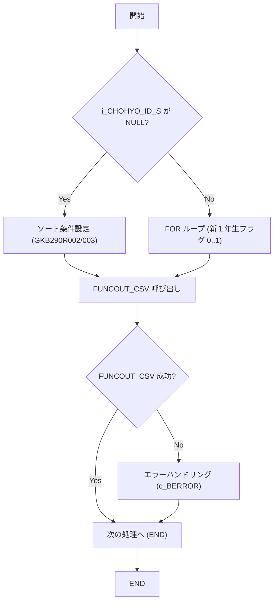
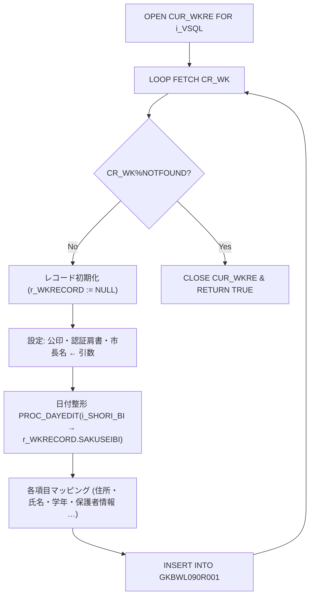

# GKBSKIDOTCH プロシージャ ‑ 技術ドキュメント  

> **対象読者**：このモジュールを初めて担当する開発者  
> **目的**：異動通知（CSV）作成ロジックの全体像と、変更ポイント・拡張ポイントを把握できるようにする  

---  

## 1. 概要  

| 項目 | 内容 |
|------|------|
| **業務名** | GKB（教育） |
| **プロシージャ名** | `GKBSKIDOTCH` |
| **主な機能** | 異動通知の中間テーブル `GKBWIDOTSUCHI` から、帳票定義 ID に応じた CSV（実体は DB の別テーブルへ INSERT）を生成 |
| **呼び出し側** | バッチジョブ／即時処理から `i_CHOHYO_ID`（帳票 ID）と端末・職員情報を渡して実行 |
| **バージョン履歴** | 0.2 → 0.3 → 1.0 まで多数の機能追加（認証コード取得、日付整形ロジック改修等） |
| **主要テーブル** | - `GKBWIDOTSUCHI`（中間データ） - `GKBWL090R001`（最終 CSV 用テーブル） - 旧バージョンで使用した `GKBWL290R001/002/003` 系はコメントアウトされている |

> **ポイント**：現在の実装は「即時」帳票（`GKB090R001`）だけを対象にしており、旧帳票（`GKB290R001~003`）は削除済み。将来的に再利用する場合はコメントアウト部分を参考に復活させることができる。

---  

## 2. コード構造と主要ロジック  

### 2.1 パラメータ一覧  

| パラメータ | 型 | 用途 |
|-----------|----|------|
| `i_SHORI_BI` | `NUMBER` | 処理日付（システム日付） |
| `i_SHORI_JIKAN` | `NUMBER` | 処理時間 |
| `i_TANMATU` | `VARCHAR2` | 端末番号 |
| `i_SHOKUIN_NO` | `VARCHAR2` | 職員個人番号 |
| `i_CHOHYO_ID` | `VARCHAR2` | 帳票 ID（例：`GKB090R001`） |
| `i_CHOHYO_ID_S` | `VARCHAR2` | 新１年生用帳票 ID（省略可） |
| `i_NRENBAN` | `NUMBER` | ジョブ番号 |
| **認証コード取得用** | | |
| `i_vKOINFILENAME` | `VARCHAR2` | 公印（認証コード）文字列 |
| `i_vKATAGAKI1` | `VARCHAR2` | 市町村長認証肩書 |
| `i_vSHUCHOMEI` | `VARCHAR2` | 市町村長名 |
| `i_BATCH` | `PLS_INTEGER` | バッチ区分（デフォルト 2） |

### 2.2 定数・変数  

| 定数 | 意味 |
|------|------|
| `c_BERROR` / `c_BNORMALEND` | 戻り値用ブール定数 |
| `c_ISIN1NEN_FLG_SHIN1NEN` / `c_ISIN1NEN_FLG_NOT_SHIN1NEN` | 新１年生フラグの列挙値 |

| 変数 | 用途 |
|------|------|
| `VSQL` | 動的 SQL（`SELECT * FROM GKBWIDOTSUCHI`） |
| `VSORT_CLM` | ソート条件文字列（帳票種別に応じて設定） |
| `BRTN` / `I_RTN` | 各サブルーチンの戻り値 |
| `CUR_WKRE` | 動的カーソル |
| `CR_WK` | `GKBWIDOTSUCHI` のレコード |
| `r_WKRECORD` | 出力テーブル（例：`GKBWL090R001`）のレコード |

### 2.3 フローチャート  

### 2.4 主なサブルーチン  

| サブルーチン | 位置 | 役割 |
|-------------|------|------|
| `PROC_DAYEDIT` | 行 70‑100 | 日付文字列を整形し、全角スペース除去。`JIBSKDAYEDIT2/4` へ委譲し、結果を `OUT` パラメータで返す。 |
| `FUNC_CREATE_CSV_004` | 行 250‑460 | **即時帳票**（`GKB090R001`）のレコード生成ロジック。認証コードは引数 `i_vKOINFILENAME` などから直接設定。 |
| `FUNCOUT_CSV` | 行 470‑540 | `i_CHOHYO_ID` に応じて適切な `FUNC_CREATE_CSV_XXX` を呼び出すディスパッチャ。現在は `FUNC_CREATE_CSV_004` のみ有効。 |
| **メインブロック** | 行 560‑620 | ソート条件設定、`i_CHOHYO_ID_S` の有無で 1 回または 2 回（新１年生フラグ）`FUNCOUT_CSV` を実行。 |

#### 2.4.1 `FUNC_CREATE_CSV_004` の流れ（重要ポイント）  

- **認証コード取得**：従来は `CR_WK.KYOIKU_KOIN_MEI` 等から取得していたが、2025‑05‑20 の改修で **引数** から直接渡すように変更。これにより、外部システムから取得した認証コードを柔軟に差し込める。  
- **日付処理**：`PROC_DAYEDIT` が統一的に呼び出され、`JIBSKDAYEDIT2/4` の内部ロジックは変更せずに再利用。  

### 2.5 エラーハンドリング  

- 各 `FUNC_CREATE_CSV_XXX` は `EXCEPTION WHEN OTHERS THEN … RETURN FALSE;` で失敗を通知。  
- `FUNCOUT_CSV` は戻り値が `FALSE` の場合に例外 `EXCP` を発生させ、呼び出し元で `c_BERROR` を返す。  
- メインブロックは `WHEN OTHERS THEN NULL;` で例外を抑制しているが、**ログ出力が無い**点は改善余地。  

---  

## 3. 依存関係・外部リソース  

| 参照先 | 種別 | コメント |
|--------|------|----------|
| `GKBWIDOTSUCHI` | テーブル | 中間データ（異動通知の元） |
| `GKBWL090R001` | テーブル | 最終 CSV 用テーブル（INSERT 先） |
| `GKBWL290R001/002/003` | テーブル（コメントアウト） | 旧帳票用テーブル。必要に応じて復活可能 |
| `PROC_DAYEDIT` / `JIBSKDAYEDIT2/4` | PL/SQL 手続き | 日付整形ロジック（別パッケージに実装） |
| `i_vKOINFILENAME` など | 引数 | 呼び出し元（バッチ／Web）から認証コード文字列を渡す |

> **注意**：`PROC_DAYEDIT` はこのファイル内に定義されているが、内部で呼び出す `JIBSKDAYEDIT2/4` は別パッケージに依存している。開発時はそのパッケージのバージョン管理とテストケースを確認すること。

---  

## 4. 変更・拡張のポイント  

| 変更箇所 | 目的 | 影響範囲 |
|----------|------|----------|
| **認証コード取得（2025‑05‑20）** | 引数で受け取るように変更 | `FUNC_CREATE_CSV_004` の呼び出し側（バッチ／API）に 3 つの文字列引数を追加 |
| **日付整形ロジック** | `PROC_DAYEDIT` で統一 | すべての `JIBSKDAYEDIT2/4` 呼び出しを置換可能。将来的にロジック変更は `PROC_DAYEDIT` のみ修正すれば済む |
| **新１年生フラグ処理** | `i_CHOHYO_ID_S` が指定された場合、2 回ループ実行 | ループ範囲は `c_ISIN1NEN_FLG_NOT_SHIN1NEN .. c_ISIN1NEN_FLG_SHIN1NEN`（0,1） |
| **削除された旧帳票ロジック** | コメントアウトで残存 | 必要に応じて `FUNC_CREATE_CSV_001~003` を復活させる際は、`FUNCOUT_CSV` の `CASE` に追加し、テーブル定義を確認 |
| **エラーロギング** | 現在は例外を黙殺 | `WHEN OTHERS THEN` に `DBMS_OUTPUT.PUT_LINE` や `APEX_ERROR.ADD_ERROR` 等でログ出力を追加すると保守性向上 |

---  

## 5. 推奨する保守・テスト戦略  

1. **単体テスト**  
   - `PROC_DAYEDIT` に対して各種日付文字列（8 桁、9 桁、空文字）を投入し、期待出力を検証。  
   - `FUNC_CREATE_CSV_004` の引数 `i_vKOINFILENAME` などが正しくレコードにマッピングされるか確認。  

2. **統合テスト**  
   - `GKBWIDOTSUCHI` にサンプルデータを投入し、`GKBSKIDOTCH` を実行。`GKBWL090R001` の件数・内容が期待通りか検証。  

3. **回帰テスト**  
   - 旧帳票（`GKB290R001~003`）を復活させるシナリオがある場合、コメントアウト解除後に同様のテストケースを追加。  

4. **パフォーマンス**  
   - 大量レコード（数十万件）での実行時間を測定し、`VSQL` にインデックスが適切か確認。  
   - `CUR_WKRE` のフェッチバッチサイズを調整できる場合は検討。  

---  

## 6. 参考リンク（コードブロック）  

- **メインプロシージャ**  
  [GKBSKIDOTCH](http://localhost:3000/projects/all/wiki?file_path=D:\code-wiki\projects\all\sample_all\sql\GKBSKIDOTCH.SQL)

- **日付整形サブルーチン**  
  [PROC_DAYEDIT](http://localhost:3000/projects/all/wiki?file_path=D:\code-wiki\projects\all\sample_all\sql\GKBSKIDOTCH.SQL)

- **即時帳票生成ロジック**  
  [FUNC_CREATE_CSV_004](http://localhost:3000/projects/all/wiki?file_path=D:\code-wiki\projects\all\sample_all\sql\GKBSKIDOTCH.SQL)

- **CSV 出力ディスパッチャ**  
  [FUNCOUT_CSV](http://localhost:3000/projects/all/wiki?file_path=D:\code-wiki\projects\all\sample_all\sql\GKBSKIDOTCH.SQL)

---  

## 7. まとめ  

- `GKBSKIDOTCH` は **帳票 ID** に応じて動的に CSV 用テーブルへデータを流す **汎用バッチ** である。  
- 現在は **即時帳票（GKB090R001）** のみが有効で、認証コードは外部から引数で受け取る設計に変更された。  
- 日付整形は `PROC_DAYEDIT` に集約されているため、将来のフォーマット変更はこの手続きだけを修正すれば済む。  
- エラーハンドリングとログ出力が最小限なので、**運用上の障害調査** の際は追加実装を検討すること。  

このドキュメントを基に、まずは **テスト環境で `GKBSKIDOTCH` を実行し、`GKBWL090R001` の出力を確認** してください。その後、必要に応じて認証コード取得ロジックや新１年生フラグ処理の拡張を行うとスムーズに開発が進められます。  