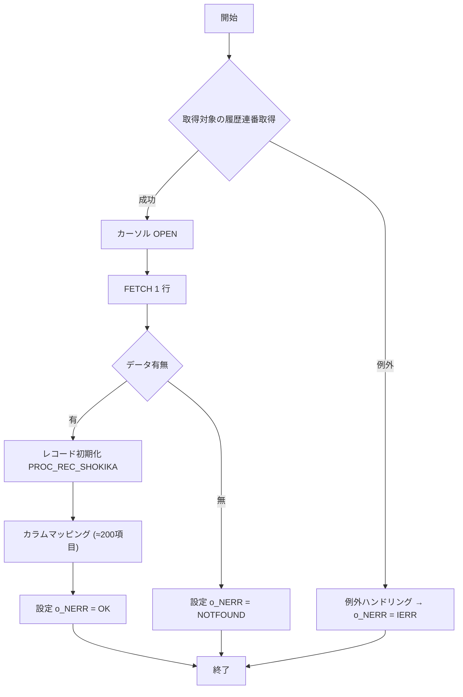

# GKBSKJDOG プロシージャ ‑ 児童情報取得サブ

**対象読者**：このモジュールを初めて担当する開発者  
**目的**：個人番号（`i_NKOJIN_NO`）をキーに、学籍簿テーブル `GKBTGAKUREIBO` から児童情報を取得し、`o_RG`（`GKBTGAKUREIBO%ROWTYPE`）に格納して呼び出し元に返す。

---

## 1. 概要

| 項目 | 内容 |
|------|------|
| **業務名** | GKB（教育） |
| **プロシージャ名** | `GKBSKJDOG` |
| **主な機能** | 個人番号 → 児童情報（学籍簿）取得 |
| **入力** | `i_NKOJIN_NO`（NUMBER） |
| **出力** | `o_RG`（学籍簿レコード）<br>`o_NERR`（エラーコード） |
| **作成者 / 日付** | ZCZL.LIKEWEN / 2024‑01‑06 |
| **バージョン** | 0.3.000.000（2024/06/04 追加） |

> **このファイルが担う役割**  
> - 画面やバッチから「児童情報が欲しい」要求を受け、DB から 1 件のレコードを取得して返す  
> - 取得失敗時はエラーコードで呼び出し元に通知し、レコードは初期化状態に保つ  

---

## 2. コードレベルの洞察

### 2.1 定数・変数

| 定数 | 意味 |
|------|------|
| `c_BERROR` / `c_BNORMALEND` | 例外ハンドリングで使用するブールフラグ（現在は未使用） |
| `c_ISUCCESS` | 正常終了（0） |
| `c_INOT_SUCCESS` | 異常終了（-1） |
| `c_IOK` | 戻り値正常（0） |
| `c_INOTFOUND` | 該当なし（1） |
| `c_IERR` | その他エラー（2） |

| 変数 | 用途 |
|------|------|
| `N_SQL_CODE` / `V_SQL_MSG` | 例外時に取得した SQL エラー情報 |
| `I_RTN` | `FUNC_GET_JIDO_REC` の戻り値（処理結果） |
| `IMRIREKI_RENBAN` | 取得対象の履歴連番（最大値） |
| `RCJIDO` | カーソル `CJIDO1` の 1 行分レコード（`%ROWTYPE`） |

### 2.2 カーソル定義

```sql
CURSOR CJIDO1(p_NKOJIN_NO IN NUMBER) IS
    SELECT <約 200 カラム>
    FROM GKBTGAKUREIBO
    WHERE KOJIN_NO = p_NKOJIN_NO
      AND RIREKI_RENBAN = IMRIREKI_RENBAN;
```

- **ポイント**：`RIREKI_RENBAN` は呼び出し前に `MAX(RIREKI_RENBAN)` で取得し、最新履歴だけを対象にする設計。  
- **注意**：履歴が複数存在しない前提なので、`LOOP` は実質 1 回だけ回る。

### 2.3 レコード初期化手続き `PROC_REC_SHOKIKA`

- すべてのカラムを **0** または **空文字** にリセット。  
- 変更履歴追加（2024/06/04）で新規カラムも同様に初期化。  
- **役割**：エラー時に呼び出し元が期待する「空レコード」状態を保証。

### 2.4 主処理関数 `FUNC_GET_JIDO_REC`

1. **履歴連番取得**  
   ```sql
   SELECT MAX(RIREKI_RENBAN) INTO IMRIREKI_RENBAN
   FROM GKBTGAKUREIBO
   WHERE KOJIN_NO = i_NKOJIN_NO;
   ```
2. **カーソルオープン → FETCH**  
   - 取得できなければ `c_INOTFOUND` を設定しループ脱出。  
3. **レコード初期化** → `PROC_REC_SHOKIKA(o_RG)`  
4. **カラムマッピング**  
   - `RCJIDO` の各フィールドを `o_RG` に 1 対 1 で代入。  
   - 追加されたカラム（例：`RIREKI_RENBAN_EDA` 等）も同様にマッピング。  
5. **正常終了** → `o_NERR := c_ISUCCESS`、`EXIT`（一意レコードなのでループ終了）  
6. **例外ハンドリング**  
   - `NO_DATA_FOUND` → `c_INOTFOUND`（正常扱い）  
   - `OTHERS` → `c_IERR`、SQL エラー情報取得  

### 2.5 メインブロック

```plsql
BEGIN
    I_RTN := FUNC_GET_JIDO_REC(o_RG);
    IF I_RTN <> c_ISUCCESS OR o_NERR = c_INOTFOUND THEN
        PROC_REC_SHOKIKA(o_RG);   -- エラー時は空レコードにリセット
    END IF;
EXCEPTION
    WHEN OTHERS THEN o_NERR := c_IERR;
END GKBSKJDOG;
```

- **フロー**：取得成功なら `o_RG` にデータが入る。失敗または該当なしの場合は空レコードにリセットし、エラーコードだけを返す。

---

## 3. フローチャート（全体像）



---

## 4. 依存関係・参照

| コード要素 | 説明 | Wiki リンク |
|------------|------|-------------|
| `GKBTGAKUREIBO` | 学籍簿テーブル（レコード型 `%ROWTYPE`） | [GKBTGAKUREIBO テーブル](http://localhost:3000/projects/all/wiki?file_path=D:/code-wiki/projects/all/sample_all/sql/GKBTGAKUREIBO.SQL) |
| `PROC_REC_SHOKIKA` | レコード初期化手続き | [PROC_REC_SHOKIKA](http://localhost:3000/projects/all/wiki?file_path=D:/code-wiki/projects/all/sample_all/sql/GKBSKJDOG.SQL#PROC_REC_SHOKIKA) |
| `FUNC_GET_JIDO_REC` | 取得ロジック本体 | [FUNC_GET_JIDO_REC](http://localhost:3000/projects/all/wiki?file_path=D:/code-wiki/projects/all/sample_all/sql/GKBSKJDOG.SQL#FUNC_GET_JIDO_REC) |
| `CJIDO1` | カーソル（最新履歴取得） | [CJIDO1 カーソル](http://localhost:3000/projects/all/wiki?file_path=D:/code-wiki/projects/all/sample_all/sql/GKBSKJDOG.SQL#CJIDO1) |

> **注**：上記リンクは同一ファイル内のアンカーを想定しています。実際の Wiki では該当手続き・関数のページへ遷移します。

---

## 5. 設計上の考慮点・潜在的課題

| 項目 | 内容 | 推奨アクション |
|------|------|----------------|
| **カラム数が膨大**（≈200） | メンテナンス性が低く、追加・削除時に漏れが起きやすい。 | カラムマッピングを自動化する共通ユーティリティ（例：`SELECT * INTO` でレコード型を直接コピー）を検討。 |
| **履歴取得ロジック** | `MAX(RIREKI_RENBAN)` で最新履歴を取得するが、履歴が削除されると「該当なし」になる可能性。 | 履歴テーブルに有効フラグを持たせ、`WHERE VALID = 1` で取得する方式へ変更。 |
| **エラーハンドリング** | `NO_DATA_FOUND` を「正常」扱いしているが、呼び出し側が「データなし」か「エラー」か判別できない。 | `o_NERR` に `c_INOTFOUND` を返すだけでなく、`o_RG` の `KOJIN_NO` も 0 にして明示的に区別。 |
| **パフォーマンス** | カーソルで 1 行だけ取得しているが、`SELECT ... INTO` に置き換えるとオーバーヘッド削減。 | 1 行取得であれば `SELECT ... INTO` にリファクタリング。 |
| **トランザクション管理** | 本プロシージャは SELECT のみでコミット/ロールバックは不要だが、呼び出し側がトランザクション内で使用する場合は注意。 | ドキュメントに「読み取り専用」旨を明記し、呼び出し側でのトランザクション影響を注意喚起。 |

---

## 6. 変更履歴（抜粋）

| 日付 | 担当 | 内容 |
|------|------|------|
| 2024/06/04 | ZCZL.wangyunhan | バージョン 0.3.000.000 で **新 WizLIFE 2 次開発** に伴い、約 30 カラムを追加し、初期化・マッピングロジックを拡張。 |
| 2024/01/06 | ZCZL.LIKEWEN | 初版作成。 |

---

## 7. まとめ（新担当者へのアドバイス）

1. **まずはテスト実行**：`i_NKOJIN_NO` に既存の個人番号を入れ、取得結果と `o_NERR` の組み合わせを確認。  
2. **カラムマッピングの整合性**：テーブル定義が変更されたら必ずこのプロシージャの `PROC_REC_SHOKIKA` と `FUNC_GET_JIDO_REC` の代入部を更新。  
3. **例外処理の拡張**：業務要件で「データなし」を別途ハンドリングしたい場合は、`o_NERR` のみでなく、呼び出し側にフラグを追加することを検討。  
4. **リファクタリングの機会**：カラム数が多いので、将来的に共通マッピングユーティリティやレコード型コピー手法への置き換えを計画すると保守性が向上します。  

以上が `GKBSKJDOG` プロシージャの全体像と、今後の開発・保守に役立つポイントです。質問や不明点があれば、コードベース内のコメントやバージョン管理履歴を参照してください。