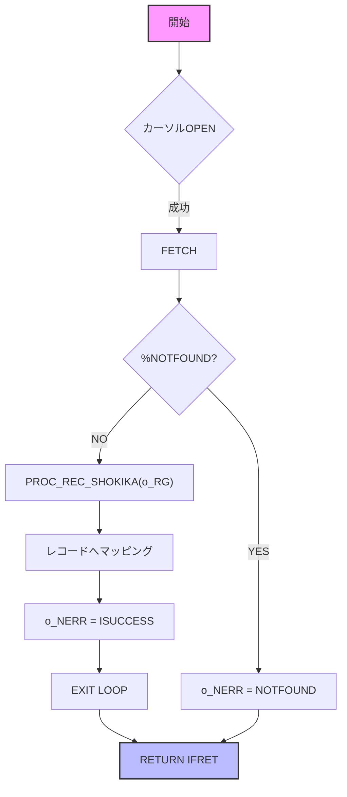

# GKBSKJDOG2 (児童情報取得サブ) – 技術ドキュメント  

**ファイルパス**  
`D:\code-wiki\projects\all\sample_all\sql\GKBSKJDOG2.SQL`

---

## 1. 概要

| 項目 | 内容 |
|------|------|
| **業務名** | GKB（教育） |
| **プロシージャ名** | `GKBSKJDOG2` |
| **目的** | 児童（個人番号）と履歴連番（枝番含む）をキーに、学齢簿テーブル `GKBTGAKUREIBO` から対象児童の全情報を取得し、呼び出し元に返す |
| **主な入出力** | - `i_NKOJIN_NO` : 児童個人番号 <br> - `i_RIREKI_RENBAN` : 履歴連番 <br> - `i_RIREKI_RENBAN_EDA` : 履歴枝番 <br> - `o_RG` : 取得したレコード（`GKBTGAKUREIBO%ROWTYPE`） <br> - `o_NERR` : 処理結果コード |
| **変更履歴** | 2024/06/04 – WizLIFE 2次開発で枝番対応 (`i_RIREKI_RENBAN_EDA`) を追加 |
| **呼び出し例** | ```sql\nDECLARE\n  v_rec GKBTGAKUREIBO%ROWTYPE;\n  v_err NUMBER;\nBEGIN\n  GKBSKJDOG2(123456, 1, 0, v_rec, v_err);\nEND;\n``` |

> **新規開発者へのポイント**  
> - このプロシージャは「取得」だけを行い、エラーは `o_NERR` に集約されます。  
> - 取得失敗（該当なし）でも例外は発生せず、`o_NERR = 1`（`c_INOTFOUND`）で通知されます。  

---

## 2. コードレベルの洞察

### 2.1 定数・変数

| 定数 | 意味 |
|------|------|
| `c_BERROR` / `c_BNORMALEND` | 例外ハンドリングで使用するブールフラグ（現在は未使用） |
| `c_ISUCCESS` | 正常終了コード（0） |
| `c_INOT_SUCCESS` | 異常終了コード（-1） |
| `c_IOK` | 戻り値成功（0） |
| `c_INOTFOUND` | 該当なし（1） |
| `c_IERR` | その他エラー（2） |

エラーハンドリングは **例外捕捉** と **戻り値コード** の二重構造で実装され、呼び出し側は `o_NERR` と関数戻り値の両方をチェックできます。

### 2.2 カーソル `CJIDO1`

```sql
CURSOR CJIDO1(p_NKOJIN_NO IN NUMBER,
              p_RIREKI_RENBAN IN NUMBER,
              p_RIREKI_RENBAN_EDA IN NUMBER) IS
  SELECT ... FROM GKBTGAKUREIBO
  WHERE KOJIN_NO = p_NKOJIN_NO
    AND RIREKI_RENBAN = p_RIREKI_RENBAN
    AND RIREKI_RENBAN_EDA = p_RIREKI_RENBAN_EDA;
```

- **役割**：キーに合致する 1 件の児童レコードを取得。  
- **拡張**：2024/06/04 の改修で `RIREKI_RENBAN_EDA`（枝番）を条件に追加し、同一履歴番号でも枝番で識別できるようにした。

### 2.3 手続き `PROC_REC_SHOKIKA`

- **目的**：`o_RG`（出力レコード）を「ゼロクリア」し、NULL になる可能性のある項目を安全なデフォルト値に初期化。  
- **実装**：全カラムに対し数値は `0`、文字列は空白 `' '`、日付系は `0`（Oracle の DATE では `DATE '0001-01-01'` ではなく数値型として扱われている）を設定。  
- **呼び出しタイミング**  
  1. カーソル取得前にレコードを初期化（安全策）  
  2. 取得失敗時や例外発生時に再度呼び出し、出力レコードが不定値になるのを防止  

### 2.4 関数 `FUNC_GET_JIDO_REC`

フロー（簡易化）：



- **エラーハンドリング**  
  - `NO_DATA_FOUND` → 正常終了 (`c_ISUCCESS`) かつ `o_NERR = c_INOTFOUND`  
  - `OTHERS` → `c_INOT_SUCCESS`、SQLCODE/SQLERRM を取得し `o_NERR = c_IERR`  

### 2.5 メインブロック

```plsql
BEGIN
    I_RTN := FUNC_GET_JIDO_REC(o_RG);
    IF I_RTN <> c_ISUCCESS OR o_NERR = c_INOTFOUND THEN
        PROC_REC_SHOKIKA(o_RG);
    END IF;
EXCEPTION
    WHEN OTHERS THEN o_NERR := c_IERR;
END GKBSKJDOG2;
```

- **ロジック**：取得成功であれば `o_RG` にデータが入る。失敗（エラーまたは該当なし）時はレコードをクリアし、呼び出し側が「空」状態を確実に受け取れるようにする。

---

## 3. 依存関係・関係図

```
GKBSKJDOG2
│
├─► FUNC_GET_JIDO_REC
│    ├─► CJIDO1 (カーソル)
│    └─► PROC_REC_SHOKIKA (レコード初期化)
│
└─► o_RG (GKBTGAKUREIBO%ROWTYPE) ← テーブル GKBTGAKUREIBO
```

- **テーブル** `GKBTGAKUREIBO` は学齢簿（児童情報）を保持。  
- **外部からの呼び出し** は `GKBSKJDOG2` のみ。内部で `FUNC_GET_JIDO_REC` → `CJIDO1` → `PROC_REC_SHOKIKA` の流れになる。

### 参照リンク（Wiki 内部リンク）

- [`PROC_REC_SHOKIKA`](http://localhost:3000/projects/all/wiki?file_path=D:\code-wiki\projects\all\sample_all\sql\GKBSKJDOG2.SQL)  
- [`FUNC_GET_JIDO_REC`](http://localhost:3000/projects/all/wiki?file_path=D:\code-wiki\projects\all\sample_all\sql\GKBSKJDOG2.SQL)  
- [`CJIDO1 (カーソル)`](http://localhost:3000/projects/all/wiki?file_path=D:\code-wiki\projects\all\sample_all\sql\GKBSKJDOG2.SQL)  

---

## 4. 例外・エラーパターン

| 例外種別 | 発生条件 | 処理結果 (`o_NERR`) | コメント |
|----------|----------|-------------------|----------|
| `NO_DATA_FOUND` | キーに該当レコードが無い | `c_INOTFOUND` (1) | 正常終了扱いだが、呼び出し側は「該当なし」判定が必要 |
| `OTHERS` | SQL エラー、カーソルオープン失敗、データ型不整合等 | `c_IERR` (2) | `SQLCODE` と `SQLERRM` がローカル変数に格納される（デバッグに活用） |
| `OTHERS`（メインブロック） | `FUNC_GET_JIDO_REC` 以外で例外が流出 | `c_IERR` (2) | 例外は捕捉され、`o_NERR` にエラーコードが設定されるだけでプロシージャは終了 |

---

## 5. メンテナンス上の留意点

1. **枝番追加の影響**  
   - 2024/06/04 の改修で `i_RIREKI_RENBAN_EDA` が必須パラメータに。既存呼び出しコードは必ず第 3 引数を渡すように更新が必要。  
2. **テーブル構造変更**  
   - `GKBTGAKUREIBO` にカラムが増減した場合、`PROC_REC_SHOKIKA` とマッピング部（`i_REC.<カラム> := RCJIDO.<カラム>`）の両方を同期させる必要があります。  
3. **エラーロギング**  
   - 現在はエラーコードだけを返す設計です。運用上は `SQLCODE`/`SQLERRM` を別テーブルに書き出すロジックを追加すると、障害解析が容易になります。  
4. **パフォーマンス**  
   - キーはプライマリキー（`KOJIN_NO` + `RIREKI_RENBAN` + `RIREKI_RENBAN_EDA`）でインデックスが張られていることを確認してください。大量呼び出し時のボトルネックはインデックス欠如です。  

---

## 6. まとめ

`GKBSKJDOG2` は **児童情報取得の単一責務** を持つプロシージャで、**取得成功・失敗・例外** を明確に分離した設計です。  
- **取得ロジック** は `FUNC_GET_JIDO_REC` → `CJIDO1` → `PROC_REC_SHOKIKA` の三層構造。  
- **エラーハンドリング** は例外捕捉と戻り値コードの二重保護で、呼び出し側は `o_NERR` と戻り値で状態を判定できます。  
- **拡張ポイント** は枝番対応とテーブルカラム増減です。  

このドキュメントを基に、既存システムへの統合や新規機能追加時の影響範囲を迅速に把握できるはずです。  