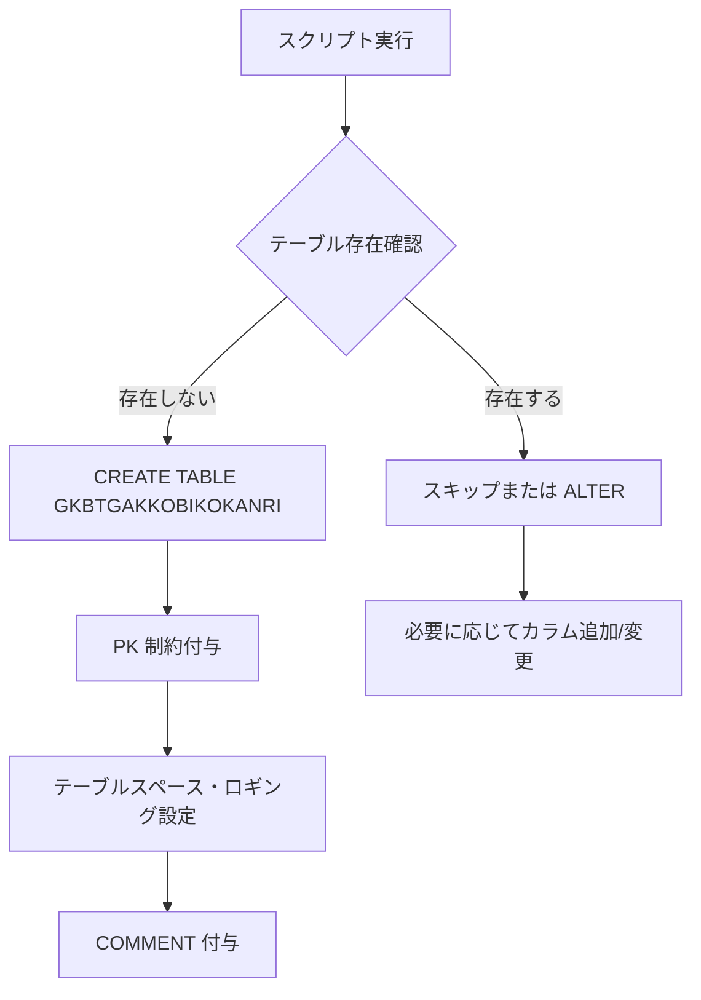

# GKBTGAKKOBIKOKANRI.SQL 技術ドキュメント  

**ファイルパス**: `D:\code-wiki\projects\all\sample_all\sql\GKBTGAKKOBIKOKANRI.SQL`  
[ソースコード全体](http://localhost:3000/projects/all/wiki?file_path=D:\code-wiki\projects\all\sample_all\sql\GKBTGAKKOBIKOKANRI.SQL)

---

## 1. 概要概述
このスクリプトは **学校長向け備考管理テーブル** `GKBTGAKKOBIKOKANRI` を定義します。  
- 主キーは `RENBAN`（連番）で、インデックスは `GK_INDEX` テーブルスペースに配置。  
- データ本体は `GK_DATA` テーブルスペースに格納し、キャッシュは使用しません（`NOCACHE`）。  
- 監査用カラム（作成日・更新日・更新時間・更新者・端末）を標準で持ち、システム全体での変更履歴追跡に利用されます。  

このテーブルは **備考文（BIKO）** を中心に、学校長が参照・更新する情報を一元管理する役割を担います。

---

## 2. コード級洞察

### 2.1 テーブル定義

| カラム名 | データ型 | 制約 | コメント |
|----------|----------|------|----------|
| `RENBAN` | `NUMBER(3,0)` | `NOT NULL`, **PK** | 連番 |
| `BIKO` | `NVARCHAR2(240)` | なし | 備考文 |
| `SYS_SAKUSEIBI` | `NUMBER(8,0)` | なし | 作成日 (YYYYMMDD) |
| `SYS_KOSHINBI` | `NUMBER(8,0)` | なし | 更新日 (YYYYMMDD) |
| `SYS_JIKAN` | `NUMBER(6,0)` | なし | 更新時間 (HHMMSS) |
| `SYS_SHOKUINKOJIN_NO` | `CHAR(12)` | なし | 更新職員宛名番号 |
| `SYS_TANMATSU_NO` | `NVARCHAR2(63)` | なし | 更新端末番号 |

#### 主キー制約
```sql
CONSTRAINT GKBTGAKKOBIKOKANRI_PKEY PRIMARY KEY (RENBAN) USING INDEX
    TABLESPACE GK_INDEX
    LOGGING
    ENABLE
```
- **設計意図**: `RENBAN` が一意であることを保証し、検索性能を `GK_INDEX` に委譲。  
- **実装上の留意点**: `NUMBER(3,0)` で最大 999 までしか格納できないため、将来的に件数が増える可能性がある場合は拡張が必要。

#### テーブルスペース・ロギング
```sql
TABLESPACE GK_DATA
NOCACHE
LOGGING
```
- **NOCACHE**: データブロックのキャッシュを行わず、I/O 負荷が高い環境でのメモリ使用抑制を狙う。  
- **LOGGING**: 変更はリドゥログに記録され、リカバリが可能。

### 2.2 コメント定義
```sql
COMMENT ON TABLE GKBTGAKKOBIKOKANRI IS '学校長向け備考管理';
COMMENT ON COLUMN GKBTGAKKOBIKOKANRI.RENBAN IS '連番';
...
```
- **目的**: データディクショナリに日本語説明を付与し、DBA・開発者がテーブル構造を即座に把握できるようにする。  
- **活用例**: `SELECT * FROM USER_COL_COMMENTS WHERE TABLE_NAME='GKBTGAKKOBIKOKANRI';` で自動ドキュメント生成が可能。

### 2.3 フローチャート（テーブル作成手順）



---

## 3. 依存関係と関係

| 参照先/参照元 | 種類 | 説明 |
|---------------|------|------|
| `GK_INDEX` | テーブルスペース | 主キーインデックスが格納される領域。インデックスサイズ・パフォーマンスはこのスペースに依存。 |
| `GK_DATA` | テーブルスペース | 実データが格納される領域。容量計画はこのテーブルの行数・カラムサイズに基づく。 |
| 監査カラム (`SYS_*`) | 共通カラム | 他テーブルでも同様の監査カラムが使用されている場合、統一的なトリガーやバッチ処理で更新されることが想定される。 |
| アプリケーション層 | 呼び出し元 | 学校長向け UI/バッチが `INSERT/UPDATE` を行い、`SYS_*` カラムは自動的に設定される（例: PL/SQL トリガー）。 |

> **注**: 本テーブルは他テーブルとの外部キー制約を持たないが、業務ロジック上は `RENBAN` が他テーブルの備考参照キーとして使用される可能性がある。実装時は参照整合性をアプリ側で担保する必要がある。

---

## 4. 例外・注意点

| 項目 | 発生条件 | 対応策 |
|------|----------|--------|
| `PK 重複エラー (ORA-00001)` | 同一 `RENBAN` が INSERT 時に存在 | `RENBAN` をシーケンスで自動採番するか、アプリ側で重複チェックを実装 |
| `テーブルスペース不足` | `GK_DATA` または `GK_INDEX` の空き領域が枯渇 | 定期的にテーブルスペースの使用率をモニタリングし、必要に応じて拡張 |
| `文字コード不整合` | `NVARCHAR2` に格納する文字が DB の NLS 設定と合わない | データ投入前に文字コード変換を徹底（UTF-8 推奨） |

---

## 5. 今後の拡張指針

1. **シーケンス導入**  
   `RENBAN` の上限 (999) が懸念される場合、`CREATE SEQUENCE GKBTGAKKOBIKOKANRI_SEQ START WITH 1 INCREMENT BY 1;` を作成し、`INSERT` 時に `RENBAN = GKBTGAKKOBIKOKANRI_SEQ.NEXTVAL` とする。

2. **監査トリガー統一化**  
   複数テーブルで同一の `SYS_*` カラムを使用しているなら、共通トリガーパッケージを作成し、メンテナンスコストを削減。

3. **インデックス最適化**  
   将来的に `BIKO` カラムで検索が頻繁になる場合は、全文検索インデックス（Oracle Text）やサブインデックスの追加を検討。

---

以上が `GKBTGAKKOBIKOKANRI.SQL` の技術ドキュメントです。新規開発者は本テーブルの役割・構造・運用上の注意点を把握したうえで、既存バッチや UI からのデータ操作ロジックを確認してください。