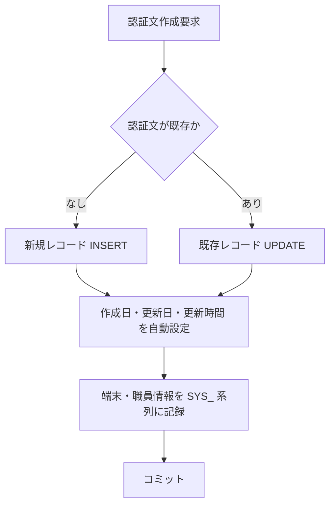

## GKBTGAKKONINSHOBUN テーブル定義  
[GKBTGAKKONINSHOBUN.SQL](http://localhost:3000/projects/all/wiki?file_path=D:\code-wiki\projects\all\sample_all\sql\GKBTGAKKONINSHOBUN.SQL)

---

### 1. 概要概説
| 項目 | 内容 |
|------|------|
| **テーブル名** | `GKBTGAKKONINSHOBUN` |
| **主目的** | 学校長向けの認証文（通知文）を管理するマスタテーブル。認証文はシステムから自動生成・更新され、履歴管理や日付区分での検索に利用される。 |
| **システム内位置付け** | 学校情報系（`GK` プレフィックス）モジュールの「認証文管理」サブシステム。ほかの業務テーブル（例：通知履歴テーブル）から外部キーで参照される想定。 |
| **重要ポイント** | - `RENBAN` がプライマリキーで連番管理。 - すべてのシステム監査項目（作成日・更新日・更新時間・更新者・端末）を保持。 - テーブル・インデックスはそれぞれ `GK_DATA`、`GK_INDEX` 表領域に配置し、パフォーマンスと保守性を分離。 |

---

### 2. コード級洞察

#### 2.1 カラム一覧と設計意図
| カラム | データ型 | 制約 | コメント（業務意味） |
|--------|----------|------|----------------------|
| `RENBAN` | `NUMBER(3,0)` | `NOT NULL`、PK | 連番。テーブル内で一意にレコードを識別。 |
| `NINSHOBUN` | `NVARCHAR2(240)` | なし | 認証文本文。可変長文字列で日本語対応。 |
| `HIDUKE_KBN` | `NUMBER(1,0)` | なし | 日付区分。例: `0=作成日`, `1=有効日` など、業務ロジックで判別。 |
| `SYS_SAKUSEIBI` | `NUMBER(8,0)` | なし | 作成日（YYYYMMDD）。データ生成日時のトレーサビリティ。 |
| `SYS_KOSHINBI` | `NUMBER(8,0)` | なし | 更新日（YYYYMMDD）。変更履歴管理に必須。 |
| `SYS_JIKAN` | `NUMBER(6,0)` | なし | 更新時間（HHMMSS）。分単位までの精度で変更時刻を保持。 |
| `SYS_SHOKUINKOJIN_NO` | `CHAR(12)` | なし | 更新職員宛名番号。更新者の職員コード（固定長）。 |
| `SYS_TANMATSU_NO` | `NVARCHAR2(63)` | なし | 更新端末番号。端末識別子（端末名・IP など）。 |

#### 2.2 制約・インデックス
- **プライマリキー**: `RENBAN` に対して `GKBTGAKKONINSHOBUN_PKEY` 制約を設定。  
  - インデックスは `GK_INDEX` 表領域に作成し、テーブル領域 `GK_DATA` から分離。  
  - `USING INDEX` によりインデックス作成時のオプション（`TABLESPACE GK_INDEX`、`LOGGING`、`ENABLE`）が明示的に指定されている。

#### 2.3 テーブル・インデックス配置
- **TABLESPACE**: `GK_DATA`（データ領域）  
  - `NOCACHE`：データブロックのキャッシュを行わず、I/O 負荷が高い環境での予測可能なパフォーマンスを確保。  
  - `LOGGING`：変更は redo log に記録され、リカバリが可能。

#### 2.4 コメント（メタデータ）
各カラム・テーブルに対して `COMMENT ON` が付与されており、データディクショナリ上で業務意味が明示される。新規開発者はこのコメントを参照することで、カラムの目的を即座に把握できる。

#### 2.5 典型的な利用シナリオ（フローチャート）

- **INSERT** 時は `RENBAN` をシーケンス等で取得し、`SYS_SAKUSEIBI` と `SYS_KOSHINBI` を同一日付で設定。  
- **UPDATE** 時は `SYS_KOSHINBI`、`SYS_JIKAN`、`SYS_SHOKUINKOJIN_NO`、`SYS_TANMATSU_NO` を更新し、履歴を残す。

---

### 3. 依存関係と関係性

| 依存先 | 種類 | 目的 |
|--------|------|------|
| `GK_DATA` 表領域 | ストレージ | データ本体の格納先。容量・パフォーマンス要件に合わせて別管理。 |
| `GK_INDEX` 表領域 | ストレージ | インデックス専用領域。検索性能向上と I/O 分離のために別表領域を使用。 |
| **想定外部テーブル** | 参照関係（FK） | 認証文を参照する通知履歴テーブルや、学校マスタ (`GK_SCHOOL` 等) が `RENBAN` を外部キーとして利用する可能性がある。実装上は別途 `ALTER TABLE ... ADD CONSTRAINT ... FOREIGN KEY` が付与されることが多い。 |
| **システム監査モジュール** | ロギング/監査 | `SYS_` 系列は共通監査フレームワークで自動埋め込みされ、変更履歴のトレーサビリティを提供。 |

> **開発者への助言**  
> - テーブル定義はシンプルだが、**監査項目** が多数ある点に注意。INSERT/UPDATE 時に必ず `SYS_` 系列を正しく設定するユーティリティ関数（例：`PKG_AUDIT.set_audit_columns`）がプロジェクト内に存在するはずなので、既存ロジックを流用すべき。  
> - `HIDUKE_KBN` の具体的なコードマッピングは別途マスタテーブル（例：`GK_DATE_KBN`）で管理されている可能性が高い。検索ロジックを実装する際は結合条件を確認すること。  

---  

*本ドキュメントは新規参入開発者がテーブル構造と業務的背景を迅速に把握し、既存のデータ操作ロジックに安全に組み込むことを目的としています。*