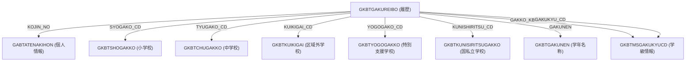

## GKBVEUCGAKUKYU_SETTEI ビュー概要

| 項目 | 内容 |
|------|------|
| **オブジェクト種別** | Oracle **FORCE VIEW** |
| **目的** | 児童・生徒の個人履歴情報と、学校区分・学年・学級情報を結合し、氏名・性別・生年月日等の基本情報とともに「学校区分コード」「学校区分名称」「学校等コード」「学校等名称」「学年コード」「学年名称」「学級コード」「学級名称」を一括取得できるレポート用ビュー |
| **利用シーン** | WizLIFE 2次開発で追加された「児童・生徒情報一覧」画面、または外部システムへのデータエクスポートに使用 |
| **バージョン履歴** | - `1.0.000.000-02.02-02.02` (初期作成)<br>- `2024/06/03` ZCZL.chenying **Update 0.3.000.000**: 国私立学校（区分 5）対応、カラム名統一、CASE 文の修正等 |

---

## 1. ビューが提供するカラム

| カラム名 | 説明 | ソーステーブル |
|----------|------|----------------|
| `SHIMEI_KANJI` | 氏名（漢字） | `GABTATENAKIHON` (JA) |
| `SHIMEI_KANA` | 氏名（カナ） | `GABTATENAKIHON` (JA) |
| `HYOJI_SEIBETSU` | 性別（表示用）: 1→男、2→女 | `GABTATENAKIHON` (JA) |
| `SEINENGAPI` | 生年月日 | `GABTATENAKIHON` (JA) |
| `KOJIN_NO` | 個人番号（宛名番号） | `GKBTGAKUREIBO` (GR) |
| `RIREKI_RENBAN` | 履歴連番 | `GKBTGAKUREIBO` (GR) |
| `RIREKI_RENBAN_EDA` | 履歴連番枝番（児童生徒個人履歴番号枝番） | `GKBTGAKUREIBO` (GR) |
| `GAKKO_KBN_CD` | 学校区分コード (1‑5) | `GKBTGAKUREIBO` (GR) |
| `GAKKO_KBN_MEI` | 学校区分名称（小学校・中学校・特別支援学校・区域外学校・国私立学校） | CASE 文で生成 |
| `GAKKO_CD` | 学校等コード（区分に応じたコード） | CASE 文で生成 |
| `GAKKO_MEI` | 学校等名称 | CASE 文で生成 |
| `GAKUNEN` | 学年（年度） | `GKBTGAKUREIBO` (GR) |
| `GAKUNENMEI` | 学年名称 | `GKBTGAKUNEN` (GN) |
| `GAKUKYU_CD` | 学級コード | `GKBTMSGAKUKYUCD` (GK) |
| `GAKUKYU_MEI` | 学級名称 | `GKBTMSGAKUKYUCD` (GK) |

> **注**: `GAKKO_KBN_CD = 5` が新たに追加された「国私立学校」区分で、対応テーブルは `GKBTKUNISIRITSUGAKKO` (KO)。

---

## 2. 実装ロジックとフロー

### 2‑1. 主テーブルと結合関係



- **外部結合 (`(+)`)** を多用しているため、履歴が存在しない場合でも個人情報は取得できる。  
- `GR.SAISHIN_KBN = 0` で「最新履歴」だけを対象に絞り込み。  

### 2‑2. 学校区分別のコード・名称取得

```sql
CASE GR.GAKKO_KBN_CD
  WHEN 1 THEN GR.SYOGAKO_CD          -- 小学校
  WHEN 2 THEN GR.TYUGAKO_CD          -- 中学校
  WHEN 3 THEN GR.YOGOGAKO_CD         -- 特別支援学校
  WHEN 4 THEN GR.KUIKIGAI_CD         -- 区域外学校
  WHEN 5 THEN GR.KUNISHIRITSU_CD      -- 国私立学校 (新規)
END AS GAKKO_CD
```

同様に名称も `CASE` で切り替えて取得し、**区分 5** が追加されたことが唯一のロジック変更点。

### 2‑3. ソート順

```sql
ORDER BY
  GR.GAKKO_KBN_CD,      -- 区分順 (小→中→特別→区域外→国私立)
  GAKKO_CD,             -- 学校コード順
  GR.GAKUNEN,           -- 学年順
  JA.SHIMEI_KANA,       -- 氏名カナ順
  JA.SEINENGAPI        -- 生年月日順
```

画面表示や帳票出力で自然な並びになるよう設計。

---

## 3. 設計上の考慮点・トレードオフ

| 項目 | 内容 | 影響 |
|------|------|------|
| **外部結合の多用** | すべてのマスタテーブルを `(+ )` で結合 | データ欠損があってもレコードは取得できるが、インデックスが効きにくくなる可能性あり。大量データ時は実行計画を確認すべき。 |
| **`FORCE VIEW`** | ビュー作成時にコンパイルエラーを無視し、参照時に評価 | 開発初期のスキーマ変更に強いが、実行時エラーが遅延して顕在化するリスク。 |
| **区分 5 の追加** | 国私立学校を新規テーブル `GKBTKUNISIRITSUGAKKO` で管理 | 既存ロジックに最小限の変更で対応できたが、テーブル間の整合性（外部キー等）が別途管理必要。 |
| **`DECODE` → `CASE`** | 性別変換は `DECODE`、他は `CASE` を使用 | 可読性はやや分散するが、Oracle の古いコードベースとの互換性保持。 |
| **ハードコーディングされた文字列** | 区分名称は CASE 内に直接記述 | 将来的に多言語化や区分追加が必要になる場合は、マスタテーブル化を検討。 |

---

## 4. 依存関係

| 依存先 | 種別 | 用途 |
|--------|------|------|
| `GKBTGAKUREIBO` | テーブル | 児童・生徒の履歴（主キー） |
| `GABTATENAKIHON` | テーブル | 個人基本情報（氏名・性別・生年月日） |
| `GKBTSHOGAKKO` | テーブル | 小学校マスタ |
| `GKBTCHUGAKKO` | テーブル | 中学校マスタ |
| `GKBTKUIKIGAI` | テーブル | 区域外学校マスタ |
| `GKBTYOGOGAKKO` | テーブル | 特別支援学校マスタ |
| `GKBTKUNISIRITSUGAKKO` | テーブル | 国私立学校マスタ（新規） |
| `GKBTGAKUNEN` | テーブル | 学年名称マスタ |
| `GKBTMSGAKUKYUCD` | テーブル | 学級コード・名称マスタ |

> **リンク例**（実際のファイルパスが分かれば置き換えてください）  
> - [`GKBTGAKUREIBO`](http://localhost:3000/projects/all/wiki?file_path=path/to/GKBTGAKUREIBO.sql)  
> - [`GABTATENAKIHON`](http://localhost:3000/projects/all/wiki?file_path=path/to/GABTATENAKIHON.sql)  

---

## 5. 今後の保守・拡張ポイント

1. **インデックス最適化**  
   - `GR.SAISHIN_KBN`, `GR.KOJIN_NO`, `GR.GAKKO_KBN_CD` など検索条件に使用される列にインデックスが無いとフルテーブルスキャンになる恐れ。実行計画を確認し、必要に応じて複合インデックスを追加。

2. **区分名称の外部化**  
   - 現在は CASE 文でハードコーディング。将来的に区分追加や多言語対応が必要になる場合は、`GAKKO_KBN_MASTER` テーブルを作り、`JOIN` に置き換える。

3. **データ品質チェック**  
   - `GR.GAKKO_KBN_CD` が 1‑5 以外になるケースが存在し得る。バリデーションロジック（トリガーやバッチ）で不正データを除外。

4. **ビューのリフレッシュ戦略**  
   - 大規模環境では `FORCE VIEW` がパフォーマンスに影響。必要に応じてマテリアライズドビューへの置き換えや、定期的な統計情報の収集を検討。

---

## 6. まとめ

`GKBVEUCGAKUKYU_SETTEI` は **児童・生徒情報** と **学校区分・学年・学級** を横断的に結合し、レポートや画面表示に最適化されたビューです。  
- **新規追加**: 国私立学校（区分 5）への対応と、カラム名の統一。  
- **設計上の特徴**: 外部結合で欠損データに寛容、`FORCE VIEW` による柔軟性、`CASE` による区分別ロジック。  
- **保守上の注意点**: インデックス・ハードコーディング・データ品質の3点に留意し、将来的な拡張（区分追加・多言語化）を見据えてマスタテーブル化を検討してください。