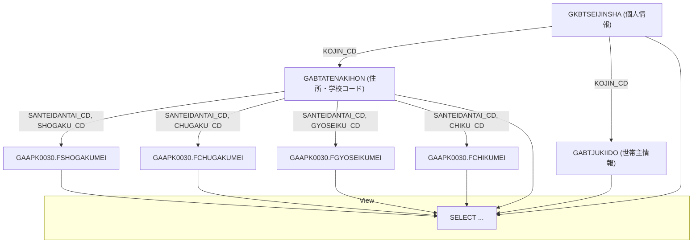

## GKBVEUCSEIJIN ビュー概要

**ファイル**: `D:\code-wiki\projects\all\sample_all\sql\GKBVEUCSEIJIN.SQL`  
**オブジェクト種別**: `FORCE VIEW`  

### 1. 目的・役割
このビューは、児童・生徒の個人情報（氏名・生年月日・性別 等）と、**所属する学校・行政区・地区** の名称コードを結合し、**「宛名印刷」や「出欠管理」等の帳票作成** に直接利用できる形に整形したものです。  
- **年度・整理番号** で一意にレコードを特定  
- 学校コードから名称取得は PL/SQL パッケージ `GAAPK0030` の関数で行い、コードと名称の両方を同時に取得  
- 左外部結合 (`(+ )`) により、個人情報は必ず取得しつつ、学校・行政区情報が欠けてもレコードは残ります（帳票に空欄を出力できる）

> **新規開発者が最初に抱く疑問**  
> 「なぜ同じ `KOJIN_CD` で 3 つのテーブルを結合しているのか？」  
> → 個人テーブル `GKBTSEIJINSHA` が基点で、**住所情報** と **学校情報** が別テーブルに分散しているため、外部結合で欠損データを許容しつつ、必要な属性をすべて取得しています。

---

## 2. カラム構成とビジネス意味

| カラム名 | 説明 | 取得元 |
|----------|------|--------|
| **年度** | 対象学年（例: 2023） | `A.NENDO` |
| **整理番号** | データ管理用シリアル | `A.SEIRI_NO` |
| **宛名番号** | 個人コード（外部キー） | `A.KOJIN_CD` |
| **氏名かな / 氏名漢字** | 氏名（かな・漢字） | `A.SHIMEI_KANA` / `A.SHIMEI_KANJI` |
| **生年月日 / 表示用生年月日** | 生年月日（内部用・表示用） | `A.SEINENGAPI` / `B.HYOJI_SEINENGAPI` |
| **性別** | `A.SEIBETU` |
| **中学校区 / 行政区** | 住所区分 | `A.TYUGAKO_KU` / `A.GYOSEI_KU` |
| **郵便番号 / 町名 / 番地 / 方書** | 住所詳細 | `A.YUBIN_NO` / `A.CHOMEI` / `A.BANCHI` / `A.KATAGAKI` |
| **電話番号** | `A.TEL_NO` |
| **出欠区分** | 出欠管理フラグ | `A.SYUKETSU_KBN` |
| **算定団体コード** | 給付対象団体 | `A.SANTEIDANTAI_CD` |
| **宛名＿小学校コード / 名称** | 小学校コード・名称 | `B.SHOGAKU_CD` / `GAAPK0030.FSHOGAKUMEI` |
| **宛名＿中学校コード / 名称** | 中学校コード・名称 | `B.CHUGAKU_CD` / `GAAPK0030.FCHUGAKUMEI` |
| **宛名＿行政区コード / 名称** | 行政区コード・名称 | `B.GYOSEIKU_CD` / `GAAPK0030.FGYOSEIKUMEI` |
| **宛名＿地区コード / 名称** | 地区コード・名称 | `B.CHIKU_CD` / `GAAPK0030.FCHIKUMEI` |
| **世帯主カナ / 世帯主名** | 世帯主情報（別テーブル） | `C.NUSHI_SHIMEI_KANA` / `C.NUSHI_SHIMEI_KANJI` |

> **ポイント**  
> - 学校・行政区・地区名称は、**コード → 名称** の変換ロジックを PL/SQL 関数に委譲しているため、ビュー側はロジックを保持しません。変更は `GAAPK0030` パッケージだけで済みます。

---

## 3. 実装詳細とフロー

### 3.1 主なロジック

1. **基点テーブル** `GKBTSEIJINSHA`（エイリアス `A`）から全レコードを取得。  
2. `A.KOJIN_CD` をキーに、**左外部結合**で  
   - `GABTATENAKIHON`（エイリアス `B`） → 住所・学校コード  
   - `GABTJUKIIDO`（エイリアス `C`） → 世帯主情報  
   を結合。`(+)` により、`B`・`C` が無くても `A` の行は残ります。  
3. 結合後、`B` のコード列を `GAAPK0030` パッケージの関数に渡し、**名称文字列**を取得。`NVL(..., '')` で NULL を空文字に変換。  
4. 最終的に SELECT 句で列を並べ替え、`FORCE VIEW` として保存。

### 3.2 例外・注意点

| 例外種別 | 発生条件 | 対応 |
|----------|----------|------|
| **NULL 名称** | 対応コードが `GAAPK0030` に未登録 | `NVL(..., '')` により空文字で出力。帳票側で「未設定」等のデフォルト表示が可能 |
| **外部結合欠損** | `GABTATENAKIHON` または `GABTJUKIIDO` に該当レコードが無い | `A` の情報は必ず取得できるが、住所・学校情報は空欄になる。帳票ロジックで「住所不明」等のハンドリングが必要 |
| **パッケージ変更** | `GAAPK0030` の関数シグネチャが変わる | ビューは再コンパイルが必要。影響範囲はこのビューだけで済む設計になっている |

---

## 4. 依存関係

| 依存先 | 種別 | 用途 | リンク |
|--------|------|------|--------|
| `GKBTSEIJINSHA` | テーブル | 個人基礎情報 | [GKBTSEIJINSHA](http://localhost:3000/projects/all/wiki?file_path=GKBTSEIJINSHA) |
| `GABTATENAKIHON` | テーブル | 住所・学校コード | [GABTATENAKIHON](http://localhost:3000/projects/all/wiki?file_path=GABTATENAKIHON) |
| `GABTJUKIIDO` | テーブル | 世帯主情報 | [GABTJUKIIDO](http://localhost:3000/projects/all/wiki?file_path=GABTJUKIIDO) |
| `GAAPK0030` | PL/SQL パッケージ | コード → 学校・行政区・地区 名称変換 | [GAAPK0030](http://localhost:3000/projects/all/wiki?file_path=GAAPK0030) |
| `GKBVEUCSEIJIN` | ビュー（本体） | 帳票用統合データ提供 | [GKBVEUCSEIJIN](http://localhost:3000/projects/all/wiki?file_path=D:/code-wiki/projects/all/sample_all/sql/GKBVEUCSEIJIN.SQL) |

> **設計上の意図**  
> - **テーブル分割**: 個人情報と住所・学校情報を別テーブルにすることで、更新頻度の違い（個人は頻繁、住所は稀）に対応。  
> - **外部結合**: データ欠損時でも帳票は生成できるようにし、運用上のロバスト性を確保。  
> - **関数委譲**: 名称取得ロジックをパッケージに集約し、コード変更が最小限で済むようにした。

---

## 5. 今後の保守・拡張ポイント

1. **新しい学校区分の追加**  
   - `GAAPK0030` に新関数を追加し、ビューは再コンパイルだけで対応可能。  
2. **住所項目の正規化**  
   - 住所テーブル構造が変わる場合は、`GABTATENAKIHON` のカラム名・結合条件を更新すればよい。  
3. **パフォーマンス改善**  
   - 大量データで遅延が出る場合は、`GKBTSEIJINSHA.KOJIN_CD` と `GABTATENAKIHON.KOJIN_NO`、`GABTJUKIIDO.KOJIN_NO` にインデックスを付与。  
4. **ビューのバージョニング**  
   - 変更履歴はコメント行（例: `--1.0.000.000-02.02-02.02`）で管理しているが、Git のタグやリリースノートと併用すると追跡が容易。

---

**まとめ**  
`GKBVEUCSEIJIN` は「個人情報 + 学校・行政区情報」の統合ビューで、帳票作成に最適化された構造です。外部結合と PL/SQL 関数の活用により、データ欠損や名称変更に対して柔軟に対応できる設計となっています。新規開発者は、**テーブル間の結合ロジックと `GAAPK0030` の関数** がキーになることを意識すれば、機能追加や保守がスムーズに行えるでしょう。