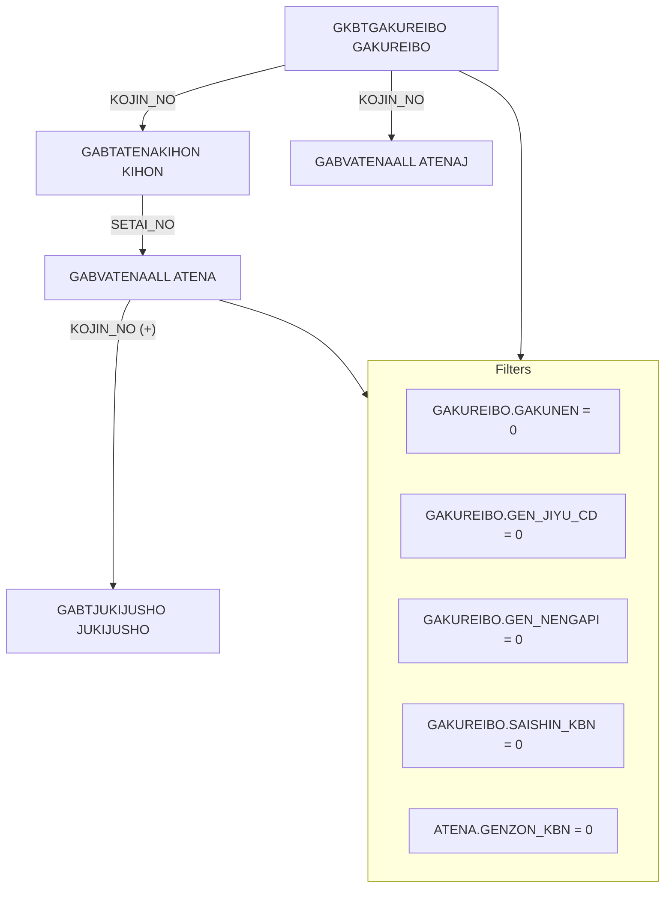

## GKBVEUCSETAIKOSEI ビュー概要  
**ファイル**: `D:\code-wiki\projects\all\sample_all\sql\GKBVEUCSETAIKOSEI.SQL`  

### 1. 目的・役割
このビューは **「新入学児童世帯構成情報」** を統合的に取得するための読み取り専用オブジェクトです。  
- 児童・生徒とその世帯員の氏名（かな／漢字）、生年月日、性別、続柄情報、現住所など、帳票・レポート作成で必要となる項目を 1 行にまとめます。  
- 複数テーブル（`GKBTGAKUREIBO`, `GABTATENAKIHON`, `GABVATENAALL`, `GABTJUKIJUSHO`）から最新の履歴レコードを取得し、**世帯単位** でソートして返します。  
- 主に WizLIFE 2 次開発（2024/06/03）での UI 表示や外部システム連携に利用されます。

### 2. 主な構成要素
| カラム | 意味 | コメント |
|--------|------|----------|
| 児童生徒宛名番号 | 児童・生徒の個人識別番号 | `GAKUREIBO.KOJIN_NO` |
| 児童生徒氏名カナ / 児童生徒氏名漢字 | 児童・生徒の氏名 | `ATENAJ.SHIMEI_KANA`, `ATENAJ.SHIMEI_KANJI` |
| 世帯番号 | 世帯を識別するキー | `ATENAJ.SETAI_NO` |
| 世帯員宛名番号 | 世帯員の個人識別番号 | `ATENA.KOJIN_NO` |
| 世帯員氏名カナ / 世帯員氏名漢字 | 世帯員の氏名 | `ATENA.SHIMEI_KANA`, `ATENA.SHIMEI_KANJI` |
| 人格区分 | 児童・世帯員の属性区分 | `ATENA.JINKAKU_KBN` |
| 生年月日 / 表示用生年月日 | 生年月日（内部値／表示用） | `ATENA.SEINENGAPI`, `ATENA.HYOJI_SEINENGAPI` |
| 性別 | `DECODE` により「男/女」へ変換 | `ATENA.SEIBETSU` |
| 現住所 | 住所文字列生成関数 `GAAPK0010.FADDRESSEDIT` の結果 |  |
| 続柄コード①〜④、続柄名 | 続柄情報（最大 4 階層） | `ATENA.ZOKUGARA_CD*`, `ATENA.ZOKUGARA_MEI` |
| 筆頭者氏名 | 世帯の代表者氏名 | `JUKIJUSHO.NUSHI_HITTOSYA` |

### 3. 変更履歴ハイライト
| バージョン | 主な変更点 | コメント |
|------------|------------|----------|
| 0.3.000.000 (2024/06/03) | カラム名のかな表記を **カナ** に統一、コメント更新 | WizLIFE 2 次開発に合わせた UI 変更 |
| 5.4.000.000 (2020/03/05) | 結合条件を外部結合に変更 (`(+ )`) | 設計書変更に伴う結合ロジックの修正 |
| 5.4.000.000 (2020/06/11) | 表示用生年月日カラムへ修正 | UAT 故障対応 |

---

## コードレベルの洞察  

### 3‑1. SELECT 部分のロジック
```sql
SELECT
    GAKUREIBO.KOJIN_NO               -- 児童生徒宛名番号
  , ATENAJ.SHIMEI_KANA               -- 児童生徒氏名カナ
  , ATENAJ.SHIMEI_KANJI              -- 児童生徒氏名漢字
  , ATENAJ.SETAI_NO                  -- 世帯番号
  , ATENA.KOJIN_NO                   -- 世帯員宛名番号
  , ATENA.SHIMEI_KANA                -- 世帯員氏名カナ
  , ATENA.SHIMEI_KANJI               -- 世帯員氏名漢字
  , ATENA.JINKAKU_KBN                -- 人格区分
  , ATENA.SEINENGAPI                -- 生年月日
  , ATENA.HYOJI_SEINENGAPI          -- 表示用生年月日
  , DECODE(ATENA.SEIBETSU,1,'男',2,'女','') SEIBETSU
  , GAAPK0010.FADDRESSEDIT(1,'',ATENA.CHOMEI,ATENA.BANCHI,ATENA.KATAGAKI,'')
  , ATENA.ZOKUGARA_CD1
  , ATENA.ZOKUGARA_CD2
  , ATENA.ZOKUGARA_CD3
  , ATENA.ZOKUGARA_CD4
  , ATENA.ZOKUGARA_MEI
  , JUKIJUSHO.NUSHI_HITTOSYA
```
- **最新履歴取得**: `ATENA.RIREKI_RENBAN` と `ATENAJ.RIREKI_RENBAN` はサブクエリで **最大連番** を取得し、最新の履歴レコードだけを対象にしています。  
- **外部結合**: `ATENA` と `JUKIJUSHO` は外部結合 (`(+)`) により、住所情報が無くても児童情報は取得可能です。  
- **住所生成**: `GAAPK0010.FADDRESSEDIT` はカスタム関数で、都道府県・市区町村・番地等を結合し文字列化します。  

### 3‑2. FROM / WHERE の結合構造

- **主キー結合**: `GAKUREIBO.KOJIN_NO` が児童・生徒と世帯情報のハブ。  
- **世帯情報取得**: `KIHON`（世帯基本テーブル）と `ATENA`（世帯員テーブル）を `SETAI_NO` で結合。  
- **住所テーブル**は外部結合で、住所が未登録でもレコードは取得。  

### 3‑3. フィルタ条件
| 条件 | 意味 |
|------|------|
| `GAKUREIBO.GAKUNEN = 0` | 学年が「未設定」(0) のみ対象（新入学児童） |
| `GAKUREIBO.GEN_JIYU_CD = 0`、`GEN_NENGAPI = 0`、`SAISHIN_KBN = 0` | 0 がデフォルト/未使用コードであることを保証 |
| `ATENA.GENZON_KBN = 0` | 世帯員の在籍区分が「在籍」(0) のみ |
| `RIREKI_RENBAN` の最大値取得 | 最新履歴レコードを抽出 |

### 3‑4. ソート順
```
ORDER BY
  GAKUREIBO.GAKKO_KBN_CD,
  GAKUREIBO.SYOGAKO_CD,
  GAKUREIBO.TYUGAKO_CD,
  GAKUREIBO.KUIKIGAI_CD,
  GAKUREIBO.YOGOGAKO_CD,
  GAKUREIBO.GAKUNEN,
  ATENAJ.SHIMEI_KANA,
  ATENA.KISAI_JUNI
```
- 学校区分・学年・氏名かな順に並べ、同一世帯内は `KISAI_JUNI`（世帯員順序）で整列します。

---

## 依存関係・関連オブジェクト

| オブジェクト | 種類 | 用途 | Wiki リンク |
|--------------|------|------|-------------|
| `GKBTGAKUREIBO` | テーブル | 児童・生徒の基本情報（個人番号・学年等） | [GKBTGAKUREIBO](http://localhost:3000/projects/all/wiki?file_path=GKBTGAKUREIBO) |
| `GABTATENAKIHON` | テーブル | 世帯基本情報（世帯番号） | [GABTATENAKIHON](http://localhost:3000/projects/all/wiki?file_path=GABTATENAKIHON) |
| `GABVATENAALL` | テーブル | 世帯員情報（氏名、続柄、生年月日等） | [GABVATENAALL](http://localhost:3000/projects/all/wiki?file_path=GABVATENAALL) |
| `GABTJUKIJUSHO` | テーブル | 住所情報（現住所） | [GABTJUKIJUSHO](http://localhost:3000/projects/all/wiki?file_path=GABTJUKIJUSHO) |
| `GAAPK0010.FADDRESSEDIT` | 関数 | 住所文字列生成ロジック | [FADDRESSEDIT](http://localhost:3000/projects/all/wiki?file_path=GAAPK0010.FADDRESSEDIT) |
| `GKBVEUCSETAIKOSEI` | **ビュー** | 本ファイルが定義するオブジェクト | [GKBVEUCSETAIKOSEI](http://localhost:3000/projects/all/wiki?file_path=D:/code-wiki/projects/all/sample_all/sql/GKBVEUCSETAIKOSEI.SQL) |

> **注**: 上記リンクは同一プロジェクト内に対象オブジェクトの Wiki ページが存在する前提です。実際のパスはプロジェクト構成に合わせて調整してください。

---

## 例外・注意点

| 項目 | 発生条件 | 推奨対策 |
|------|----------|----------|
| 住所が NULL の場合 | `JUKIJUSHO` に該当レコードが無い | 外部結合により行は取得できるが、`現住所` カラムは NULL になる。レポート側で NULL 判定を実装 |
| 複数履歴が残っている場合 | `RIREKI_RENBAN` が最大でないレコードが残存 | サブクエリで最大連番を取得しているため、過去データは自動的に除外されるが、履歴テーブルのインデックス最適化を検討 |
| 性別コードが 1,2 以外 | `ATENA.SEIBETSU` が 1/2 以外 | `DECODE` のデフォルト '' が返る。必要に応じてマスタテーブルでコード追加 |

---

## まとめ（新規開発者へのアドバイス）

1. **ビューは読み取り専用** であり、テーブル構造や履歴管理ロジックに依存しています。テーブル定義や履歴テーブルのインデックス変更は、ビューのパフォーマンスに直結します。  
2. **カラム名の変更履歴**（かな → カナ 等）は UI 側の表示ロジックに影響するため、フロントエンドのバインディングも合わせて確認してください。  
3. **パフォーマンスチューニング** が必要な場合は、結合キー (`KOJIN_NO`, `SETAI_NO`) に対するインデックスと、`RIREKI_RENBAN` のサブクエリを `MAX` 集計に置き換えるビュー（マテリアライズドビュー）への検討が有効です。  
4. **変更履歴コメント** がコード中に多数残っているので、将来的に `git` のコミットメッセージやチケット管理システムに統合し、SQL ファイル自体はクリーンに保つことを推奨します。  