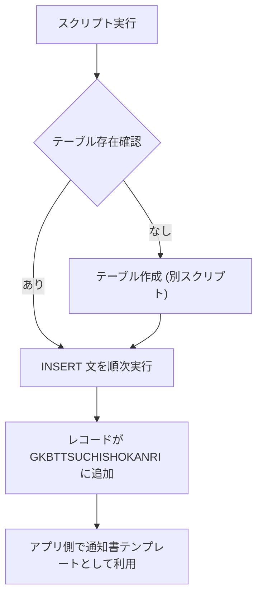

# GKBTTSUCHISHOKANRI テーブルへの初期データ投入  
**ファイルパス**: `D:\code-wiki\projects\all\sample_all\sql\INS_GKBTTSUCHISHOKANRI.SQL`

---

## 1. 概要

この SQL スクリプトは、**GKBTTSUCHISHOKANRI**（通知書マスタ）テーブルに、教育委員会が発行する各種通知書テンプレートを **定数レコード** として登録します。  
主な目的は:

| 目的 | 説明 |
|------|------|
| **テンプレート管理** | 各通知書（健康診断通知書、入学通知書、就学免除通知書 など）の項目構成・文面を一元管理し、アプリケーション側で動的に組み立てられるようにする |
| **業務ロジックの簡素化** | 画面やバッチから「通知書種別コード」だけ指定すれば、必要な項目名・表示順・定型文が取得できる |
| **法令・公印情報の統一** | 「（公印省略）」「黒色の電子公印」等、全通知書で共通するフッター情報をレコード単位で保持 |

> **新規開発者が最初に抱く疑問**  
> - 何のテーブルに対する INSERT なのか？  
> - 各カラムの意味は？特に `CHOHYO_KBN`・`SHOCHU_KBN` などは業務コードらしいが、どのように使われるのか？  
> - 文中の `CHR(13)||CHR(10)` は改行コードであり、テンプレート本文の改行を表すことを忘れないこと。

---

## 2. テーブル構造と主要カラム

| カラム | 意味・使用例 | 備考 |
|--------|--------------|------|
| **CHOHYO_KBN** | 通知書種別コード（例: `'1'`＝健康診断通知書、 `'2'`＝小学校入学通知書） | 業務ロジックで種別判定に使用 |
| **CHOHYO_MEI** | 種別名称（日本語） | UI 表示用 |
| **HYOJI_JUN** | 表示順（整数） | ソート順に利用 |
| **SHUHATS_MEI** | 発信元名称（※現状 `NULL`） | 将来的に発信元組織を分ける想定 |
| **SHOCHU_KBN** | 書式区分（`0`＝自由入力、`1`＝日付系、`2`＝調査書系） | フォーム生成時の制御に使用 |
| **DATE_MEI1〜5** | 日付項目ラベル（例: `'実施日'`） | 必要に応じて最大 5 件まで |
| **KOMOKU_MEI1〜10** | 項目ラベル（例: `'開始時間'`、`'受付会場'`） | 最大 10 項目まで定義 |
| **KOIN_SHORYAKU / KOIN_CHUSHAKU** | 公印・署名に関する文言 | 例: `（公印省略）` |
| **TSUCHIBUN** | 本文（長文） | `CHR(13)||CHR(10)` で改行を表現 |
| **TOKKIJIKO** | 特記事項（例: `NULL`） | 任意 |
| **YOSHIKI_BANGO_SETTOGO / YOSHIKI_BANGO / YOSHIKI_BANGO_SETSUBIGO** | 書類番号構成要素（第・号 等） | 書類番号の組み立てに使用 |
| **BIKO_TITLE / BIKO** | 備考タイトル・本文 | 任意の補足情報 |
| **SYS_*** 系列 | システム管理項目（作成日・更新日・担当者等） | データベーストリガやアプリ側で自動設定 |

> **注**: `SYS_*` 系列は本スクリプトでは固定値（例: `20251201`）が入っているが、実運用では `CURRENT_DATE` 等に置き換えることが想定されます。

---

## 3. データ投入ロジック

### 3.1 基本フロー



1. **テーブルが存在すれば**、`INSERT INTO GKBTTSUCHISHOKANRI ... VALUES (...)` が 39 件（種別ごとに 1 件）実行されます。  
2. 各レコードは **固定のテンプレート** であり、業務ロジックは「種別コード → レコード取得 → 必要項目だけ画面に展開」のシンプルな流れです。

### 3.2 文字列結合と改行

- 本文 (`TSUCHIBUN`) は Oracle の文字列結合演算子 `||` と `CHR(13)||CHR(10)`（CR+LF）で改行を埋め込んでいます。  
- 例:  

  ```sql
  '注意事項' || CHR(13) || CHR(10) ||
  '(1)　別紙「健康診断票」の太線枠内を確認・記入し、当日お持ちください。' || CHR(13) || CHR(10) ||
  …
  ```

  → アプリ側で取得した文字列はそのまま改行付きテキストとして表示できます。

---

## 4. 主な通知書種別と業務シナリオ

| 種別コード | 種別名称 | 主な利用シーン | 代表的な項目 |
|------------|----------|----------------|--------------|
| `1` | 健康診断通知書 | 学校保健安全法に基づく健康診断の案内 | `実施日`, `開始時間`, `受付時間`, `受付会場` |
| `2` | 小学校入学通知書 | 入学式・入学期日の案内 | `入学式日`, `入学期日` |
| `3` | 中学校入学通知書 | 同上（中学校） | `入学式日`, `入学期日` |
| `4` | 転入学通知書 | 他校からの転入手続き案内 | `（公印省略）` だけで本文が法令引用 |
| `5` | 編入学通知書 | 編入学手続き案内 | 同上 |
| `6` | 健康診断結果通知書 | 診断結果の通知 | `（公印省略）` と結果文言 |
| `7` | 健康診断票 | 診断票自体の配布 | 基本的に項目なし |
| `8` | 学齢簿 | 学齢簿の管理・配布 | 基本的に項目なし |
| `21` | 教育異動通知書 | 学齢簿の異動情報 | 法令引用文 |
| `22` | 就学猶予通知書 | 就学猶予・免除の通知 | `備考` フィールドあり |
| `23`‑`24` | 新設校・廃校に伴う入学通知書 | 学校統廃合時の入学案内 | 入学期日、注意事項 |
| `25` | 外国籍児童への就学案内 | 外国籍児童向けの案内 | ほぼ空テンプレート |
| `26` | 出入国記録照会書 | 在留・帰国記録の照会依頼 | 法令引用と添付物説明 |
| `27` | 就学免除通知書 | 就学免除決定の通知 | `備考` フィールドあり |
| `29`‑`30` | 学校選択制案内書（小・中） | 学校選択制の手続き案内 | 調査書提出期限 |
| `31`‑`32` | 学校選択制調査書（小・中） | 調査書の記入依頼 | 回答期限 |
| `33`‑`34` | 入学予定通知書（小・中） | 入学までのスケジュール案内 | `入学期日` 等 |
| `35`‑`36` | 新設校・廃校に伴う入学通知書（小・中） | 学校統廃合時の入学案内 | 同上 |
| `37` | 外国籍児童への就学案内 | 同上（別レコード） | 空テンプレート |
| `38` | 出入国記録照会書 | 同上（別レコード） | 詳細文面 |
| `39` | 就学免除通知書 | 同上（別レコード） | `備考` あり |

> **ポイント**: 種別コードは **連番** であるが、業務上は **意味のあるコード**（例: `1`＝健康診断）としてハードコードされているケースが多い。新規通知書を追加する際は、コード体系と `HYOJI_JUN`（表示順）を意識して拡張すること。

---

## 5. 依存関係・参照先

| 参照先 | 内容 | リンク |
|--------|------|--------|
| `GKBTTSUCHISHOKANRI` テーブル定義 | カラム定義・制約（PK, FK 等） | [GKBTTSUCHISHOKANRI テーブル定義](http://localhost:3000/projects/all/wiki?file_path=src/database/tables/GKBTTSUCHISHOKANRI.sql) |
| 通知書生成ロジック | 種別コードからテンプレート取得・PDF 生成 | [通知書生成サービス](http://localhost:3000/projects/all/wiki?file_path=src/services/NotificationGenerator.java) |
| 法令テキストリポジトリ | `TSUCHIBUN` に埋め込まれる法令引用文 | [法令テキスト定義](http://localhost:3000/projects/all/wiki?file_path=src/resources/laws/education_laws.sql) |

> **注意**: 本スクリプトは **データ投入のみ** を行うため、テーブル作成やインデックス付与は別スクリプト（`DDL_GKBTTSUCHISHOKANRI.SQL` 等）で管理されています。テーブル構造が変更された場合は、**DDL と INSERT の整合性** を必ず確認してください。

---

## 6. 今後の拡張・留意点

| 項目 | 推奨アクション |
|------|----------------|
| **多言語化** | 現在は日本語固定。`CHOHYO_MEI` 等に `EN_` カラムを追加し、国際化対応を検討 |
| **バージョニング** | `SYS_TANMATU_NO`（バージョン）を活用し、テンプレート改訂履歴を管理 |
| **動的項目数** | `DATE_MEI*`・`KOMOKU_MEI*` が固定上限 5/10。将来的に項目増が必要なら正規化（別テーブル）を検討 |
| **改行コードの統一** | Oracle 固有の `CHR(13)||CHR(10)` を `\n` に置換し、他 DB への移植性を向上 |
| **テストデータ管理** | 本 INSERT は **マスタデータ** として本番環境でも使用。テスト環境では `TRUNCATE` 後に再投入するスクリプトを用意 |

---

## 7. まとめ

- 本ファイルは **通知書テンプレートマスタ** を一括で登録するスクリプトであり、業務ロジックは「種別コード → テンプレート取得」のシンプルさに依存しています。  
- 主要カラムの意味と利用シーンを把握すれば、**新しい通知書の追加** や **既存テンプレートの修正** が容易です。  
- 変更時は **テーブル定義・DDL** と **通知書生成ロジック** の整合性を必ず確認し、**バージョン管理**（`SYS_TANMATU_NO`）を活用してください。  