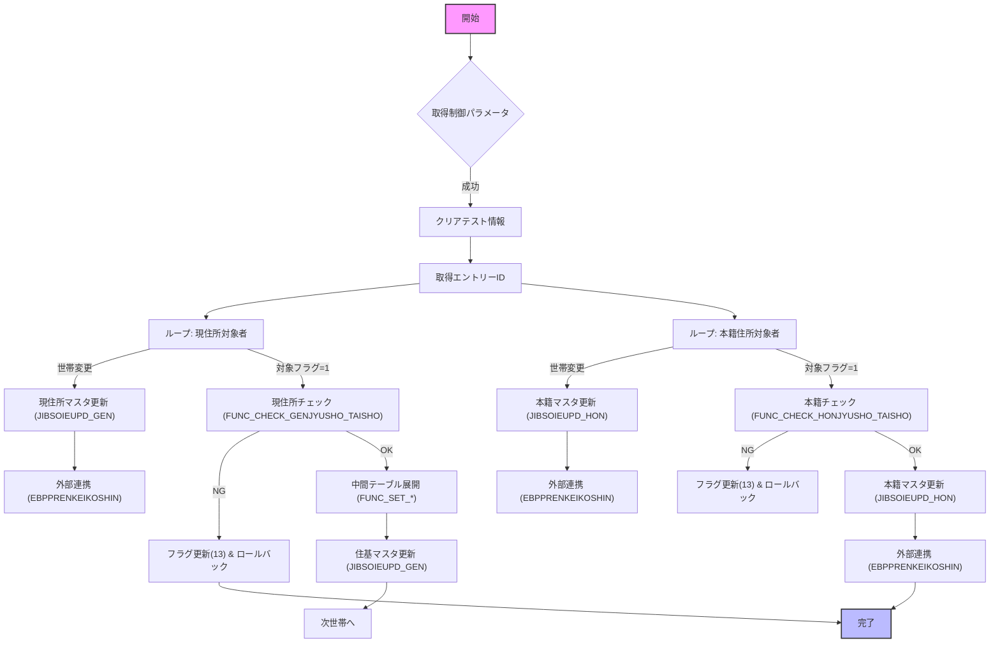

# JIBSOJHJIBUPD プロシージャ Wiki

> **対象ファイル**: `D:\code-wiki\projects\all\sample_all\sql\JIBSOJHJIBUPD.SQL`  
> **最終更新**: 2024/11/09  

---

## 目次
1. [概要](#概要)  
2. [主要コンポーネント一覧](#主要コンポーネント一覧)  
3. [処理フロー概観](#処理フロー概観)  
4. [詳細コード解説](#詳細コード解説)  
   - 4.1 [定数・制御パラメータ](#定数制御パラメータ)  
   - 4.2 [ローカル変数・レコード型](#ローカル変数レコード型)  
   - 4.3 [補助関数・手続き](#補助関数手続き)  
   - 4.4 [メインロジック](#メインロジック)  
5. [エラーハンドリング方針](#エラーハンドリング方針)  
6. [外部依存・呼び出し先](#外部依存呼び出し先)  
7. [留意点・改善ポイント](#留意点改善ポイント)  

---

## 概要
`JIBSOJHJIBUPD` は **住居表示変更**（現住所・本籍住所）に伴う住基（住民基本台帳）マスタ更新を一括で実行する PL/SQL ストアドプロシージャです。  

- **入力**: テストフラグ、異動日・届出日・異動届出区分、備考文字列、職員番号・端末番号、出力用エラーコード/メッセージ。  
- **処理**:  
  1. 変更対象者（`JIBTJUSHOHENKO_TAISHO`）をカーソルで取得。  
  2. 現住所・本籍住所それぞれについて、対象者チェック → IES 中間テーブルへデータ展開 → 住基マスタ更新（`JIBSOIEUPD` 呼び出し） → 連携テーブル（国民年金等）更新 → 住所変更証明書管理テーブルへ履歴登録。  
  3. 世帯単位でバッチ処理し、エントリーID を取得しながらトランザクションを分割。  
- **出力**: `o_NSQL_CODE`（0＝成功、-1＝例外）と `o_VSQL_MSG`（エラーメッセージ）。  

> **新規開発者へのポイント**  
- 本プロシージャは **大量レコードをバッチ処理** するため、ロジックの分岐とエラーハンドリングが多層に渡ります。  
- 変更対象のフラグ (`GEN_TAISHO_FLG` / `HON_TAISHO_FLG`) が `1` のみ実際に更新が走ります。  
- テストモード (`i_TEST_FLG = 1`) では実テーブルではなくテストフラグ列が更新され、ロジックは同一です。  

---

## 主要コンポーネント一覧
| 種別 | 名前 | 種類 | 目的 | Wiki リンク |
|------|------|------|------|-------------|
| **プロシージャ** | `JIBSOJHJIBUPD` | `CREATE OR REPLACE PROCEDURE` | 住居表示変更バッチ本体 | [JIBSOJHJIBUPD](http://localhost:3000/projects/all/wiki?file_path=D:/code-wiki/projects/all/sample_all/sql/JIBSOJHJIBUPD.SQL) |
| **カーソル** | `CJUSHOHENKOTAISHO` | `CURSOR` | 変更対象者（現住所・本籍）取得 | 同上 |
| **補助関数** | `FUNC_INPUT_CTL_CONSTANT` | `FUNCTION` | 制御パラメータ（CTLPRM1〜9）取得 | 同上 |
| | `FUNC_CLEAR_TAISHO_TEST` | `FUNCTION` | テストフラグクリア | 同上 |
| | `FUNC_GET_DATA` | `FUNCTION` | 宛名基本・住基異動テーブル取得 & 更新日付設定 | 同上 |
| | `FUNC_CHECK_GENJYUSHO_TAISHO` | `FUNCTION` | 現住所対象者の整合性チェック | 同上 |
| | `FUNC_CHECK_HONJYUSHO_TAISHO` | `FUNCTION` | 本籍住所対象者の整合性チェック | 同上 |
| | `FUNC_UPDATE_GENJYUSHO` | `FUNCTION` | 現住所更新ロジック（中間テーブル展開→マスタ更新） | 同上 |
| | `FUNC_UPDATE_HONJYUSHO` | `FUNCTION` | 本籍住所更新ロジック | 同上 |
| | `FUNC_GET_W_ENTORYID` | `FUNCTION` | エントリーID（シーケンス）取得 | 同上 |
| | `FUNC_JIBSOIEUPD_GEN` / `FUNC_JIBSOIEUPD_HON` | `FUNCTION` | IES 中間テーブルから住基マスタ更新（現住所/本籍） | 同上 |
| | `FUNC_EBPPRENKEIKOSHIN` | `FUNCTION` | 国民年金・戸籍連携等外部システム呼び出し | 同上 |
| **手続き** | `INIT_EBT_...` 系列 | `PROCEDURE` | IES 中間テーブル（宛名基本・住基異動・住基住所）初期化 | 同上 |
| | `FUNC_SET_ATENAKIHON` | `FUNCTION` | 宛名基本中間テーブル INSERT | 同上 |
| | `FUNC_SET_JUKIIDO` | `FUNCTION` | 住基異動中間テーブル INSERT | 同上 |
| | `FUNC_SET_JUKIJUSHO` | `FUNCTION` | 住基住所中間テーブル INSERT | 同上 |
| | `FUNC_SET_JUSHOHENKO` | `FUNCTION` | 住所変更証明書管理テーブル INSERT | 同上 |
| | `FUNC_SET_IES_JUKIJOHO` | `FUNCTION` | 住基情報中間テーブル INSERT | 同上 |

---

## 処理フロー概観


- **世帯単位**でエントリーIDを取得し、同一世帯の全対象者をまとめて IES 中間テーブルへ展開し、最後に一括で住基マスタ更新・外部連携を実行します。  
- 例外が発生した場合は **対象フラグを `13（その他）` に戻し、IES 中間テーブルを削除** してロールバックします。

---

## 詳細コード解説

### 定数・制御パラメータ
| 定数 | 値 | 意味 |
|------|----|------|
| `C_ISUCCESS` | `0` | 正常終了 |
| `C_INOT_SUCCESS` | `-1` | 例外発生 |
| `C_GENJUSHO` | `420` | 現住所変更事由コード |
| `C_HONJUSHO` | `410` | 本籍変更事由コード |
| `C_GEN` / `C_HON` | `'C'` / `'H'` | 住基情報中間テーブルでの区分 |
| `C_ZENBU` | `0` | 住基情報更新対象（全体） |
| `C_YITIBU` | `1` | 本籍情報更新対象 |
| `C_KOSINZUMI` | `10` | 住基更新済 |
| `C_HIGENZON` | `11` | 住基未更新（非現存） |
| `C_HUYIKI` | `12` | 住基未更新（不一致） |
| `C_SONOTA` | `13` | 住基未更新（その他） |
| `C_GEN` | `'C'` | 現住所区分 |
| `C_HON` | `'H'` | 本籍区分 |
| `C_ZENBU` | `0` | 現住所（全体） |
| `C_YITIBU` | `1` | 本籍（部分） |
| `C_GENJUSHO` | `420` | 事由コード 42（現住所変更） |
| `C_HONJUSHO` | `410` | 事由コード 41（本籍変更） |

`FUNC_INPUT_CTL_CONSTANT` で `KKAPK0030.FPRMGET` から取得した `CTLPRM1〜9` が `FLAG` 判定や外部連携ロジックに使用されます。  

### ローカル変数・レコード型
- **日付系**: `W_SYSDATE`, `W_SYSTIME`, `W_NIDOBI`, `W_NTODOKE_BI`（`YYYYMMDD` 形式に正規化）。  
- **世帯・フラグ管理**: `w_V_SETAINO`, `w_V_GEN_KOJIN_NO`, `w_V_HON_KOJIN_NO`（カンマ区切りで同世帯の個人番号を保持）。  
- **中間テーブルレコード**: `o_EBT_...` 系列（宛名基本・住基異動・住基住所・情報中間・住所変更証明書管理）。  
- **配列型**:  
  - `M_TAISHO`（世帯内退避レコード）  
  - `MRENKEIDATA`（世帯内連携データ退避）  

### 補助関数・手続き

#### 1. `FUNC_INPUT_CTL_CONSTANT`
- `KKAPK0030.FPRMGET` で `CTLPRM1〜9` を取得し、ローカル変数に格納。  
- 取得失敗時は `C_INOT_SUCCESS` を返す。

#### 2. `FUNC_CLEAR_TAISHO_TEST`
- `JIBTJUSHOHENKO_TAISHO` のテストフラグ列 (`GEN_TEST_FLG`, `HON_TEST_FLG`) を `0` にリセット。

#### 3. `FUNC_GET_DATA`
- `JIBTJUKIKIHON` と `JIBTJUKIIDO` から対象者の宛名・住基異動情報を取得。  
- テストモードか本番モードかで `TEST_DATE/TIME` または `UPDATE_DATE/TIME` を更新。  
- 失敗時は対象フラグを `13（その他）` に設定し、IES 中間テーブルを削除してロールバック。

#### 4. `FUNC_CHECK_GENJYUSHO_TAISHO` / `FUNC_CHECK_HONJYUSHO_TAISHO`
- **非現存チェック**: `GENZON_KBN > 0` → フラグ `11`（非現存）を設定。  
- **項目不一致チェック**: 変更前情報と住基情報の比較（氏名、続柄、世帯番号、住所要素等）。不一致ならフラグ `12`（不一致）を設定。  
- **整合性 OK**: フラグ `10`（更新済）を設定し、`C_ISUCCESS_EXEC` を返す。  

#### 5. `FUNC_UPDATE_GENJYUSHO` / `FUNC_UPDATE_HONJYUSHO`
- 対象者チェック → `FUNC_SET_ATENAKIHON` → `FUNC_SET_IES_JUKIJOHO` → `FUNC_SET_JUKIIDO` → `FUNC_SET_JUKIJUSHO` の順に IES 中間テーブルへデータ展開。  
- 失敗した段階で **対象フラグを `13（その他）` に戻し、展開した中間テーブルを削除**。  

#### 6. `FUNC_GET_W_ENTORYID`
- `KKFTNEXTIDKANRI`（シーケンス管理テーブル）から `NEXTID` を取得し、`W_ENTORYID` に設定。取得失敗時は `1` を使用。  

#### 7. `FUNC_JIBSOIEUPD_GEN` / `FUNC_JIBSOIEUPD_HON`
- `JIBSOIEUPD`（外部パッケージ）を呼び出し、住基マスタを更新。  
- 成功時は `KKFTNEXTIDKANRI` の `NEXTID` をインクリメント。  
- 失敗時は対象フラグを `13（その他）` に戻し、IES 中間テーブルを削除。  

#### 8. `FUNC_EBPPRENKEIKOSHIN`
- 世帯内退避データ (`MRENKEIDATA`) を基に外部システム（国民年金 `NKBSOJIDO`、戸籍連携 `NKBSOJIDO` など）へ連携呼び出し。  
- 住所変更証明書管理テーブル (`JIBTJUSHOHENKO`) へ履歴レコードを登録。  

### メインロジック
```plsql
BEGIN
    -- 初期化
    W_SYSDATE := TO_CHAR(SYSDATE,'YYYYMMDD');
    W_SYSTIME := TO_CHAR(SYSDATE,'HH24MISS');
    -- 日付正規化 (KKAPK0020.FDAYEDIT)
    ...

    -- 制御パラメータ取得
    I_RTN := FUNC_INPUT_CTL_CONSTANT;

    -- システム条件取得 (NKOSEKIJKN)
    I_RTN := KKAPK0030.FCTGetR('JIB','SYSTEM_JOKEN','0002','3',o_tITEM);
    ...

    -- テスト情報クリア
    I_RTN := FUNC_CLEAR_TAISHO_TEST;

    -- エントリーID 取得
    I_RTN := FUNC_GET_W_ENTORYID;

    -- ------------------- 現住所バッチ -------------------
    FOR R_TAISHO IN CJUSHOHENKOTAISHO LOOP
        IF 世帯が変わった THEN
            -- 前世帯のまとめ処理
            IF w_V_GEN_KOJIN_NO IS NOT NULL THEN
                FUNC_JIBSOIEUPD_GEN;
                FUNC_EBPPRENKEIKOSHIN(C_GEN);
                FUNC_GET_W_ENTORYID;   -- 次エントリーID取得
            END IF;
            -- カウンタ・テーブルリセット
        END IF;

        IF R_TAISHO.GEN_TAISHO_FLG = 1 THEN
            W_UPDKUBUN := 1;          -- 現住所
            W_JIYU    := C_GENJUSHO;   -- 事由コード 42
            FUNC_GET_DATA(R_TAISHO);
            M_TAISHO(I_CNT+1) := R_TAISHO;
            FUNC_UPDATE_GENJYUSHO(R_TAISHO);
        END IF;
    END LOOP;
    -- 最終世帯のまとめ処理 (GEN)

    -- ------------------- 本籍バッチ -------------------
    -- 1 秒スリープでエントリーID 重複回避
    DBMS_LOCK.SLEEP(1);
    FOR R_TAISHO IN CJUSHOHENKOTAISHO LOOP
        ... (同様に HON フラグが 1 のみ処理)
    END LOOP;
    -- 最終世帯のまとめ処理 (HON)

EXCEPTION
    WHEN OTHERS THEN
        o_NSQL_CODE := NVL(SQLCODE, C_INOT_SUCCESS);
        o_VSQL_MSG  := SUBSTR(SQLERRM,1,255);
END JIBSOJHJIBUPD;
```

---

## エラーハンドリング方針
- **例外捕捉**は各補助関数・手続き内部で `WHEN OTHERS` を使用し、`SQLCODE` と `SQLERRM` をローカル変数 `o_NSQL_CODE` / `o_VSQL_MSG` に格納。  
- メインブロックでも最上位で例外捕捉し、同様にエラー情報を設定。  
- **ロールバック**は自動的に行われません。失敗した場合は対象フラグを `13（その他）` に更新し、展開した IES 中間テーブルを手動で削除（`DELETE FROM JIBWIES_...`）して状態をクリアします。  
- **テストモード**は `i_TEST_FLG = 1` のとき、実テーブル更新ではなく `*_TEST_FLG` 列を更新し、ロジックは同一です。  

---

## 外部依存・呼び出し先
| 依存先 | 種別 | 用途 |
|--------|------|------|
| `KKAPK0020.FDAYEDIT` | パッケージ関数 | 入力日付（和暦・西暦）正規化 |
| `KKAPK0030.FPRMGET` / `FCTGetR` | パッケージ関数 | 制御パラメータ・システム条件取得 |
| `JIBSOIEUPD` | 外部プロシージャ | IES 中間テーブルから住基マスタ更新（現住所/本籍） |
| `NKBSOJIDO` | 外部プロシージャ | 国民年金異動報告データ連携 |
| `EBPPKOSEKINEWXEROXTEXT`（コメントアウト） | 外部プロシージャ | 戸籍連携（将来的に有効化予定） |
| `UAT_NEXTIDKANRI` → `KKFTNEXTIDKANRI` | テーブル | エントリーID（シーケンス）管理 |
| `DBMS_LOCK.SLEEP` | ビルトイン | エントリーID 重複防止のため 1 秒待機 |

---

## 留意点・改善ポイント
1. **トランザクション管理**  
   - 現在は暗黙的に自動コミットが走りますが、バッチ全体を `SAVEPOINT`/`ROLLBACK TO SAVEPOINT` で囲むと、世帯単位のロールバックが容易になります。  

2. **エラーログの統一**  
   - `o_NSQL_CODE` と `o_VSQL_MSG` の設定は各関数で重複しています。共通エラーハンドラ（例: `RAISE_APPLICATION_ERROR`）に集約すると保守性が向上します。  

3. **カーソルのパフォーマンス**  
   - `CJUSHOHENKOTAISHO` は `GEN_TAISHO_FLG = 1 OR HON_TAISHO_FLG = 1` のレコードだけを取得するようにフィルタを追加すると、不要なループ回数を削減できます。  

4. **テストモードの分離**  
   - 現在はフラグだけでテストモードを切り替えていますが、テスト用スキーマに切り替えるか、`PRAGMA AUTONOMOUS_TRANSACTION` を利用したサンドボックス化を検討してください。  

5. **文字列結合の安全性**  
   - `w_V_GEN_KOJIN_NO` / `w_V_HON_KOJIN_NO` にカンマ区切りで個人番号を連結し `IN` 句で使用していますが、レコード数が多いと SQL 文が長くなりエラーになる可能性があります。`TABLE` 型バインド変数を使用したバインド方式に変更すると安全です。  

--- 

> **次に読むべきページ**  
- [JIBSOIEUPD（住基マスタ更新）](http://localhost:3000/projects/all/wiki?file_path=.../JIBSOIEUPD.SQL)  
- [NKBSOJIDO（国民年金連携）](http://localhost:3000/projects/all/wiki?file_path=.../NKBSOJIDO.SQL)  

--- 

*本ドキュメントは新規開発者が `JIBSOJHJIBUPD` の全体像と各部品の役割を迅速に把握できるよう設計されています。実装変更やバグ修正時は、**フロー図** と **関数間の入出力** を必ず更新してください。*