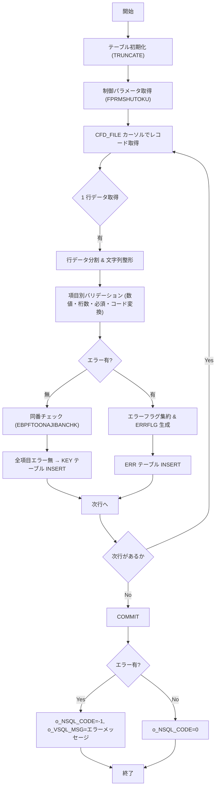

# 📄 **JIBSOJHJKNCHK プロシージャ**  
**ファイル:** `D:\code-wiki\projects\all\sample_all\sql\JIBSOJHJKNCHK.SQL`  

---  

## 1. 概要概説
| 項目 | 内容 |
|------|------|
| **業務名** | 住民記録 (JIB) |
| **プロシージャ名** | `JIBSOJHJKNCHK` |
| **目的** | 住居表示変更条件 FD データを一時保存テーブル `JIBWJUSHOHENKO_TMP` から取得し、項目ごとの妥当性チェックを実施。エラーが無いレコードは同番チェック用ワークテーブル `JIBWJUSHOHENKO_KEY` に、エラーがあるレコードはエラーテーブル `JIBTJUSHOHENKO_JKN_ERR` に出力する。 |
| **呼び出し元** | バッチジョブや画面からのデータ取込処理 (呼び出し側は `i_NSHORIBI`, `i_VMACHINE_NAME`, `i_NSHOKUIN_NO` を渡す) |
| **戻り値** | `o_NSQL_CODE` (0: 正常, -1: 異常) と `o_VSQL_MSG` (エラーメッセージ) |
| **主要テーブル** | `JIBWJUSHOHENKO_TMP`, `JIBWJUSHOHENKO_KEY`, `JIBTJUSHOHENKO_JKN_ERR` |
| **外部モジュール** | `KKAPK3000.FTRUNCATE`, `KKAPK0030.FPRMSHUTOKU`, `KKAPK0030.FCTGetR`, `JIBSKGYOSEGET` などの汎用パッケージ |

> **新規担当者へのポイント**  
> - このプロシージャは「データのバリデーション + 同番チェック」だけを担うので、テーブル構造やコード変換マスタ (`GABTSHIKUCHOSON` など) が正しくメンテナンスされているかが前提条件です。  
> - エラー情報は文字列フラグ (`*`, `&`, `#`, `@`, `%`, `$`) が連結されて `ERRFLG` に格納され、後続バッチで集計・通知に利用されます。  

---

## 2. パラメータ定義
| パラメータ | モード | 型 | 用途 |
|-----------|--------|----|------|
| `i_NSHORIBI` | IN | NUMBER | 処理日 (作成日) |
| `i_VMACHINE_NAME` | IN | NVARCHAR2 | 端末識別子 |
| `i_NSHOKUIN_NO` | IN | NVARCHAR2 | 更新担当者個人番号 |
| `o_NSQL_CODE` | OUT | NUMBER | 終了ステータス (0: 正常, -1: 異常) |
| `o_VSQL_MSG` | OUT | NVARCHAR2 | エラーメッセージ文字列 |

---

## 3. 主な処理フロー  

### 3‑1. 初期化処理
1. `JIBTJUSHOHENKO_JKN_ERR` と `JIBWJUSHOHENKO_KEY` を `KKAPK3000.FTRUNCATE` で全削除。  
2. 制御パラメータ (`CTLPRM1`〜`CTLPRM9`) を `KKAPK0030.FPRMSHUTOKU` で取得。取得失敗時は全て 0 にフォールバック。

### 3‑2. データ抽出・行単位処理
* `CFD_FILE` カーソルで `JIBWJUSHOHENKO_TMP.DATA` (BLOB) を取得。  
* 行区切りは CR (`CHR(13)`) → `DBMS_LOB.INSTR` で位置取得し、`UTL_RAW.CAST_TO_VARCHAR2` で文字列化、UTF‑8 → SJIS 変換。  
* 1 行は 30 以上のカンマ区切り項目に分割し、**順序**は「変更前」→「変更後」→「補助情報」(郵便番号・支所コード等) の 26 項目。

### 3‑3. バリデーションロジック
| 種類 | 実装関数 | 主なチェック項目 |
|------|----------|-----------------|
| 数値判定 | `EBPFCHKNUMERIC` | 空文字は NG、数字のみか判定 |
| 桁数判定 | `EBPFCHKIKETASU` | 指定桁数以内か |
| コード変換 | `EBPFCHKCDHENKOU` / `EBPFCHKCDHENKOU1` | 対象コードがマスタテーブルに存在するか |
| 相関チェック | 直接 `IF … THEN` ブロック | 例: `EDABAN1` がある場合は `HONBAN` 必須、枝番上限に応じた必須項目等 |
| 同番チェック | `EBPFTOONAJIBANCHK` | 変更前住所キーが `JIBWJUSHOHENKO_KEY` に重複しないか |

エラーは **フラグ文字** を対象項目のエラーカラムに連結し、最終的に `ERRFLG` に集約。  
フラグ文字の意味  
| 記号 | 意味 |
|------|------|
| `*` | データタイプ不正 (数値でない) |
| `&` | 桁数オーバー |
| `#` | 必須項目未入力 |
| `@` | コード変換失敗 (マスタ未登録) |
| `%` | 相関チェックエラー |
| `$` | 同番チェックエラー |

### 3‑4. 正常レコードの登録
* 全エラーフラグが `NULL` の場合、`JIBWJUSHOHENKO_KEY` に以下を設定して INSERT  
  * 変更前住所キー (`BF_CITY_CD` 〜 `BF_EDABAN3`)  
  * メタ情報 (`SYS_SAKUSEIBI`, `SYS_KOSHINBI`, `SYS_JIKAN`, `SYS_SHOKUINKOJIN_NO`, `SYS_TANMATSU_NO`)  

### 3‑5. エラーレコードの登録
* エラーフラグを集計し `ERRFLG` を生成。  
* 元データの各項目を **サブストリング** (長さ 10/20) で `JIBTJUSHOHENKO_JKN_ERR` に格納。  
* `NERRDATACOUNT` と `NERRORFLG` をインクリメント。

### 3‑6. 終了処理
* すべての行を処理したら `COMMIT`。  
* `NERRORFLG = 1` → `o_NSQL_CODE = -1` (異常)  
* それ以外 → `o_NSQL_CODE = 0` (正常)  

---

## 4. 主要サブルーチン・関数

| 名称 | 種別 | 役割 |
|------|------|------|
| `EBPFCHKNUMERIC` | 関数 | 文字列が数値か判定し、NULL 判定も返す |
| `EBPFCHKIKETASU` | 関数 | 桁数チェック |
| `EBPFCHKCDHENKOU` | 関数 | `GABTSHIKUCHOSON` でコード変換チェック (自治区分 1) |
| `EBPFCHKCDHENKOU1` | 関数 | `KKATCD` でコード変換チェック (汎用) |
| `EBPFCHKSONOTA` | 関数 | 同番チェック用ワークテーブル `JIBWJUSHOHENKO_KEY` の重複検索 |
| `EBPFTOONAJIBANCHK` | 手続き | 同番エラーフラグ `$` を付与 |
| `PROCCLEAR` | 手続き | エラーレコードの各項目フラグを初期化 |
| `JIBSKGYOSEGET` | 手続き (外部) | 住所から行政情報 (行政区・班・学校等) を自動取得 |

---

## 5. 依存関係・外部呼び出し

| 依存先 | 種別 | 用途 |
|--------|------|------|
| `JIBWJUSHOHENKO_TMP` | テーブル | 取り込み対象の BLOB データ |
| `JIBWJUSHOHENKO_KEY` | テーブル | 同番チェック用ワークテーブル |
| `JIBTJUSHOHENKO_JKN_ERR` | テーブル | エラーデータ格納 |
| `GABTSHIKUCHOSON` | テーブル | 市区町村コード変換マスタ |
| `GABTOAZA` | テーブル | 大字コード変換マスタ |
| `GABTBANCHIHENSHU` | テーブル | 番地編集タイプマスタ |
| `KKATCD` | テーブル | 各種コード変換 (支所・ごみ業者等) |
| `KKAPK3000.FTRUNCATE` | パッケージ | テーブル全削除 |
| `KKAPK0030.FPRMSHUTOKU` | パッケージ | 制御パラメータ取得 |
| `KKAPK0030.FCTGetR` | パッケージ | システム条件取得 (`SYSTEM_JOKEN`) |
| `JIBSKGYOSEGET` | 手続き | 住所から行政情報自動取得 (外部ロジック) |

> **リンク例** (同一プロジェクト内の別ファイルへ)  
> - `[JIBWJUSHOHENKO_TMP テーブル定義](http://localhost:3000/projects/all/wiki?file_path=sql/JIBWJUSHOHENKO_TMP.SQL)`  
> - `[KKAPK3000 パッケージ](http://localhost:3000/projects/all/wiki?file_path=sql/KKAPK3000.SQL)`

---

## 6. エラーハンドリング方針

| 例外 | 発生箇所 | 対応 |
|------|----------|------|
| `NO_DATA_FOUND` | コード変換クエリ | カウントを 0 に設定し `@` フラグを付与 |
| `OTHERS` (SQL エラー) | 任意の `INSERT` / `TRUNCATE` / 外部手続き | `ROLLBACK` → `o_NSQL_CODE = -1` → `o_VSQL_MSG` に `SQLERRM` を格納 |
| `OTHERS` (プロシージャ全体) | 予期しない例外 | 同上、最終 `EXCEPTION` ブロックで捕捉 |

---

## 7. 変更履歴

| バージョン | 日付 | 修正者 | 主な変更点 |
|------------|------|--------|------------|
| 0.2.000.000 | 2022/07/28 | ZCZL.DUANDONGLIN | 初版作成 |
| 0.0.000.000 | 2022/08/19 | JIP H.Furui | `支所CD` を `CHAR(3)` に変更、コメント整理 |
| 2022/08/19 以降 | - | - | 追加コメント・相関チェックロジック微修正 |

---

## 8. 開発者への実装上の注意点

1. **文字コード変換**  
   - BLOB は `UTF8` → `JA16SJIS` に変換しているため、入力ファイルが UTF‑8 であることを前提とする。文字化けが起きたら `CONVERT` の第2・第3引数を見直すこと。

2. **制御パラメータ (`CTLPRM*`)**  
   - `FPRMSHUTOKU` が取得できないと全項目が必須扱いになる (`0` がデフォルト)。本番環境でパラメータが欠落すると大量エラーになるので、パラメータテーブルの保守に注意。

3. **同番チェック**  
   - `EBPFTOONAJIBANCHK` は重複が見つかった場合に `$` を付与するだけで、実際の重複排除は `JIBWJUSHOHENKO_KEY` への INSERT 時に DB のユニーク制約で検出される想定。ユニーク制約が無い場合は重複レコードが流出するリスクがある。

4. **エラーフラグの集約ロジック**  
   - フラグ文字は **順序** に依存しないが、`ERRFLG` は最大 10 文字に切り詰められる (`SUBSTR(W_ERRFLG2,1,10)`)。新しいチェック項目を追加する際は、フラグ文字が 10 文字を超えないように設計するか、`ERRFLG` の長さ拡張を検討。

5. **パフォーマンス**  
   - 行単位で `INSERT` を行うため、データ件数が数万件を超えると処理時間が長くなる。大量取込時はバルク処理 (`FORALL` + コレクション) へのリファクタリングを検討。

6. **テストポイント**  
   - 正常系: 全項目が正しいケース → `JIBWJUSHOHENKO_KEY` に 1 行 INSERT。  
   - 異常系: 各フラグ (`*`, `&`, `#`, `@`, `%`, `$`) がそれぞれ 1 つだけ付くケース → `JIBTJUSHOHENKO_JKN_ERR` に正しくフラグが格納されるか。  
   - 境界値: 桁数上限 (例: 市区町村コード 5 桁) を超える入力 → `&` が付くこと。  

---  

**このドキュメントは、`JIBSOJHJKNCHK` の全体像と主要ロジックを把握し、保守・拡張作業を円滑に進めるための指針です。**  