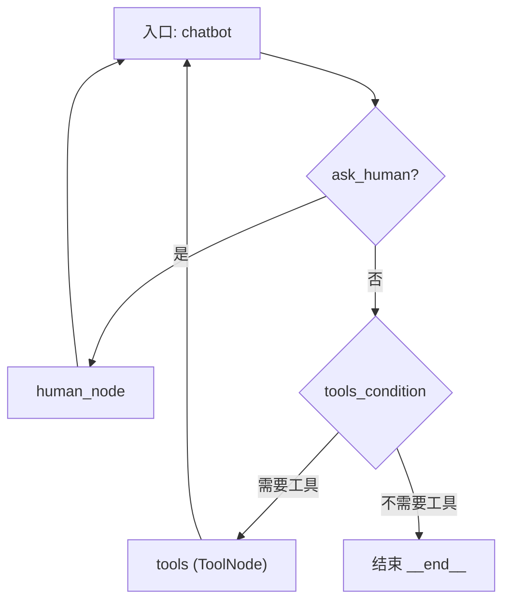

## 📄 文件概览  
**文件路径**：`D:\code-wiki\projects\agent_120\langgraph-tutorial-quickstart\agent-py\tutorial_quickstart\agent.py`

### 1. 这段代码到底在干什么？  
本文件演示了 **LangGraph** 与 **LangChain** 的组合使用，构建一个 **可中断、可升级** 的对话代理（Agent）：

| 关键概念 | 作用 |
|---|---|
| **State** | 继承自 `CopilotKitState`，在对话状态中加入 `ask_human` 标记，用来指示是否需要人工介入。 |
| **RequestAssistance** | 用 Pydantic 定义的工具（Tool），当 LLM 认为自己无法自行回答时，会返回此工具调用，触发 “请求人工帮助”。 |
| **ToolNode** | 包装外部工具（这里是 `TavilySearchResults`）的执行节点。 |
| **Human Node** | 当 `ask_human=True` 时，暂停 LLM，等待开发者（或前端）手动提供 `ToolMessage`，再继续对话。 |
| **MemorySaver** | 基于 LangGraph 的检查点（checkpoint）实现，持久化对话历史，支持中断恢复。 |
| **Graph** | 用 `StateGraph` 把上述节点串联成有向状态机，实现 **LLM → Tool → Human → LLM** 的循环。 |

> **对新接手的开发者**：这段代码的核心价值在于 **“可中断的 LLM 流程”**——当模型不确定或权限受限时，自动转向人工协助，而不是盲目返回错误答案。

---

## 2. 代码结构与实现细节  

### 2.1 关键类 / 函数一览  

| 名称 | 类型 | 说明 | Wiki 链接 |
|---|---|---|---|
| `State` | class | 扩展 `CopilotKitState`，新增 `ask_human` 标记 | [State](http://localhost:3000/projects/agent_120/wiki?file_path=D:/code-wiki/projects/agent_120/langgraph-tutorial-quickstart/agent-py/tutorial_quickstart/agent.py) |
| `RequestAssistance` | Pydantic `BaseModel` | 用作 LLM 的工具调用，携带用户的求助请求 | [RequestAssistance](http://localhost:3000/projects/agent_120/wiki?file_path=D:/code-wiki/projects/agent_120/langgraph-tutorial-quickstart/agent-py/tutorial_quickstart/agent.py) |
| `chatbot` | function | LLM 主体逻辑：调用模型、检测是否触发 `RequestAssistance`，并返回 `ask_human` 标记 | [chatbot](http://localhost:3000/projects/agent_120/wiki?file_path=D:/code-wiki/projects/agent_120/langgraph-tutorial-quickstart/agent-py/tutorial_quickstart/agent.py) |
| `human_node` | function | 当 `ask_human=True` 时执行：若前一步未产生 `ToolMessage`，补一个占位，随后清除标记 | [human_node](http://localhost:3000/projects/agent_120/wiki?file_path=D:/code-wiki/projects/agent_120/langgraph-tutorial-quickstart/agent-py/tutorial_quickstart/agent.py) |
| `select_next_node` | function | 根据 `ask_human` 决定下一个执行节点（Human 或 Tools） | [select_next_node](http://localhost:3000/projects/agent_120/wiki?file_path=D:/code-wiki/projects/agent_120/langgraph-tutorial-quickstart/agent-py/tutorial_quickstart/agent.py) |
| `create_response` | function | 将 LLM 的 `ToolCall` 包装成 `ToolMessage`，供 Human Node 使用 | [create_response](http://localhost:3000/projects/agent_120/wiki?file_path=D:/code-wiki/projects/agent_120/langgraph-tutorial-quickstart/agent-py/tutorial_quickstart/agent.py) |

### 2.2 关键实现流程  

#### 2.2.1 LLM 与工具绑定  

```python
llm = ChatAnthropic(model="claude-3-5-sonnet-20240620",
                    api_key=os.getenv("ANTHROPIC_API_KEY"))
llm_with_tools = llm.bind_tools(tools + [RequestAssistance])
```

- **为什么要绑定**：`bind_tools` 让模型在生成回复时能够直接返回结构化的 `tool_calls`，从而触发后续节点（搜索或人工请求）。  
- **工具列表**：`tools` 包含 `TavilySearchResults`（网络搜索），`RequestAssistance` 用于“升级”对话。

#### 2.2.2 `chatbot` 节点  

```python
def chatbot(state: State, config: RunnableConfig):
    config = copilotkit_customize_config(config, emit_tool_calls="RequestAssistance")
    response = llm_with_tools.invoke(state["messages"], config=config)
    ask_human = False
    if response.tool_calls and response.tool_calls[0]["name"] == RequestAssistance.__name__:
        ask_human = True
    return {"messages": [response], "ask_human": ask_human}
```

- **核心逻辑**：  
  1. **自定义配置**：`emit_tool_calls="RequestAssistance"` 告诉 CopilotKit 只在需要时输出该工具调用。  
  2. **模型调用**：把当前对话历史（`state["messages"]`）喂给 LLM。  
  3. **检测升级请求**：若返回的 `tool_calls` 名称匹配 `RequestAssistance`，则把 `ask_human` 设为 `True`，触发后续人工节点。  

#### 2.2.3 `human_node` 节点  

```python
def human_node(state: State):
    new_messages = []
    if not isinstance(state["messages"][-1], ToolMessage):
        new_messages.append(create_response("No response from human.", state["messages"][-1]))
    return {"messages": new_messages, "ask_human": False}
```

- **目的**：在 LLM 请求人工帮助后，等待外部系统（如前端）注入真实的 `ToolMessage`。若没有注入，则自动补一个占位，以防止图执行卡死。  
- **状态清理**：返回后把 `ask_human` 复位，保证后续循环回到正常路径。

#### 2.2.4 节点路由  

```python
def select_next_node(state: State):
    if state["ask_human"]:
        return "human"
    return tools_condition(state)
```

- **决策点**：  
  - `ask_human=True` → 直接跳到 `human` 节点。  
  - 否则使用 `tools_condition`（LangGraph 内置）判断是否需要调用搜索工具或结束对话。

### 2.3 整体执行图（Mermaid）



- **执行顺序**：  
  1. **chatbot** 产生回复或 `RequestAssistance` 调用。  
  2. 若标记 `ask_human`，转到 **human_node**（等待人工输入）。  
  3. 若未标记，则依据 `tools_condition` 决定是否进入 **tools**（网络搜索）或直接结束。  
  4. **tools** 完成后回到 **chatbot**，形成闭环。

---

## 3. 依赖关系与模块交互  

| 模块 | 依赖方向 | 说明 |
|---|---|---|
| `langchain_anthropic.ChatAnthropic` | → LLM | 提供 Claude 3.5 Sonnet 的调用接口。 |
| `langchain_community.tools.tavily_search.TavilySearchResults` | → ToolNode | 实现网络搜索功能，返回最多 2 条结果。 |
| `langgraph.checkpoint.memory.MemorySaver` | → Graph | 为整个状态机提供持久化检查点，支持中断恢复。 |
| `copilotkit` 系列 (`CopilotKitState`, `copilotkit_customize_config`) | → State / Config | 为 LangGraph 注入 CopilotKit 的自定义配置与状态结构。 |
| `langgraph.prebuilt.ToolNode` | ← tools | 将外部工具包装为可在图中调用的节点。 |
| `langgraph.graph.StateGraph` | ← 所有节点 | 负责把 `chatbot`、`tools`、`human` 组合成有向状态机。 |

> **注意**：  
> - `RequestAssistance` 并非外部库实现，而是本项目自定义的 **工具模型**，因此在图中不需要单独的 `ToolNode`，而是直接在 `chatbot` 中检测并设置 `ask_human`。  
> - `MemorySaver` 通过 `checkpointer=memory` 参数注入到 `graph.compile`，确保每一步的状态都被持久化。

---

## 4. 常见疑惑 & 建议的调试方式  

| 疑惑 | 解释 | 调试建议 |
|---|---|---|
| **为什么 `chatbot` 里要手动检查 `tool_calls[0]["name"]`？** | LangChain 只会在模型返回工具调用时填充 `tool_calls`，但我们只关心 `RequestAssistance`（升级请求），所以显式判断。 | 在本地运行时打印 `response.tool_calls`，确认模型是否真的返回了该工具。 |
| **`human_node` 为什么会自动生成 “No response from human.”？** | 防止图在没有外部注入 `ToolMessage` 时卡死，保证对话可以继续（即使是占位）。 | 若想强制阻塞等待真实人工输入，可删除占位逻辑或在前端实现回调。 |
| **`tools_condition` 的内部实现是什么？** | LangGraph 提供的默认路由：如果消息中包含工具调用则转到 `tools`，否则结束。 | 使用 `print(state)` 查看 `tools_condition` 的判断依据。 |
| **如何持久化对话历史到外部数据库？** | 替换 `MemorySaver` 为自定义 `Checkpointer` 实现（实现 `save_checkpoint` / `load_checkpoint`）。 | 参考 LangGraph 文档的自定义检查点示例。 |

---

## 5. 扩展思路  

1. **增加更多工具**：在 `tools` 列表中加入如 `WikipediaLookup`, `Calculator` 等，只需在 `llm_with_tools` 里绑定即可。  
2. **细化升级策略**：可以在 `RequestAssistance` 中加入 `urgency`、`category` 等字段，让前端根据不同需求分配不同专家。  
3. **多轮人工交互**：在 `human_node` 中保存人工返回的 `ToolMessage`，并在后续循环中继续使用，而不是仅作占位。  
4. **日志与监控**：在每个节点入口/出口加入结构化日志（如 `logging.info({"node": "chatbot", "state": state})`），便于追踪异常路径。  

---  

**结语**：本文件展示了一个 **“LLM + Tool + Human”** 的完整闭环实现，是构建可审计、可升级 AI 助手的基础模板。掌握其中的状态标记、节点路由以及检查点机制后，你可以轻松在此基础上加入业务专属工具、复杂的对话策略以及持久化存储。祝开发顺利！