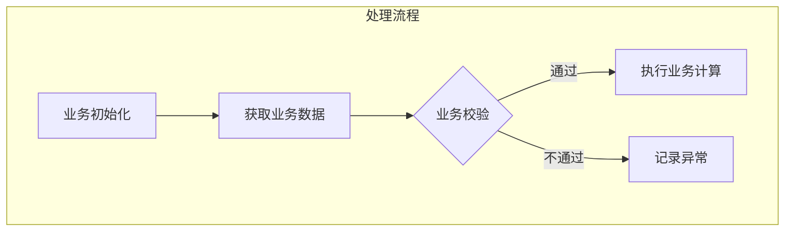

# Wiki 大文件生成方案设计

**日期**: 2026-04-09  
**目标**: 不丢失、完整准确、无幻觉输出 Wiki  
**更新**: 2026-04-13 (子流程图规范 + 结构化提取优化)

---

## 一、问题背景

### 当前架构与问题

```
源码 → 分块读取 → 逐块摘要 → 合并摘要 → LLM 生成 Wiki
```

| 问题 | 影响 |
|------|------|
| 摘要丢失细节 | 第一次摘要就丢失了代码细节 |
| 二次合并丢失 | 合并时再次压缩，细节进一步丢失 |
| 直接源码幻觉 | LLM 理解不准确，编造参数/变量 |

### 设计原则

1. **不丢失** - 所有关键信息必须保留
2. **准确输出** - 参数逐行列出，业务语义完整，无省略
3. **无幻觉** - 不编造未提供的信息

### 约束条件

- 文件类型：仅 PLSQL(.sql) + Java(.java)
- PLSQL 为主力 (约70%)，Java 为辅 (约30%)

---

## 二、实际实现架构

### 整体流程

```
file_read (分页读取) → 结构化提取 (JSON) → 合并 → Wiki生成 → Mermaid清理 → 生成后校验
                          ↓                                    ↓              ↓
                    参数/变量/常量/子程序                   检查遗漏        语法修正
```

### 核心实现

| 组件 | 文件 | 行号 | 作用 |
|------|------|------|------|
| 分页读取 | `wiki_service.py` | 360 | 1000行/次，has_more机制 |
| 结构化提取 | `wiki_service.py` | 407 | LLM提取为JSON |
| **JSON解析容错** | `wiki_service.py` | 458-473 | 3层fallback机制 |
| 合并去重 | `wiki_service.py` | 502 | 多块合并+去重 |
| 上下文策略 | `wiki_service.py` | 605 | 小文件完整源码，大文件首尾片段 |
| **Mermaid清理** | `wiki_service.py` | 771 | 调用 `sanitize_mermaid_code()` 清理语法 |
| 生成后校验 | `wiki_service.py` | 778 | 检查遗漏 |
| 提示词强化 | `wiki_agent.py` | `get_language_constraints()` | 强制引用结构化数据 |

### JSON 解析容错方案

当前实现 (`wiki_service.py` 第 458-473 行)：

```python
# 第1层：直接解析
try:
    return json.loads(content)
except json.JSONDecodeError:
    pass

# 第2层：提取 markdown 中的 JSON
try:
    if "```json" in content:
        content = content.split("```json")[1].split("```")[0]
    elif "```" in content:
        content = content.split("```")[1].split("```")[0]
    return json.loads(content)
except json.JSONDecodeError:
    pass

# 第3层：保留原始内容，返回最低限度信息
return {
    "raw_content": chunk_content,  # 保存源码，而非 LLM 输出
    "parse_error": str(e2),
    "chunk_index": chunk_index,  # 记录是哪个 chunk 解析失败
    "file_type": file_type,
    "identifier": {
        "name": "",
        "description": "提取失败，请参考原始内容",
    },
}
```

**处理流程**：
1. 首先尝试直接解析 JSON
2. 如果失败，尝试提取 markdown 代码块中的 JSON
3. 如果仍失败，保留该 chunk 的源码，在 Wiki 生成阶段会附加"补充源码"作为参考

**注意**：JSON 解析失败时，结构化数据可能不完整，但源码上下文仍可作为参考生成 Wiki。

### Token 消耗估算

以 3000 行大文件为例：

| 阶段 | 场景 | 输入内容 | Token 估算 |
|------|------|----------|------------|
| **结构化提取** | 最后一次（第3次，chunk3） | 约1000行代码 + 提取提示词 | ~2000-2500 |
| **Wiki生成** | 合并后JSON + 源码上下文 | JSON(6KB) + 首尾源码(10KB) + 提示词 | ~5000 |

**说明**：
- 结构化提取阶段：每次调用只处理一个chunk，**无源码上下文**
- Wiki生成阶段：合并后的JSON + 首尾源码片段 + 提示词
- 实际 token 取决于字段数量和代码密度

---

## 三、7段式 Wiki 骨架

详见 `.code-wiki/AGENTS.md`

```
1. 基本概要【核心业务语义】
2. 业务定位与架构职责
3. 接口契约与数据规范（主程序参数 + 子程序清单）
4. 核心逻辑与数据流向（主流程图 + 步骤业务含义）
5. 异常处理与边界条件
6. 核心业务规则（去掉变量表）
7. 使用指引与注意事项
```

### 关键优化点

| 优化 | 理由 |
|------|------|
| "一次处理"显式独立 | 业务语义核心，最先理解 |
| 第3章不展开子程序参数 | 实现细节，只关心主入口 |
| 第6章去掉变量表 | 实现细节，关注业务规则 |
| 第4章增加"步骤业务含义" | 流程图 + 说明，更易理解 |

---

## 四、源码上下文策略

### 小文件 (<1000行)

```
结构化数据（必须基于此生成）
JSON

完整代码（供参考，不直接复制）
源码

【重要】结构化数据优先，源码仅作参考验证。
```

### 大文件 (≥1000行)

```
结构化数据（必须基于此生成）
JSON

文件开头（行 1-1000）
源码片段

文件结尾
源码片段

【重要】结构化数据优先，如发现数据与代码不符，以代码为准。
```

### 补充源码（JSON 解析失败时）

当某个 chunk 的 JSON 解析失败时：
- **小文件**：不需要补充（完整源码已传）
- **大文件**：只补充**非首尾**的 chunk（首尾源码已传）

提示词会标注：
```markdown
## 补充源码（结构化提取失败的 chunk）

### chunk 3 源码（JSON 解析失败，请基于源码理解）
```源码内容...
```
```

---

## 五、准确率提升方案

### 方案1：提示词强制引用（已实现）

在 `wiki_agent.py` 中增加：

```
【重要】结构化数据引用规则
你必须严格按照以下结构化数据生成 Wiki：
- 参数表必须包含结构化数据中的**所有参数**，逐行列出
- 常量表必须包含结构化数据中的**所有业务常量**
- 子程序清单必须包含结构化数据中的**所有子程序**

禁止遗漏：如果结构化数据中有某个字段，Wiki 中必须出现
```

### 方案2：生成后校验（已实现）

在 `wiki_service.py` 中实现：

```python
def _verify_wiki_completeness(self, wiki_content: str, structure: dict):
    """校验 Wiki 是否遗漏结构化数据中的重要字段"""
    missing_items = []
    
    # 检查参数
    for param in structure.get("parameters", []):
        if param["name"] not in wiki_content:
            missing_items.append(f"参数: {param['name']}")
    
    # 检查常量
    for const in structure.get("constants", []):
        if const["name"] not in wiki_content:
            missing_items.append(f"常量: {const['name']}")
    
    # 检查子程序
    for sub in structure.get("subprograms", []):
        if sub["name"] not in wiki_content:
            missing_items.append(f"子程序: {sub['name']}")
    
    if missing_items:
        logger.warning(f"Wiki 校验发现遗漏: {missing_items[:10]}")
```

### 准确率预期

| 阶段 | 准确率 |
|------|--------|
| 优化前 | 80-90% |
| 优化后 | 90-95% |

---

## 六、实施计划

### 已完成

| 步骤 | 状态 |
|------|------|
| 添加提取提示词 EXTRACTION_PROMPTS | ✅ 完成 |
| 实现 `_extract_structure()` 函数 | ✅ 完成 |
| 实现 `_merge_extractions()` 函数 | ✅ 完成 |
| 实现 `_build_input_with_context()` 函数 | ✅ 完成 |
| 实现生成后校验 `_verify_wiki_completeness()` | ✅ 完成 |
| 提示词强化（强制引用结构化数据） | ✅ 完成 |
| 7段式骨架优化 | ✅ 完成 |
| 删除冗余的完整性检查代码 | ✅ 完成 |
| 子流程图生成规范 | ✅ 完成 (2026-04-13) |
| JSON 解析失败时保存源码 | ✅ 完成 (2026-04-13) |
| 避免重复传源码 | ✅ 完成 (2026-04-13) |

### 验收标准

- [x] 无【待确认】标记过多
- [x] 参数逐行列出，无省略
- [x] 字段映射完整
- [x] 无编造信息
- [x] 生成后校验记录遗漏
- [x] 子流程图使用业务术语
- [x] JSON 解析失败时传源码（而非 LLM 输出）

---

## 十、子流程图规范 (2026-04-13)

### 问题

之前生成的 Wiki 中，子流程图内容不完整或缺失：
- 第 4.3 节只有说明文字，无子流程图
- 流程图节点使用函数名而非业务术语

### 解决方案

在 `.code-wiki/AGENTS.md` 和 `.code-wiki/rules/02-plsql.md` 中添加：

```markdown
### 4.3 子流程图

> **关键**：第3.2节的子程序清单只列名称功能。本节必须为**关键子程序**生成子流程图。

**哪些子程序需要生成**：
- 有循环/条件分支的
- 有多步骤计算的
- 有数据聚合/汇总的

**子流程图要求**：
- 展示内部详细步骤（变量初始化 → 数据获取 → 计算 → 分支 → 结果写入）
- **节点必须使用业务术语**（如"获取年金"、"计算税额"，而非"getNenkin"、"calculateTax"）
- 节点数量根据实际业务逻辑决定

**禁止**：
- 只写文字说明，无子流程图
- 节点使用函数名/技术命名
```

### 示例



---

## 十一、结构化提取优化 (2026-04-13)

### 问题

JSON 解析失败时：
1. 之前保存的是 LLM 的原始输出（非源码）
2. 大文件时可能重复传递源码（首尾已传，中间又传）

### 解决方案

| 改动 | 说明 |
|------|------|
| 保存源码而非 LLM 输出 | `raw_content: chunk_content` |
| 记录 chunk 索引 | 方便后续判断是否重复 |
| 只补充非首尾 chunk | 首尾源码已传，避免重复 |
| 标注解析失败状态 | 告诉 LLM "JSON 解析失败，请基于源码理解" |

### 代码改动

`wiki_service.py`:

```python
# 1. 返回时保存源码
return {
    "raw_content": chunk_content,  # 改为保存源码
    "parse_error": str(e2),
    "chunk_index": chunk_index,  # 新增
    ...
}

# 2. 合并时保存格式改为 dict
raw_contents.append({
    "content": ext["raw_content"],
    "chunk_index": ext.get("chunk_index", 0),
})

# 3. 构建上下文时只补充非首尾
if chunk_idx == 1 or chunk_idx == len(chunks):
    continue  # 跳过首尾
```

### 效果

| 场景 | 修改前 | 修改后 |
|------|--------|--------|
| 小文件 + 解析失败 | 完整源码 + LLM 输出重复 | 完整源码 |
| 大文件 + 首尾解析失败 | 首尾源码 + LLM 输出重复 | 首尾源码 |
| 大文件 + 中间解析失败 | 首尾源码 + LLM 输出 | 首尾源码 + **补充中间源码**（标注） |

---

*创建时间：2026-04-09*  
*最后更新：2026-04-13*  
*状态：已完成实现*

---

## 七、代码清理

### 已删除

| 内容 | 文件 | 理由 |
|------|------|------|
| `validate_wiki_completeness()` 函数 | wiki_service.py | 已定义但未使用 |
| 完整性检查常量（OMISSION_PATTERNS等） | wiki_service.py | 冗余防御 |
| PL/SQL 规则中的"完整性检查【强制】"章节 | rules/02-plsql.md | 冗余 |
| Java 规则中的"完整性检查"章节 | rules/04-java.md | 冗余 |
| 大量"【禁止】"、"【强制】"约束 | AGENTS.md, wiki_agent.py | 简化 |

### 保留的约束

- 格式规范（禁止添加冗余信息）
- 业务语义要求（流程图用业务术语）

---

## 八、Mermaid 图表扩展

### 新增类型

| 类型 | 用途 | 替代 |
|------|------|------|
| 决策图 (flowchart) | 业务规则、条件分支 | 文字描述 |
| 序列图 (sequenceDiagram) | 调用关系、数据流动 | 数据流表格 |
| 状态图 (stateDiagram-v2) | 状态流转 | 状态描述 |

详见 `.code-wiki/AGENTS.md` 第 158-185 行。

---

## 九、子流程图规范 (2026-04-13)

### 问题

之前生成的 Wiki 中，子流程图内容不完整或缺失：
- 第 4.3 节只有说明文字，无子流程图
- 流程图节点使用函数名而非业务术语

### 解决方案

在 `.code-wiki/AGENTS.md` 和 `.code-wiki/rules/02-plsql.md` 中添加：

```markdown
### 4.3 子流程图

> **关键**：第3.2节的子程序清单只列名称功能。本节必须为**关键子程序**生成子流程图。

**哪些子程序需要生成**：
- 有循环/条件分支的
- 有多步骤计算的
- 有数据聚合/汇总的

**子流程图要求**：
- 展示内部详细步骤（变量初始化 → 数据获取 → 计算 → 分支 → 结果写入）
- **节点必须使用业务术语**（如"获取年金"、"计算税额"，而非"getNenkin"、"calculateTax"）
- 节点数量根据实际业务逻辑决定

**禁止**：
- 只写文字说明，无子流程图
- 节点使用函数名/技术命名
```

### 示例


---

## 十、结构化提取优化 (2026-04-13)

### 问题

JSON 解析失败时：
1. 之前保存的是 LLM 的原始输出（非源码）
2. 大文件时可能重复传递源码（首尾已传，中间又传）

### 解决方案

| 改动 | 说明 |
|------|------|
| 保存源码而非 LLM 输出 | `raw_content: chunk_content` |
| 记录 chunk 索引 | 方便后续判断是否重复 |
| 只补充非首尾 chunk | 首尾源码已传，避免重复 |
| 标注解析失败状态 | 告诉 LLM "JSON 解析失败，请基于源码理解" |

### 代码改动

`wiki_service.py`:

```python
# 1. 返回时保存源码
return {
    "raw_content": chunk_content,  # 改为保存源码
    "parse_error": str(e2),
    "chunk_index": chunk_index,  # 新增
    ...
}

# 2. 合并时保存格式改为 dict
raw_contents.append({
    "content": ext["raw_content"],
    "chunk_index": ext.get("chunk_index", 0),
})

# 3. 构建上下文时只补充非首尾
if chunk_idx == 1 or chunk_idx == len(chunks):
    continue  # 跳过首尾
```

### 效果

| 场景 | 修改前 | 修改后 |
|------|--------|--------|
| 小文件 + 解析失败 | 完整源码 + LLM 输出重复 | 完整源码 |
| 大文件 + 首尾解析失败 | 首尾源码 + LLM 输出重复 | 首尾源码 |
| 大文件 + 中间解析失败 | 首尾源码 + LLM 输出 | 首尾源码 + **补充中间源码**（标注） |

---

## 十一、关键文件

| 文件 | 作用 |
|------|------|
| `src/services/wiki/wiki_service.py` | 核心实现 |
| `src/agents/wiki_agent.py` | 提示词模板 |
| `.code-wiki/AGENTS.md` | 7段式骨架 |
| `.code-wiki/rules/02-plsql.md` | PL/SQL 规则 |

---

*创建时间：2026-04-09*  
*最后更新：2026-04-13*  
*状态：已完成实现*