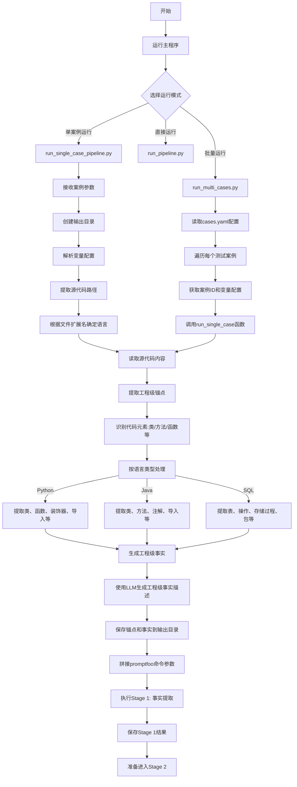

# Stage 1 之前的流程图

## 整体流程

## 详细流程说明

### 1. 启动阶段
- 用户可以选择三种运行方式：
  - `run_multi_cases.py`：批量运行多个测试案例
  - `run_single_case_pipeline.py`：运行单个测试案例
  - `run_pipeline.py`：直接运行完整管道

### 2. 配置解析阶段
- 解析测试案例配置（cases.yaml）
- 提取每个案例的ID和变量配置
- 准备运行环境和输出目录

### 3. 源代码分析阶段
- 读取源代码文件内容
- 根据文件扩展名自动识别编程语言
- 提取工程级锚点（代码中的关键元素）

### 4. 工程级事实提取阶段
- 根据不同编程语言提取相应的代码元素：
  - Python: 类、函数、装饰器、导入语句等
  - Java: 类、方法、注解、导入语句等
  - SQL: 表、操作、存储过程、包、触发器等
- 使用LLM生成工程级事实描述
- 保存锚点和事实信息到输出目录

### 5. Stage 1 准备阶段
- 拼接promptfoo命令参数
- 包含工程级事实信息
- 准备执行Stage 1的评估