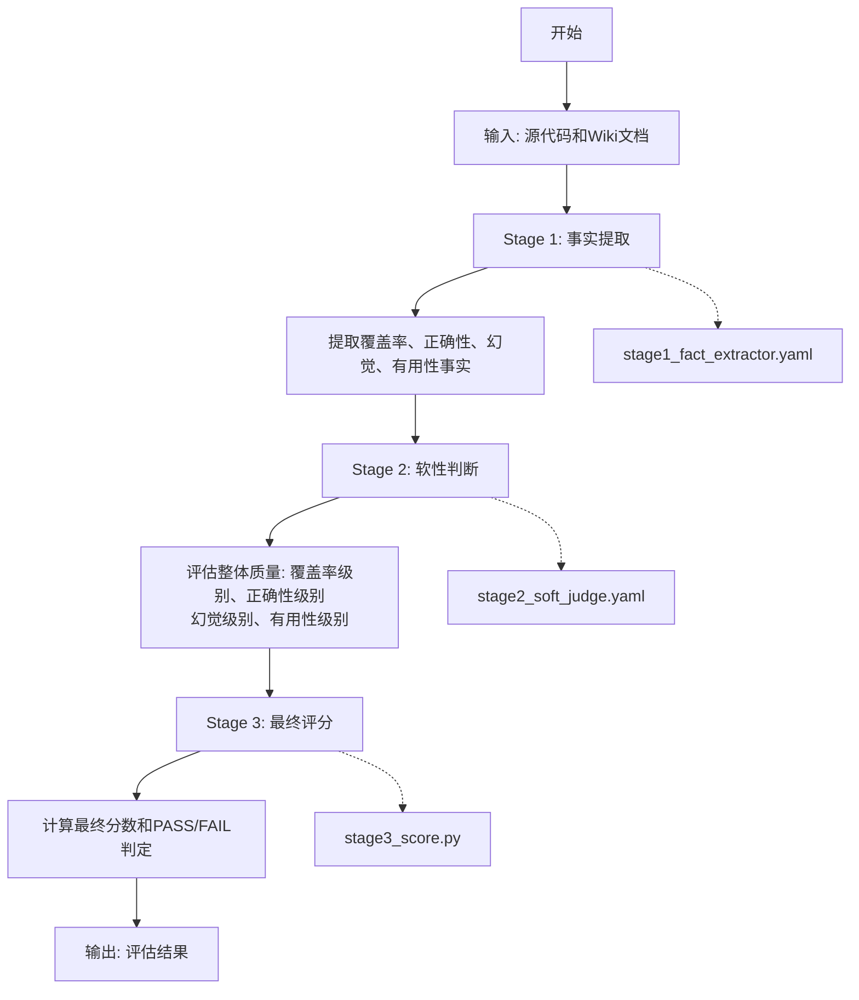
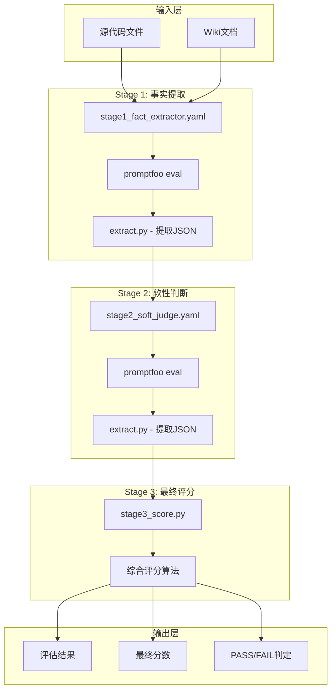
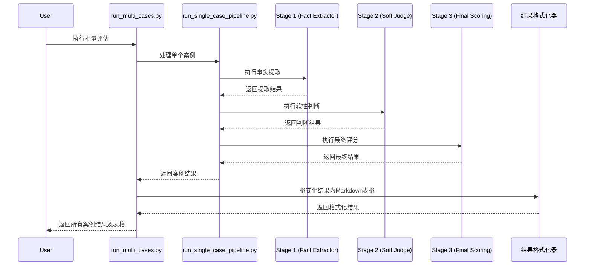
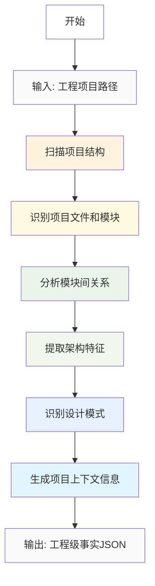
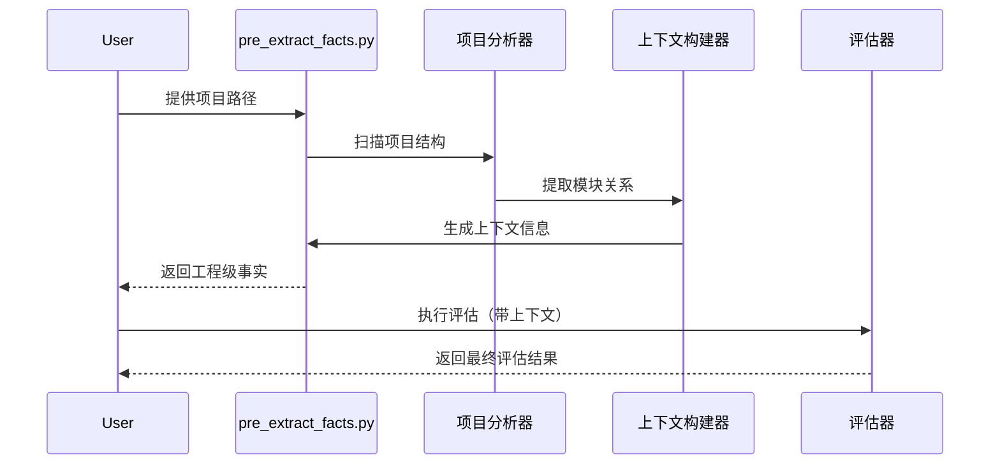
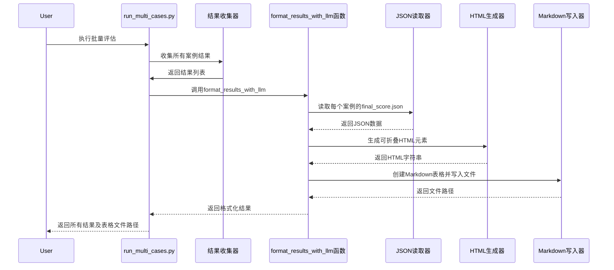

# Fact Judge 系统流程图

## 整体架构流程



### 文本流程说明

1. **开始** → **输入**: 接收源代码和Wiki文档作为输入
2. **输入** → **Stage 1**: 执行事实提取阶段
3. **Stage 1** → **提取事实**: 从源代码和文档中提取覆盖率、正确性、幻觉、有用性事实
4. **提取事实** → **Stage 2**: 执行软性判断阶段
5. **Stage 2** → **评估质量**: 评估整体质量，包括覆盖率级别、正确性级别、幻觉级别、有用性级别
6. **评估质量** → **Stage 3**: 执行最终评分阶段
7. **Stage 3** → **计算分数**: 计算最终分数和PASS/FAIL判定
8. **计算分数** → **输出**: 输出评估结果

## 详细组件交互图



### 组件交互文本说明

- **输入层**: 提供源代码文件和Wiki文档
- **Stage 1**: 使用stage1_fact_extractor.yaml配置文件，通过promptfoo eval执行事实提取，然后使用extract.py提取JSON格式结果
- **Stage 2**: 使用stage2_soft_judge.yaml配置文件，接收Stage 1的JSON结果，通过promptfoo eval执行软性判断，再使用extract.py提取JSON格式结果
- **Stage 3**: 使用stage3_score.py脚本，接收Stage 2的JSON结果，通过综合评分算法计算最终结果
- **输出层**: 生成评估结果、最终分数和PASS/FAIL判定

## 脚本执行流程



### 脚本执行文本说明

1. 用户执行run_multi_cases.py脚本启动批量评估
2. run_multi_cases.py脚本读取cases.yaml配置文件，逐个处理每个案例
3. 对于每个案例，调用run_single_case_pipeline.py脚本处理单个案例
4. run_single_case_pipeline.py脚本依次执行：
   - 调用Stage 1 (Fact Extractor) 进行事实提取
   - 接收Stage 1返回结果后，调用Stage 2 (Soft Judge) 进行软性判断
   - 接收Stage 2返回结果后，调用Stage 3 (Final Scoring) 进行最终评分
5. run_single_case_pipeline.py将最终结果返回给run_multi_cases.py
6. run_multi_cases.py收集所有案例结果后，调用结果格式化器生成Markdown表格
7. run_multi_cases.py返回所有案例结果和格式化的表格给用户

## 新增功能流程图

### 前置提取事实（工程wiki级别）流程



### 前置提取与评估流程整合


### 工程级评估流程



### 结果可视化流程

```mermaid
graph TD
    A[开始] --> B[批量评估完成]
    B --> C[收集所有案例结果]
    C --> D[读取每个案例的final_score.json]
    D --> E[提取关键信息]
    E --> F[Summary<br/>Coverage Level<br/>Usefulness Level<br/>Correctness Level<br/>Hallucination Level<br/>Coverage Rate]
    F --> G[格式化为平铺显示]
    G --> H[生成可折叠HTML元素]
    H --> I[创建Markdown表格]
    I --> J[Case ID | 文件名 | 结果 | 分数 | 详情]
    J --> K[保存为final_results_table-[timestamp].md]
    K --> L[输出完成]

    style A fill:#e3f2fd
    style B fill:#e8f5e8
    style C fill:#f1f8e9
    style D fill:#e8f5e8
    style E fill:#f1f8e9
    style F fill:#e3f2fd
    style G fill:#e8f5e8
    style H fill:#f1f8e9
    style I fill:#e8f5e8
    style J fill:#f1f8e9
    style K fill:#e3f2fd
    style L fill:#f1f8e9
```

### 结果可视化序列图

