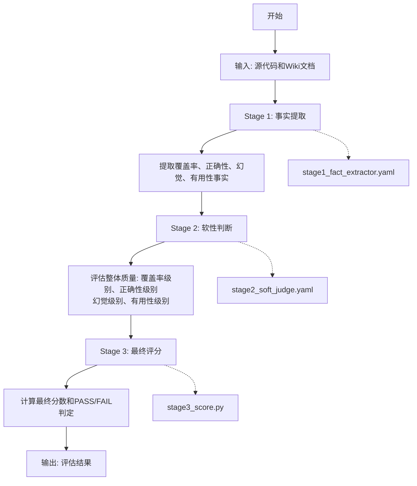

# Fact Judge 项目用户使用文档

## 项目概述

Fact Judge 是一个基于 promptfoo 框架构建的事实判断系统，专门用于评估代码文档（如Wiki）与源代码的一致性、准确性和完整性。该系统通过多阶段评估流程，自动化地判断生成的代码文档是否准确反映了源代码的功能和结构。

### 核心功能

Fact Judge 系统采用三阶段评估流程：

1. **第一阶段（Fact Extraction）**：从源代码和生成的Wiki文档中提取具体的事实信息，识别覆盖率、正确性、幻觉和有用性方面的差异。
2. **第二阶段（Soft Judge）**：基于提取的事实进行软性判断，评估文档的整体质量，包括覆盖率级别、正确性级别、幻觉级别和有用性级别。
3. **第三阶段（Final Scoring）**：根据前两个阶段的结果进行综合评分，得出最终的分数和PASS/FAIL判定。

### 系统流程图



#### 流程说明

1. **开始** → **输入**: 接收源代码和Wiki文档作为输入
2. **输入** → **Stage 1**: 执行事实提取阶段，使用stage1_fact_extractor.yaml配置文件
3. **Stage 1** → **提取事实**: 从源代码和文档中提取覆盖率、正确性、幻觉、有用性事实
4. **提取事实** → **Stage 2**: 执行软性判断阶段，使用stage2_soft_judge.yaml配置文件
5. **Stage 2** → **评估质量**: 评估整体质量，包括覆盖率级别、正确性级别、幻觉级别、有用性级别
6. **评估质量** → **Stage 3**: 执行最终评分阶段，使用stage3_score.py脚本
7. **Stage 3** → **计算分数**: 计算最终分数和PASS/FAIL判定
8. **计算分数** → **输出**: 输出评估结果

### 技术架构

- 基于 promptfoo 框架进行评估
- 支持多种大语言模型（默认使用 ollama:gpt-oss:120b）
- 采用 YAML 配置文件定义评估标准
- 通过 Python 脚本处理数据流和评分逻辑

## 安装和配置指南

### 系统要求

- Python 3.8 或更高版本
- Node.js 和 npm（用于运行 promptfoo）
- Ollama（用于运行本地大语言模型）

### 安装步骤

1. **安装 Python 依赖**

   ```bash
   pip install pyyaml
   ```

2. **安装 Node.js 依赖**

   ```bash
   npm install -g promptfoo
   ```

3. **设置 Ollama**

   - 下载并安装 Ollama
   - 启动 Ollama 服务
   - 拉取所需的模型（例如 gpt-oss:120b）

4. **克隆或下载 Fact Judge 项目**

   ```bash
   git clone <repository-url>
   cd promptfoo_wiki/fact_judge
   ```

### 配置说明

1. **环境配置**：确保系统中已安装并正确配置了 Python、Node.js、npm 和 Ollama。

2. **模型配置**：修改 YAML 配置文件中的模型参数以适应你的环境（如 `stage1_fact_extractor.yaml` 和 `stage2_soft_judge.yaml`）。

3. **数据准备**：将待评估的源代码和对应的 Wiki 文档放置在 `data` 目录下，并在 `cases.yaml` 中配置相应的测试案例。

## 使用方法说明

### 单个案例运行

要运行单个评估案例，请使用 `run_single_case_pipeline.py` 脚本：

```python
from run_single_case_pipeline import run_single_case

result = run_single_case(
    case_id="my_case",
    vars_cfg={
        "source_code": "data/my_source_code.txt",
        "wiki_md": "data/my_wiki_doc.md"
    },
    output_dir="output/my_case"
)
```

此脚本会依次执行三个阶段：
1. 运行事实提取器（stage1_fact_extractor.yaml）
2. 运行软性判断器（stage2_soft_judge.yaml）
3. 计算最终得分（stage3_score.py）

### 批量案例运行

要批量运行多个案例，请使用 `run_multi_cases.py` 脚本：

```bash
python run_multi_cases.py
```

此脚本会读取 `cases.yaml` 文件中的所有案例配置，并逐一执行评估。最终结果会保存到 `output/final_results-[timestamp].yaml` 文件中。

### 直接运行管道

你也可以直接运行整个评估管道：

```bash
python run_pipeline.py
```

这将执行完整的三阶段评估流程并将结果保存到 `output` 目录中。

## 配置文件说明

### cases.yaml

这是测试案例的配置文件，定义了要评估的源代码和Wiki文档对：

```yaml
cases:
  - id: case_001
    vars:
      source_code: data/agent.py.txt
      wiki_md: data/agent.py.md
  # - id: case_002
  #   vars:
  #     source_code: data/JIBSOJHJKNCHK.utf8.SQL
  #     wiki_md: data/JIBSOJHJKNCHK.SQL.md
  # - id: case_003
  #   vars:
  #     source_code: data/JIBSOIEUPDB.utf8.SQL
  #     wiki_md: data/JIBSOIEUPDB.SQL.md
```

每个案例包含：
- `id`: 案例唯一标识符
- `vars`: 包含源代码和Wiki文档路径的变量集合

### stage1_fact_extractor.yaml

第一阶段配置文件，负责从源代码和Wiki文档中提取事实信息：

- 使用指定的大语言模型（默认为 ollama:gpt-oss:120b）
- 定义了详细的提示词，指导模型提取覆盖率、正确性、幻觉和有用性方面的事实
- 输出JSON格式的结果，包含缺失项、错误匹配项、幻觉项等信息

### stage2_soft_judge.yaml

第二阶段配置文件，基于提取的事实进行软性判断：

- 评估文档的整体质量，包括覆盖率级别、正确性级别、幻觉级别和有用性级别
- 定义了严格的判断规则，区分GOOD、MINOR_ISSUES和BAD等级别
- 输出JSON格式的评估结果

### stage3_score.py

第三阶段评分脚本，根据前两个阶段的结果计算最终得分：

- 实现了综合评分算法
- 根据各项指标计算最终分数
- 判断结果是PASS还是FAIL

## 常见问题解答

### Q1: 如何更换使用的语言模型？

A: 你可以在 `stage1_fact_extractor.yaml` 和 `stage2_soft_judge.yaml` 配置文件中修改 `providers` 部分，将 `ollama:gpt-oss:120b` 替换为你想要使用的其他模型，例如 `openai/gpt-4` 或其他支持的模型。

### Q2: 评估结果中的分数是如何计算的？

A: 最终分数由 `stage3_score.py` 中的评分算法计算得出，主要考虑以下几个方面：
- 基础分（30分）
- 覆盖率和有用性加分
- 正确性惩罚（特别是标记为BAD的情况）
- 幻觉惩罚（特别是严重幻觉）
- 第一阶段事实提取结果的轻量校正

最终分数经过归一化处理，范围在0-100之间。

### Q3: 如何自定义评估标准？

A: 你可以通过修改 `stage1_fact_extractor.yaml` 和 `stage2_soft_judge.yaml` 中的提示词来自定义评估标准。这些文件中的详细指令决定了模型如何评估文档的质量。

### Q4: 评估过程中出现错误怎么办？

A: 如果在评估过程中遇到错误，请检查以下几点：
- 确保所有依赖项已正确安装
- 确保Ollama服务正在运行且模型可用
- 检查输入文件路径是否正确
- 查看输出目录是否有足够的写入权限

### Q5: 如何扩展系统以支持更多类型的源代码？

A: 系统设计上支持多种类型的源代码，只需确保你的源代码文件和对应的Wiki文档放在正确的路径下，并在 `cases.yaml` 中配置相应的测试案例即可。如果需要针对特定类型的语言进行优化，可以调整提示词内容。

## 总结

Fact Judge 是一个强大的自动化文档质量评估工具，通过多阶段评估流程能够全面评估代码文档与源代码的一致性、准确性和完整性。通过本指南，你应该已经了解了如何安装、配置和使用该系统，以及如何根据需要自定义评估标准。

为了更直观地理解系统的工作流程，请参阅 [FLOWCHART.md](FLOWCHART.md) 文件，其中包含了系统的详细架构图和执行流程。

如果你在使用过程中遇到任何问题，请参考常见问题解答部分，或者查看项目中的示例文件以获得更多信息。