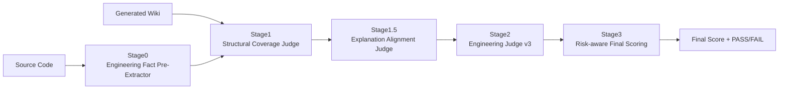

---

# Wiki Engineering Judge v3（重构设计文档）

> 设计目标：
> **准确衡量 Wiki 是否真的“帮助新接手开发者理解代码”**，
> 同时 **抑制脑补、避免极端 0 / 100 分**，与现有 Stage3 风险感知评分完全兼容。

---

## 一、整体评估架构（与现有代码完全对齐）



你现在的 pipeline **不用动**，只需要：

* **重构 Stage2 的 judging 语义**
* **微调 Stage1 / 1.5 的关注点**
* **让 Stage3 不再出现极端分**

---

## 二、评估系统的“总原则”（非常重要）

### 1️⃣ Wiki 的评估不是“是否写得多”

而是：

> **新接手开发者，看完是否：**
>
> * 知道这个文件在干嘛
> * 知道为什么这么设计
> * 知道哪里不能乱改
> * 知道接下来要去看哪里

---

### 2️⃣ 评分是连续的，不是开关式

你现在的 `final_score()` 已经是**正确方向**：

* ❌ 不再有 Stage2 = FAIL 直接 0
* ✅ 风险只做扣分
* ✅ FAIL 只在“高风险 + 解释不合理”时出现

👉 所以 **Judge 的 prompt 不能再产出极端标签**。

---

## 三、Stage0：Engineering Fact Pre-Extractor（已正确，不动）

### 定位（你现在已经做对了）

* **只抽“代码里客观存在的工程锚点”**
* 不解释、不评价、不总结
* 是后续所有 judge 的“事实地基”

Stage0 输出本质是：

> 「**Wiki 不允许越界的边界集合**」

✔ 保留现状。

---

## 四、Stage1：Structural Coverage Judge（重构目标）

### 原始问题

以前 Stage1 容易变成：

> “有没有提到类 / 方法 / 表名”

但你的 Wiki 模板关注的是：

> **“新接手开发者最大的困惑是否被覆盖”**

---

### ✅ Stage1 v3 评估目标

> Wiki 是否**覆盖了“必须解释的工程结构点”**

而不是：

* 是否逐行解释
* 是否提到所有函数

---

### Stage1 输出结构（建议）

```json
{
  "coverage_level": "HIGH | MEDIUM | LOW",
  "covered_items": [
    {
      "anchor": "Controller.handleRequest",
      "why_important": "入口方法，决定业务主流程",
      "covered": true
    }
  ],
  "missing_critical_items": [
    {
      "anchor": "i_TENKAI_KBN flags",
      "impact": "控制大量条件分支，未解释会导致误修改"
    }
  ],
  "summary": "..."
}
```

### 判定逻辑（给 Judge 的明确指令）

* **HIGH**

  * 所有“高认知负担”的结构点都有解释
* **MEDIUM**

  * 主流程清楚，但关键条件 / 状态解释不足
* **LOW**

  * 只描述代码表面结构，无法支撑理解

⚠️ **禁止输出 PASS / FAIL**

---

## 五、Stage1.5：Explanation Alignment Judge（重构重点）

这是**防脑补的核心关卡**。

### 核心问题

> Wiki 中的解释，是否**严格受限于代码事实**？

---

### Stage1.5 评估维度（非常具体）

Judge **只看三件事**：

1. 是否**引入代码中不存在的概念**
2. 是否**夸大代码的职责**
3. 是否**推断未出现的业务规则**

---

### 输出结构（建议）

```json
{
  "alignment_level": "HIGH | MEDIUM | LOW",
  "fabrication_risk": "LOW | MEDIUM | HIGH",
  "issues": [
    {
      "type": "INVENTED_BEHAVIOR",
      "statement": "This controller ensures transactional consistency",
      "reason": "代码中无事务控制"
    }
  ],
  "summary": "..."
}
```

### Judge 明确规则

* **HIGH**

  * 所有解释都能追溯到代码结构或注释
* **MEDIUM**

  * 有合理推断，但明确标注为“推测 / 可能”
* **LOW**

  * 把“代码行为”说成“业务规则”

⚠️ **fabrication_risk 只在这里产生**

---

## 六、Stage2：Engineering Judge v3（核心重构）

这是你现在**最值得重构的一层**。

---

### Stage2 不再做“裁判”

而是做：

> **“工程价值评估器”**

---

### Stage2 v3 输入

* structural_coverage_results（Stage1）
* explanation_alignment_results（Stage1.5）
* wiki_md
* artifact_type

---

### Stage2 v3 输出（必须严格匹配 Stage3）

```json
{
  "comprehension_support": "HIGH | MEDIUM | LOW",
  "engineering_usefulness": "HIGH | MEDIUM | LOW",
  "explanation_reasonableness": "HIGH | MEDIUM | LOW",
  "abstraction_quality": "GOOD | OK | POOR",
  "fabrication_risk": "LOW | MEDIUM | HIGH",
  "summary": "..."
}
```

---

### 各维度**精确定义**（给 qwen-coder 的关键）

#### 1️⃣ comprehension_support

> 新开发者能否快速建立**整体心智模型**

* HIGH：读完知道“这个文件存在的意义”
* MEDIUM：知道流程，但不清楚设计动机
* LOW：只能当注释看

---

#### 2️⃣ engineering_usefulness

> 是否能**指导实际修改 / 排查问题**

* HIGH：明确指出关键分支、风险点
* MEDIUM：只能用于阅读理解
* LOW：工程上几乎不可用

---

#### 3️⃣ explanation_reasonableness

> 解释是否**克制、可辩护**

* HIGH：解释与代码强一致
* MEDIUM：有合理抽象，但略模糊
* LOW：解释跳跃、结论先行

---

#### 4️⃣ abstraction_quality

> 抽象是否**服务理解而非装逼**

* GOOD：抽象层级恰好
* OK：略偏高或偏低
* POOR：要么复述代码，要么空谈架构

---

#### 5️⃣ fabrication_risk

> **直接透传 Stage1.5 的结论**

---

## 七、Stage3：最终打分（你现在这版是对的）

你现在的 `final_score()`：

✔ 已经满足所有目标：

* 连续分布
* 风险扣分
* 极小 FAIL 面积
* 不会轻易 0 / 100

**唯一建议（可选）**：

```python
# 防止“全 LOW + MEDIUM 风险 = 0”
final_score_value = clamp(score - risk_penalty, min_v=10, max_v=95)
```

> 这样你会得到一个**工程上更好用的分布**

---

## 八、最终效果（你将得到什么）

* Wiki 写得烂 → **20~40**
* 勉强能用 → **50~65**
* 工程友好 → **70~85**
* 教科书级 → **90 左右**
* ❌ 几乎不会再出现：

  * 动不动 0
  * 随便 100

---
 
