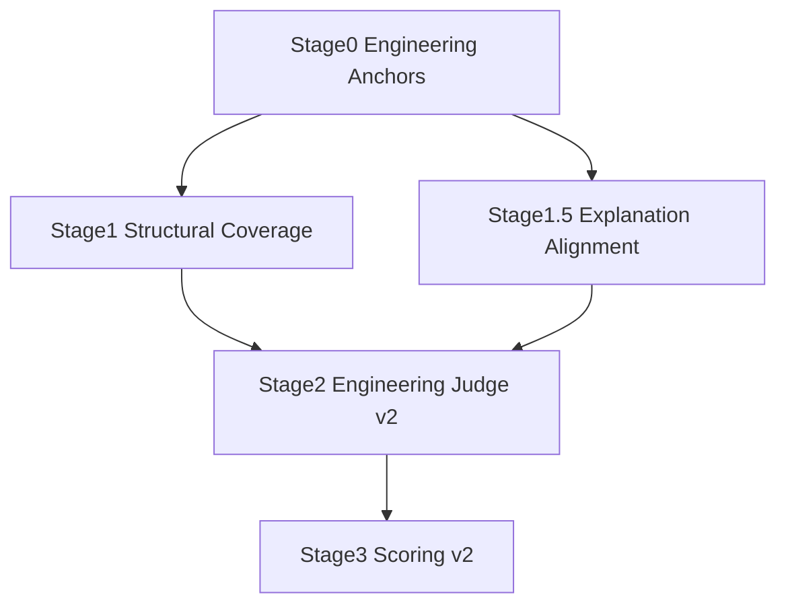

---

# Wiki Judge v2 重构设计文档（已过时）

> **注意：此文档描述的是Engineering Judge v2的架构，现已过时。请参考 [DESIGN_v3.md](DESIGN_v3.md) 了解当前的Engineering Judge v3架构。**

（Engineering-Oriented Wiki Quality Evaluation System）

---

## 1. 重构背景与问题定义

### 1.1 当前系统的核心问题

当前 Wiki 生成 Prompt 的目标是：

> 面向**新接手模块的工程师**，
> 提供 **理解路径、设计动机、工程权衡、系统角色** 的解释型文档。

但现有 Judge Pipeline（Stage0–3）的隐含评价假设是：

> 好 Wiki =
> **最大化可验证的代码事实覆盖 + 严格边界约束**

这导致以下系统性偏差：

| 现象                          | 根因                    |
| --------------------------- | --------------------- |
| 高质量解释型 Wiki 得分偏低            | 抽象解释 ≠ coverage item  |
| Mermaid / 系统级总结被惩罚          | facts 无法一一对齐          |
| 设计动机被视为 interpretation risk | boundary_adherence 过严 |
| Stage3 频繁 FAIL              | “防幻觉”优先级过高            |

---

### 1.2 重构目标（Judge v2）

**Judge v2 的目标不是“更宽松”，而是“更工程化”。**

核心目标：

1. **区分「工程抽象」与「幻觉编造」**
2. **奖励有价值的工程解释，而不是惩罚它**
3. **把风险评估从“一票否决”变成“可控扣分”**
4. **评价维度与 Wiki Prompt 明确对齐**

---

## 2. Judge v2 总体架构

### 2.1 新 Pipeline 结构



### 2.2 核心变化点

| 位置        | v1               | v2                               |
| --------- | ---------------- | -------------------------------- |
| Stage1    | 单一 Fact Coverage | Coverage + Explanation Alignment |
| Stage2    | 安全性优先            | 工程价值 + 风险并行                      |
| Stage3    | 硬 FAIL           | 软风险加权                            |
| Judge 价值观 | 防胡编              | 工程可理解性优先                         |

---

## 3. Stage 1 重构：Structural Coverage Judge（保留但降权）

### 3.1 定位调整

Stage1 **不再作为“Wiki 好坏”的主裁判**，而是：

> **判断 Wiki 是否“严重脱离代码结构”**

### 3.2 新的 Coverage 定义

**删除旧定义：**

> coverage item = 每一个函数 / SQL / 结构必须出现

**采用新定义：**

> coverage item =
> Wiki 是否**显式或隐式覆盖了 anchors 中的“核心工程角色”**

#### 示例（Java Service）：

| Anchor        | 合格覆盖方式   |
| ------------- | -------- |
| Service 类     | 类职责整体解释  |
| 核心方法          | 流程级解释    |
| Repository 依赖 | 数据流说明    |
| 异常            | 统一异常策略说明 |

❌ 不再要求：逐方法、逐 SQL 描述。

---

### 3.3 Stage1 输出（v2）

```json
{
  "structural_coverage": "HIGH | MEDIUM | LOW",
  "unexplained_critical_anchors": [
    "Transaction boundary",
    "Main data persistence flow"
  ],
  "notes": "Coverage evaluated at architectural level"
}
```

---

## 4. 新增 Stage 1.5：Explanation Alignment Judge（关键）

> **这是整个 v2 的灵魂。**

### 4.1 目的

判断 Wiki 的解释是否：

* 来自代码
* 合理抽象
* 没有编造不存在的机制

而不是：
“是不是每一句都能定位到一行代码”。

---

### 4.2 判断原则（非常重要）

允许以下行为（明确写进 Prompt）：

✅ 合并多个函数进行流程解释
✅ 抽象命名代码模式（如“状态机”“模板方法”）
✅ 解释隐含约定（如 Spring / ORM / 事务语义）
✅ 总结 SQL 的业务意图

禁止以下行为：

❌ 编造不存在的模块 / 表 / 服务
❌ 引入代码中完全不存在的流程
❌ 断言未体现的强业务规则

---

### 4.3 Stage1.5 输出结构

```json
{
  "explanation_alignment": "GOOD | PARTIAL | WEAK",
  "fabrication_risk": "LOW | MEDIUM | HIGH",
  "acceptable_abstractions": [
    "Batch processing pipeline",
    "Transactional boundary"
  ],
  "suspect_claims": [
    "Mentions async processing but no async constructs found"
  ]
}
```

---

## 5. Stage 2 重构：Engineering Judge v2

### 5.1 新评价维度（与 Wiki Prompt 对齐）

| 维度                         | 说明               |
| -------------------------- | ---------------- |
| comprehension_support      | 是否帮助新接手开发者建立认知模型 |
| explanation_reasonableness | 抽象是否合理           |
| engineering_usefulness     | 实际工程价值           |
| fabrication_risk           | 是否存在胡编           |
| abstraction_quality        | 抽象层级是否恰当         |

---

### 5.2 Stage2 输出（v2）

```json
{
  "comprehension_support": "HIGH | MEDIUM | LOW",
  "engineering_usefulness": "HIGH | MEDIUM | LOW",
  "explanation_reasonableness": "HIGH | MEDIUM | LOW",
  "abstraction_quality": "GOOD | OK | POOR",
  "fabrication_risk": "LOW | MEDIUM | HIGH",
  "summary": "Concise engineering assessment"
}
```

---

## 6. Stage 3 重构：Scoring v2（去硬 FAIL）

### 6.1 关键原则改变

❌ v1：

> 有风险 → 直接 FAIL

✅ v2：

> 风险 ≠ 死刑
> **工程价值可以抵消中等风险**

---

### 6.2 新评分逻辑（示例）

```python
base_score =
    usefulness * 35 +
    comprehension * 25 +
    explanation_reasonableness * 20 +
    abstraction_quality * 20

risk_penalty =
    fabrication_risk == HIGH ? 40 :
    fabrication_risk == MEDIUM ? 20 : 0

final_score = clamp(base_score - risk_penalty)
```

### 6.3 FAIL 条件（极小化）

仅在以下情况 FAIL：

* fabrication_risk == HIGH
  **且**
* explanation_reasonableness == LOW

👉 明确区分：

> “大胆但合理的工程抽象”
> vs
> “胡编乱造”

---

## 7. Judge v2 与 Wiki Prompt 的一致性映射

| Wiki Prompt 要求 | Judge v2 是否奖励                |
| -------------- | ---------------------------- |
| 面向新接手开发者       | ✅ comprehension_support      |
| 解释为什么这么做       | ✅ explanation_reasonableness |
| 工程思考过程         | ✅ abstraction_quality        |
| Mermaid 抽象流程   | ✅ explanation_alignment      |
| 避免复述代码         | ✅ 不再扣 coverage               |

---

## 8. 给 qwen-coder 的实施清单（可直接抄）

**必须改的文件 / 新增：**

1. `stage1_fact_extractor.yaml`
   → 改为 **Structural Coverage Judge**

2. 新增
   `stage1_5_explanation_alignment.yaml`

3. 重构
   `stage2_explanatory_judge.yaml`
   → 新维度 schema

4. 重写
   `stage3_score.py`
   → 移除硬 FAIL，改为 risk penalty


