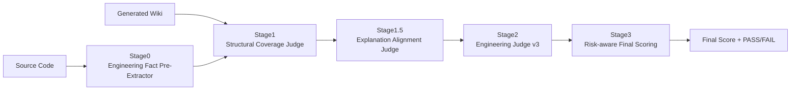

# Engineering Fact Judge v3

Engineering Fact Judge v3 是一个基于 promptfoo 框架构建的工程导向Wiki质量评估系统，专门用于评估**代码解释性文档**（如Wiki）的工程价值和风险。该系统通过多阶段评估流程，自动化地判断生成的代码解释文档是否提供了有价值的工程见解，同时保持合理的准确性。

## 概述

与传统的 Fact Judge 系统不同，Engineering Judge v3 专注于评估解释性文档的工程价值，而非严格的事实一致性。其设计目标是判断"这份文档是否提供了有价值的工程见解，同时保持合理的准确性？"，而不是"是否100%覆盖了代码中的每一个元素？"。

系统采用五阶段评估流程（包含Stage 0-3，以及Stage 1.5），确保生成的工程文档既准确又有用。

## 系统架构



### 五阶段评估流程

0. **前置阶段（Pre-fact Extraction）**：从源代码中提取工程级锚点和事实，为后续评估提供上下文
1. **第一阶段（Structural Coverage Judge）**：判断 Wiki 是否"严重脱离代码结构"，评估核心工程角色的覆盖情况
2. **第一阶段半（Explanation Alignment Judge）**：判断 Wiki 的解释是否来自代码、合理抽象、没有编造不存在的机制
3. **第二阶段（Engineering Judge v3）**：评估理解支持、工程实用性、解释合理性、抽象质量和伪造风险
4. **第三阶段（Scoring v3）**：基于工程价值进行评分，采用风险扣分机制而非硬性FAIL

## 核心评估原则

### 1. 源代码至上
- 源代码是唯一的事实依据
- 行业惯例或通用架构模式不能作为证据

### 2. 解释 ≠ 推测
- 即使合理的假设也必须有代码支持
- "常见的架构模式"不是事实

### 3. 伪造是主要风险
- 发明的层级、职责或行为被视为高风险故障
- 优先识别和拒绝虚构内容

### 4. 工程实用性次于真实性
- 有帮助但不正确的解释比不完整的解释更糟糕

## 伪造违规类别

### 1. 架构伪造 (Architectural Fabrication)
- 例如：发明的服务、控制器、框架、事务管理

### 2. 责任膨胀 (Responsibility Inflation)
- 分配代码中不存在的责任

### 3. 机制不匹配 (Mechanism Mismatch)
- 描述与代码实际行为不同的行为

### 4. 术语幻觉 (Terminology Hallucination)
- 将设计模式或概念视为未经证实的事实

### 5. 语义过度延伸 (Semantic Overreach)
- 推断代码中未显示的并发、隔离或业务语义

## 安装和配置

### 系统要求
- Python 3.8 或更高版本
- Node.js 和 npm（用于运行 promptfoo）
- Ollama（用于运行本地大语言模型）

### 安装步骤

1. **安装Python依赖**
   ```bash
   pip install -r requirements.txt
   ```

2. **安装Node.js依赖**
   ```bash
   npm install -g promptfoo
   ```

3. **设置Ollama**
   - 下载并安装Ollama
   - 启动Ollama服务
   - 拉取所需模型（例如：`ollama pull gpt-oss:120b`）

## 使用方法

### 单个案例运行

```python
from run_single_case_pipeline import run_single_case

result = run_single_case(
    case_id="my_case",
    vars_cfg={
        "source_code": "data/my_source_code.txt",
        "wiki_md": "data/my_wiki_doc.md"
    },
    output_dir="output/my_case"
)

print(f"最终得分: {result['final_score']}")
print(f"评估结果: {result['result']}")
```

### 批量案例运行

```bash
# 使用默认设置（resume 模式：跳过已完成的案例，运行剩余案例）
python run_multi_cases_unified.py
```

或者使用不同的执行模式和参数：

```bash
# all 模式：运行所有测试案例，从头开始
python run_multi_cases_unified.py all --cases my_cases.yaml --output my_output

# resume 模式：支持断点续传，跳过已完成的案例（默认模式）
python run_multi_cases_unified.py resume --cases my_cases.yaml --output my_output

# retry 模式：仅重跑失败的案例
python run_multi_cases_unified.py retry --cases my_cases.yaml --output my_output

# 使用简短参数
python run_multi_cases_unified.py all -c my_cases.yaml -o my_output
```

**执行模式说明：**
- `all`：运行所有测试案例，从头开始（相当于旧版本的 `--simple` 模式）
- `resume`：支持断点续传，跳过已完成的案例（默认模式）
- `retry`：仅重跑失败的案例（相当于旧版本的 `--retry-failed` 模式）

**新增功能：**
- **执行时间统计**：系统会自动计算并显示总执行时间和平均每案例耗时

### 对抗性回归测试

运行对抗性回归测试以确保系统稳定性：

```bash
python run_stage2_regression.py
```

测试结果将整体输出并保存到 `output/regression/regression_report.json` 文件中。

## 配置文件说明

### cases.yaml

测试案例配置文件，定义要评估的源代码和Wiki文档对：

```yaml
cases:
  - id: case_001
    vars:
      source_code: data/agent.py.txt
      wiki_md: data/agent.py.md
```

### stage1_fact_extractor.yaml

第一阶段配置文件，负责从源代码和Wiki文档中提取事实信息。

### stage1_5_explanation_alignment.yaml

第一阶段半配置文件，进行解释对齐判断。

### stage2_explanatory_judge.yaml

第二阶段配置文件，进行工程判断v3。

### stage3_score.py

第三阶段评分脚本，根据工程价值进行评分。

## 结果可视化

系统支持将评估结果输出为Markdown表格格式，便于查看和分析：

- **表格化展示**：将评估结果以标准Markdown表格形式呈现
- **多维度信息**：包含Case ID、文件名、结果、分数和详细信息
- **可折叠详情**：使用HTML的`<details>`和`<summary>`标签实现可折叠显示
- **平铺信息展示**：在详情中平铺显示`final_score.json`中的关键信息
- **执行时间统计**：显示总执行时间和平均每案例耗时

## 回归测试

系统包含对抗性回归测试套件，确保评估行为的一致性：

- **权威性**：回归案例代表可接受行为的规范
- **保护性**：任何未来变更都必须保持回归结果
- **非协商边界**：回归案例定义"不可协商的边界"

## 设计后果

- **许多LLM生成文档得分很低**：因为它们倾向于合理但无支持的解释
- **保守解释受到青睐**：坚持代码的解释优于全面但不准确的解释
- **相比人工评审显得严格**：这是优先考虑可靠性的有意工程权衡

## 依赖

项目依赖列在 `requirements.txt` 文件中：

- `ollama`：用于与本地大语言模型交互
- `promptfoo`：用于运行多阶段评估流程
- `PyYAML`：用于解析YAML配置文件
- `javalang`：用于Java代码解析（可选）
- `sqlparse`：用于SQL代码解析（可选）
- `python-dotenv`：用于环境变量管理（可选）

## 更新日志

### 2026年2月10日更新

今天对 Engineering Fact Judge v3 系统进行了重要更新，主要包括：

#### 1. 工程建议优先显示优化
根据用户反馈，对结果展示进行了重要优化：

- **工程建议作为主要展示点**：在结果表格的摘要部分，直接显示推荐操作内容，而非"Recommended Action: XXX"格式
- **消除冗余信息**：详情部分不再重复显示推荐操作，避免与标题重复
- **提升用户体验**：用户可以第一时间看到最重要的工程建议，无需展开详情

#### 2. HTML 格式报告功能
新增了 HTML 格式的结果报告功能：

- **直接浏览器查看**：生成的 HTML 文件可直接在浏览器中打开，无需额外转换
- **响应式设计**：采用现代化的 CSS 样式，适配不同屏幕尺寸
- **交互式详情**：使用 `<details>` 和 `<summary>` 标签实现可折叠的详情查看
- **状态可视化**：PASS/FAIL 状态使用不同颜色标识，便于快速识别
- **生成函数**：新增 `format_results_to_html()` 函数，与现有的 Markdown 格式功能并行

#### 3. PL/SQL 测试用例扩展
为支持更广泛的数据库代码评估，新增了 PL/SQL 测试用例：

- **SQL 文件 UTF-8 转换**：创建了 `convert_sql_to_utf8.py` 脚本，将原始 SQL 文件转换为 UTF-8 编码
- **cases_plsql.yaml**：创建了包含 34 个 PL/SQL 测试用例的配置文件，涵盖 Functions、Procedures、Packages、Tables、Views、Package Bodies 等多种对象类型
- **cases_plsql_kimi.yaml**：创建了使用 Kimi 生成文档的对比测试配置文件，用于评估不同 AI 模型的文档生成质量
- **多类型覆盖**：测试用例覆盖了各种 PL/SQL 对象类型，确保评估系统的全面性

#### 4. Engineering Judge v3.1 升级
根据 DESIGN_v3.1.md 文档，实现了以下关键改进：

- **新增 fabrication_type 字段**：在 Stage2 输出中添加了 `fabrication_type` 字段，用于明确标识伪造类型（NONE, ARCHITECTURAL, LOCAL, TERMINOLOGY）
- **Architecture Fabrication 硬覆盖规则**：当 `fabrication_type == "ARCHITECTURAL"` 时，强制设置 `explanation_reasonableness = "LOW"` 和 `fabrication_risk = "HIGH"`
- **Abstraction Mismatch 分数封顶**：当 `explanation_reasonableness == "HIGH"` 且 `fabrication_risk == "LOW"` 且 `abstraction_quality` 为 `"OK"` 或 `"POOR"` 时，将最终分数限制在 50 或以下
- **更新 Stage2 Prompt**：添加了 CRITICAL FABRICATION RULES，强化对架构级伪造的识别

#### 5. 结果报告增强
- **工程操作建议显示**：在最终报告中添加了 `engineering_action` 信息，包括操作级别、描述和推荐操作
- **更详细的评估维度**：在最终报告中显示所有评估维度的详细信息

#### 6. 回归测试改进
- **合并回归测试**：创建了 `run_both_regressions_standalone.py` 脚本，可以同时运行 positive 和 adversarial 回归测试
- **修复变量传递问题**：解决了 `language` 参数被当作文件路径处理的问题
- **改进编码处理**：在 subprocess 调用中添加了 `encoding='utf-8'` 以解决编码问题

#### 7. 系统改进
- **增强鲁棒性**：改进了文件路径处理逻辑，支持多种可能的文件名变体
- **优化错误处理**：增强了错误处理和调试信息

## 开发者指南

### 扩展开发

您可以开发自定义的评估组件来满足特定需求：

- **自定义提取器**：开发自定义的事实提取器
- **插件架构**：添加新的分析模块
- **扩展评估维度**：增加新的评估标准

### 最佳实践

- **分层分析**：先进行高层分析，再深入细节
- **上下文关联**：始终考虑文件在整个项目中的角色
- **迭代改进**：根据前置提取结果调整详细评估策略
- **结果验证**：交叉验证不同层次的分析结果