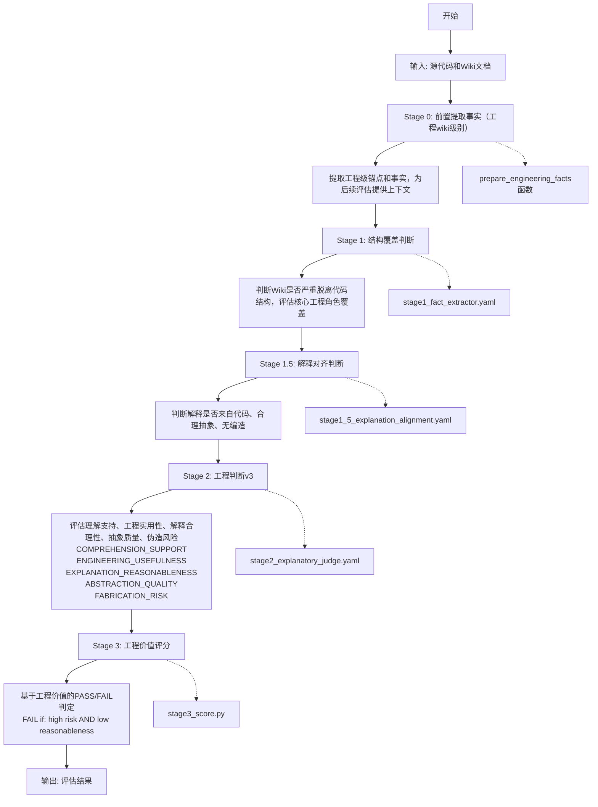

# Engineering Judge v3 项目用户使用文档

## 快速入门

如果您是第一次使用Engineering Explanation Judge，建议先阅读[快速入门指南](QUICK_START.md)，它将引导您完成安装、配置和首次运行的全过程。

## 项目概述

Engineering Judge v3 是一个基于 promptfoo 框架构建的工程导向Wiki质量评估系统，专门用于评估代码解释性文档（如Wiki）的工程价值和风险。该系统通过多阶段评估流程，自动化地判断生成的代码解释文档是否提供了有价值的工程见解，同时保持合理的准确性。

### 重构背景

与传统的 Fact Judge 系统不同，Engineering Judge v3 专注于评估解释性文档的工程价值，而非严格的事实一致性。其设计目标是判断"这份文档是否提供了有价值的工程见解，同时保持合理的准确性？"，而不是"是否100%覆盖了代码中的每一个元素？"。

### 核心功能

Engineering Judge v3 系统采用四阶段评估流程：

0. **前置阶段（Pre-fact Extraction）**：从源代码中提取工程级锚点和事实，包括类、函数、方法、表等关键信息，为后续评估提供上下文。
1. **第一阶段（Structural Coverage Judge）**：判断 Wiki 是否"严重脱离代码结构"，评估核心工程角色的覆盖情况。
2. **第一阶段半（Explanation Alignment Judge）**：判断 Wiki 的解释是否来自代码、合理抽象、没有编造不存在的机制。
3. **第二阶段（Engineering Judge v3）**：评估理解支持、工程实用性、解释合理性、抽象质量和伪造风险。
4. **第三阶段（Scoring v3）**：基于工程价值进行评分，采用风险扣分机制而非硬性FAIL。

### 系统流程图



#### 流程说明

1. **开始** → **输入**: 接收源代码和Wiki文档作为输入
2. **输入** → **Stage 0**: 执行前置提取事实阶段（工程wiki级别），使用prepare_engineering_facts函数
3. **Stage 0** → **提取工程信息**: 提取工程级锚点和事实，为后续评估提供上下文
4. **提取工程信息** → **Stage 1**: 执行结构覆盖判断，使用stage1_fact_extractor.yaml配置文件
5. **Stage 1** → **判断覆盖**: 判断Wiki是否严重脱离代码结构，评估核心工程角色覆盖
6. **判断覆盖** → **Stage 1.5**: 执行解释对齐判断，使用stage1_5_explanation_alignment.yaml配置文件
7. **Stage 1.5** → **判断对齐**: 判断解释是否来自代码、合理抽象、无编造
8. **判断对齐** → **Stage 2**: 执行工程判断v3，使用stage2_explanatory_judge.yaml配置文件
9. **Stage 2** → **评估质量**: 评估理解支持、工程实用性、解释合理性、抽象质量和伪造风险
10. **评估质量** → **Stage 3**: 执行工程价值评分，使用stage3_score.py脚本
11. **Stage 3** → **计算分数**: 基于工程价值的PASS/FAIL判定（高风险且解释不合理则FAIL）
12. **计算分数** → **输出**: 输出评估结果

### 技术架构

- 基于 promptfoo 框架进行评估
- 支持多种大语言模型（默认使用 ollama:gpt-oss:120b）
- 采用 YAML 配置文件定义评估标准
- 通过 Python 脚本处理数据流和评分逻辑

## 安装和配置指南

### 系统要求

- Python 3.8 或更高版本
- Node.js 和 npm（用于运行 promptfoo）
- Ollama（用于运行本地大语言模型）

### 安装步骤

1. **克隆或下载 Fact Judge 项目**

   ```bash
   git clone <repository-url>
   cd promptfoo_wiki/fact_judge
   ```

2. **创建虚拟环境（推荐）**

   ```bash
   python -m venv venv
   source venv/bin/activate  # Linux/Mac
   # 或
   venv\Scripts\activate     # Windows
   ```

3. **安装 Python 依赖**

   ```bash
   pip install -r requirements.txt
   ```

4. **安装 Node.js 依赖**

   ```bash
   npm install -g promptfoo
   ```

5. **设置 Ollama**

   - 下载并安装 Ollama
   - 启动 Ollama 服务
   - 拉取所需的模型（例如 gpt-oss:120b）

### 配置说明

1. **环境配置**：确保系统中已安装并正确配置了 Python、Node.js、npm 和 Ollama。

2. **模型配置**：修改 YAML 配置文件中的模型参数以适应你的环境（如 `stage1_fact_extractor.yaml` 和 `stage2_soft_judge.yaml`）。

3. **数据准备**：将待评估的源代码和对应的 Wiki 文档放置在 `data` 目录下，并在 `cases.yaml` 中配置相应的测试案例。

## 使用方法说明

### 单个案例运行

要运行单个评估案例，请使用 `run_single_case_pipeline.py` 脚本：

```python
from run_single_case_pipeline import run_single_case

result = run_single_case(
    case_id="my_case",
    vars_cfg={
        "source_code": "data/my_source_code.txt",
        "wiki_md": "data/my_wiki_doc.md"
    },
    output_dir="output/my_case"
)
```

此脚本会依次执行四个阶段：
0. 运行前置提取事实（prepare_engineering_facts函数）
1. 运行结构覆盖判断器（stage1_fact_extractor.yaml）
2. 运行解释对齐判断器（stage1_5_explanation_alignment.yaml）
3. 运行工程判断器v3（stage2_explanatory_judge.yaml）
4. 计算工程价值得分（stage3_score.py）

### 批量案例运行

要批量运行多个案例，请使用 `run_multi_cases.py` 脚本：

```bash
python run_multi_cases.py
```

此脚本会读取 `cases.yaml` 文件中的所有案例配置，并逐一执行评估。最终结果会保存到 `output/final_results-[timestamp].yaml` 文件中。

### 直接运行管道

你也可以直接运行整个评估管道：

```bash
python run_pipeline.py
```

这将执行完整的四阶段评估流程并将结果保存到 `output` 目录中。

## 配置文件说明

### cases.yaml

这是测试案例的配置文件，定义了要评估的源代码和Wiki文档对：

```yaml
cases:
  - id: case_001
    vars:
      source_code: data/agent.py.txt
      wiki_md: data/agent.py.md
  # - id: case_002
  #   vars:
  #     source_code: data/JIBSOJHJKNCHK.utf8.SQL
  #     wiki_md: data/JIBSOJHJKNCHK.SQL.md
  # - id: case_003
  #   vars:
  #     source_code: data/JIBSOIEUPDB.utf8.SQL
  #     wiki_md: data/JIBSOIEUPDB.SQL.md
```

每个案例包含：
- `id`: 案例唯一标识符
- `vars`: 包含源代码和Wiki文档路径的变量集合

### stage1_fact_extractor.yaml

第一阶段配置文件，负责从源代码和Wiki文档中提取事实信息：

- 使用指定的大语言模型（默认为 ollama:gpt-oss:120b）
- 定义了详细的提示词，指导模型提取覆盖率、正确性、幻觉和有用性方面的事实
- 输出JSON格式的结果，评估结构覆盖情况

### stage1_5_explanation_alignment.yaml

第一阶段半配置文件，进行解释对齐判断：

- 评估解释对齐（EXPLANATION_ALIGNMENT）：Wiki的解释是否来自代码
- 评估合理抽象（REASONABLE_ABSTRACTIONS）：是否进行了合理的抽象
- 评估伪造风险（FABRICATION_RISK）：是否存在编造不存在的元素
- 识别可接受的抽象（ACCEPTABLE_ABSTRACTIONS）：列出合理的抽象方式
- 识别可疑声明（SUSPECT_CLAIMS）：列出可能有问题的声明
- 输出JSON格式的评估结果

### stage2_explanatory_judge.yaml

第二阶段配置文件，进行工程判断v3：

- 评估理解支持（COMPREHENSION_SUPPORT）：是否帮助新接手开发者建立认知模型
- 评估工程实用性（ENGINEERING_USEFULNESS）：是否提供实用的工程价值
- 评估解释合理性（EXPLANATION_REASONABLENESS）：抽象和解释是否合理且基于代码
- 评估抽象质量（ABSTRACTION_QUALITY）：抽象层级是否适当
- 评估伪造风险（FABRICATION_RISK）：是否存在编造不存在的元素或行为
- 输出JSON格式的评估结果

### stage3_score.py

第三阶段评分脚本，根据工程价值进行评分：

- 实现了工程价值评分算法
- 仅在高风险且解释不合理的情况下判定为FAIL
- 根据理解支持、工程实用性、解释合理性和抽象质量等因素计算基础分数
- 根据伪造风险进行扣分
- 判断结果是PASS还是FAIL

## 常见问题解答

### Q1: 如何更换使用的语言模型？

A: 你可以在 `stage1_fact_extractor.yaml` 和 `stage2_explanatory_judge.yaml` 配置文件中修改 `providers` 部分，将 `ollama:gpt-oss:120b` 替换为你想要使用的其他模型，例如 `openai/gpt-4` 或其他支持的模型。

### Q2: 评估结果中的分数是如何计算的？

A: 最终分数由 `stage3_score.py` 中的工程价值评分算法计算得出，主要考虑以下几个方面：
- 基础分数由以下因素构成：
  - 理解支持（comprehension_support）
  - 工程实用性（engineering_usefulness）
  - 解释合理性（explanation_reasonableness）
  - 抽象质量（abstraction_quality）
- 风险扣分机制：
  - 伪造风险为HIGH时，扣除40分
  - 伪造风险为MEDIUM时，扣除20分
  - 伪造风险为LOW时，不扣分
- FAIL条件：
  - 仅在伪造风险为HIGH且解释合理性为LOW时，才判定为FAIL

最终分数范围在0-100之间。

### Q3: 如何自定义评估标准？

A: 你可以通过修改 `stage1_fact_extractor.yaml` 和 `stage2_explanatory_judge.yaml` 中的提示词来自定义评估标准。这些文件中的详细指令决定了模型如何评估文档的质量。

### Q4: 评估过程中出现错误怎么办？

A: 如果在评估过程中遇到错误，请检查以下几点：
- 确保所有依赖项已正确安装
- 确保Ollama服务正在运行且模型可用
- 检查输入文件路径是否正确
- 查看输出目录是否有足够的写入权限

### Q5: 如何扩展系统以支持更多类型的源代码？

A: 系统设计上支持多种类型的源代码，只需确保你的源代码文件和对应的Wiki文档放在正确的路径下，并在 `cases.yaml` 中配置相应的测试案例即可。如果需要针对特定类型的语言进行优化，可以调整提示词内容。

## 新增功能

### 前置提取事实（工程wiki级别的）

Fact Judge 系统新增了前置提取事实功能，专门用于工程wiki级别的事实提取。此功能允许在进行详细评估之前，先对源代码进行工程级锚点和事实的提取和分析，为后续评估提供上下文。

#### 功能特点

1. **工程级分析**：能够从源代码中提取工程级锚点（如类、函数、方法、表等）
2. **结构化提取**：提取工程级事实，描述责任、机制或工作流程
3. **上下文感知**：考虑代码整体上下文，为后续评估提供丰富信息
4. **预处理能力**：为后续的详细评估提供基础事实数据

#### 使用方法

前置提取事实功能在运行评估流程时自动执行，通过 `prepare_engineering_facts` 函数实现：

在 `run_single_case_pipeline.py` 中，系统会自动执行：

```python
engineering_facts_path = prepare_engineering_facts(
    source_code=source_code,
    language=language,  # 自动根据文件扩展名确定
    output_dir=output_dir
)
```

该函数会：
1. 从源代码中提取工程级锚点（类、函数、方法、表等）
2. 使用LLM将锚点组合成工程级事实
3. 生成engineering_facts.json文件供后续阶段使用

#### 输出格式

前置提取的事实将以JSON格式输出，包含以下信息：

- 工程级事实列表
- 事实ID和描述
- 支持事实的锚点列表
- 语言特定的工程元素（如类、函数、表等）

### 结果可视化（Markdown表格格式）

Fact Judge 系统新增了结果可视化功能，能够将评估结果输出为Markdown表格格式，便于查看和分享。

#### 功能特点

1. **表格化展示**：将评估结果以标准Markdown表格格式展示
2. **多维度信息**：包含Case ID、文件名、结果、分数和详细信息
3. **可折叠详情**：详细信息使用HTML的`<details>`和`<summary>`标签实现可折叠显示
4. **平铺信息展示**：在详情中平铺显示`final_score.json`中的关键信息，包括Summary、Coverage、Usefulness、Correctness、Hallucination和Coverage Rate

#### 使用方法

结果可视化功能在批量运行评估时自动执行，通过 `format_results_with_llm` 函数实现：

在 `run_multi_cases.py` 中，系统会自动执行：

```python
format_results_with_llm(results, cfg, base_output)
```

该函数会：
1. 读取每个案例的`final_score.json`文件
2. 提取关键信息并格式化为平铺显示
3. 生成带时间戳的Markdown表格文件

#### 输出格式

生成的Markdown表格包含以下列：

- **Case ID**：测试案例的唯一标识符
- **文件名**：输入源代码文件名
- **结果**：PASS/FAIL状态
- **分数**：最终得分
- **详情**：包含Summary、Coverage Level、Usefulness Level、Correctness Level、Hallucination Level和Coverage Rate的可折叠详细信息

## 高级配置

### 预提取配置

前置提取功能会根据源代码文件扩展名自动确定编程语言：

- `.py` → python
- `.java` → java
- `.sql/.plsql` → sql
- 其他 → 默认为java

您还可以在 `cases.yaml` 中显式指定语言：

```yaml
cases:
  - id: case_001
    vars:
      source_code: data/agent.py.txt
      wiki_md: data/agent.py.md
      language: python  # 显式指定语言
```

### 批量运行配置

批量运行功能支持命令行参数，允许动态指定配置文件和输出目录：

```bash
python run_multi_cases.py --cases-yaml my_cases.yaml --base-output my_output
```

参数说明：
- `--cases-yaml`：指定测试案例配置文件路径（默认为'cases_all.yaml'）
- `--base-output`：指定基础输出目录（默认为'results_output'）

## 最佳实践

### 工程级评估策略

1. **锚点提取**：前置提取阶段会自动从源代码中提取工程级锚点（如类、函数、方法等）
2. **上下文增强**：利用提取的工程事实为后续评估提供上下文信息
3. **语言适配**：确保源代码文件扩展名正确，以便系统能自动识别编程语言

### 结果分析策略

1. **表格化查看**：使用生成的Markdown表格快速浏览所有测试案例的结果
2. **详细信息展开**：点击可折叠区域查看每个案例的详细评估信息
3. **批量比较**：通过表格形式方便地比较不同案例之间的评分和表现

## 总结

Engineering Judge v3 是一个强大的自动化文档质量评估工具，通过多阶段评估流程能够全面评估代码解释性文档的工程价值和风险。与传统的事实一致性评估不同，本系统专注于判断解释性文档是否提供了有价值的工程见解，同时保持合理的准确性。通过本指南，你应该已经了解了如何安装、配置和使用该系统，以及如何根据需要自定义评估标准。

新增的前置提取事实功能（工程wiki级别）能够对整个工程项目进行高层次的分析，提取项目结构、模块关系、依赖关系等关键信息，为后续的详细评估提供丰富的上下文。

新增的结果可视化功能能够将评估结果以Markdown表格形式展示，便于查看、分享和分析评估结果。

为了更直观地理解系统的工作流程，请参阅 [FLOWCHART.md](FLOWCHART.md) 文件，其中包含了系统的详细架构图和执行流程。

## 依赖管理

Fact Judge 项目依赖于多个Python包和外部工具。所有必需的依赖都列在 `requirements.txt` 文件中：

- **核心依赖**：
  - `ollama`：用于与本地大语言模型交互
  - `promptfoo`：用于运行多阶段评估流程
  - `PyYAML`：用于解析YAML配置文件

- **可选依赖**（用于代码分析）：
  - `javalang`：用于Java代码解析
  - `sqlparse`：用于SQL代码解析
  - `python-dotenv`：用于环境变量管理

如需开发和测试，可安装 `requirements-dev.txt` 中的额外依赖：

```bash
pip install -r requirements-dev.txt
```

如果你在使用过程中遇到任何问题，请参考常见问题解答部分，或者查看项目中的示例文件以获得更多信息。