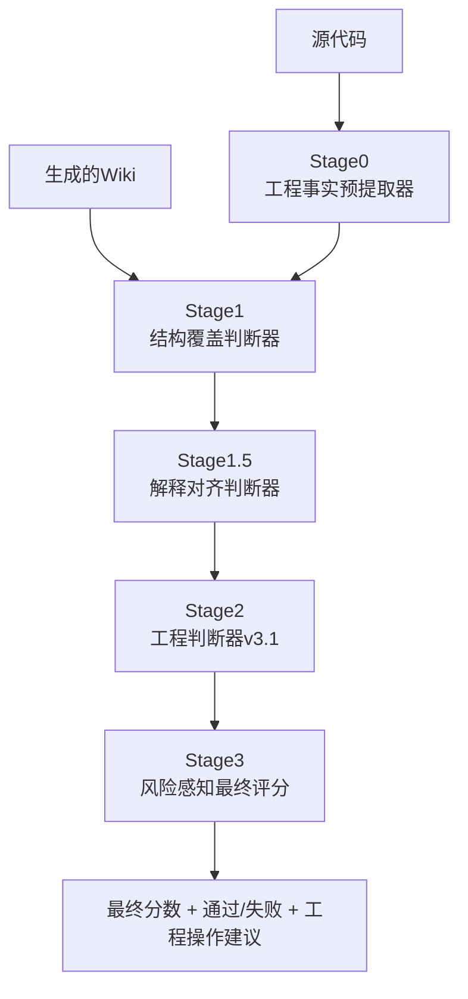

# Engineering Fact Judge v3.1 详细说明文档

## 1. 系统介绍

### 1.1 背景与动机
在现代软件开发中，代码文档的质量直接影响团队的生产力和项目的可维护性。然而，随着代码库规模的增长和复杂性的提升，手动编写和维护高质量的技术文档变得越来越困难。与此同时，AI技术的发展使得自动生成代码文档成为可能，但如何确保这些自动生成的文档既准确又有用，成为了新的挑战。

Engineering Fact Judge v3.1 系统应运而生，旨在解决这一问题。该系统不仅评估文档的准确性，更重要的是评估其工程价值——即文档是否真正有助于工程师理解和修改代码。

### 1.2 系统目标
- **准确性验证**：确保文档内容基于实际代码，而非虚构或推测
- **工程价值评估**：判断文档是否提供了有价值的工程见解
- **风险量化**：识别和量化文档中的潜在风险
- **标准化评估**：提供一致、可重复的文档质量评估标准

### 1.3 系统定位
Engineering Fact Judge v3.1 不是一个简单的语法检查器或风格评估器，而是一个专门设计的工程导向评估系统。它在评估流水线中充当关键的守门人，确保生成的文档基于实际源代码，而不是听起来合理但缺乏支持的声明。

## 2. 系统架构详解

### 2.1 整体架构概览
系统采用五阶段评估流程，每个阶段都有明确的职责和输出：



### 2.2 各阶段详细说明

#### Stage 0: 工程事实预提取器
**功能定位**：
- 从源代码中提取客观存在的工程锚点和事实
- 为后续评估提供事实基础
- 确保评估过程有据可依

**处理流程**：
1. 解析源代码文件
2. 识别关键工程元素（类、方法、函数、变量、配置等）
3. 提取代码结构和依赖关系
4. 生成工程锚点列表

**输出格式**：
```json
{
  "anchors": [
    {
      "type": "method",
      "name": "handleRequest",
      "location": "UserController.java:25-45",
      "signature": "public ResponseEntity<User> handleRequest(Long userId)",
      "purpose": "处理用户请求并返回用户信息"
    }
  ],
  "artifact_type": "java_controller",
  "dependencies": ["UserService", "UserRepository"]
}
```

**特点**：
- 客观性：只提取代码中存在的事实
- 不解释：不对代码行为进行解释或推测
- 不评价：不对代码质量进行评价

#### Stage 1: 结构覆盖判断器
**功能定位**：
- 判断 Wiki 是否覆盖了"必须解释的工程结构点"
- 评估文档对代码结构的覆盖程度
- 识别关键结构点的遗漏

**评估维度**：
- **覆盖水平**：HIGH/MEDIUM/LOW
- **覆盖项分析**：哪些结构点已被覆盖
- **遗漏项分析**：哪些关键结构点未被覆盖

**输出格式**：
```json
{
  "coverage_level": "MEDIUM",
  "covered_items": [
    {
      "anchor": "UserController.handleRequest",
      "covered": true,
      "quality": "GOOD"
    }
  ],
  "missing_critical_items": [
    {
      "anchor": "validation_logic",
      "impact": "控制大量条件分支，未解释会导致误修改"
    }
  ],
  "summary": "..."
}
```

**评估标准**：
- **HIGH**: 所有"高认知负担"的结构点都有解释
- **MEDIUM**: 主流程清楚，但关键条件/状态解释不足
- **LOW**: 只描述代码表面结构，无法支撑理解

#### Stage 1.5: 解释对齐判断器
**功能定位**：
- 判断 Wiki 的解释是否严格受限于代码事实
- 防止脑补和虚构内容
- 评估解释的合理性

**核心问题**：
- Wiki 中的解释是否严格受限于代码事实？
- 是否引入代码中不存在的概念？
- 是否夸大代码的职责？
- 是否推断未出现的业务规则？

**输出格式**：
```json
{
  "alignment_level": "MEDIUM",
  "fabrication_risk": "MEDIUM",
  "issues": [
    {
      "type": "INVENTED_BEHAVIOR",
      "statement": "This controller ensures transactional consistency",
      "reason": "代码中无事务控制",
      "severity": "HIGH"
    }
  ],
  "summary": "..."
}
```

**评估标准**：
- **HIGH**: 所有解释都能追溯到代码结构或注释
- **MEDIUM**: 有合理推断，但明确标注为"推测/可能"
- **LOW**: 把"代码行为"说成"业务规则"

#### Stage 2: 工程判断器 v3.1
**功能定位**：
- 评估文档的工程价值
- 多维度综合评估
- 生成详细评估结果

**输入数据**：
- structural_coverage_results（Stage1）
- explanation_alignment_results（Stage1.5）
- wiki_md（生成的文档）
- artifact_type（代码类型）

**评估维度详解**：

##### 2.1.1 理解支持 (Comprehension Support)
**定义**：新开发者能否快速建立整体心智模型

**评估标准**：
- **HIGH**: 
  - 清晰目的：文件存在的意义明确
  - 清晰角色：在更大系统中的作用明确
  - 重大认知负荷问题得到解决：混淆或高认知负载部分得到承认

- **MEDIUM**: 
  - 总体思路可理解
  - 但重要上下文缺失

- **LOW**: 
  - 只能看到表面行为或代码结构

**示例**：
- HIGH: "This controller handles user authentication requests and manages session state."
- MEDIUM: "This file processes login requests."
- LOW: "This file has methods and variables."

##### 2.1.2 工程实用性 (Engineering Usefulness)
**定义**：是否能指导实际修改/排查问题

**评估标准**：
- **HIGH**: 
  - 明确指出关键分支、标志、条件或风险
  - 帮助读者知道哪里容易出错
  - 指导下一步查看位置

- **MEDIUM**: 
  - 有助于理解
  - 有限用于实际更改

- **LOW**: 
  - 工程上几乎不可用

**示例**：
- HIGH: "Be careful with the password validation - it has strict requirements and throws specific exceptions."
- MEDIUM: "This validates user passwords."
- LOW: "This has a validatePassword method."

##### 2.1.3 解释合理性 (Explanation Reasonableness)
**定义**：解释是否克制、可辩护

**评估标准**：
- **HIGH**: 
  - 解释与代码强一致
  - 基于代码的主张有明确支持
  - 推断适度且标注清楚

- **MEDIUM**: 
  - 有合理抽象
  - 但略模糊

- **LOW**: 
  - 解释跳跃
  - 结论先行

**示例**：
- HIGH: "Based on the code, this method appears to handle retries (line 45-50), though this should be confirmed."
- MEDIUM: "This method handles retries."
- LOW: "This method implements a sophisticated retry mechanism with exponential backoff."

##### 2.1.4 抽象质量 (Abstraction Quality)
**定义**：抽象是否服务于理解而非炫耀

**评估标准**：
- **GOOD**: 
  - 抽象层级恰好
  - 明显改善理解
  - 避免过度具体或过度抽象

- **OK**: 
  - 有一些抽象问题
  - 但仍然可用

- **POOR**: 
  - 要么复述代码
  - 要么空谈架构

**示例**：
- GOOD: "This service orchestrates the user registration workflow, coordinating between validation, persistence, and notification components."
- OK: "This handles user registration."
- POOR: "This method on line 23 does this and that..." (too specific) OR "This implements enterprise-grade user management." (too abstract)

##### 2.1.5 伪造风险 (Fabrication Risk)
**定义**：文档中虚构内容的风险程度

**评估标准**：
- **LOW**: 
  - 无发明的概念、责任或保证
  - 所有解释都可追溯到代码结构或注释

- **MEDIUM**: 
  - 一些推断行为或意图存在
  - 但谨慎表述，不会误导工程决策

- **HIGH**: 
  - 发明行为、业务规则、保证或系统角色
  - 可能误导工程决策

**示例**：
- LOW: "This method validates user input based on the validation annotations."
- MEDIUM: "This method likely validates input, though the exact rules aren't clear from the code."
- HIGH: "This method validates input using a custom validation framework that enforces business rules."

**Stage 2 v3.1 新增字段**：
- **fabrication_type**: 标识伪造类型
  - `NONE`: 无伪造
  - `ARCHITECTURAL`: 架构级伪造
  - `LOCAL`: 局部伪造
  - `TERMINOLOGY`: 术语伪造

**Stage 2 输出格式**：
```json
{
  "comprehension_support": "HIGH",
  "engineering_usefulness": "MEDIUM", 
  "explanation_reasonableness": "HIGH",
  "abstraction_quality": "GOOD",
  "fabrication_risk": "LOW",
  "fabrication_type": "NONE",
  "summary": "文档提供了清晰的目的说明，但在工程实用性方面略显不足..."
}
```

#### Stage 3: 风险感知最终评分
**功能定位**：
- 基于工程价值进行最终评分
- 应用风险扣分机制
- 生成最终结果

**评分算法详解**：

##### 3.1 基础分计算
```python
# 基础分映射
comprehension_support_score = {
    "HIGH": 25,
    "MEDIUM": 15, 
    "LOW": 5,
}[comprehension_support]

engineering_usefulness_score = {
    "HIGH": 35,
    "MEDIUM": 20,
    "LOW": 5,
}[engineering_usefulness]

explanation_reasonableness_score = {
    "HIGH": 20,
    "MEDIUM": 12,
    "LOW": 4,
}[explanation_reasonableness]

abstraction_quality_score = {
    "GOOD": 20,
    "OK": 12,
    "POOR": 4,
}[abstraction_quality]

raw_score = comprehension_support_score + engineering_usefulness_score + \
           explanation_reasonableness_score + abstraction_quality_score
```

##### 3.2 风险扣分
```python
risk_penalty = 0
if fabrication_risk == "HIGH":
    risk_penalty = 40
elif fabrication_risk == "MEDIUM":
    risk_penalty = 20

adjusted_score = raw_score - risk_penalty
```

##### 3.3 v3.1 版本新增规则

**Law 1: Architecture Fabrication 硬覆盖**
```python
if fabrication_type == "ARCHITECTURAL":
    explanation_reasonableness = "LOW"
    fabrication_risk = "HIGH"
    # 重新计算分数
```

**Law 2: Abstraction Mismatch 分数封顶**
```python
if (explanation_reasonableness == "HIGH" and 
    fabrication_risk == "LOW" and 
    abstraction_quality in ["OK", "POOR"]):
    final_score_value = min(final_score_value, 50)
```

##### 3.4 分辨率增强层
```python
# 分档吸附
bands = [10, 20, 30, 40, 50, 60, 70, 80, 90, 95]
snapped_score = min(bands, key=lambda b: abs(b - score))

# 真实性奖励下限
if explanation_reasonableness == "HIGH" and fabrication_risk == "LOW":
    snapped_score = max(snapped_score, 60)

# 关键事实错误上限
if critical_fact_error:
    snapped_score = min(snapped_score, 40)
```

**输出格式**：
```json
{
  "final_score": 78,
  "result": "PASS",
  "summary": "文档质量良好...",
  "engineering_action": {
    "level": "SAFE_WITH_CAUTION",
    "description": "可用于理解与修改，需关注风险点",
    "recommended_action": "修改前需重点核对标注的风险或 TODO"
  },
  "details": {
    "comprehension_support": "HIGH",
    "engineering_usefulness": "MEDIUM",
    "explanation_reasonableness": "HIGH",
    "abstraction_quality": "GOOD", 
    "fabrication_risk": "LOW"
  }
}
```

## 3. 评分标准详解

### 3.1 评分范围与含义

| 分数区间 | 含义（对用户） | 工程操作建议 |
|---------|---------------|-------------|
| ≥ 90 | 可作为主要参考文档 | 可直接用于理解、调试和修改代码 |
| 70–89 | 可用于理解与修改，需关注风险点 | 修改前需重点核对标注的风险或 TODO |
| 50–69 | 仅供理解结构，修改需对照源码 | 不可仅依赖文档进行修改 |
| 40–49 | 不建议用于修改 | 仅用于初步了解，不可指导工程决策 |
| < 40 | 不可信 | 不应作为任何工程依据 |

### 3.2 评分计算示例

#### 示例1：高质量文档
```json
{
  "comprehension_support": "HIGH",
  "engineering_usefulness": "HIGH", 
  "explanation_reasonableness": "HIGH",
  "abstraction_quality": "GOOD",
  "fabrication_risk": "LOW",
  "fabrication_type": "NONE"
}
```

计算过程：
- 基础分：25(HIGH) + 35(HIGH) + 20(HIGH) + 20(GOOD) = 100
- 风险扣分：0 (LOW风险)
- 调整后：100 (但最高95)
- 真实性奖励：max(95, 60) = 95
- 最终分数：95 (A级 - 可作为主要参考文档)

#### 示例2：架构伪造文档
```json
{
  "comprehension_support": "HIGH",
  "engineering_usefulness": "HIGH", 
  "explanation_reasonableness": "HIGH",  // 原值
  "abstraction_quality": "GOOD",
  "fabrication_risk": "LOW",  // 原值
  "fabrication_type": "ARCHITECTURAL"  // 关键
}
```

计算过程：
- Law 1 触发：explanation_reasonableness = "LOW", fabrication_risk = "HIGH"
- 基础分：25(HIGH) + 35(HIGH) + 4(LOW) + 20(GOOD) = 84
- 风险扣分：40 (HIGH风险)
- 调整后：84 - 40 = 44
- 最终分数：44 (E级 - 不可信)

#### 示例3：抽象失配文档
```json
{
  "comprehension_support": "HIGH",
  "engineering_usefulness": "HIGH", 
  "explanation_reasonableness": "HIGH",
  "abstraction_quality": "OK",  // 关键
  "fabrication_risk": "LOW",
  "fabrication_type": "NONE"
}
```

计算过程：
- 基础分：25 + 35 + 20 + 12 = 92
- 风险扣分：0
- Law 2 触发（HIGH+LOW+OK）：min(92, 50) = 50
- 最终分数：50 (C级 - 仅供理解结构）

### 3.3 评分影响因素分析

#### 3.3.1 正面影响因素
1. **理解支持度高**：文档帮助新开发者建立正确的心智模型
2. **工程实用性强**：文档指导实际的修改和调试工作
3. **解释合理**：文档内容有代码支持，不过度推断
4. **抽象质量好**：文档抽象层级恰当，有助于理解

#### 3.3.2 负面影响因素
1. **伪造风险高**：文档包含虚构内容
2. **架构伪造**：文档描述不存在的架构元素
3. **抽象失配**：文档抽象层级与实际不符
4. **关键事实错误**：文档包含严重错误信息

## 4. 伪造违规类别详解

### 4.1 架构伪造 (Architectural Fabrication)

**定义**：引入源代码中不存在的架构元素，如发明的服务、控制器、框架或事务管理系统。

**识别特征**：
- 描述代码中不存在的组件
- 声称存在未实现的架构模式
- 描述未实现的系统集成点

**示例**：
```java
// 实际代码
public class UserController {
    public User getUser(Long id) {
        return userRepository.findById(id);
    }
}
```

**伪造文档**：
> "This controller implements a sophisticated caching layer that stores user data in Redis for improved performance. It also integrates with the authentication service to validate user sessions."

**问题**：
- 代码中没有Redis缓存实现
- 没有与认证服务的集成

**工程风险**：
- 工程师可能基于虚假的缓存假设进行开发
- 可能尝试使用不存在的认证服务接口

### 4.2 责任膨胀 (Responsibility Inflation)

**定义**：向代码元素分配实际实现不支持的责任、义务或能力。

**识别特征**：
- 声称函数执行未实现的功能
- 夸大类或模块的能力
- 分配代码中不存在的责任

**示例**：
```java
// 实际代码
public String formatName(String firstName, String lastName) {
    return firstName + " " + lastName;
}
```

**膨胀文档**：
> "This method performs comprehensive name validation, applies internationalization rules, and generates formatted names according to cultural conventions."

**问题**：
- 代码只做了简单的字符串拼接
- 没有验证、国际化或文化约定处理

**工程风险**：
- 工程师可能期待更复杂的功能
- 可能基于错误的假设使用该方法

### 4.3 机制不匹配 (Mechanism Mismatch)

**定义**：描述与代码实际实现不同的系统行为，即使所描述的行为看起来合理。

**识别特征**：
- 描述与代码逻辑不符的行为
- 声明代码未实现的处理机制
- 解释与实际实现不同的工作方式

**示例**：
```java
// 实际代码 - 同步处理
public void processOrder(Order order) {
    paymentService.charge(order);
    inventoryService.updateStock(order);
    emailService.sendConfirmation(order);
}
```

**不匹配文档**：
> "This method asynchronously processes orders using a message queue to ensure high throughput and fault tolerance."

**问题**：
- 代码是同步处理，不是异步
- 没有消息队列的使用

**工程风险**：
- 工程师可能基于异步假设进行错误的并发处理
- 可能误解系统的吞吐量和容错能力

### 4.4 术语幻觉 (Terminology Hallucination)

**定义**：在代码中没有明确证据的情况下，将设计模式、架构概念或行业术语视为事实。

**识别特征**：
- 声称使用特定设计模式而无代码支持
- 使用架构术语描述简单实现
- 将普通功能包装为高级概念

**示例**：
```java
// 实际代码 - 简单的数据传输对象
public class UserDTO {
    private String name;
    private String email;
    
    // getters and setters
}
```

**幻觉文档**：
> "This class implements the Data Transfer Object pattern and incorporates the Builder pattern for fluent interface construction."

**问题**：
- 代码只是简单的POJO，不是DTO模式的实现
- 没有Builder模式的实现

**工程风险**：
- 工程师可能期待更复杂的功能
- 可能基于错误的模式理解进行扩展

### 4.5 语义过度延伸 (Semantic Overreach)

**定义**：推断代码中未明确显示的并发性、隔离性、业务语义或其他高级行为。

**识别特征**：
- 声称代码具有未实现的安全特性
- 推断未明确的业务规则
- 假设代码具有未实现的性能特性

**示例**（SQL）：
```sql
-- 实际代码
SELECT * FROM users WHERE active = 1;
```

**过度延伸文档**：
> "This query is thread-safe and implements optimistic locking to prevent race conditions during concurrent access."

**问题**：
- 简单的SELECT查询不涉及线程安全问题
- 没有乐观锁的实现

**工程风险**：
- 工程师可能基于错误的安全假设进行并发处理
- 可能误解查询的并发特性

## 5. 系统使用详解

### 5.1 环境准备

#### 5.1.1 系统要求
- **操作系统**：Windows/Linux/macOS
- **Python**：3.8 或更高版本
- **Node.js**：用于运行 promptfoo
- **Ollama**：用于运行本地大语言模型
- **内存**：至少8GB RAM（推荐16GB）
- **存储**：至少2GB可用空间

#### 5.1.2 依赖安装
```bash
# 1. 安装Python依赖
pip install -r requirements.txt

# 2. 安装Node.js依赖
npm install -g promptfoo

# 3. 设置Ollama
# 下载并安装Ollama
# 启动Ollama服务
# 拉取所需模型
ollama pull gpt-oss:120b
```

#### 5.1.3 配置文件说明

**cases.yaml** - 测试案例配置
```yaml
cases:
  - id: case_001
    vars:
      source_code: data/agent.py.txt
      wiki_md: data/agent.py.md
  - id: case_002
    vars:
      source_code: data/controller.java.txt
      wiki_md: data/controller.java.md
```

**stage1_fact_extractor.yaml** - 第一阶段配置
- 定义结构覆盖判断的提示词
- 配置评估标准和输出格式

**stage1_5_explanation_alignment.yaml** - 第一阶段半配置
- 定义解释对齐判断的提示词
- 配置伪造风险识别规则

**stage2_explanatory_judge_v3.yaml** - 第二阶段配置
- 定义工程判断的提示词
- 包含CRITICAL FABRICATION RULES

### 5.2 单个案例运行

#### 5.2.1 Python API 使用
```python
from run_single_case_pipeline import run_single_case

# 定义测试案例
result = run_single_case(
    case_id="my_case",
    vars_cfg={
        "source_code": "data/my_source_code.txt",
        "wiki_md": "data/my_wiki_doc.md",
        "language": "java"  # 可选，自动检测
    },
    output_dir="output/my_case",
    base_output="output"
)

# 查看结果
print(f"最终得分: {result['final_score']}")
print(f"评估结果: {result['result']}")
print(f"工程操作建议: {result['engineering_action']}")
print(f"详细信息: {result['details']}")
```

#### 5.2.2 输出结果详解
```json
{
  "final_score": 78,
  "result": "PASS",
  "summary": "文档质量良好，提供了清晰的结构说明和关键点提示...",
  "engineering_action": {
    "level": "SAFE_WITH_CAUTION",
    "description": "可用于理解与修改，需关注风险点", 
    "recommended_action": "修改前需重点核对标注的风险或 TODO"
  },
  "details": {
    "comprehension_support": "HIGH",
    "engineering_usefulness": "MEDIUM",
    "explanation_reasonableness": "HIGH", 
    "abstraction_quality": "GOOD",
    "fabrication_risk": "LOW",
    "fabrication_type": "NONE"
  }
}
```

### 5.3 批量案例运行

#### 5.3.1 命令行运行
```bash
# 使用默认配置
python run_multi_cases.py

# 指定配置文件和输出目录
python run_multi_cases.py --cases-yaml my_cases.yaml --base-output my_output
```

#### 5.3.2 结果可视化
系统会生成Markdown格式的表格报告：

| Case ID | 文件名 | 结果 | 分数 | 详情 |
|---------|--------|------|------|------|
| case_001 | agent.py | PASS | 85 | <details><summary>Score: 85, Result: PASS</summary><div>Summary: ...</div></details> |

### 5.4 回归测试运行

#### 5.4.1 合并回归测试
```bash
# 同时运行正向和对抗性回归测试
python run_both_regressions_standalone.py
```

#### 5.4.2 测试结果报告
```json
{
  "summary": {
    "total": 11,
    "passed": 8,
    "failed": 3,
    "timestamp": "2026-02-09T10:37:21.829979",
    "breakdown": {
      "positive": {
        "total": 4,
        "passed": 3,
        "failed": 1
      },
      "adversarial": {
        "total": 7,
        "passed": 5,
        "failed": 2
      }
    }
  }
}
```

## 6. 系统特性与优势

### 6.1 核心特性

#### 6.1.1 多阶段评估
- **分层验证**：每个阶段专注特定评估维度
- **逐步筛选**：早期阶段过滤明显问题
- **综合评估**：最终阶段整合所有信息

#### 6.1.2 风险感知评分
- **连续分布**：避免极端0/100分
- **风险扣分**：基于问题严重程度扣分
- **工程导向**：评分反映工程实用性

#### 6.1.3 强制规则
- **Law 1**: 架构伪造硬覆盖
- **Law 2**: 抽象失配分数封顶
- **不可绕过**: 规则优先于其他评估结果

### 6.2 系统优势

#### 6.2.1 准确性保障
- **代码至上**：源代码是唯一事实依据
- **防脑补**：严格限制推测性内容
- **伪造检测**：主动识别虚构内容

#### 6.2.2 工程实用性
- **操作建议**：提供具体的工程操作指导
- **风险量化**：明确标识文档风险等级
- **决策支持**：为工程决策提供可靠依据

#### 6.2.3 可靠性保证
- **回归保护**：全面的回归测试套件
- **标准一致**：统一的评估标准
- **可重复性**：相同输入产生相同输出

### 6.3 应用场景

#### 6.3.1 代码文档质量评估
- **自动生成文档**：评估AI生成的代码文档质量
- **技术文档验证**：验证现有技术文档的准确性
- **文档标准化**：建立文档质量标准

#### 6.3.2 工程团队协作
- **新人培训**：为新成员提供可靠的代码理解工具
- **代码审查**：在代码审查中评估文档质量
- **重构决策**：基于文档质量评估重构优先级

#### 6.3.3 AI辅助开发
- **模型训练**：为AI模型提供质量反馈
- **输出验证**：验证AI生成内容的准确性
- **持续改进**：基于评估结果改进AI模型

## 7. 最佳实践

### 7.1 编写高质量文档的指导原则

#### 7.1.1 基于代码事实
- **引用具体代码**：明确指出文档内容对应的代码位置
- **避免推测**：只描述代码实际实现的功能
- **标注假设**：对任何推测性内容明确标注

#### 7.1.2 保持适当抽象
- **避免过度具体**：不要逐行解释代码
- **避免过度抽象**：不要空谈架构概念
- **平衡抽象层级**：选择合适的抽象层级

#### 7.1.3 突出工程价值
- **标识风险点**：明确指出需要注意的地方
- **提供修改指导**：说明如何安全地修改代码
- **连接上下文**：说明代码在系统中的作用

### 7.2 使用系统的最佳实践

#### 7.2.1 配置优化
- **定期更新测试案例**：保持回归测试的时效性
- **调整评估标准**：根据项目特点调整评估权重
- **监控评估结果**：跟踪文档质量趋势

#### 7.2.2 结果解读
- **关注工程操作建议**：根据建议采取相应行动
- **分析失败原因**：理解文档质量问题的根本原因
- **制定改进计划**：基于评估结果制定改进措施

### 7.3 持续改进

#### 7.3.1 系统改进
- **收集反馈**：从用户反馈中识别改进点
- **扩展支持**：增加对更多编程语言的支持
- **优化算法**：持续改进评估算法的准确性

#### 7.3.2 流程改进
- **集成CI/CD**：将评估集成到持续集成流程
- **自动化报告**：自动生成质量报告
- **预警机制**：建立质量下降预警

## 8. 总结

Engineering Fact Judge v3.1 系统通过其独特的五阶段评估流程和严格的事实验证机制，为工程团队提供了可靠的代码文档质量评估工具。v3.1 版本的升级进一步增强了对架构伪造的识别能力和风险控制机制，确保生成的工程文档既准确又有用。

系统的核心价值在于：
- **保障准确性**：通过严格的事实验证防止虚构内容
- **量化工程价值**：提供可操作的工程操作建议
- **风险管理**：识别和量化文档中的潜在风险
- **标准化评估**：提供一致、可重复的评估标准

随着软件系统的复杂性不断增加，高质量的代码文档变得越来越重要。Engineering Fact Judge v3.1 系统为确保文档质量提供了强有力的技术保障，是现代软件开发流程中不可或缺的工具。

通过持续的改进和优化，该系统将继续为工程团队提供更好的服务，推动软件开发质量的整体提升。