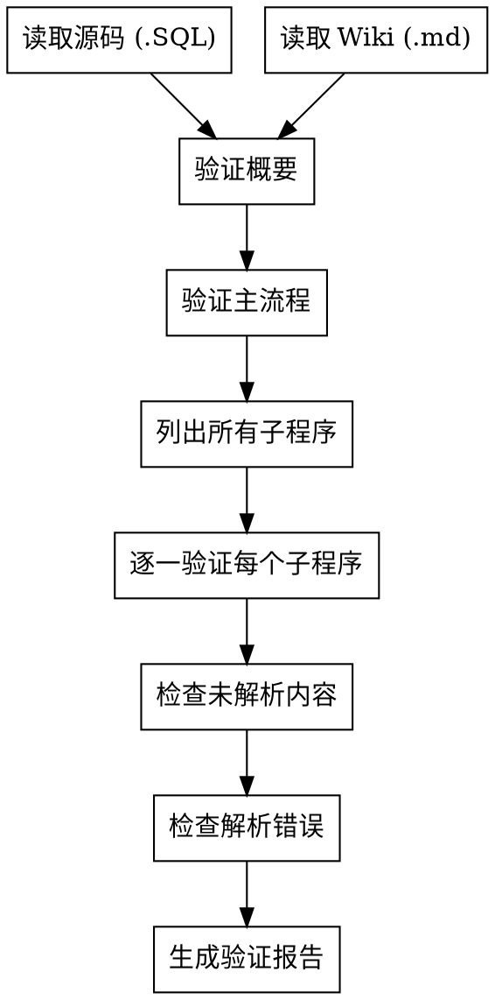
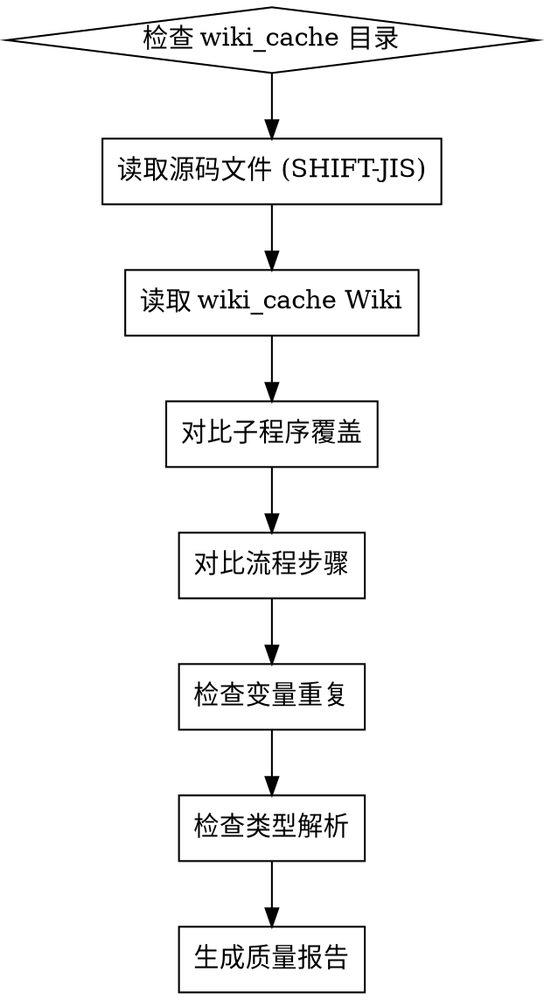

# Wiki Quality Difference Analysis

## Overview

系统化比对 PL/SQL 源码与生成的 Wiki 文档，识别流程图遗漏、条件判断错误、嵌套结构误判等质量差异。

**核心原则：证据前置，禁止推算，未验证位置必须标注"未验证"。**

**验证要求：必须逐一验证每个子程序和主程序，参考源码一一对照。**

## 验证基准

**重要规则：验证 Wiki 质量时，必须以 `wiki_cache/` 目录下真实生成的 Wiki 文件为验证基准。**

| 文件位置 | 用途 | 说明 |
|---------|------|------|
| `wiki_cache/{filename}.SQL.md` | **验证基准** | 真实生成的 Wiki，用于质量验证 |
| `.debug/*.step4_final_raw.md` | 调试参考 | 生成过程的中间文件，可能包含占位符，仅供参考 |

**常见错误**：以 `.debug/*.step4_final_raw.md` 为验证基准来判断 Wiki 质量。

- `.debug/step4_final_raw.md` 可能包含 `{{PLACEHOLDER:SUBPROGRAMS}}` 占位符
- `wiki_cache/*.md` 是经过后处理替换后的最终 Wiki，内容完整正确
- **只有当 `wiki_cache/` 中的 Wiki 存在问题时，才属于真正的 Wiki 质量问题**

## Mandatory Verification Checklist

**验证 Wiki 质量时，必须执行以下全部检查项：**

| # | 检查项 | 验证方法 |
|---|--------|----------|
| 1 | 验证概要是否准确 | 对照源码的业务描述，检查 Wiki 概要是否准确反映功能 |
| 2 | 验证主流程是否准确 | 对照源码主程序逻辑，检查 flowchart 是否完整 |
| 3 | 验证子程序是否完整解析 | 对照源码，逐个检查所有子程序是否都被解析 |
| 4 | 验证子程序步骤和流程图是否准确 | 对照源码，逐行验证每个子程序的 flowchart 步骤 |
| 5 | 验证是否有未解析的源码 | 扫描源码，检查是否有重要逻辑未被 Wiki 描述 |
| 6 | 验证是否有解析不正确的 | 对照源码，检查 Wiki 描述是否与源码逻辑矛盾 |
| 7 | 验证全部的子程序 | 列出源码所有子程序，逐一确认 Wiki 都有描述 |
| 8 | 必须逐一验证并且参考源码一一对照 | 对每个检查项，引用具体源码行号作为证据 |
| 9 | 逻辑类型必须验证所有的子程序/主程序 | FUNCTION 返回值逻辑、PROCEDURE 流程必须全部验证 |
| 10 | 其他类型按照实际情况验证 | CURSOR、TYPE、CONSTANT 等按需验证 |

## Verification Flow



## Subprogram Verification Method

**逻辑类型（FUNCTION/PROCEDURE）必须逐个验证：**

1. **列出源码所有子程序**（名称、起止行号）
2. **对照 Wiki 子程序列表**，确认每个都有描述
3. **验证每个子程序的 flowchart**：
   - 参数传递是否正确
   - 条件判断逻辑是否与源码一致
   - 返回值/输出参数是否正确
4. **检查是否有遗漏的子程序**
5. **检查是否有虚构的子程序**（Wiki 有但源码无）

**验证证据格式：**
```markdown
| 子程序名 | 源码行号 | Wiki 位置 | 验证结果 | 差异说明 |
|---------|---------|---------|---------|---------|
| PROC_NAME | 100-150 | Section 4.2 | ✅正确/❌错误 | 具体差异 |
```

## Common Quality Issues

| 问题类型 | 症状 | 检查方法 |
|----------|------|----------|
| **Phantom Parameter** | Wiki 列出不存在的参数 | 对照源码参数声明 |
| **Logic Inversion** | 条件判断与源码相反 | 检查 IF/ELSE 逻辑 |
| **Missing Step** | 主流程缺少关键步骤 | 对照源码执行顺序 |
| **Unparsed Logic** | 重要业务逻辑未描述 | 扫描源码关键段落 |
| **Hallucination** | Wiki 内容与源码矛盾 | 交叉验证多个检查项 |

## Actual Implementation Flow

Wiki 生成使用 **4-step chunked generation** (LOGICAL 类型):

```
Step 1: Global Context → step1_global_context_input/raw
Step 2: Chunk Generation → step2_chunk{N}_input/raw
Step 3: Main Program → step3_main_input/raw
Step 4: Final Wiki → step4_final_input/raw → wiki_cache/*.md
```

## Debug Files Location

所有调试文件保存在项目 `.debug/` 目录:

| 文件 | 内容 |
|------|------|
| `{basename}.step1_global_context_input.md` | Step 1 输入 |
| `{basename}.step1_global_context_raw.md` | Step 1 原始输出 |
| `{basename}.step2_chunk{N}_input.md` | Step 2 chunk 输入 |
| `{basename}.step2_chunk{N}_raw.md` | Step 2 chunk原始输出 |
| `{basename}.step3_main_input.md` | Step 3 输入 |
| `{basename}.step3_main_raw.md` | Step 3 原始输出 |
| `{basename}.step4_final_input.md` | Step 4 输入 (最终拼接模板) |
| `{basename}.step4_final_raw.md` | Step 4 原始输出 |
| `wiki_cache/{filename}.SQL.md` | 最终生成的 Wiki |

## Analysis Workflow



**注意**：`.debug/` 目录下的 `step4_final_raw.md` 仅用于调试参考，不作为 Wiki 质量验证的依据。

## Core Analysis Method

### Step 1: 文件验证

```powershell
# 列出调试文件
Get-ChildItem -Path "项目路径\.debug\" -Recurse

# 统计源码行数
Get-Content "项目路径\文件名.SQL" | Measure-Object -Line

# 检查 wiki_cache 目录
Get-ChildItem -Path "项目路径\wiki_cache\" -Filter "*.md"
```

### Step 2: 读取 Wiki 和源码

**编码注意**: PL/SQL 源码通常是 SHIFT-JIS 编码:
```powershell
# PowerShell 读取 SHIFT-JIS 编码文件
Get-Content -Path "项目路径\文件名.SQL" -Encoding Default
```

### Step 3: 逐行差异分析

| 分析维度 | 检查要点 |
|----------|----------|
| **子程序覆盖** | Wiki 中的子程序列表是否完整（核心指标） |
| **流程图覆盖** | 每个子程序的 flowchart 是否存在且准确（核心指标） |
| **变量重复** | 检查 `NGENMEN_KOJIN_KBN2` 等变量是否重复 |
| **类型解析** | 变量类型是否为 `---`（`---` 为 RECORD/TABLE 类型，正常现象） |
| **行号准确** | Wiki 中标注的行号与源码是否对应 |
| **Wiki/源码比** | 仅供参考，不作为质量指标 |

### Step 4: 高频质量问题

| 问题模式 | 说明 | 检查方法 |
|----------|------|----------|
| **子程序遗漏** | 子程序在 Wiki 中未被独立描述 | 对比源码与 Wiki 的子程序列表 |
| **变量重复** | 同一变量出现 100+ 次 | `(Get-Content wiki.md -Raw) -split "变量名" \| Measure-Object -Maximum` |
| **类型 `---`** | RECORD/TABLE 类型未识别 | 检查变量类型列（`---` 为正常现象） |
| **流程图简化** | 巨型子程序（>500行）的 flowchart 过于简化 | 检查大型子程序的步骤数量 |
| **Wiki 未生成** | wiki_cache 中无文件 | 检查文件是否存在 |

## Quality Scoring

**重要原则：Wiki/源码比不能说明 Wiki质量。**

| Wiki/源码比 | 实际情况 | 质量判断 |
|-------------|----------|----------|
| 低比例（如 10%） | 可能是精简优质代码 | 可能很好 |
| 高比例（如 90%） | 可能是冗余劣质代码 | 可能很差 |
| 低比例（30%）但子程序全 |精简但完整 | 优秀 |
| 高比例（50%）但子程序缺 | 冗余且不完整 | 差 |

**正确的质量评分维度：**

| 维度 | 权重 | 评分标准 |
|------|------|----------|
| **子程序覆盖率** | 35% | Wiki 有流程图的子程序数 / 源码总子程序数 |
| **流程图准确性** | 30% | flowchart 与源码逻辑一致程度 |
| **完整性** | 25% | 重要业务逻辑是否被描述 |
| **无错误** | 10% | 无 phantom 参数、无逻辑反转、无遗漏 |

**评分计算公式：**
```python
total_score = (
    subprogram_coverage * 0.35 +
    flowchart_accuracy * 0.30 +
    completeness * 0.25 +
    no_error * 0.10
)
```

**注意**：
- `Wiki完整度`（Wiki行数/源码行数）不是质量指标，仅供参考
- 同样比例的两个文件，质量可能差异巨大
- 评估时必须以**子程序覆盖率**和**流程图准确性**为核心

## Report Template

```markdown
# Wiki 质量差异分析报告
## 文件: {文件名}.SQL
## 项目: {项目名}

## 一、验证检查清单

| # | 检查项 | 结果 | 证据 |
|---|--------|------|------|
| 1 | 概要是否准确 | ✅/❌ | {行号}: {说明} |
| 2 | 主流程是否准确 | ✅/❌ | {行号}: {说明} |
| 3 | 子程序是否完整解析 | ✅/❌ | {遗漏子程序列表} |
| 4 | 子程序步骤和流程图是否准确 | ✅/❌ | {问题列表} |
| 5 | 是否有未解析的源码 | ✅/❌ | {未解析内容} |
| 6 | 是否有解析不正确的 | ✅/❌ | {错误列表} |
| 7 | 全部子程序是否验证 | ✅/❌ | {未验证子程序} |
| 8 | 是否逐一对照源码 | ✅/❌ | {缺少对照项} |
| 9 | 逻辑类型子程序/主程序是否全部验证 | ✅/❌ | {问题列表} |
| 10 | 其他类型是否按实际验证 | ✅/❌ | {说明} |

## 二、项目 Wiki 生成概览

| 文件 | 源码行数 | Wiki行数 | 生成状态 | 问题 |
|------|---------|---------|----------|------|
| {filename}.SQL | {src_lines} | {wiki_lines} | ✅/❌ | {issues} |

## 三、详细差异分析

### {文件名}.SQL

#### 子程序验证详情

| 子程序名 | 源码行号 | Wiki 位置 | 验证结果 | 差异说明 |
|---------|---------|---------|---------|---------|
| {name} | {start}-{end} | Section X.X | ✅正确/❌错误 | {具体差异} |

#### 参数验证详情

| Wiki 参数 | 源码声明 | 验证结果 | 说明 |
|-----------|---------|---------|------|
| {param} | {found/not found} | ✅/❌ | {说明} |

**质量评分**: {score}/100

## 四、高频问题汇总

| 问题模式 | 出现文件数 | 说明 |
|----------|-----------|------|
| {pattern} | {count} | {description} |

## 五、建议改进

1. {suggestion}

## 六、验证证据

```
{验证命令输出}
```

## Common Mistakes

| 错误 | 说明 | 修正方法 |
|------|------|----------|
| **以 Wiki/源码比判断质量** | 认为比例高=质量好，比例低=质量差 | Wiki/源码比只是参考，必须用子程序覆盖率和流程图准确性判断质量 |
| **以 debug 文件为验证基准** | 以 `.debug/*.step4_final_raw.md` 判断 Wiki 质量 | 必须使用 `wiki_cache/*.md` 作为验证基准 |
| **假设 .merged.json 存在** | 当前实现无此文件 | 使用 step4_final_raw.md |
| **忽略编码问题** | SHIFT-JIS 源码显示乱码 | 使用 `Get-Content -Encoding Default` 读取 |
| **跳过巨型文件** | >10万行文件易截断 | 重点检查大文件 |
| **推算未验证的位置** | 标注"推测"而非"未验证" | 明确标注"未验证" |
| **Phantom Parameter** | Wiki 列出源码不存在的参数 | 必须对照源码参数声明逐个核实 |
| **逻辑反转** | 条件判断与源码相反 | 检查 IF/ELSE 分支是否倒置 |
| **未验证全部子程序** | 只验证部分子程序 | 必须逐一验证，列出所有子程序的验证结果 |
| **缺少源码对照** | 验证时未引用行号 | 每项验证必须引用具体源码行号作为证据 |

## Real-World Patterns

实际分析中发现的高频问题:

1. **子程序遗漏**: 某些子程序在 Wiki 中未被独立描述（如 FUNCKIWARIZUMI）
2. **变量重复**: `NGENMEN_KOJIN_KBN2` 在 Wiki 中出现 167 次
3. **类型解析失败**: 变量类型显示 `---` 表示 RECORD/TABLE 类型未识别（正常）
4. **巨型子程序简化**: >500行的子程序 flowchart 过于简化

## Output Requirement

- 报告保存到: `docs/new/quality/{项目名}-wiki-quality-report-v{X}.md`
- 格式: Markdown
- 约束:
  1. 逐行对照: 每个 Wiki step 必须对应具体源码行号
  2. 精确到行: 差异位置标注源码行号
  3. 证据前置: 先执行验证命令，输出作为报告一部分
  4. 禁止推算: 未验证位置标注"未验证"
