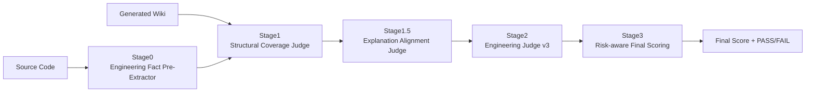

# Wiki Fact Judge 系统

Wiki Fact Judge 是一个基于 promptfoo 框架构建的维基百科事实准确性评估系统，专门用于评估**代码解释性文档**（如Wiki）的工程价值和风险。该系统通过多阶段评估流程，自动化地判断生成的代码解释文档是否提供了有价值的工程见解，同时保持合理的准确性。

## 概述

与传统的 Fact Judge 系统不同，Wiki Fact Judge 专注于评估解释性文档的工程价值，而非严格的事实一致性。其设计目标是判断"这份文档是否提供了有价值的工程见解，同时保持合理的准确性？"，而不是"是否100%覆盖了代码中的每一个元素？"。

系统采用五阶段评估流程（包含Stage 0-3，以及Stage 1.5），确保生成的工程文档既准确又有用。

## 系统架构



### 五阶段评估流程

0. **前置阶段（Pre-fact Extraction）**：从源代码中提取工程级锚点和事实，为后续评估提供上下文
1. **第一阶段（Structural Coverage Judge）**：判断 Wiki 是否"严重脱离代码结构"，评估核心工程角色的覆盖情况
2. **第一阶段半（Explanation Alignment Judge）**：判断 Wiki 的解释是否来自代码、合理抽象、没有编造不存在的机制
3. **第二阶段（Engineering Judge v3）**：评估理解支持、工程实用性、解释合理性、抽象质量和伪造风险
4. **第三阶段（Scoring v3）**：基于工程价值进行评分，采用风险扣分机制而非硬性FAIL

## 核心评估原则

### 1. 源代码至上
- 源代码是唯一的事实依据
- 行业惯例或通用架构模式不能作为证据

### 2. 解释 ≠ 推测
- 即使合理的假设也必须有代码支持
- "常见的架构模式"不是事实

### 3. 伪造是主要风险
- 发明的层级、职责或行为被视为高风险故障
- 优先识别和拒绝虚构内容

### 4. 工程实用性次于真实性
- 有帮助但不正确的解释比不完整的解释更糟糕

## 伪造违规类别

### 1. 架构伪造 (Architectural Fabrication)
- 例如：发明的服务、控制器、框架、事务管理

### 2. 责任膨胀 (Responsibility Inflation)
- 分配代码中不存在的责任

### 3. 机制不匹配 (Mechanism Mismatch)
- 描述与代码实际行为不同的行为

### 4. 术语幻觉 (Terminology Hallucination)
- 将设计模式或概念视为未经证实的事实

### 5. 语义过度延伸 (Semantic Overreach)
- 推断代码中未显示的并发、隔离或业务语义

## 安装和配置

### 系统要求
- Python 3.8 或更高版本
- Node.js 和 npm（用于运行 promptfoo）
- Ollama（用于运行本地大语言模型）

### 安装步骤

1. **安装Python依赖**
   ```bash
   pip install -r requirements.txt
   ```

2. **安装Node.js依赖**
   ```bash
   npm install -g promptfoo
   ```

3. **设置Ollama**
   - 下载并安装Ollama
   - 启动Ollama服务
   - 拉取所需模型（例如：`ollama pull gpt-oss:120b`）

## 使用方法

### 单个案例运行

```python
from run_single_case_pipeline import run_single_case

result = run_single_case(
    case_id="my_case",
    vars_cfg={
        "source_code": "data/my_source_code.txt",
        "wiki_md": "data/my_wiki_doc.md"
    },
    output_dir="output/my_case"
)

print(f"最终得分: {result['final_score']}")
print(f"评估结果: {result['result']}")
```

### 批量案例运行

```bash
# 使用默认设置（resume 模式：跳过已完成的案例，运行剩余案例）
python run_multi_cases_unified.py
```

或者使用不同的执行模式和参数：

```bash
# all 模式：运行所有测试案例，从头开始
python run_multi_cases_unified.py all --cases my_cases.yaml --output my_output

# resume 模式：支持断点续传，跳过已完成的案例（默认模式）
python run_multi_cases_unified.py resume --cases my_cases.yaml --output my_output

# retry 模式：仅重跑失败的案例
python run_multi_cases_unified.py retry --cases my_cases.yaml --output my_output

# 使用简短参数
python run_multi_cases_unified.py all -c my_cases.yaml -o my_output
```

**执行模式说明：**
- `all`：运行所有测试案例，从头开始（相当于旧版本的 `--simple` 模式）
- `resume`：支持断点续传，跳过已完成的案例（默认模式）
- `retry`：仅重跑失败的案例（相当于旧版本的 `--retry-failed` 模式）

**新增功能：**
- **执行时间统计**：系统会自动计算并显示总执行时间和平均每案例耗时

### 对抗性回归测试

运行对抗性回归测试以确保系统稳定性：

```bash
python run_stage2_regression.py
```

## Web UI 使用

系统提供 Web UI 界面，支持以下功能：

1. **案例管理**：上传、查看、运行测试案例
2. **计划管理**：创建、编辑、运行测试计划
3. **报告管理**：查看、分析测试报告

### 启动后端服务

```bash
cd backend
uvicorn main:app --reload --port 8000
```

### 启动前端服务

```bash
cd frontend
npm install
npm start
```

## 架构说明

系统采用双入口架构：

```
                   ┌──────────────────────────┐
                   │        React Web UI      │
                   └────────────┬─────────────┘
                                │ REST API
                                ▼
                   ┌──────────────────────────┐
                   │      FastAPI Backend     │
                   │                          │
                   │  - Case Management       │
                   │  - Plan Management       │
                   │  - Report Management     │
                   │  - Trigger Pipeline      │
                   └────────────┬─────────────┘
                                │
                                ▼
                   ┌──────────────────────────┐
                   │   Existing CLI Pipeline  │
                   │ run_single_case_pipeline │
                   └────────────┬─────────────┘
                                │
                                ▼
                        本地文件输出 (output/)
                                │
                                ▼
                             SQLite
```

## 核心原则

1. ❗ 不修改 `run_single_case_pipeline.py` 核心逻辑
2. ❗ 不改变 CLI 使用方式
3. Web 只是"封装 CLI 调用"
4. 文件全部保存在本地
5. 数据库存储元数据与索引
6. Web 调用通过 subprocess 执行 CLI

## 贡献

欢迎提交 Issue 和 Pull Request 来改进系统。